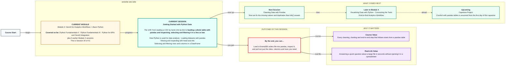

# Mental Map — Getting Started with Python Data
> Academic Session 34 · Module 4: GenAI for Analytics Workflows + Basic Python

```mermaid
%%{init: {'flowchart': {'htmlLabels': true, 'nodeSpacing': 60, 'rankSpacing': 95, 'wrappingWidth': 620, 'padding': 18}}}%%
flowchart LR

START["<b>Course Start</b>"]

subgraph foundation[" WHERE WE ARE "]
direction TB
    CURMOD["<b>CURRENT MODULE</b><br/><i>Module 4: GenAI for Analytics Workflows + Basic Python</i><br/>&nbsp;<br/><b>Covered so far:</b> Python Fundamentals II · Python Fundamentals III · Python for APIs and GenAI Integration<br/>plus 5 earlier Module 4 sessions<br/>This is Session 34 of 41"]
    CURSES["<b>CURRENT SESSION</b><br/><b>Getting Started with Python Data</b><br/>&nbsp;<br/><i>The shift:</i> from <i>reading a CSV by hand, line by line</i> to <b>loading a whole table with pandas and inspecting, selecting and filtering it in a line or two</b><br/>&nbsp;<br/>How Python is used for data analysis · Loading datasets with pandas<br/>Viewing and inspecting with head and info<br/>Selecting and filtering rows and columns in a DataFrame"]
end

subgraph outcome[" OUTCOME OF THIS SESSION "]
direction TB
    OUT["<b>By the end, you can…</b><br/>&nbsp;<br/>Load a Kirana365 orders file into pandas, inspect it,<br/>and pull out just the cities, columns and rows you need"]
end

subgraph value[" WHY IT MATTERS "]
direction TB
    CVAL["<b>Course Value</b><br/>Every cleaning, charting and end-to-end step that follows starts from a pandas table"]
    RVAL["<b>Real-Life Value</b><br/>Answering a quick question about a large file in seconds without opening it in a spreadsheet"]
end

subgraph future[" WHAT COMES NEXT "]
direction TB
    U0["<b>Next Session</b><br/>Cleaning Data with Pandas<br/><i>Now we fix the missing values and duplicates that info() reveals</i>"]
    U1["<b>Later in Module 4</b><br/>Visualizing Data with Python · Connecting the Tools<br/>End-to-End Analytics Workflow"]
    U2["<b>Upcoming</b><br/>Capstone Project<br/><i>Comfort with pandas tables is assumed from the first day of the capstone</i>"]
end

START ==>|" begin "| CURMOD
CURMOD ==>|" progress "| CURSES
CURSES ==>|" you get "| OUT
OUT ==>|" course "| CVAL
OUT ==>|" real life "| RVAL
CURSES ==>|" next up "| U0
U0 -.->|" then "| U1
U1 -.->|" ahead "| U2

classDef startBox fill:#F7FAFC,stroke:#4A5568,stroke-width:2px,color:#1A202C
classDef curModBox fill:#FFF8E6,stroke:#B7791F,stroke-width:2px,color:#1A202C
classDef curSessBox fill:#E6FFFA,stroke:#0D9488,stroke-width:3px,color:#1A202C
classDef outBox fill:#FEF2F2,stroke:#DC2626,stroke-width:3px,color:#1A202C
classDef valueBox fill:#F3E8FF,stroke:#7C3AED,stroke-width:2px,color:#1A202C
classDef futureBox fill:#ECFDF5,stroke:#047857,stroke-width:2px,color:#1A202C

class START startBox
class CURMOD curModBox
class CURSES curSessBox
class OUT outBox
class CVAL,RVAL valueBox
class U0,U1,U2 futureBox

linkStyle default stroke-width:2px
```
