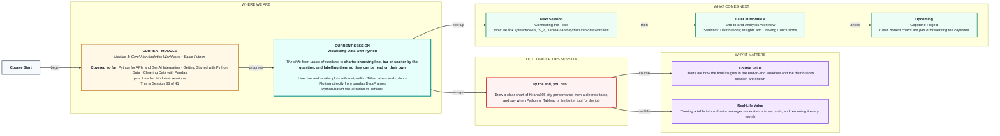

# Mental Map — Visualizing Data with Python
> Academic Session 36 · Module 4: GenAI for Analytics Workflows + Basic Python

```mermaid
%%{init: {'flowchart': {'htmlLabels': true, 'nodeSpacing': 60, 'rankSpacing': 95, 'wrappingWidth': 620, 'padding': 18}}}%%
flowchart LR

START["<b>Course Start</b>"]

subgraph foundation[" WHERE WE ARE "]
direction TB
    CURMOD["<b>CURRENT MODULE</b><br/><i>Module 4: GenAI for Analytics Workflows + Basic Python</i><br/>&nbsp;<br/><b>Covered so far:</b> Python for APIs and GenAI Integration · Getting Started with Python Data · Cleaning Data with Pandas<br/>plus 7 earlier Module 4 sessions<br/>This is Session 36 of 41"]
    CURSES["<b>CURRENT SESSION</b><br/><b>Visualizing Data with Python</b><br/>&nbsp;<br/><i>The shift:</i> from <i>tables of numbers</i> to <b>charts: choosing line, bar or scatter by the question, and labelling them so they can be read on their own</b><br/>&nbsp;<br/>Line, bar and scatter plots with matplotlib · Titles, labels and colours<br/>Plotting directly from pandas DataFrames<br/>Python-based visualization vs Tableau"]
end

subgraph outcome[" OUTCOME OF THIS SESSION "]
direction TB
    OUT["<b>By the end, you can…</b><br/>&nbsp;<br/>Draw a clear chart of Kirana365 city performance from a cleaned table,<br/>and say when Python or Tableau is the better tool for the job"]
end

subgraph value[" WHY IT MATTERS "]
direction TB
    CVAL["<b>Course Value</b><br/>Charts are how the final insights in the end-to-end workflow and the distributions session are shown"]
    RVAL["<b>Real-Life Value</b><br/>Turning a table into a chart a manager understands in seconds, and rerunning it every month"]
end

subgraph future[" WHAT COMES NEXT "]
direction TB
    U0["<b>Next Session</b><br/>Connecting the Tools<br/><i>Now we link spreadsheets, SQL, Tableau and Python into one workflow</i>"]
    U1["<b>Later in Module 4</b><br/>End-to-End Analytics Workflow<br/>Statistics: Distributions; Insights and Drawing Conclusions"]
    U2["<b>Upcoming</b><br/>Capstone Project<br/><i>Clear, honest charts are part of presenting the capstone</i>"]
end

START ==>|" begin "| CURMOD
CURMOD ==>|" progress "| CURSES
CURSES ==>|" you get "| OUT
OUT ==>|" course "| CVAL
OUT ==>|" real life "| RVAL
CURSES ==>|" next up "| U0
U0 -.->|" then "| U1
U1 -.->|" ahead "| U2

classDef startBox fill:#F7FAFC,stroke:#4A5568,stroke-width:2px,color:#1A202C
classDef curModBox fill:#FFF8E6,stroke:#B7791F,stroke-width:2px,color:#1A202C
classDef curSessBox fill:#E6FFFA,stroke:#0D9488,stroke-width:3px,color:#1A202C
classDef outBox fill:#FEF2F2,stroke:#DC2626,stroke-width:3px,color:#1A202C
classDef valueBox fill:#F3E8FF,stroke:#7C3AED,stroke-width:2px,color:#1A202C
classDef futureBox fill:#ECFDF5,stroke:#047857,stroke-width:2px,color:#1A202C

class START startBox
class CURMOD curModBox
class CURSES curSessBox
class OUT outBox
class CVAL,RVAL valueBox
class U0,U1,U2 futureBox

linkStyle default stroke-width:2px
```
