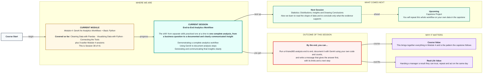

# Mental Map — End-to-End Analytics Workflow
> Academic Session 38 · Module 4: GenAI for Analytics Workflows + Basic Python

```mermaid
%%{init: {'flowchart': {'htmlLabels': true, 'nodeSpacing': 60, 'rankSpacing': 95, 'wrappingWidth': 620, 'padding': 18}}}%%
flowchart LR

START["<b>Course Start</b>"]

subgraph foundation[" WHERE WE ARE "]
direction TB
    CURMOD["<b>CURRENT MODULE</b><br/><i>Module 4: GenAI for Analytics Workflows + Basic Python</i><br/>&nbsp;<br/><b>Covered so far:</b> Cleaning Data with Pandas · Visualizing Data with Python · Connecting the Tools<br/>plus 9 earlier Module 4 sessions<br/>This is Session 38 of 41"]
    CURSES["<b>CURRENT SESSION</b><br/><b>End-to-End Analytics Workflow</b><br/>&nbsp;<br/><i>The shift:</i> from <i>separate skills practised one at a time</i> to <b>one complete analysis, from a business question to a documented and clearly communicated insight</b><br/>&nbsp;<br/>Demonstrating a complete analytics workflow<br/>Using GenAI to document analysis steps<br/>Generating and communicating final insights clearly"]
end

subgraph outcome[" OUTCOME OF THIS SESSION "]
direction TB
    OUT["<b>By the end, you can…</b><br/>&nbsp;<br/>Run a Kirana365 analysis end to end, document it with GenAI using your own code and counts,<br/>and write a message that gives the answer first,<br/>with its limits and a next step"]
end

subgraph value[" WHY IT MATTERS "]
direction TB
    CVAL["<b>Course Value</b><br/>This brings together everything in Module 4 and is the pattern the capstone follows"]
    RVAL["<b>Real-Life Value</b><br/>Handing a manager a result they can trust, repeat and act on the same day"]
end

subgraph future[" WHAT COMES NEXT "]
direction TB
    U0["<b>Next Session</b><br/>Statistics: Distributions; Insights and Drawing Conclusions<br/><i>Now we learn to read the shape of data and to conclude only what the evidence supports</i>"]
    U2["<b>Upcoming</b><br/>Capstone Project<br/><i>You will repeat this whole workflow on your own data in the capstone</i>"]
end

START ==>|" begin "| CURMOD
CURMOD ==>|" progress "| CURSES
CURSES ==>|" you get "| OUT
OUT ==>|" course "| CVAL
OUT ==>|" real life "| RVAL
CURSES ==>|" next up "| U0
U0 -.->|" ahead "| U2

classDef startBox fill:#F7FAFC,stroke:#4A5568,stroke-width:2px,color:#1A202C
classDef curModBox fill:#FFF8E6,stroke:#B7791F,stroke-width:2px,color:#1A202C
classDef curSessBox fill:#E6FFFA,stroke:#0D9488,stroke-width:3px,color:#1A202C
classDef outBox fill:#FEF2F2,stroke:#DC2626,stroke-width:3px,color:#1A202C
classDef valueBox fill:#F3E8FF,stroke:#7C3AED,stroke-width:2px,color:#1A202C
classDef futureBox fill:#ECFDF5,stroke:#047857,stroke-width:2px,color:#1A202C

class START startBox
class CURMOD curModBox
class CURSES curSessBox
class OUT outBox
class CVAL,RVAL valueBox
class U0,U2 futureBox

linkStyle default stroke-width:2px
```
