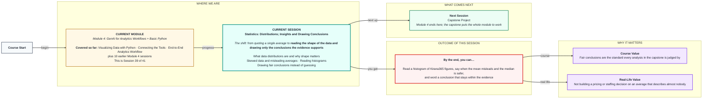

# Mental Map — Statistics: Distributions; Insights and Drawing Conclusions
> Academic Session 39 · Module 4: GenAI for Analytics Workflows + Basic Python

```mermaid
%%{init: {'flowchart': {'htmlLabels': true, 'nodeSpacing': 60, 'rankSpacing': 95, 'wrappingWidth': 620, 'padding': 18}}}%%
flowchart LR

START["<b>Course Start</b>"]

subgraph foundation[" WHERE WE ARE "]
direction TB
    CURMOD["<b>CURRENT MODULE</b><br/><i>Module 4: GenAI for Analytics Workflows + Basic Python</i><br/>&nbsp;<br/><b>Covered so far:</b> Visualizing Data with Python · Connecting the Tools · End-to-End Analytics Workflow<br/>plus 10 earlier Module 4 sessions<br/>This is Session 39 of 41"]
    CURSES["<b>CURRENT SESSION</b><br/><b>Statistics: Distributions; Insights and Drawing Conclusions</b><br/>&nbsp;<br/><i>The shift:</i> from <i>quoting a single average</i> to <b>reading the shape of the data and drawing only the conclusions the evidence supports</b><br/>&nbsp;<br/>What data distributions are and why shape matters<br/>Skewed data and misleading averages · Reading histograms<br/>Drawing fair conclusions instead of guessing"]
end

subgraph outcome[" OUTCOME OF THIS SESSION "]
direction TB
    OUT["<b>By the end, you can…</b><br/>&nbsp;<br/>Read a histogram of Kirana365 figures, say when the mean misleads and the median is safer,<br/>and word a conclusion that stays within the evidence"]
end

subgraph value[" WHY IT MATTERS "]
direction TB
    CVAL["<b>Course Value</b><br/>Fair conclusions are the standard every analysis in the capstone is judged by"]
    RVAL["<b>Real-Life Value</b><br/>Not building a pricing or staffing decision on an average that describes almost nobody"]
end

subgraph future[" WHAT COMES NEXT "]
direction TB
    U0["<b>Next Session</b><br/>Capstone Project<br/><i>Module 4 ends here; the capstone puts the whole module to work</i>"]
end

START ==>|" begin "| CURMOD
CURMOD ==>|" progress "| CURSES
CURSES ==>|" you get "| OUT
OUT ==>|" course "| CVAL
OUT ==>|" real life "| RVAL
CURSES ==>|" next up "| U0

classDef startBox fill:#F7FAFC,stroke:#4A5568,stroke-width:2px,color:#1A202C
classDef curModBox fill:#FFF8E6,stroke:#B7791F,stroke-width:2px,color:#1A202C
classDef curSessBox fill:#E6FFFA,stroke:#0D9488,stroke-width:3px,color:#1A202C
classDef outBox fill:#FEF2F2,stroke:#DC2626,stroke-width:3px,color:#1A202C
classDef valueBox fill:#F3E8FF,stroke:#7C3AED,stroke-width:2px,color:#1A202C
classDef futureBox fill:#ECFDF5,stroke:#047857,stroke-width:2px,color:#1A202C

class START startBox
class CURMOD curModBox
class CURSES curSessBox
class OUT outBox
class CVAL,RVAL valueBox
class U0 futureBox

linkStyle default stroke-width:2px
```
