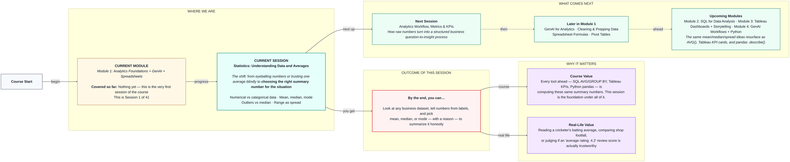

# Mental Map — Statistics: Understanding Data and Averages
> Academic Session 1 · Module 1: Analytics Foundations + GenAI + Spreadsheets

```mermaid
%%{init: {'theme': 'default', 'themeVariables': { 'fontSize': '28px', 'fontFamily': 'sans-serif' }, 'flowchart': {'useMaxWidth': false, 'htmlLabels': true, 'nodeSpacing': 100, 'rankSpacing': 140, 'wrappingWidth': 700, 'padding': 40}}}%%
flowchart LR

START["<b>Course Start</b>"]

subgraph foundation[" WHERE WE ARE "]
direction TB
    CURMOD["<b>CURRENT MODULE</b><br/><i>Module 1: Analytics Foundations + GenAI + Spreadsheets</i><br/>&nbsp;<br/><b>Covered so far:</b> Nothing yet — this is the very first session of the course<br/>This is Session 1 of 41"]
    CURSES["<b>CURRENT SESSION</b><br/><b>Statistics: Understanding Data and Averages</b><br/>&nbsp;<br/><i>The shift:</i> from <i>eyeballing numbers or trusting one average blindly</i> to <b>choosing the right summary number for the situation</b><br/>&nbsp;<br/>Numerical vs categorical data · Mean, median, mode<br/>Outliers vs median · Range as spread"]
end

subgraph outcome[" OUTCOME OF THIS SESSION "]
direction TB
    OUT["<b>By the end, you can…</b><br/>&nbsp;<br/>Look at any business dataset, tell numbers from labels, and pick<br/>mean, median, or mode — with a reason — to summarize it honestly"]
end

subgraph value[" WHY IT MATTERS "]
direction TB
    CVAL["<b>Course Value</b><br/>Every tool ahead — SQL AVG/GROUP BY, Tableau KPIs, Python pandas — is<br/>computing these same summary numbers. This session is the foundation under all of it."]
    RVAL["<b>Real-Life Value</b><br/>Reading a cricketer's batting average, comparing shop footfall,<br/>or judging if an 'average rating: 4.2' review score is actually trustworthy"]
end

subgraph future[" WHAT COMES NEXT "]
direction TB
    U0["<b>Next Session</b><br/>Analytics Workflow, Metrics & KPIs<br/><i>How raw numbers turn into a structured business question-to-insight process</i>"]
    U1["<b>Later in Module 1</b><br/>GenAI for Analytics · Cleaning & Prepping Data<br/>Spreadsheet Formulas · Pivot Tables"]
    U2["<b>Upcoming Modules</b><br/>Module 2: SQL for Data Analysis · Module 3: Tableau Dashboards + Storytelling · Module 4: GenAI Workflows + Python<br/><i>The same mean/median/spread ideas resurface as AVG(), Tableau KPI cards, and pandas .describe()</i>"]
end

START ==>|" begin "| CURMOD
CURMOD ==>|" progress "| CURSES
CURSES ==>|" you get "| OUT
OUT ==>|" course "| CVAL
OUT ==>|" real life "| RVAL
CURSES ==>|" next up "| U0
U0 -.->|" then "| U1
U1 -.->|" ahead "| U2

classDef startBox fill:#F7FAFC,stroke:#4A5568,stroke-width:2px,color:#1A202C
classDef curModBox fill:#FFF8E6,stroke:#B7791F,stroke-width:2px,color:#1A202C
classDef curSessBox fill:#E6FFFA,stroke:#0D9488,stroke-width:3px,color:#1A202C
classDef outBox fill:#FEF2F2,stroke:#DC2626,stroke-width:3px,color:#1A202C
classDef valueBox fill:#F3E8FF,stroke:#7C3AED,stroke-width:2px,color:#1A202C
classDef futureBox fill:#ECFDF5,stroke:#047857,stroke-width:2px,color:#1A202C

class START startBox
class CURMOD curModBox
class CURSES curSessBox
class OUT outBox
class CVAL,RVAL valueBox
class U0,U1,U2 futureBox

linkStyle default stroke-width:2px
```
