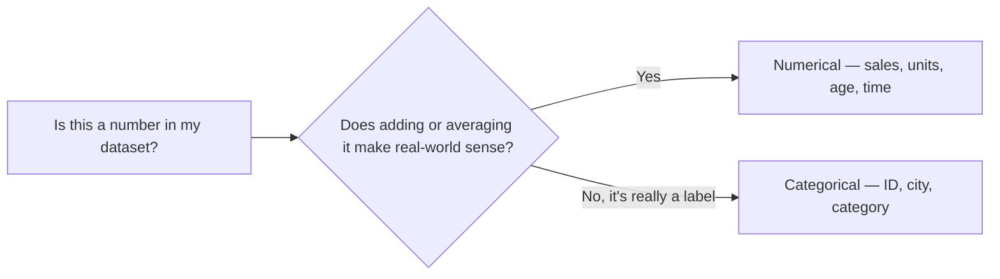
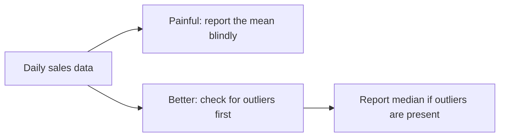

# Statistics: Understanding Data and Averages
> **Pre-Read — Academic Session 1** | Module 1: Analytics Foundations + GenAI + Spreadsheets
---
## Mental Map
> 📄 Also provided as a printable PDF in this folder: **mental-map: Statistics- Understanding Data and Averages.pdf**

```mermaid
%%{init: {'theme': 'default', 'themeVariables': { 'fontSize': '12px', 'fontFamily': 'sans-serif' }, 'flowchart': {'htmlLabels': true, 'useMaxWidth': false, 'nodeSpacing': 30, 'rankSpacing': 45, 'padding': 10}}}%%
flowchart LR

START["<b>Course Start</b>"]

subgraph foundation[" WHERE WE ARE "]
direction TB
    CURMOD["<b>CURRENT MODULE</b><br/><i>Module 1: Analytics Foundations + GenAI + Spreadsheets</i><br/>&nbsp;<br/><b>Covered so far:</b> Nothing yet — this is the very first session of the course<br/>This is Session 1 of 41"]
    CURSES["<b>CURRENT SESSION</b><br/><b>Statistics: Understanding Data and Averages</b><br/>&nbsp;<br/><i>The shift:</i> from <i>eyeballing numbers or trusting one average blindly</i> to <b>choosing the right summary number for the situation</b><br/>&nbsp;<br/>Numerical vs categorical data · Mean, median, mode<br/>Outliers vs median · Range as spread"]
end

subgraph outcome[" OUTCOME OF THIS SESSION "]
direction TB
    OUT["<b>By the end, you can…</b><br/>&nbsp;<br/>Look at any business dataset, tell numbers from labels, and pick<br/>mean, median, or mode — with a reason — to summarize it honestly"]
end

subgraph value[" WHY IT MATTERS "]
direction LR
    CVAL["<b>Course Value</b><br/>Every tool ahead — SQL AVG/GROUP BY, Tableau KPIs, Python pandas — is<br/>computing these same summary numbers. This session is the foundation under all of it."]
    RVAL["<b>Real-Life Value</b><br/>Reading a cricketer's batting average, comparing shop footfall,<br/>or judging if a "average rating: 4.2" review score is actually trustworthy"]
end

subgraph future[" WHAT COMES NEXT "]
direction TB
    U0["<b>Next Session</b><br/>Analytics Workflow, Metrics & KPIs<br/><i>How raw numbers turn into a structured business question-to-insight process</i>"]
    U1["<b>Later in Module 1</b><br/>GenAI for Analytics · Cleaning & Prepping Data<br/>Spreadsheet Formulas · Pivot Tables"]
    U2["<b>Upcoming Modules</b><br/>Module 2: SQL for Data Analysis · Module 3: Tableau Dashboards + Storytelling · Module 4: GenAI Workflows + Python<br/><i>The same mean/median/spread ideas resurface as AVG(), Tableau KPI cards, and pandas .describe()</i>"]
end

START ==>|" begin "| CURMOD
CURMOD ==>|" progress "| CURSES
CURSES ==>|" you get "| OUT
OUT ==>|" course "| CVAL
OUT ==>|" real life "| RVAL
CURSES ==>|" next up "| U0
U0 -.->|" then "| U1
U1 -.->|" ahead "| U2

classDef startBox fill:#F7FAFC,stroke:#4A5568,stroke-width:2px,color:#1A202C
classDef curModBox fill:#FFF8E6,stroke:#B7791F,stroke-width:2px,color:#1A202C
classDef curSessBox fill:#E6FFFA,stroke:#0D9488,stroke-width:3px,color:#1A202C
classDef outBox fill:#FEF2F2,stroke:#DC2626,stroke-width:3px,color:#1A202C
classDef valueBox fill:#F3E8FF,stroke:#7C3AED,stroke-width:2px,color:#1A202C
classDef futureBox fill:#ECFDF5,stroke:#047857,stroke-width:2px,color:#1A202C

class START startBox
class CURMOD curModBox
class CURSES curSessBox
class OUT outBox
class CVAL,RVAL valueBox
class U0,U1,U2 futureBox

linkStyle default stroke-width:2px
```

## What You'll Learn
In this pre-read, you'll discover:
- The difference between **numbers you can do math on** and **numbers that are really just labels**
- How to calculate **mean**, **median**, and **mode** — and which one to trust for a given business question
- Why **one unusual value can badly mislead** a business report, and when to reach for the median instead
- How **range** gives you a one-second sense of how spread out performance really is
- A simple decision table you can use anytime you're not sure "which average" to report

---

## A. Numerical vs Categorical Data

**💡 Analogy:** Think about a cricket scorecard. "Runs scored" (86, 42, 0, 104) is something you can add, average, and compare. "Batting position" or "team name" (Mumbai, Chennai) is just a label — you can count how many times each label appears, but you can't "average" a team name. Business data works the same way.

**Numerical data is any value you can meaningfully do arithmetic on; categorical data is a label that sorts things into groups.**

| Type | What it looks like | Can you average it? | Examples in business |
|---|---|---|---|
| **Numerical** | Counts, amounts, measurements | Yes | Daily sales (₹), units sold, customer age, delivery time (minutes) |
| **Categorical** | Names, labels, categories | No — but you can count frequencies | Store city, payment method, product category, customer feedback (Good/Average/Poor) |

**Worked example:** A retail chain, **Zappy Mart**, logs each transaction with: `Store City`, `Product Category`, `Units Sold`, `Sale Amount (₹)`. Here, `Store City` and `Product Category` are categorical — Jaipur is not "more" than Lucknow. `Units Sold` and `Sale Amount` are numerical — 45 units genuinely is more than 20 units.

⚠️ **Common trap:** A field that *looks* numeric isn't always numerical. A "Store ID" like 1024 is really a label, not a quantity — averaging Store IDs would be meaningless. Always ask: *does adding or averaging this actually mean something?*



---

## B. Mean, Median, and Mode

**💡 Analogy:** Imagine five friends going out for chai and comparing how much pocket money they have this week: ₹200, ₹250, ₹220, ₹210, ₹4,000 (one friend just got a bonus from a part-time job). If you say "the average pocket money is ₹976," that describes almost nobody in the group.

**Mean, median, and mode are three different ways of answering "what's typical here— — and they can give very different answers.**

- **Mean** — add up all values, divide by how many there are. The everyday "average."
- **Median** — sort the values, pick the middle one (or average the two middle ones if there's an even count).
- **Mode** — the value that appears most often. The only one of the three that works for categorical data too.

**Core explanation:**

| Measure | Formula / Method | Best used when |
|---|---|---|
| **Mean** | Sum of values ÷ count of values | Data is fairly even, no extreme values |
| **Median** | Middle value after sorting | Data has extreme values or is skewed |
| **Mode** | Most frequently occurring value | You want the "most common" case, or data is categorical |

**Worked example:** Zappy Mart's Jaipur branch reports daily sales (in ₹ thousands) over 7 days: `18, 22, 19, 21, 20, 23, 19`.
- **Mean** = (18+22+19+21+20+23+19) ÷ 7 = 142 ÷ 7 = **₹20.3k**
- **Median** = sort → 18, 19, 19, 20, 21, 22, 23 → middle value = **₹20k**
- **Mode** = 19 appears twice, more than any other value = **₹19k**

Here all three are close — a healthy sign that the week was consistent.

⚠️ **Common trap:** Students often assume "average" always means mean. In everyday reporting it usually does — but a good analyst checks whether the mean is actually representative before quoting it.

---

## C. Outliers and the Honest Median

**💡 Analogy:** Picture a WhatsApp family group discussing "average" monthly income to decide how much everyone should contribute for a family trip. If one uncle who owns a business is in the group, the mean income shoots up — but most people in the group can't actually afford that share. The median tells a more honest story of what a "typical" member can pay.

**An outlier is a value far away from the rest of the data, and it can pull the mean toward it — even though it doesn't represent the "typical" case.**

**Worked example:** Zappy Mart's Udaipur branch reports daily sales (₹ thousands) over 7 days: `19, 21, 20, 18, 22, 20, 210` (a huge one-day spike from a wedding-season bulk order).
- **Mean** = (19+21+20+18+22+20+210) ÷ 7 = 330 ÷ 7 = **₹47.1k** ← misleading, no normal day looked like this
- **Median** = sort → 18, 19, 20, 20, 21, 22, 210 → middle value = **₹20k** ← matches what a typical day actually looked like

If a manager reports "our average daily sales are ₹47k," every other branch looks like it's underperforming, when really one unusual day distorted the number.

⚠️ **Common trap / highest-value insight:** When someone reports "the average is X," always ask: *is this the mean, and could an outlier be inflating or deflating it?* This single question prevents a huge share of misleading business reporting.



---

## D. Range — Quick Spread Check

**💡 Analogy:** At a café counter, if you're told "orders take on average 3 minutes," that sounds fine — but if some orders take 30 seconds and others take 10 minutes, "on average 3 minutes" hides a very inconsistent experience. Knowing the **spread**, not just the average, tells you if a business is *consistent*.

**Range is the simplest measure of spread: the highest value minus the lowest value.**

**Core explanation:**

$$\text{Range} = \text{Maximum value} - \text{Minimum value}$$

**Worked example:** Comparing two Zappy Mart branches over a week, both with mean daily sales of ₹20k:
- **Jaipur:** 18, 19, 19, 20, 21, 22, 23 → Range = 23 − 18 = **₹5k** (consistent)
- **Udaipur (with the outlier):** 18, 19, 20, 20, 21, 22, 210 → Range = 210 − 18 = **₹192k** (wildly inconsistent)

Even though both branches have similar "typical" performance, the range instantly shows that Udaipur's sales are far less predictable — useful for staffing, inventory, and cash-flow planning.

⚠️ **Common trap:** Range only looks at the two extreme values — it ignores everything in between, so it's a *quick* signal, not a complete picture of spread. (You'll meet more complete measures — variance and standard deviation — in Session 4.1.)

---

## Quick Reference — Which Summary Number Should You Use?

| Your situation | Use this | Because |
|---|---|---|
| Data is fairly even, no extreme values | **Mean** | Uses every value, easy to explain |
| Data has one or more extreme values (outliers) | **Median** | Not distorted by extremes |
| You need the most common/frequent value | **Mode** | Only measure that shows "most typical" case |
| Data is categorical (city, category, label) | **Mode** | Mean/median don't apply to labels |
| You want a fast sense of consistency | **Range** | One quick number: highest − lowest |
| You need a fuller picture of consistency | Wait for **Session 4.1** | Variance & standard deviation go deeper |

---

## Practice Exercises

**1. Concept Detective**
A food delivery app reports: "Average delivery time this month: 28 minutes." The individual delivery times (in minutes) for a sample week are: `22, 25, 24, 26, 23, 27, 95`. Identify which measure (mean/median) was likely used, and explain why it might be misleading.

**2. Pattern Recognition**
Zappy Mart's Lucknow branch has these daily footfall counts (customers/day) for the week: `120, 118, 125, 400, 122, 119, 121`. What do you notice, and which measure would you recommend reporting to head office?

**3. Real-Life Application**
List three real situations (from cricket, family finances, college life, or shopping) where reporting the mean instead of the median could mislead someone. For each, briefly explain what's actually happening in the data.

**4. Spot the Error**
A classmate says: "Since 'Store City' has values like Jaipur, Lucknow, and Udaipur, I calculated the average store city as 'Lucknow' because it's in the middle alphabetically." What's wrong with this reasoning, and what should they have calculated instead?

**5. Planning Ahead**
You're asked to compare two Zappy Mart branches to decide which one gets extra staff during a Diwali sale. Branch A has consistent daily sales (small range); Branch B has occasional huge spikes (large range). Which single number — mean, median, or range — would you look at first to make a staffing decision, and why?

---
> ✅ **You're done!** You can now tell numerical data from categorical data, calculate mean, median, and mode, spot when an outlier is distorting a business number, and use range for a quick consistency check.
Next up: **Analytics Workflow, Metrics & KPIs**, where you'll use these same numbers as building blocks for a structured, step-by-step way to turn a business question into an insight.
