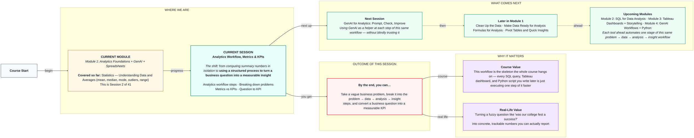

# Mental Map — Analytics Workflow, Metrics & KPIs
> Academic Session 2 · Module 1: Analytics Foundations + GenAI + Spreadsheets

```mermaid
%%{init: {'theme': 'default', 'themeVariables': { 'fontSize': '28px', 'fontFamily': 'sans-serif' }, 'flowchart': {'useMaxWidth': false, 'htmlLabels': true, 'nodeSpacing': 100, 'rankSpacing': 140, 'wrappingWidth': 700, 'padding': 40}}}%%
flowchart LR

START["<b>Course Start</b>"]

subgraph foundation[" WHERE WE ARE "]
direction TB
    CURMOD["<b>CURRENT MODULE</b><br/><i>Module 1: Analytics Foundations + GenAI + Spreadsheets</i><br/>&nbsp;<br/><b>Covered so far:</b> Statistics — Understanding Data and Averages (mean, median, mode, outliers, range)<br/>This is Session 2 of 41"]
    CURSES["<b>CURRENT SESSION</b><br/><b>Analytics Workflow, Metrics & KPIs</b><br/>&nbsp;<br/><i>The shift:</i> from <i>computing summary numbers in isolation</i> to <b>using a structured process to turn a business question into a measurable insight</b><br/>&nbsp;<br/>Analytics workflow steps · Breaking down problems<br/>Metrics vs KPIs · Question to KPI"]
end

subgraph outcome[" OUTCOME OF THIS SESSION "]
direction TB
    OUT["<b>By the end, you can…</b><br/>&nbsp;<br/>Take a vague business problem, break it into the problem → data → analysis → insight<br/>steps, and convert a business question into a measurable KPI"]
end

subgraph value[" WHY IT MATTERS "]
direction TB
    CVAL["<b>Course Value</b><br/>This workflow is the skeleton the whole course hangs on — every SQL query, Tableau<br/>dashboard, and Python script you write later is just executing one step of it faster"]
    RVAL["<b>Real-Life Value</b><br/>Turning a fuzzy question like 'was our college fest a success?'<br/>into concrete, trackable numbers you can actually report"]
end

subgraph future[" WHAT COMES NEXT "]
direction TB
    U0["<b>Next Session</b><br/>GenAI for Analytics: Prompt, Check, Improve<br/><i>Using GenAI as a helper at each step of this same workflow — without blindly trusting it</i>"]
    U1["<b>Later in Module 1</b><br/>Clean Up the Data · Make Data Ready for Analysis<br/>Formulas for Analysis · Pivot Tables and Quick Insights"]
    U2["<b>Upcoming Modules</b><br/>Module 2: SQL for Data Analysis · Module 3: Tableau Dashboards + Storytelling · Module 4: GenAI Workflows + Python<br/><i>Each tool ahead automates one stage of this same problem → data → analysis → insight workflow</i>"]
end

START ==>|" begin "| CURMOD
CURMOD ==>|" progress "| CURSES
CURSES ==>|" you get "| OUT
OUT ==>|" course "| CVAL
OUT ==>|" real life "| RVAL
CURSES ==>|" next up "| U0
U0 -.->|" then "| U1
U1 -.->|" ahead "| U2

classDef startBox fill:#F7FAFC,stroke:#4A5568,stroke-width:2px,color:#1A202C
classDef curModBox fill:#FFF8E6,stroke:#B7791F,stroke-width:2px,color:#1A202C
classDef curSessBox fill:#E6FFFA,stroke:#0D9488,stroke-width:3px,color:#1A202C
classDef outBox fill:#FEF2F2,stroke:#DC2626,stroke-width:3px,color:#1A202C
classDef valueBox fill:#F3E8FF,stroke:#7C3AED,stroke-width:2px,color:#1A202C
classDef futureBox fill:#ECFDF5,stroke:#047857,stroke-width:2px,color:#1A202C

class START startBox
class CURMOD curModBox
class CURSES curSessBox
class OUT outBox
class CVAL,RVAL valueBox
class U0,U1,U2 futureBox

linkStyle default stroke-width:2px
```
