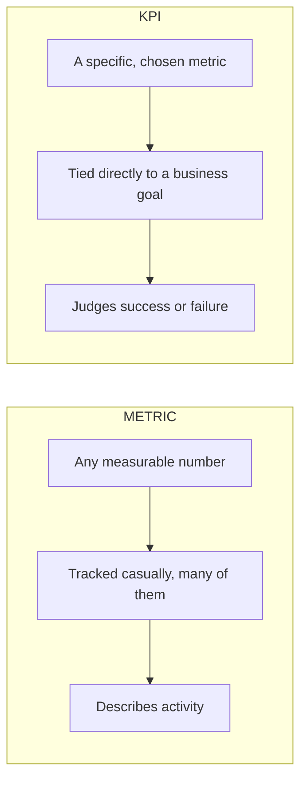

# Analytics: Analytics Workflow, Metrics & KPIs
> **Pre-Read — Academic Session 2** | Module 1: Analytics Foundations + GenAI + Spreadsheets
---
## Mental Map
> 📄 Also provided as a printable PDF in this folder: **mental-map: Analytics Workflow, Metrics & KPIs.pdf**

```mermaid
%%{init: {'theme': 'default', 'themeVariables': { 'fontSize': '12px', 'fontFamily': 'sans-serif' }, 'flowchart': {'htmlLabels': true, 'useMaxWidth': false, 'nodeSpacing': 30, 'rankSpacing': 45, 'padding': 10}}}%%
flowchart LR

START["<b>Course Start</b>"]

subgraph foundation[" WHERE WE ARE "]
direction TB
    CURMOD["<b>CURRENT MODULE</b><br/><i>Module 1: Analytics Foundations + GenAI + Spreadsheets</i><br/>&nbsp;<br/><b>Covered so far:</b> Statistics — Understanding Data and Averages (mean, median, mode, outliers, range)<br/>This is Session 2 of 41"]
    CURSES["<b>CURRENT SESSION</b><br/><b>Analytics Workflow, Metrics & KPIs</b><br/>&nbsp;<br/><i>The shift:</i> from <i>computing summary numbers in isolation</i> to <b>using a structured process to turn a business question into a measurable insight</b><br/>&nbsp;<br/>Analytics workflow steps · Breaking down problems<br/>Metrics vs KPIs · Question to KPI"]
end

subgraph outcome[" OUTCOME OF THIS SESSION "]
direction TB
    OUT["<b>By the end, you can…</b><br/>&nbsp;<br/>Take a vague business problem, break it into the problem → data → analysis → insight<br/>steps, and convert a business question into a measurable KPI"]
end

subgraph value[" WHY IT MATTERS "]
direction LR
    CVAL["<b>Course Value</b><br/>This workflow is the skeleton the whole course hangs on — every SQL query, Tableau<br/>dashboard, and Python script you write later is just executing one step of it faster"]
    RVAL["<b>Real-Life Value</b><br/>Turning a fuzzy question like "was our college fest a success—<br/>into concrete, trackable numbers you can actually report"]
end

subgraph future[" WHAT COMES NEXT "]
direction TB
    U0["<b>Next Session</b><br/>GenAI for Analytics: Prompt, Check, Improve<br/><i>Using GenAI as a helper at each step of this same workflow — without blindly trusting it</i>"]
    U1["<b>Later in Module 1</b><br/>Clean Up the Data · Make Data Ready for Analysis<br/>Formulas for Analysis · Pivot Tables and Quick Insights"]
    U2["<b>Upcoming Modules</b><br/>Module 2: SQL for Data Analysis · Module 3: Tableau Dashboards + Storytelling · Module 4: GenAI Workflows + Python<br/><i>Each tool ahead automates one stage of this same problem → data → analysis → insight workflow</i>"]
end

START ==>|" begin "| CURMOD
CURMOD ==>|" progress "| CURSES
CURSES ==>|" you get "| OUT
OUT ==>|" course "| CVAL
OUT ==>|" real life "| RVAL
CURSES ==>|" next up "| U0
U0 -.->|" then "| U1
U1 -.->|" ahead "| U2

classDef startBox fill:#F7FAFC,stroke:#4A5568,stroke-width:2px,color:#1A202C
classDef curModBox fill:#FFF8E6,stroke:#B7791F,stroke-width:2px,color:#1A202C
classDef curSessBox fill:#E6FFFA,stroke:#0D9488,stroke-width:3px,color:#1A202C
classDef outBox fill:#FEF2F2,stroke:#DC2626,stroke-width:3px,color:#1A202C
classDef valueBox fill:#F3E8FF,stroke:#7C3AED,stroke-width:2px,color:#1A202C
classDef futureBox fill:#ECFDF5,stroke:#047857,stroke-width:2px,color:#1A202C

class START startBox
class CURMOD curModBox
class CURSES curSessBox
class OUT outBox
class CVAL,RVAL valueBox
class U0,U1,U2 futureBox

linkStyle default stroke-width:2px
```

## What You'll Learn
In this pre-read, you'll discover:
- The four-step **analytics workflow** every analyst quietly follows, whether they realize it or not
- How to **break a big, vague business problem** into smaller, answerable questions
- The real difference between a **metric** and a **KPI** — they're not the same thing
- How to **convert a fuzzy business question into a measurable KPI** you could actually track

---

## A. What Is an Analytics Workflow?

**💡 Analogy:** Think about diagnosing why your phone's battery is draining fast. You don't randomly start uninstalling apps — you first define the *problem* (battery drains in 4 hours instead of 10), check the *data* (battery usage screen), *analyze* it (one app is using 60% of battery), and reach an *insight* (that app is the cause, uninstall or restrict it). Analytics works exactly the same way, just with business numbers instead of a phone screen.

**An analytics workflow is a repeatable four-step process — problem → data → analysis → insight — that turns a fuzzy question into a clear, evidence-backed answer.**

| Step | What happens | Zappy Mart example |
|---|---|---|
| **1. Problem** | Define the real business question | "Why did Udaipur branch sales drop last month— |
| **2. Data** | Identify and gather what you need to answer it | Daily sales, footfall, promotions run, stock-outs |
| **3. Analysis** | Summarize and examine the data | Compare week-by-week sales, check for stock-out days |
| **4. Insight** | State a clear, evidence-backed conclusion | "Sales dropped mainly on 4 days when the top-selling SKU was out of stock" |

**Worked example:** A vague complaint like *"our numbers look bad this month"* isn't a problem statement yet — it's a feeling. Step 1 forces you to sharpen it into something answerable: *"Did overall sales decline, or did only specific branches/products decline—*

⚠️ **Common trap:** Jumping straight to Step 3 (analysis) without a clear Step 1 (problem). Without a sharp problem statement, you can analyze for hours and still not answer the question anyone actually cares about.


---

## B. Breaking a Business Problem Into Smaller Questions

**💡 Analogy:** "Plan a great college fest" is too big to act on directly — nobody can "just do" it. You break it down: budget, venue booking, artist lineup, promotion, ticketing. Each smaller piece is now something a specific person can actually own and execute. Business problems need the same breakdown before they become analyzable.

**Breaking down a problem means converting one large, vague question into several smaller, specific ones that data can actually answer.**

**Worked example:** Problem: *"Zappy Mart's overall revenue is flat this quarter."* This alone can't be analyzed — it's too broad. Break it down:
- Is revenue flat across *all* branches, or are some up and some down?
- Is it flat across *all* product categories, or are some categories dragging it down?
- Is footfall flat too, or is footfall up but average spend per customer down?
- Did anything change — pricing, promotions, competitor activity — during this period?

Each of these sub-questions maps cleanly to a specific slice of data you can pull and compare.

⚠️ **Common trap:** Trying to answer the big question directly ("why is revenue flat—) without breaking it down first almost always leads to a vague, unconvincing answer like "market conditions" — which isn't actionable.

---

## C. Metrics vs KPIs

**💡 Analogy:** In a cricket match, "runs scored," "balls faced," and "boundaries hit" are all metrics — useful numbers you can track. But if the team management has decided "strike rate in the last 5 overs" is the *one number* they use to judge a finisher's success, that specific number becomes a KPI — a metric elevated to "this is what we judge success by."

**A metric is any number you can measure; a KPI (Key Performance Indicator) is a metric specifically chosen to track progress toward a business goal.**

| | Metric | KPI |
|---|---|---|
| **Definition** | Any measurable number | A metric tied directly to a specific goal |
| **Quantity** | Can be dozens, tracked casually | Usually a small, deliberately chosen set |
| **Example** | Daily footfall, units sold, average basket size | "Monthly revenue growth %" (if the goal is growth) |

**Worked example:** Zappy Mart tracks many metrics daily: footfall, units sold, average transaction value, number of returns, staff hours logged. If this quarter's business goal is *"grow revenue per branch by 10%,"* the KPI becomes specifically **"Revenue growth % per branch, quarter-over-quarter"** — one of those many metrics, elevated because it's what leadership will judge success by.

⚠️ **Common trap:** Treating every metric as equally important. Tracking 30 metrics with no clear KPI usually means nobody can tell you clearly whether the business is winning or losing.



---

## D. Converting a Business Question Into a KPI

**💡 Analogy:** "I want to get fitter" is a wish, not a plan. "I want to run 5 km in under 30 minutes by December" is a KPI — specific, measurable, and time-bound. Businesses need the same translation from a wish to a trackable number.

**Converting a question into a KPI means restating a business goal as a specific, measurable, trackable number with a clear direction (up or down = good).**

**Core explanation — the conversion checklist:**

| Ask this | Why it matters |
|---|---|
| What exact number captures this goal? | Vague goals ("do better") can't be tracked |
| Over what time period? | "This month" vs "this year" changes everything |
| Is higher or lower better? | Revenue ↑ is good; return rate ↑ is bad |
| Can I actually get this data? | A perfect KPI you can't measure is useless |

**Worked example:** Business question: *"Is our new loyalty program actually working—*
→ Converted KPI: **"Average monthly spend per loyalty-program customer, compared to non-members, tracked monthly."** This is specific, measurable, time-bound, and directly answers whether the program is "working."

⚠️ **Common trap:** Choosing a KPI just because the data is easy to pull, rather than because it actually answers the business question. Easy-to-measure and actually-meaningful are not always the same thing.

---

## Quick Reference — Workflow Step, Metric, or KPI?

| Your situation | Use this | Because |
|---|---|---|
| You're not sure what's actually being asked | Go back to **Step 1: Problem** | Everything downstream depends on a sharp problem statement |
| The problem feels too big to analyze directly | **Break it into smaller questions** | Each sub-question maps to a specific slice of data |
| You want to track general business activity | **Metrics** (many, tracked casually) | Gives ongoing visibility without over-focusing |
| You need one number leadership will judge success by | **KPI** (few, deliberately chosen) | Tied directly to the stated business goal |
| You have a vague goal like "grow" or "improve" | **Convert it into a KPI** using the checklist | Forces specificity: what, over what time, which direction |

---

## Practice Exercises

**1. Concept Detective**
A store manager says, "Our problem is that customers don't like us anymore." Identify what's wrong with this as a Step 1 problem statement, and rewrite it as a sharper, analyzable version.

**2. Pattern Recognition**
Zappy Mart tracks: footfall, units sold, average basket size, number of complaints, staff hours, delivery time, return rate. If this quarter's business goal is "reduce customer complaints," which of these should become the KPI, and which stay as background metrics?

**3. Real-Life Application**
List three real situations (college, personal fitness, a part-time job, a hobby) where you could apply the four-step workflow (problem → data → analysis → insight) to make a decision.

**4. Spot the Error**
A classmate proposes this as a KPI: "Make customers happier." What's missing from this to make it a proper KPI, using the conversion checklist from Section D?

**5. Planning Ahead**
Zappy Mart wants to know "should we open a new branch in Indore— Break this into at least three smaller, data-answerable questions, and propose one KPI that would most directly inform the final decision.

---
> ✅ **You're done!** You can now walk through the problem → data → analysis → insight workflow, break a big vague problem into smaller questions, tell a metric apart from a KPI, and convert a business question into a trackable KPI.
Next up: **GenAI for Analytics: Prompt, Check, Improve**, where you'll start using GenAI tools to speed up steps of this exact workflow — while learning to verify, not blindly trust, what they produce.
