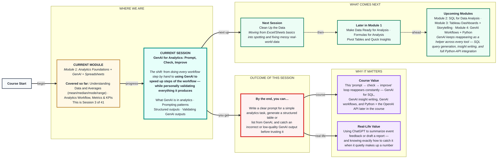
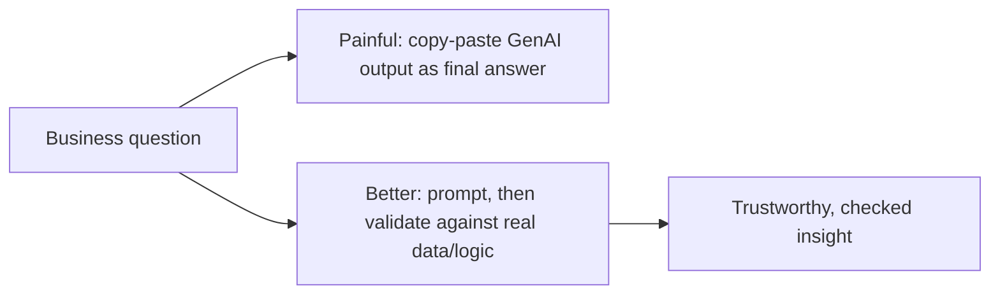

# GenAI for Analytics: Prompt, Check, Improve
> **Pre-Read — Academic Session 3** | Module 1: Analytics Foundations + GenAI + Spreadsheets
---
## Mental Map
> 📄 Also provided as a printable PDF in this folder: **mental-map: GenAI for Analytics- Prompt, Check, Improve.pdf**

## What You'll Learn
In this pre-read, you'll discover:
- What **GenAI** actually is in an analytics context, and where it fits into the workflow you learned last session
- How to write a **clear prompt** using a simple, repeatable pattern
- How to make GenAI produce **structured outputs** (tables, lists) instead of messy paragraphs
- How to **spot incorrect or low-quality GenAI outputs**, and validate them before you trust them

---

## A. What Is GenAI in Analytics?

**💡 Analogy:** Think of GenAI as a very fast, very confident intern. It can draft a summary, write a query, or organize data in seconds — but like any intern on day one, it sometimes gets things wrong with total confidence, and it's still your name on the final report. Your job isn't to avoid using the intern — it's to supervise well.

**GenAI (Generative AI) is a tool that can produce text, summaries, code, or structured content from a prompt — and in analytics, it's best used to speed up specific steps of the workflow, not to replace the analyst's judgment.**

**Where GenAI fits into last session's workflow:**

| Workflow step | How GenAI can help |
|---|---|
| Problem | Help draft or sharpen a fuzzy problem statement into smaller questions |
| Data | Suggest what data fields might be relevant (it cannot fetch real data on its own here) |
| Analysis | Draft formulas, summarize patterns you describe, organize findings into tables |
| Insight | Draft a first version of a written insight or report — for you to check and correct |

⚠️ **Common trap:** Assuming GenAI "knows" your actual business data. Unless it has been given the real numbers directly, it can only work with what you tell it — anything else is a guess, not a fact.

---

## B. Writing Basic Prompts

**💡 Analogy:** Ordering at a Zappy Mart food counter by saying "make me something" gets you a random dish. Saying "one plate of veg fried rice, medium spice, no onions" gets you exactly what you wanted. Prompts work the same way — vague requests get vague, unpredictable results.

**A good prompt gives clear instructions and states the expected output format — the more specific you are, the more useful and predictable the result.**

**Core explanation — the simple prompting pattern:**

| Part | What to include | Example |
|---|---|---|
| **Instruction** | What exactly you want done | "Summarize this week's sales data" |
| **Context** | Relevant details GenAI needs | "for the Udaipur branch, 7 days of daily sales figures" |
| **Output format** | How you want the result shaped | "as a 3-bullet summary, under 50 words" |

**Worked example — weak vs. strong prompt:**

| Weak prompt | Strong prompt |
|---|---|
| "Tell me about this sales data." | "Summarize the following 7 days of Udaipur branch sales data in exactly 3 bullet points, highlighting the highest and lowest day. Keep it under 50 words." |

The weak prompt could return anything from a one-line comment to a five-paragraph essay. The strong prompt tells GenAI exactly what "done well" looks like.

⚠️ **Common trap:** Forgetting to specify the output format. Even a perfectly clear instruction can come back in an unusable shape (a wall of text) if you never said how you wanted it structured.

---

## C. Generating Structured Outputs

**💡 Analogy:** A pivot table is far easier to scan than the same numbers buried in a paragraph. The same is true for GenAI outputs — asking for a table or list turns a rambling response into something you can immediately act on.

**Structured outputs (tables, bullet lists, numbered steps) are easier to check, compare, and use directly than free-flowing paragraphs — and you get them by explicitly asking for them in your prompt.**

**Worked example:** Prompt: *"List the 3 possible reasons Udaipur branch sales might have dropped last month, as a numbered list, one line each."*

Likely structured output:
1. A key product (top-selling SKU) may have been out of stock on several days
2. A local competitor may have run a promotion during the same period
3. Reduced footfall due to seasonal factors (e.g., off-wedding-season lull)

Compare this to the same content buried in a paragraph — the numbered list is instantly scannable and easy to hand off to a teammate.

⚠️ **Common trap:** Accepting the first structured output as final. A table or list *looks* authoritative because it's neatly formatted — but formatting is not the same as accuracy. Structure makes an output easier to check, not automatically correct.

---

## D. Checking and Validating GenAI Outputs

**💡 Analogy:** If your intern hands you a report claiming "sales grew 40% this month," you wouldn't forward it to your manager without glancing at the actual sales numbers first. The same rule applies to GenAI — before you use its output, spot-check it against something you actually know.

**Validating a GenAI output means checking it against real data, your own domain knowledge, or logical consistency before trusting or sharing it.**

**Core explanation — a simple validation checklist:**

| Check | What to look for |
|---|---|
| **Numbers** | Does any number quoted match your actual data? GenAI can confidently invent figures. |
| **Logic** | Does the reasoning actually make sense, or does it just sound fluent? |
| **Completeness** | Did it skip something important you specifically asked for? |
| **Source** | Is it stating something as fact that it couldn't actually know (e.g., your real business data)? |

**Worked example:** You ask GenAI to summarize Zappy Mart's Kanpur branch week (from Session 1: `15, 15, 16, 17, 18, 19, 30`, in ₹ thousands) and it responds: *"Average daily sales were ₹25,000, showing consistent strong performance."*

Checking against the real mean (≈ ₹18,600) and the fact that six of seven days were far lower than the "consistent strong performance" claim — this output fails both the **numbers** check and the **logic** check. The fix: re-prompt with the actual numbers included, and explicitly ask it to flag any outlier days rather than smoothing over them.

⚠️ **Common trap / highest-value insight:** A confident, well-formatted answer is not the same as a correct one. Treat every GenAI output as a first draft from a fast but unsupervised intern — never as a final answer.

---

## Quick Reference — Prompt, Check, Improve

| Your situation | Use this | Because |
|---|---|---|
| You're not getting useful output | Add clearer **instruction + context + output format** | Vague prompts produce vague, unpredictable results |
| The response is a messy paragraph | Explicitly ask for a **table or list** | Structured outputs are easier to scan and check |
| A number or claim looks suspicious | Run the **numbers/logic/completeness/source** check | Confident-sounding ≠ correct |
| The output failed validation | **Re-prompt with the real data included**, and ask it to flag anomalies | Improves accuracy instead of accepting a wrong first draft |

---

## Practice Exercises

**1. Concept Detective**
A classmate's prompt was: "Analyze my sales data." The result was three vague paragraphs with no real numbers. Identify what's missing from the prompt using the instruction/context/output-format pattern.

**2. Pattern Recognition**
GenAI summarizes a dataset and states: "Revenue increased by 22% this quarter, driven primarily by the Lucknow branch." You know for a fact Lucknow branch data wasn't even included in what you gave it. What validation check catches this, and why is it dangerous to skip?

**3. Real-Life Application**
List three real situations (assignments, event planning, personal projects) where using the prompt → check → improve loop would help you get more reliable help from a GenAI tool.

**4. Spot the Error**
A friend says: "I asked GenAI for a table of top 5 products, and it gave me a neat formatted table, so it must be accurate." What's wrong with this reasoning?

**5. Planning Ahead**
You're preparing to use GenAI throughout the rest of this course — for SQL queries, dashboard insights, and Python scripts. Write a one-sentence personal rule you'll follow every time before trusting a GenAI output.

---
> ✅ **You're done!** You can now explain what GenAI is useful for in an analytics workflow, write a clear prompt using instruction + context + output format, ask for structured outputs, and validate a GenAI response before trusting it.
Next up: **Clean Up the Data**, where you'll load a real dataset into a spreadsheet and start spotting and fixing the kind of messy, real-world data issues that make even a well-checked GenAI summary go wrong if the underlying data was dirty to begin with.
