# Spreadsheets: Clean Up the Data
> **Pre-Read — Academic Session 4** | Module 1: Analytics Foundations + GenAI + Spreadsheets
---
## Mental Map
> 📄 Also provided as a printable PDF in this folder: **mental-map: Clean Up the Data.pdf**

```mermaid
%%{init: {'theme': 'default', 'themeVariables': { 'fontSize': '12px', 'fontFamily': 'sans-serif' }, 'flowchart': {'htmlLabels': true, 'useMaxWidth': false, 'nodeSpacing': 30, 'rankSpacing': 45, 'padding': 10}}}%%
flowchart LR

START["<b>Course Start</b>"]

subgraph foundation[" WHERE WE ARE "]
direction TB
    CURMOD["<b>CURRENT MODULE</b><br/><i>Module 1: Analytics Foundations + GenAI + Spreadsheets</i><br/>&nbsp;<br/><b>Covered so far:</b> Understanding Data and Averages · Analytics Workflow, Metrics & KPIs<br/>· GenAI for Analytics<br/>This is Session 4 of 41"]
    CURSES["<b>CURRENT SESSION</b><br/><b>Clean Up the Data</b><br/>&nbsp;<br/><i>The shift:</i> from <i>discussing analytics ideas conceptually</i><br/>to <b>getting hands-on in a spreadsheet with real, messy data</b><br/>&nbsp;<br/>Loading data into spreadsheets · Spotting missing values, duplicates, formatting issues<br/>Removing duplicates & fixing formats · Sort and filter to inspect"]
end

subgraph outcome[" OUTCOME OF THIS SESSION "]
direction TB
    OUT["<b>By the end, you can…</b><br/>&nbsp;<br/>Load a raw dataset into Excel/Sheets, spot missing values, duplicates, and formatting<br/>issues by eye, and clean the obvious problems using sort and filter"]
end

subgraph value[" WHY IT MATTERS "]
direction LR
    CVAL["<b>Course Value</b><br/>Every formula, pivot table, SQL query, and dashboard ahead assumes the data<br/>underneath it is clean — this is the session where that assumption starts being true"]
    RVAL["<b>Real-Life Value</b><br/>Cleaning up a messy contact list or expense sheet before you can<br/>actually trust any total or summary calculated from it"]
end

subgraph future[" WHAT COMES NEXT "]
direction TB
    U0["<b>Next Session</b><br/>Make Data Ready for Analysis<br/><i>Going one level deeper — consistent formats, data types, and validating that cleaning actually worked</i>"]
    U1["<b>Later in Module 1</b><br/>Formulas for Analysis · Pivot Tables and Quick Insights"]
    U2["<b>Upcoming Modules</b><br/>Module 2: SQL for Data Analysis · Module 3: Tableau Dashboards + Storytelling · Module 4: GenAI Workflows + Python<br/><i>Clean data is the prerequisite every one of these tools silently assumes you've already handled</i>"]
end

START ==>|" begin "| CURMOD
CURMOD ==>|" progress "| CURSES
CURSES ==>|" you get "| OUT
OUT ==>|" course "| CVAL
OUT ==>|" real life "| RVAL
CURSES ==>|" next up "| U0
U0 -.->|" then "| U1
U1 -.->|" ahead "| U2

classDef startBox fill:#F7FAFC,stroke:#4A5568,stroke-width:2px,color:#1A202C
classDef curModBox fill:#FFF8E6,stroke:#B7791F,stroke-width:2px,color:#1A202C
classDef curSessBox fill:#E6FFFA,stroke:#0D9488,stroke-width:3px,color:#1A202C
classDef outBox fill:#FEF2F2,stroke:#DC2626,stroke-width:3px,color:#1A202C
classDef valueBox fill:#F3E8FF,stroke:#7C3AED,stroke-width:2px,color:#1A202C
classDef futureBox fill:#ECFDF5,stroke:#047857,stroke-width:2px,color:#1A202C

class START startBox
class CURMOD curModBox
class CURSES curSessBox
class OUT outBox
class CVAL,RVAL valueBox
class U0,U1,U2 futureBox

linkStyle default stroke-width:2px
```

## What You'll Learn
In this pre-read, you'll discover:
- How to **load a raw dataset** into Excel/Sheets and take a first look at it
- The four most common **data issues** analysts run into — missing values, duplicates, and formatting problems
- How to **remove duplicates and fix formats** so your data is trustworthy
- How to **sort and filter** to quickly inspect a dataset before you analyze it

---

## A. Loading Data into a Spreadsheet

**💡 Analogy:** Before you cook, you unpack the grocery bag and lay everything out on the counter — you don't start chopping while things are still in the bag. Loading data is the same first step: get it visible and laid out before you touch it.

**Loading a dataset means importing raw data (often a CSV or exported file) into a spreadsheet so every row and column is visible and workable.**

**Core explanation:**

| Step | What it looks like |
|---|---|
| Open the file | File → Open/Import, or drag-and-drop a `.csv`/`.xlsx` file |
| Confirm it loaded correctly | Check row/column count roughly matches what you expected |
| Freeze the header row | Keeps column names visible as you scroll (View → Freeze) |
| Take a first look | Scroll through without editing anything yet |

**Worked example:** Zappy Mart exports a `transactions.csv` file with columns: `Date`, `Store City`, `Product Category`, `Units Sold`, `Sale Amount (₹)`. On loading it into Sheets, the first thing to check isn't the numbers — it's whether all five columns actually landed in five separate columns, or whether something got jammed together (a classic CSV import issue).

⚠️ **Common trap:** Starting to analyze or calculate the moment the file opens. Always take a full, unhurried first look before touching a single formula — issues are far easier to catch before you've built anything on top of them.

---

## B. Spotting Common Data Issues

**💡 Analogy:** Imagine a class attendance register where a few rows are blank, one student's name is written twice on the same day by mistake, and someone wrote "15th" and "15/06" for the same date in different rows. This register technically has all the information — but you can't trust a headcount from it yet.

**Common data issues fall into three main types: missing values (empty cells), duplicates (the same record entered more than once), and formatting issues (the same kind of data written inconsistently).**

| Issue type | What it looks like | Why it matters |
|---|---|---|
| **Missing values** | Blank cells where a value should exist | Skews totals, breaks formulas, hides real gaps |
| **Duplicates** | The same transaction/record appearing twice | Inflates totals and counts |
| **Formatting issues** | Dates as "15/06" vs "15-Jun-24"; "Jaipur" vs "jaipur " with a trailing space | Spreadsheet may not recognize them as the same value |

**Worked example:** In Zappy Mart's `transactions.csv`, row 42 has a blank `Sale Amount`, rows 15 and 89 are identical (same date, store, amount — likely a double-entry), and the `Store City` column has both "Jaipur" and "jaipur" (different capitalization). · SUM or COUNT formula run on this data right now would already be wrong.

⚠️ **Common trap:** Assuming a dataset is clean just because it "looks fine" at a glance. Duplicates and inconsistent capitalization are especially easy to miss without sorting or filtering first — which is exactly Section D.

---

## C. Cleaning: Removing Duplicates and Fixing Formats

**💡 Analogy:** Once you've spotted the duplicate attendance entries and inconsistent date formats in the register, the actual fix is quick — cross out the duplicate row, and rewrite every date the same way. The hard part was *spotting* the issue; fixing it is usually simple once you know exactly what to fix.

**Cleaning means actually correcting the issues you found — removing duplicate rows and standardizing formats so every value of the same kind is written the same way.**

**Core explanation:**

| Fix | How to do it |
|---|---|
| Remove duplicates | Data → Remove duplicates (select the columns that define a "duplicate") |
| Standardize text | Use Find & Replace, or TRIM/PROPER/LOWER functions to fix casing/spacing |
| Standardize dates | Select the date column → Format → Number → Date, applied consistently |
| Standardize numbers | Ensure currency/number columns use one consistent format (no text mixed with numbers) |

**Worked example:** For Zappy Mart's data: run "Remove duplicates" on the `Date + Store City + Sale Amount` combination to catch rows 15 and 89. Use Find & Replace (or the `PROPER()` function) to turn "jaipur" into "Jaipur" consistently. Reformat the whole `Date` column to one consistent style.

⚠️ **Common trap:** Removing duplicates using only one column (e.g., just `Store City`) — this deletes far too much real data, since many genuinely different transactions share a store city. Always pick the *combination* of columns that actually defines a true duplicate.

*(Load → Spot issues → Choose duplicate-defining columns → Remove duplicates → Standardize formats)*

---

## D. Sort and Filter to Inspect Data

**💡 Analogy:** If you want to find every "absent" entry in a long attendance register, you don't read every single row top to bottom — you filter to show only "Absent," or sort by name so repeated entries sit next to each other and are easy to spot.

**Sorting arranges rows by a column's values (ascending/descending); filtering temporarily hides rows that don't match a condition — both are fast ways to inspect data without changing it.**

**Worked example:** To find missing `Sale Amount` values in Zappy Mart's data, filter the `Sale Amount` column to show only blanks — every problem row appears instantly, without scrolling through thousands of rows. To spot duplicate-looking rows, sort by `Date`, then `Store City` — identical transactions will now sit next to each other, making them easy to eyeball.

⚠️ **Common trap:** Forgetting that a filter only *hides* rows — it doesn't delete or fix anything. Many students filter to find an issue, fix what's visible, then forget rows are still hidden and miss the rest of the dataset.

---

## Quick Reference — Which Cleaning Move Do I Need?

| Your situation | Use this | Because |
|---|---|---|
| A file just landed and you haven't looked at it yet | **Load and take a full first look** | Catching issues early is cheaper than catching them after analysis |
| You suspect blank cells somewhere | **Filter the column for blanks** | Instantly isolates every missing-value row |
| You suspect the same record was entered twice | **Sort by key columns, or use Remove Duplicates** | Groups identical-looking rows together for easy spotting |
| Dates/text look inconsistent | **Standardize with Find & Replace / TRIM / PROPER / Date formatting** | Spreadsheet functions can't match "Jaipur" to "jaipur " otherwise |
| You want to scan a large dataset quickly | **Sort and/or filter** | Non-destructive — a fast way to inspect without altering data |

---

## Practice Exercises

**1. Pattern Recognition**
You open a Zappy Mart dataset and notice the `Store City` column has entries: "Jaipur", "JAIPUR", "jaipur ", and "Jaipur ". What kind of data issue is this, and why would a COUNT of "Jaipur" transactions be wrong right now?

**2. Concept Detective**
A dataset has 1,000 rows. After running Remove Duplicates on just the `Store City` column, only 5 rows remain. What went wrong with this cleaning approach?

**3. Real-Life Application**
List three real datasets from your own life (contacts list, expense tracker, event RSVP list) that likely have missing values, duplicates, or formatting issues — and name which of the three each one probably has.

**4. Spot the Error**
A classmate filters the `Sale Amount` column to find and fix blank cells, fixes the 12 visible blank rows, then reports "all missing values are now fixed." What might they be forgetting about how filters work?

**5. Planning Ahead**
You're about to hand a cleaned dataset to a teammate who will build formulas on top of it next session. Write a short checklist (3-4 items) you'd want to confirm before calling the data "clean."

---
> ✅ **You're done!** You can now load a dataset into a spreadsheet, spot missing values, duplicates, and formatting issues, clean them using Remove Duplicates and standardization tools, and use sort/filter to inspect data quickly.
Next up: **Make Data Ready for Analysis**, where you'll go one level deeper — structuring your now-clean data into consistent formats and data types, and validating that your cleaning actually worked before you start analyzing.
