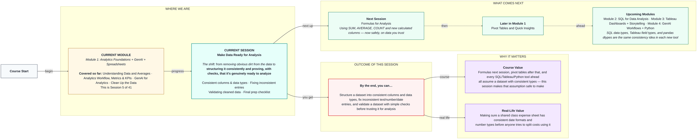

# Mental Map — Make Data Ready for Analysis
> Academic Session 5 · Module 1: Analytics Foundations + GenAI + Spreadsheets

```mermaid
%%{init: {'theme': 'default', 'themeVariables': { 'fontSize': '28px', 'fontFamily': 'sans-serif' }, 'flowchart': {'useMaxWidth': false, 'htmlLabels': true, 'nodeSpacing': 100, 'rankSpacing': 140, 'wrappingWidth': 700, 'padding': 40}}}%%
flowchart LR

START["<b>Course Start</b>"]

subgraph foundation[" WHERE WE ARE "]
direction TB
    CURMOD["<b>CURRENT MODULE</b><br/><i>Module 1: Analytics Foundations + GenAI + Spreadsheets</i><br/>&nbsp;<br/><b>Covered so far:</b> Understanding Data and Averages · Analytics Workflow, Metrics & KPIs · GenAI for Analytics · Clean Up the Data<br/>This is Session 5 of 41"]
    CURSES["<b>CURRENT SESSION</b><br/><b>Make Data Ready for Analysis</b><br/>&nbsp;<br/><i>The shift:</i> from <i>removing obvious dirt from the data</i> to <b>structuring it consistently and proving, with checks, that it's genuinely ready to analyze</b><br/>&nbsp;<br/>Consistent columns & data types · Fixing inconsistent entries<br/>Validating cleaned data · Final prep checklist"]
end

subgraph outcome[" OUTCOME OF THIS SESSION "]
direction TB
    OUT["<b>By the end, you can…</b><br/>&nbsp;<br/>Structure a dataset into consistent columns and data types, fix inconsistent text/number/date<br/>entries, and validate a dataset with simple checks before trusting it for analysis"]
end

subgraph value[" WHY IT MATTERS "]
direction TB
    CVAL["<b>Course Value</b><br/>Formulas next session, pivot tables after that, and every SQL/Tableau/Python tool ahead<br/>all assume a dataset with consistent types — this session makes that assumption safe to make"]
    RVAL["<b>Real-Life Value</b><br/>Making sure a shared class expense sheet has consistent date formats and<br/>number types before anyone tries to split costs using it"]
end

subgraph future[" WHAT COMES NEXT "]
direction TB
    U0["<b>Next Session</b><br/>Formulas for Analysis<br/><i>Using SUM, AVERAGE, COUNT and new calculated columns — now safely, on data you trust</i>"]
    U1["<b>Later in Module 1</b><br/>Pivot Tables and Quick Insights"]
    U2["<b>Upcoming Modules</b><br/>Module 2: SQL for Data Analysis · Module 3: Tableau Dashboards + Storytelling · Module 4: GenAI Workflows + Python<br/><i>SQL data types, Tableau field types, and pandas dtypes are the same consistency idea in each new tool</i>"]
end

START ==>|" begin "| CURMOD
CURMOD ==>|" progress "| CURSES
CURSES ==>|" you get "| OUT
OUT ==>|" course "| CVAL
OUT ==>|" real life "| RVAL
CURSES ==>|" next up "| U0
U0 -.->|" then "| U1
U1 -.->|" ahead "| U2

classDef startBox fill:#F7FAFC,stroke:#4A5568,stroke-width:2px,color:#1A202C
classDef curModBox fill:#FFF8E6,stroke:#B7791F,stroke-width:2px,color:#1A202C
classDef curSessBox fill:#E6FFFA,stroke:#0D9488,stroke-width:3px,color:#1A202C
classDef outBox fill:#FEF2F2,stroke:#DC2626,stroke-width:3px,color:#1A202C
classDef valueBox fill:#F3E8FF,stroke:#7C3AED,stroke-width:2px,color:#1A202C
classDef futureBox fill:#ECFDF5,stroke:#047857,stroke-width:2px,color:#1A202C

class START startBox
class CURMOD curModBox
class CURSES curSessBox
class OUT outBox
class CVAL,RVAL valueBox
class U0,U1,U2 futureBox

linkStyle default stroke-width:2px
```
