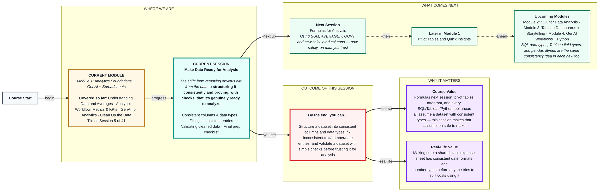
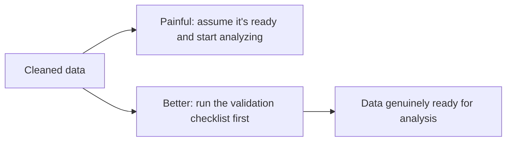

# Spreadsheets: Make Data Ready for Analysis
> **Pre-Read — Academic Session 5** | Module 1: Analytics Foundations + GenAI + Spreadsheets
---
## Mental Map
> 📄 Also provided as a printable PDF in this folder: **mental-map: Make Data Ready for Analysis.pdf**

## What You'll Learn
In this pre-read, you'll discover:
- How to **structure a dataset** into consistent columns and data types
- How to **fix inconsistent text, number, and date entries** that survived initial cleaning
- Simple **validation checks** to confirm your data is actually ready — not just "looks" ready
- A **final prep checklist** to run before you start analyzing

---

## A. Structuring Data Consistently

**💡 Analogy:** A well-organized kitchen has one drawer for spoons, one for knives, one for spices — not a single drawer with everything mixed together. A spreadsheet needs the same discipline: each column should hold exactly one kind of thing, consistently.

**Structuring a dataset means making sure each column holds one consistent data type (text, number, date) and that every row follows the same layout.**

**Core explanation:**

| Data type | What belongs in it | Example column |
|---|---|---|
| **Text** | Names, categories, labels | Store City, Product Category |
| **Number** | Quantities, amounts | Units Sold, Sale Amount (₹) |
| **Date** | Calendar dates | Transaction Date |

**Worked example:** In Zappy Mart's dataset, if the `Sale Amount` column has "1200", "₹1500", and "2,300" mixed together, a spreadsheet may treat some as text and some as numbers — meaning a SUM formula silently skips the text-formatted ones without any error message.

⚠️ **Common trap:** A column that *looks* numeric in a cell (right-aligned, digits only) isn't automatically stored as a number — currency symbols, commas, or stray spaces can quietly turn it into text.

---

## B. Fixing Inconsistent Entries

**💡 Analogy:** Imagine three friends writing down the same college fest date in a shared notes app: "12/03", "12th March", and "March 12." All three mean the same day, but no spreadsheet or search function will automatically know that unless someone standardizes it.

**Fixing inconsistent entries means rewriting values of the same underlying type (text, number, or date) so they're all expressed the same way.**

**Worked example — the three common inconsistency types:**

| Type | Messy examples | Standardized to |
|---|---|---|
| Text | "Jaipur", "jaipur", "JAIPUR " | "Jaipur" |
| Number | "1200", "₹1,200", "1200.00" | 1200 (plain number, currency formatting applied separately) |
| Date | "12/03/24", "12-Mar-2024", "March 12" | One consistent date format across the whole column |

Use `TRIM()` to remove stray spaces, `PROPER()` for consistent capitalization, and a single applied Date format for the whole column, rather than fixing entries one by one.

⚠️ **Common trap:** Fixing formatting only for the rows you can see on screen. Inconsistent entries often hide further down a long dataset — always apply a fix to the entire column, not just the visible rows.

---

## C. Validating Cleaned Data

**💡 Analogy:** Before submitting a college assignment, you don't just assume it's correct because you finished writing it — you proofread it, check the word count, and confirm you answered every part of the question. Validating data is the same proofreading step, applied to a spreadsheet.

**Validating data means running simple checks to confirm your cleaning actually worked, rather than just assuming it did.**

**Core explanation — simple validation checks:**

| Check | How to do it |
|---|---|
| Row count | Does the row count still make sense (not accidentally deleted too much)? |
| Column types | Click a few cells in each column — does the number align right, text align left? |
| Unique values | Use a quick COUNTIF or filter dropdown to check `Store City` only shows expected, standardized values |
| Spot-check totals | Does a quick SUM or COUNT roughly match what you'd expect from eyeballing the data? |

**Worked example:** After cleaning Zappy Mart's `Store City` column, open the filter dropdown — it should now show exactly five clean city names (Jaipur, Udaipur, Kanpur, Lucknow, Indore), not eight variants with different capitalization. If it still shows more than five, the cleaning wasn't fully applied.

⚠️ **Common trap:** Treating cleaning as "done" the moment a formula runs without an error. A formula can run successfully and still produce a wrong number if the underlying data still has hidden inconsistencies.

---

## D. Final Prep Checklist Before Analysis

**💡 Analogy:** A pilot doesn't take off just because the engine started — there's a pre-flight checklist covering fuel, instruments, and controls. Analysts need the same discipline before "taking off" into analysis.

**A final prep checklist is a short, repeatable list of checks run right before analysis begins, to catch anything missed earlier.**

**Core explanation — the checklist:**

1. Every column has one consistent data type
2. No unexpected blank cells (or blanks are explained/flagged, not guessed)
3. No true duplicate rows remain
4. Categorical columns (like Store City) show only the expected, standardized values
5. A quick spot-check total/count looks reasonable

**Worked example:** Before starting formulas next session, Zappy Mart's analyst runs through all five checklist items on the `transactions.csv` sheet in under two minutes — catching one leftover "udaipur" (lowercase) that had been missed during initial cleaning.

⚠️ **Common trap:** Skipping the checklist because the data was already cleaned in the previous session. Cleaning and validation are two different steps — cleaning removes visible dirt, validation proves the fix actually worked everywhere.

---

## Quick Reference — Is My Data Actually Ready?

| Your situation | Use this | Because |
|---|---|---|
| A column mixes text-formatted and true numbers | **Reformat the whole column as Number** | SUM/AVERAGE silently skip text-stored numbers |
| Same value written multiple ways | **TRIM() / PROPER() / consistent date format** | Functions can't match inconsistent text automatically |
| Not sure if cleaning actually worked | **Run the 4 validation checks (row count, types, unique values, spot-check totals)** | Assuming ≠ confirming |
| About to start formulas/analysis | **Run the 5-item final prep checklist** | Catches anything missed during initial cleaning |

---

## Practice Exercises

**1. Concept Detective**
A `Sale Amount` column shows values right-aligned for most rows but left-aligned for a few. What does this alignment difference usually signal, and why does it matter for a SUM formula?

**2. Pattern Recognition**
After "cleaning," the `Store City` filter dropdown still shows: Jaipur, Udaipur, Kanpur, Lucknow, Indore, udaipur. What does this tell you about the cleaning step, and what validation check would have caught it?

**3. Real-Life Application**
Pick one real dataset you've worked with (class marks sheet, event budget, personal expense tracker) and list which of the three data types (text/number/date) its columns should be, and one inconsistency that commonly creeps in.

**4. Spot the Error**
A classmate says: "My formulas ran without any error message, so my data must be clean." Explain why this reasoning is incomplete.

**5. Planning Ahead**
You're about to hand off a "ready" dataset to a teammate for formula-building next session. Using the final prep checklist, write the exact message you'd send them confirming what's been checked.

---
> ✅ **You're done!** You can now structure a dataset into consistent columns and types, fix inconsistent text/number/date entries, validate that your cleaning actually worked, and run a final prep checklist before analysis begins.
Next up: **Formulas for Analysis**, where you'll finally put this trustworthy dataset to work — using SUM, AVERAGE, and COUNT to calculate real business numbers with confidence.
