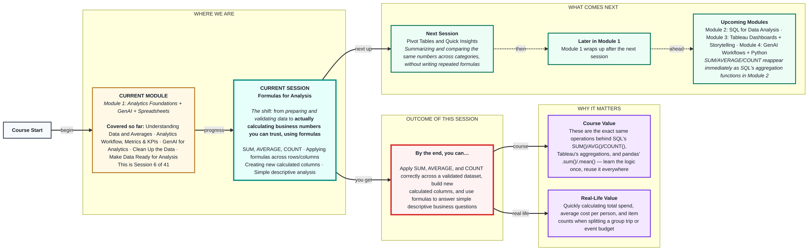

# Spreadsheets: Formulas for Analysis
> **Pre-Read — Academic Session 6** | Module 1: Analytics Foundations + GenAI + Spreadsheets
---
## Mental Map
> 📄 Also provided as a printable PDF in this folder: **mental-map: Formulas for Analysis.pdf**

## What You'll Learn
In this pre-read, you'll discover:
- How to use the three core formulas — **SUM, AVERAGE, COUNT** — for real business questions
- How to **apply a formula across many rows and columns** without retyping it each time
- How to **create new calculated columns** that don't exist in the raw data
- How to run **simple descriptive analysis** by combining formulas with what you learned in Session 1

---

## A. Core Formulas: SUM, AVERAGE, COUNT

**💡 Analogy:** Think of these three formulas as three different questions you'd ask about a stack of exam papers: "What's the total marks across the class— (SUM), "What's the typical score— (AVERAGE), and "How many papers are there— (COUNT). Same stack, three different, equally useful answers.

**SUM adds values, AVERAGE calculates the mean (Session 1's mean, applied via formula), and COUNT tells you how many entries exist.**

| Formula | What it does | Zappy Mart example |
|---|---|---|
| `=SUM(range)` | Adds all numbers in a range | `=SUM(D2:D8)` → total weekly sales |
| `=AVERAGE(range)` | Calculates the mean of a range | `=AVERAGE(D2:D8)` → average daily sales |
| `=COUNT(range)` | Counts numeric entries in a range | `=COUNT(D2:D8)` → how many days have sales data logged |

**Worked example:** Zappy Mart's Jaipur branch has 7 days of `Sale Amount` data in cells D2:D8. `=SUM(D2:D8)` gives the week's total revenue. `=AVERAGE(D2:D8)` gives the average daily sales — the same mean calculation from Session 1, just done instantly instead of by hand. `=COUNT(D2:D8)` confirms all 7 days actually have data logged (useful as a quick validation check too).

⚠️ **Common trap:** Using `COUNT` when you meant `COUNTA`. `COUNT` only counts numeric cells; if a column has text entries mixed in, `COUNT` silently ignores them — which is sometimes what you want, and sometimes a hidden bug.

---

## B. Applying Formulas Across Rows and Columns

**💡 Analogy:** If you've calculated one classmate's total marks correctly, you don't want to retype that formula 40 times for the whole class — you drag it down once and let it apply the same logic to every row automatically.

**Applying a formula across rows and columns means writing it once, then dragging/copying it so the same logic runs automatically on every relevant row or column.**

**Core explanation:**

| Technique | What it does |
|---|---|
| Fill handle (drag) | Copies a formula down a column or across a row, auto-adjusting cell references |
| Absolute reference (`$`) | Locks a specific cell/range so it doesn't shift when copied (e.g., `$D$1`) |

**Worked example:** Zappy Mart has 5 branches, each with its own weekly total in a `SUM` formula. Instead of typing `=SUM(D2:D8)` for Jaipur, then retyping a near-identical formula for Udaipur, Kanpur, Lucknow, and Indore — write it once for Jaipur, then drag the fill handle across the row (or down a column of branches) to apply it to all five instantly, with the cell references auto-adjusting for each branch's own data.

⚠️ **Common trap:** Dragging a formula that references a fixed value (like a tax rate or a target number) without using `$` to lock it — the reference shifts along with everything else and silently breaks the calculation.

---

## C. Creating New Columns with Formulas

**💡 Analogy:** A raw grocery bill lists item prices — it doesn't automatically show you "price per 100g" unless you calculate it yourself. A new calculated column is exactly that: a value derived from existing columns, not something that existed in the raw data.

**A calculated column uses a formula referencing other columns in the same row to create a brand-new piece of information.**

**Worked example:** Zappy Mart's raw data has `Units Sold` and `Sale Amount (₹)` columns, but not "Average Price per Unit." Create it: `=Sale_Amount / Units_Sold` in a new column, dragged down for every row. This new column didn't exist in the raw export — it's a derived insight built from formulas, and it can now be used in further analysis (e.g., which branch sells at the highest average price per unit).

⚠️ **Common trap:** Dividing by a column that might contain a zero (e.g., a day with zero units sold), which produces a `#DIV/0!` error. Always check for this possibility, especially after Session 2.1/2.2's work on missing/zero values.

---

## D. Descriptive Analysis Using Formulas

**💡 Analogy:** A cricket commentator doesn't just read out scores — they combine numbers into a story: "highest partnership this season," "strike rate above 150 in three of the last five matches." Descriptive analysis is combining simple formulas into small, meaningful comparisons.

**Descriptive analysis means using SUM/AVERAGE/COUNT (and calculated columns) together to describe what the data shows — not yet predicting anything, just summarizing it clearly.**

**Worked example:** Combine formulas to answer: "Which Zappy Mart branch had the highest total weekly sales, and how does its average daily sales compare to the company-wide average— This requires: `SUM` per branch (Section A), applied across all branches (Section B), possibly a calculated column for daily averages (Section C), and then a direct comparison — exactly the kind of descriptive summary a manager would actually want to see.

⚠️ **Common trap:** Reporting a single number (e.g., "total sales: ₹4,20,000") without context. Descriptive analysis is strongest when numbers are compared — against a target, another branch, or a prior period — not reported in isolation.

---

## Quick Reference — Which Formula Do I Need?

| Your situation | Use this | Because |
|---|---|---|
| You need a total | `SUM()` | Adds every value in the range |
| You need a typical value | `AVERAGE()` | Calculates the mean directly |
| You need to know how many entries exist | `COUNT()` (numbers) or `COUNTA()` (any entry) | Confirms data completeness |
| You're repeating the same formula for many rows/branches | **Fill handle + `$` for fixed references** | Saves time and avoids retyping errors |
| You need a value that doesn't exist in the raw data | **Create a calculated column** | Derives new insight from existing columns |
| You want to actually say something meaningful | **Compare numbers, don't report them alone** | A number without context isn't yet an insight |

---

## Practice Exercises

**1. Concept Detective**
A classmate uses `=COUNT(B2:B50)` on a column of `Store City` names and gets 0. Explain why, and what formula they should have used instead.

**2. Pattern Recognition**
Zappy Mart's analyst drags a formula `=D2*$B$1` (where B1 holds a fixed tax rate) down 50 rows, and it works correctly for every row. Explain what the `$` symbols are doing here.

**3. Real-Life Application**
Describe a real spreadsheet you could build (a trip budget, a college fest expense tracker, a personal savings sheet) using at least one SUM, one AVERAGE, and one calculated column.

**4. Spot the Error**
A calculated column `=SaleAmount/UnitsSold` shows `#DIV/0!` in three rows. What's the likely cause, and how should it be handled rather than ignored?

**5. Planning Ahead**
You're asked to summarize "which branch is our best performer" for a manager. List the specific formulas and calculated columns (referring to Sections A-C) you'd combine to answer this with real evidence, not just a guess.

---
> ✅ **You're done!** You can now use SUM, AVERAGE, and COUNT confidently, apply formulas across many rows and columns efficiently, build new calculated columns, and combine formulas into simple descriptive analysis.
Next up: **Pivot Tables and Quick Insights**, where you'll summarize and compare these same numbers across categories — like branch or product — without writing a single repeated formula.
