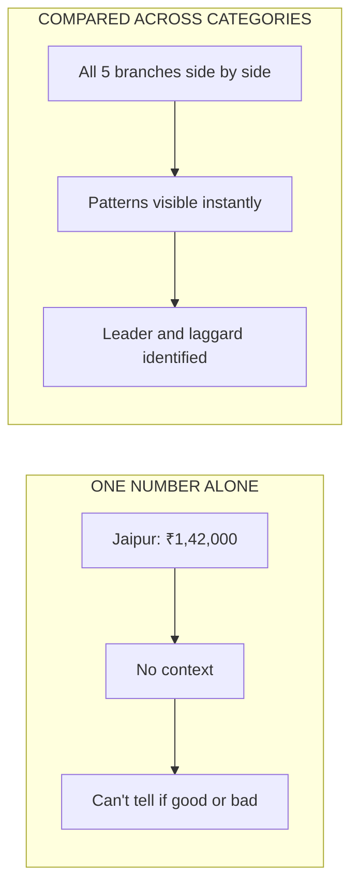

# Spreadsheets: Pivot Tables and Quick Insights
> **Pre-Read — Academic Session 7** | Module 1: Analytics Foundations + GenAI + Spreadsheets
---
## Mental Map
> 📄 Also provided as a printable PDF in this folder: **mental-map: Pivot Tables and Quick Insights.pdf**

```mermaid
%%{init: {'theme': 'default', 'themeVariables': { 'fontSize': '12px', 'fontFamily': 'sans-serif' }, 'flowchart': {'htmlLabels': true, 'useMaxWidth': false, 'nodeSpacing': 30, 'rankSpacing': 45, 'padding': 10}}}%%
flowchart LR

START["<b>Course Start</b>"]

subgraph foundation[" WHERE WE ARE "]
direction TB
    CURMOD["<b>CURRENT MODULE</b><br/><i>Module 1: Analytics Foundations + GenAI + Spreadsheets</i><br/>&nbsp;<br/><b>Covered so far:</b> Understanding Data and Averages · Analytics Workflow, Metrics & KPIs · GenAI for Analytics · Clean Up the Data · Make Data Ready for Analysis · Formulas for Analysis<br/>This is Session 7 of 41 — final session of Module 1"]
    CURSES["<b>CURRENT SESSION</b><br/><b>Pivot Tables and Quick Insights</b><br/>&nbsp;<br/><i>The shift:</i> from <i>dragging formulas manually for each summary</i> to <b>letting a pivot table instantly summarize and compare across categories</b><br/>&nbsp;<br/>What a pivot table is · Summarizing data<br/>Comparing categories · Extracting insights from pivot outputs"]
end

subgraph outcome[" OUTCOME OF THIS SESSION "]
direction TB
    OUT["<b>By the end, you can…</b><br/>&nbsp;<br/>Build a pivot table from a clean dataset, summarize totals/averages/counts by category,<br/>compare categories side by side, and pull a clear insight out of the result"]
end

subgraph value[" WHY IT MATTERS "]
direction LR
    CVAL["<b>Course Value</b><br/>This closes out Module 1's entire arc — clean data (Sessions 4-5) → formulas (Session 6) → pivot<br/>summaries (this session) — the exact same arc SQL's GROUP BY and Tableau will repeat next"]
    RVAL["<b>Real-Life Value</b><br/>Instantly comparing total spend by category on a shared trip or event<br/>budget, without manually adding up each category by hand"]
end

subgraph future[" WHAT COMES NEXT "]
direction TB
    U0["<b>Next Session</b><br/>Module 2: SQL for Data Analysis begins<br/><i>Statistics: Spread, Variability and Outliers — going deeper than range into variance and standard deviation</i>"]
    U1["<b>Later in Module 1</b><br/>Module 1 complete — every foundational spreadsheet and analytics skill is now in place"]
    U2["<b>Upcoming Modules</b><br/>Module 2: SQL for Data Analysis · Module 3: Tableau Dashboards + Storytelling · Module 4: GenAI Workflows + Python<br/><i>SQL's GROUP BY and Tableau's drag-and-drop fields are pivot tables in a new form — the logic carries forward directly</i>"]
end

START ==>|" begin "| CURMOD
CURMOD ==>|" progress "| CURSES
CURSES ==>|" you get "| OUT
OUT ==>|" course "| CVAL
OUT ==>|" real life "| RVAL
CURSES ==>|" next up "| U0
U0 -.->|" then "| U1
U1 -.->|" ahead "| U2

classDef startBox fill:#F7FAFC,stroke:#4A5568,stroke-width:2px,color:#1A202C
classDef curModBox fill:#FFF8E6,stroke:#B7791F,stroke-width:2px,color:#1A202C
classDef curSessBox fill:#E6FFFA,stroke:#0D9488,stroke-width:3px,color:#1A202C
classDef outBox fill:#FEF2F2,stroke:#DC2626,stroke-width:3px,color:#1A202C
classDef valueBox fill:#F3E8FF,stroke:#7C3AED,stroke-width:2px,color:#1A202C
classDef futureBox fill:#ECFDF5,stroke:#047857,stroke-width:2px,color:#1A202C

class START startBox
class CURMOD curModBox
class CURSES curSessBox
class OUT outBox
class CVAL,RVAL valueBox
class U0,U1,U2 futureBox

linkStyle default stroke-width:2px
```

## What You'll Learn
In this pre-read, you'll discover:
- What a **pivot table** actually is, and why it replaces dozens of dragged formulas
- How to **summarize data** — totals, averages, counts — instantly by category
- How to **compare categories** side by side to spot the real story
- How to go from a **pivot table output to an actual written insight**

---

## A. What Is a Pivot Table?

**💡 Analogy:** Imagine sorting a huge pile of cricket scorecards by team, then by player, and instantly seeing each team's total runs without manually adding a single number. A pivot table does exactly this — it reorganizes and summarizes raw rows into a compact summary table, automatically.

**A pivot table is a tool that automatically groups and summarizes raw data by category, without you writing a single SUM or AVERAGE formula yourself.**

**Core explanation:**

| Raw data (before) | Pivot table (after) |
|---|---|
| 350 individual transaction rows | 5 rows — one total per branch |
| Every single sale listed separately | Instant totals, averages, or counts, grouped how you choose |

**Worked example:** Zappy Mart's raw `transactions.csv` has 350 rows — one per sale, across 5 branches and multiple product categories. Instead of writing `SUM` formulas for each branch (Session 6's approach), a pivot table lets you drag `Store City` into "Rows" and `Sale Amount` into "Values," and it instantly produces a 5-row summary — one total per branch — in seconds.

⚠️ **Common trap:** Assuming a pivot table needs "special" clean data different from what you already have. It actually needs exactly what Sessions 4-5 already gave you: consistent columns, consistent data types, no stray duplicates. A pivot table amplifies existing data issues rather than fixing them.

---

## B. Summarizing Data with Pivot Tables

**💡 Analogy:** A restaurant bill summary at the end of the night doesn't list every individual dish sold — it groups by dish type and shows total quantity and total revenue per dish. That's a pivot summary in everyday life.

**Summarizing with a pivot table means choosing what to group by (Rows) and what to calculate (Values) — sum, average, or count — and letting the tool do the rest.**

**Core explanation — the two key drag zones:**

| Zone | What goes here | Zappy Mart example |
|---|---|---|
| **Rows** | The category you want to group by | Store City, Product Category |
| **Values** | The number to summarize, and how (Sum/Average/Count) | Sum of Sale Amount, Average of Units Sold |

**Worked example:** Drag `Store City` into Rows and `Sale Amount` into Values (set to Sum) → instantly get total sales per branch. Change the Values setting from Sum to Average → the same pivot table now shows average sale amount per branch instead, with zero formula rewriting required.

⚠️ **Common trap:** Leaving the Values field on the default "Count" when you actually meant "Sum" or "Average" — pivot tables often default to Count for text-like fields, silently giving you the wrong summary if you don't check.

---

## C. Comparing Categories

**💡 Analogy:** A single branch's sales number means little on its own — but lined up next to all five branches side by side, patterns jump out immediately: who's leading, who's lagging, and by how much.

**Comparing categories means using a pivot table's grouped rows to see multiple categories side by side, making differences and patterns immediately visible.**

**Worked example:** With `Store City` in Rows and Sum of `Sale Amount` in Values, the pivot table might show:

| Store City | Sum of Sale Amount (₹) |
|---|---|
| Jaipur | 1,42,000 |
| Udaipur | 98,000 |
| Kanpur | 1,05,000 |
| Lucknow | 1,30,000 |
| Indore | 87,000 |

Instantly visible: Jaipur leads, Indore lags — a comparison that would've taken five separate SUM formulas and manual reading to assemble by hand.

⚠️ **Common trap:** Comparing totals across categories with very different sizes (e.g., a branch open 7 days vs. a newer branch open only 3 days) without accounting for that difference — a lower total might just mean fewer operating days, not weaker performance. Always check what's actually comparable.

---

## D. Extracting Insights from Pivot Outputs

**💡 Analogy:** A pivot table is like a well-organized scoreboard — it shows you the numbers clearly, but it still takes a person to say what those numbers actually *mean* for the next match's strategy. That translation step is the real analyst skill.

**Extracting an insight means turning a pivot table's numbers into a clear, specific statement that answers the original business question — not just describing the table.**

**Worked example:** Pivot output shows Indore at ₹87,000 — lowest of all 5 branches. A weak "insight" just restates the table: *"Indore has the lowest sales."* A strong insight adds the "so what": *"Indore's sales are ₹58,000 below Jaipur's, the strongest branch — worth investigating whether this reflects Indore being newly opened, lower footfall, or a stocking issue, before deciding on next steps."*

⚠️ **Common trap:** Stopping at description ("here's what the table shows") instead of pushing to insight ("here's what it means and what to check next"). This is the exact same discipline from Session 2's analytics workflow — Analysis (Step 3) is not the same as Insight (Step 4).

---

## Quick Reference — Building a Useful Pivot Table

| Your situation | Use this | Because |
|---|---|---|
| You want totals/averages per category, fast | **Pivot table: category in Rows, number in Values** | Instantly replaces dozens of manual formulas |
| The pivot shows Count when you wanted Sum | **Check the Values field setting** | Pivot tables can default to the wrong summary type |
| You want to see who's leading/lagging | **Compare all categories side by side in the pivot** | Patterns are far more visible in a grouped table than scattered rows |
| Categories being compared aren't truly equivalent | **Check for a fair comparison basis** (e.g., same time period) | A lower total might reflect less time/data, not worse performance |
| You have the table but no conclusion yet | **State what it means and what to check next** | A pivot table is analysis; a written insight is the actual deliverable |

---

## Practice Exercises

**1. Concept Detective**
A pivot table with `Product Category` in Rows shows a "Count of Sale Amount" column instead of "Sum of Sale Amount." What setting needs to change, and why does this matter for reading the table correctly?

**2. Pattern Recognition**
A pivot table shows Indore branch with the lowest total sales, but Indore only opened 3 weeks ago compared to other branches' full quarter of data. What's misleading about comparing these totals directly?

**3. Real-Life Application**
Describe a real dataset (event RSVPs, class attendance, personal expenses) where a pivot table grouped by one category (e.g., expense type, subject, attendee status) would reveal something a flat list of rows wouldn't.

**4. Spot the Error**
A classmate submits this as their final insight: "The pivot table shows Jaipur has the highest sales." What's missing to turn this from a description into a true insight?

**5. Planning Ahead**
You need to tell a manager which product category is underperforming across all Zappy Mart branches. Describe exactly what you'd put in Rows and Values in your pivot table, and what a strong final insight sentence might look like.

---
> ✅ **You're done!** You can now build a pivot table, summarize data by category using Sum/Average/Count, compare categories side by side, and turn a pivot table's numbers into an actual written insight. This completes Module 1 — every foundational analytics and spreadsheet skill is now in place.
Next up: **Module 2: SQL for Data Analysis** begins with *Statistics: Spread, Variability and Outliers* — going deeper than Session 1's range into variance and standard deviation, right before you start querying databases directly.
