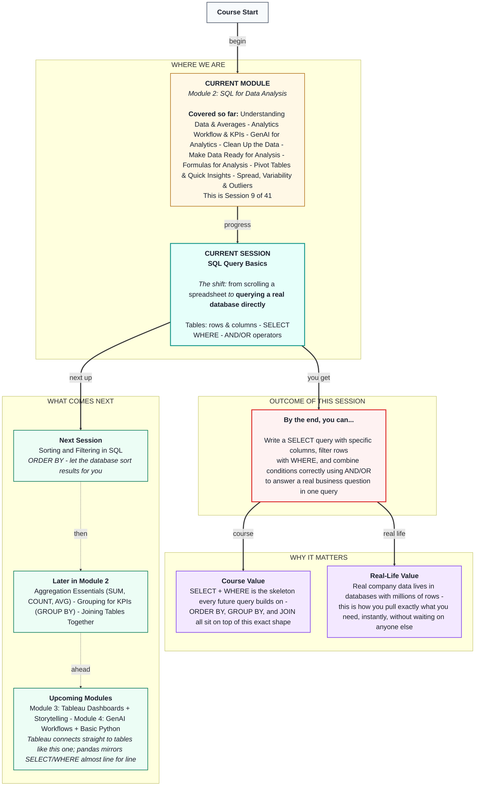

# Mental Map - SQL Query Basics
> Academic Session 9 - Module 2: SQL for Data Analysis

```mermaid
%%{init: {'flowchart': {'htmlLabels': true, 'nodeSpacing': 60, 'rankSpacing': 95, 'wrappingWidth': 400, 'padding': 18}, 'themeVariables': {'fontSize': '24px'}}}%%
flowchart TB

START["<b>Course Start</b>"]

subgraph foundation[" WHERE WE ARE "]
direction TB
    CURMOD["<b>CURRENT MODULE</b><br/><i>Module 2: SQL for Data Analysis</i><br/>&nbsp;<br/><b>Covered so far:</b> Understanding Data &amp; Averages - Analytics Workflow &amp; KPIs - GenAI for Analytics - Clean Up the Data - Make Data Ready for Analysis - Formulas for Analysis - Pivot Tables &amp; Quick Insights - Spread, Variability &amp; Outliers<br/>This is Session 9 of 41"]
    CURSES["<b>CURRENT SESSION</b><br/><b>SQL Query Basics</b><br/>&nbsp;<br/><i>The shift:</i> from scrolling a spreadsheet <i>to</i> <b>querying a real database directly</b><br/>&nbsp;<br/>Tables: rows &amp; columns - SELECT<br/>WHERE - AND/OR operators"]
end

subgraph outcome[" OUTCOME OF THIS SESSION "]
direction TB
    OUT["<b>By the end, you can...</b><br/>&nbsp;<br/>Write a SELECT query with specific columns, filter rows<br/>with WHERE, and combine conditions correctly using AND/OR<br/>to answer a real business question in one query"]
end

subgraph value[" WHY IT MATTERS "]
direction TB
    CVAL["<b>Course Value</b><br/>SELECT + WHERE is the skeleton every future query builds on -<br/>ORDER BY, GROUP BY, and JOIN all sit on top of this exact shape"]
    RVAL["<b>Real-Life Value</b><br/>Real company data lives in databases with millions of rows -<br/>this is how you pull exactly what you need, instantly, without waiting on anyone else"]
end

subgraph future[" WHAT COMES NEXT "]
direction TB
    U0["<b>Next Session</b><br/>Sorting and Filtering in SQL<br/><i>ORDER BY - let the database sort results for you</i>"]
    U1["<b>Later in Module 2</b><br/>Aggregation Essentials (SUM, COUNT, AVG) - Grouping for KPIs (GROUP BY) - Joining Tables Together"]
    U2["<b>Upcoming Modules</b><br/>Module 3: Tableau Dashboards + Storytelling - Module 4: GenAI Workflows + Basic Python<br/><i>Tableau connects straight to tables like this one; pandas mirrors SELECT/WHERE almost line for line</i>"]
end

START ==>|" begin "| CURMOD
CURMOD ==>|" progress "| CURSES
CURSES ==>|" you get "| OUT
OUT ==>|" course "| CVAL
OUT ==>|" real life "| RVAL
CURSES ==>|" next up "| U0
U0 -.->|" then "| U1
U1 -.->|" ahead "| U2

classDef startBox fill:#F7FAFC,stroke:#4A5568,stroke-width:2px,color:#1A202C
classDef curModBox fill:#FFF8E6,stroke:#B7791F,stroke-width:2px,color:#1A202C
classDef curSessBox fill:#E6FFFA,stroke:#0D9488,stroke-width:3px,color:#1A202C
classDef outBox fill:#FEF2F2,stroke:#DC2626,stroke-width:3px,color:#1A202C
classDef valueBox fill:#F3E8FF,stroke:#7C3AED,stroke-width:2px,color:#1A202C
classDef futureBox fill:#ECFDF5,stroke:#047857,stroke-width:2px,color:#1A202C

class START startBox
class CURMOD curModBox
class CURSES curSessBox
class OUT outBox
class CVAL,RVAL valueBox
class U0,U1,U2 futureBox
```
