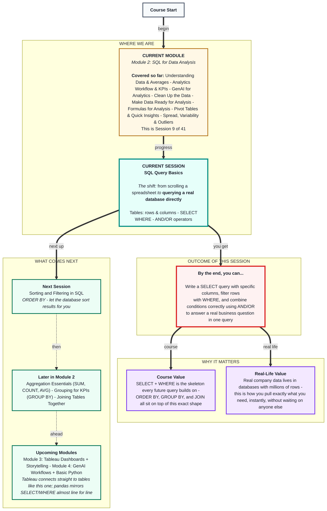
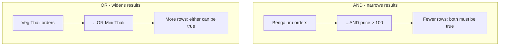

# SQL for Data Analysis: SQL Query Basics
> **Pre-Read - Academic Session 8** | Module 2: SQL for Data Analysis

---

## Mental Map
> 📄 Also provided as a printable PDF in this folder: **mental-map: SQL Query Basics.pdf**



---

## What You'll Learn

In this pre-read, you'll discover:
- Why a spreadsheet can't handle a table with millions of rows, and what SQL does instead
- How data is organized into tables, rows, and columns inside a database
- How to write a `SELECT` query to choose exactly the columns you need
- How to filter rows with `WHERE`, and combine conditions correctly with `AND` / `OR`

---

## A. Tables - how data actually lives in a database

**💡 Analogy:** Think of a kirana store's order register - a notebook where every row is one order, and every column is a fixed piece of information about that order. A SQL table is that same idea, stored digitally, with strict rules about what goes in each column.

**A table is a structured collection of data organized into rows (records) and columns (fields), where every row follows the same column structure.**

**Worked example:** A Bengaluru tiffin delivery service stores its orders in a table called `orders`:

| order_id | customer_name | city | item | quantity | price | order_date |
|---|---|---|---|---|---|---|
| 1 | Ramesh | Bengaluru | Veg Thali | 2 | 120 | 2026-08-01 |
| 2 | Fatima | Hyderabad | Non-Veg Thali | 1 | 150 | 2026-08-01 |
| 3 | Arjun | Bengaluru | Veg Thali | 1 | 120 | 2026-08-02 |
| 4 | Priya | Chennai | Mini Thali | 3 | 90 | 2026-08-02 |

Each **row** is one order. Each **column** is one attribute shared by every order. This is exactly what a Module 1 pivot table was built *from* - SQL lets you query the raw table directly, at any size, instead of pre-summarizing it in a spreadsheet first.

**⚠️ Common trap:** Confusing a column's *name* (like `price`) with the *value* in a specific cell (like 120). In SQL, a column name always refers to the entire column across every row - there's no such thing as pointing at one single cell the way you could click `B3` in a spreadsheet.

---

## B. SELECT - choosing what to look at

**💡 Analogy:** Walking into that same kirana register and saying "just show me the customer name and item columns for every order" - you're not changing the data, only choosing what to view.

**`SELECT` is the SQL keyword used to retrieve data from a table; you name which columns you want and which table to pull them from with `FROM`.**

**Worked example:** To see every column:
```sql
SELECT *
FROM orders;
```
To see only two columns:
```sql
SELECT customer_name, item
FROM orders;
```

**Result:**

| customer_name | item |
|---|---|
| Ramesh | Veg Thali |
| Fatima | Non-Veg Thali |
| Arjun | Veg Thali |
| Priya | Mini Thali |

Every SQL query in this course starts with this same skeleton: `SELECT [columns] FROM [table]`.

**⚠️ Common trap:** Defaulting to `SELECT *` out of habit, even when only two columns are needed. On a real table with 40+ columns and millions of rows, pulling everything is slow and cluttered. Treat `SELECT *` as a quick exploration tool, not a default - name exactly the columns you need.

---

## C. WHERE - filtering to the rows that matter

**💡 Analogy:** Instead of reading every page of the kirana register, WHERE is like sticky-noting only the pages that match a condition - "show me only Bengaluru orders" - before you even start reading.

**`WHERE` filters rows based on a condition, so the query returns only the rows where that condition is true.**

**Worked example:**
```sql
SELECT customer_name, item, price
FROM orders
WHERE city = 'Bengaluru';
```

**Result:**

| customer_name | item | price |
|---|---|---|
| Ramesh | Veg Thali | 120 |
| Arjun | Veg Thali | 120 |

Text values need single quotes (`'Bengaluru'`); numbers don't.

**⚠️ Common trap:** Writing `WHERE city = Bengaluru` without quotes. SQL will try to read `Bengaluru` as a column name instead of a text value, causing an error or unexpected behaviour. Always quote text, never quote numbers.

---

## D. AND / OR - combining conditions correctly

**💡 Analogy:** A single filter (only Bengaluru orders) is useful, but real business questions are usually more specific - "Bengaluru orders over ₹100" or "Veg Thali or Mini Thali orders." Operators let you stack sticky notes together.

**Comparison operators** (`=`, `<>`, `>`, `<`, `>=`, `<=`) compare a column to a value. **Logical operators** (`AND`, `OR`) combine multiple conditions.

**Worked example - AND:**
```sql
SELECT customer_name, item, price
FROM orders
WHERE city = 'Bengaluru' AND price > 100;
```

**Worked example - OR:**
```sql
SELECT customer_name, item
FROM orders
WHERE item = 'Veg Thali' OR item = 'Mini Thali';
```

**⚠️ Common trap:** Writing `WHERE item = 'Veg Thali' AND item = 'Mini Thali'` when the intent is "either of these two items." This returns **zero rows** - no single order can be both items at once. Ask: *"Can one row satisfy both conditions at the same time?"* If no, the correct operator is `OR`, not `AND`.



---

## Quick Reference - Choosing the Right Clause

| Your Situation | Use This | Because |
|---|---|---|
| You need only some columns, not all | `SELECT column1, column2` | Faster, clearer, avoids clutter on real tables |
| You need to explore an unfamiliar table quickly | `SELECT *` | Fine for a first look, not for a final query |
| You need only rows matching one condition | `WHERE` | Filters rows before they're returned |
| Both conditions must hold on the same row | `AND` | Narrows the result set |
| Either condition can hold | `OR` | Widens the result set |

---

## Practice Exercises

Using the `orders` table shown in Section A:

**1. Concept Detective:** Write the query to show only the `item` and `quantity` columns for every order. Explain why you wouldn't use `SELECT *` here.

**2. Pattern Recognition:** Write the query for all columns of orders placed on `2026-08-02`. What does an empty result for a different date actually tell you?

**3. Real-Life Application:** Write the query for `customer_name` and `price` where `price` is greater than or equal to ₹120. List 3 real business questions you could answer by changing just the WHERE condition.

**4. Spot the Error:** A classmate writes `WHERE city = Bengaluru AND quantity = 1 OR 2` to find Bengaluru orders with quantity 1 or 2. What's wrong with this, and how would you fix it?

**5. Planning Ahead:** Write the query for all orders where the item is `Non-Veg Thali` or the price is less than ₹100. Explain in one sentence why this needs `OR` and not `AND`.

---

> ✅ **You're done!** You can now query a real data table directly - choosing exactly the columns you need and filtering to exactly the rows that matter, without ever scrolling through the data by eye.
>
> Next up: **Statistics: Spread, Variability and Outliers** - a step back from SQL syntax to build statistical vocabulary you'll need soon for SQL's aggregate functions.
