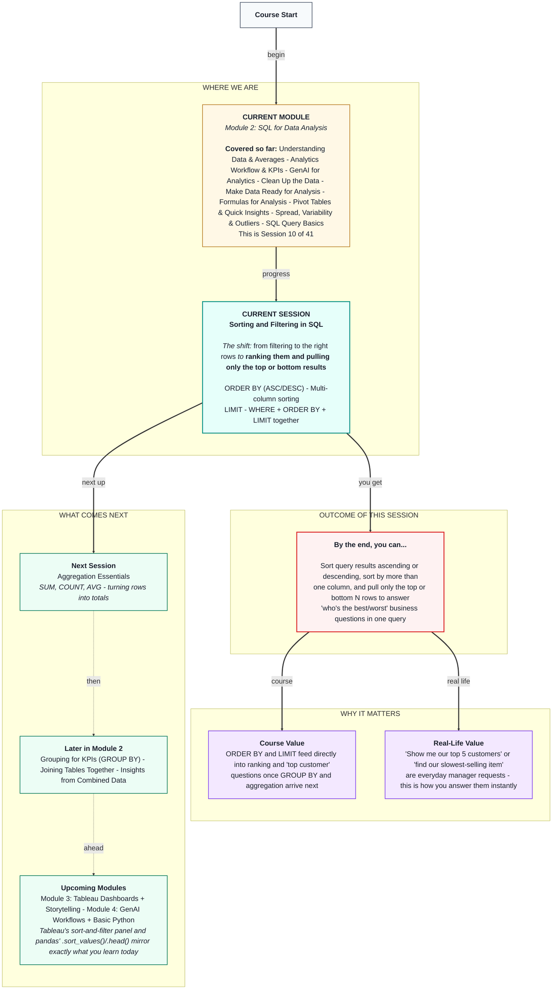

# Mental Map - Sorting and Filtering in SQL
> Academic Session 10 - Module 2: SQL for Data Analysis

```mermaid
%%{init: {'flowchart': {'htmlLabels': true, 'nodeSpacing': 100, 'rankSpacing': 150, 'wrappingWidth': 400, 'padding': 25}, 'themeVariables': {'fontSize': '24px'}}}%%
flowchart TB

START["<b>Course Start</b>"]

subgraph foundation[" WHERE WE ARE "]
direction TB
    CURMOD["<b>CURRENT MODULE</b><br/><i>Module 2: SQL for Data Analysis</i><br/>&nbsp;<br/><b>Covered so far:</b> Understanding Data &amp; Averages - Analytics Workflow &amp; KPIs - GenAI for Analytics - Clean Up the Data - Make Data Ready for Analysis - Formulas for Analysis - Pivot Tables &amp; Quick Insights - Spread, Variability &amp; Outliers - SQL Query Basics<br/>This is Session 10 of 41"]
    CURSES["<b>CURRENT SESSION</b><br/><b>Sorting and Filtering in SQL</b><br/>&nbsp;<br/><i>The shift:</i> from filtering to the right rows <i>to</i> <b>ranking them and pulling only the top or bottom results</b><br/>&nbsp;<br/>ORDER BY (ASC/DESC) - Multi-column sorting<br/>LIMIT - WHERE + ORDER BY + LIMIT together"]
end

subgraph outcome[" OUTCOME OF THIS SESSION "]
direction TB
    OUT["<b>By the end, you can...</b><br/>&nbsp;<br/>Sort query results ascending or descending, sort by more than<br/>one column, and pull only the top or bottom N rows to answer<br/>'who's the best/worst' business questions in one query"]
end

subgraph value[" WHY IT MATTERS "]
direction TB
    CVAL["<b>Course Value</b><br/>ORDER BY and LIMIT feed directly into ranking and 'top customer'<br/>questions once GROUP BY and aggregation arrive next"]
    RVAL["<b>Real-Life Value</b><br/>'Show me our top 5 customers' or 'find our slowest-selling item'<br/>are everyday manager requests - this is how you answer them instantly"]
end

subgraph future[" WHAT COMES NEXT "]
direction TB
    U0["<b>Next Session</b><br/>Aggregation Essentials<br/><i>SUM, COUNT, AVG - turning rows into totals</i>"]
    U1["<b>Later in Module 2</b><br/>Grouping for KPIs (GROUP BY) - Joining Tables Together - Insights from Combined Data"]
    U2["<b>Upcoming Modules</b><br/>Module 3: Tableau Dashboards + Storytelling - Module 4: GenAI Workflows + Basic Python<br/><i>Tableau's sort-and-filter panel and pandas' .sort_values()/.head() mirror exactly what you learn today</i>"]
end

START ==>|" begin "| CURMOD
CURMOD ==>|" progress "| CURSES
CURSES ==>|" you get "| OUT
OUT ==>|" course "| CVAL
OUT ==>|" real life "| RVAL
CURSES ==>|" next up "| U0
U0 -.->|" then "| U1
U1 -.->|" ahead "| U2

classDef startBox fill:#F7FAFC,stroke:#4A5568,stroke-width:2px,color:#1A202C
classDef curModBox fill:#FFF8E6,stroke:#B7791F,stroke-width:2px,color:#1A202C
classDef curSessBox fill:#E6FFFA,stroke:#0D9488,stroke-width:3px,color:#1A202C
classDef outBox fill:#FEF2F2,stroke:#DC2626,stroke-width:3px,color:#1A202C
classDef valueBox fill:#F3E8FF,stroke:#7C3AED,stroke-width:2px,color:#1A202C
classDef futureBox fill:#ECFDF5,stroke:#047857,stroke-width:2px,color:#1A202C

class START startBox
class CURMOD curModBox
class CURSES curSessBox
class OUT outBox
class CVAL,RVAL valueBox
class U0,U1,U2 futureBox
```
