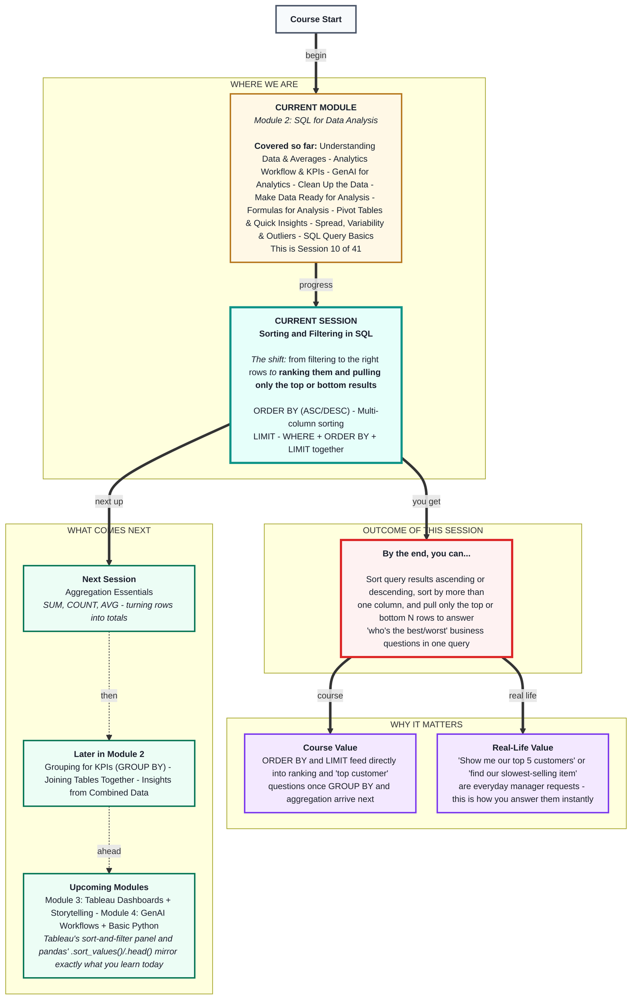
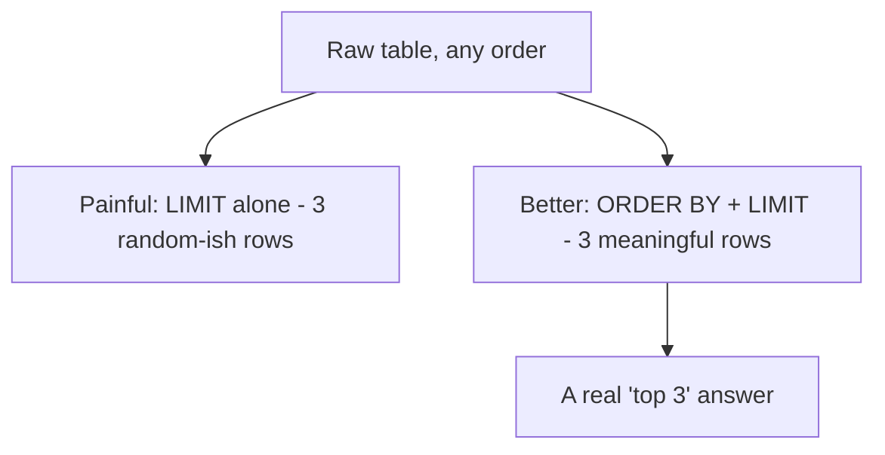

# SQL for Data Analysis: Sorting and Filtering in SQL
> **Pre-Read - Academic Session 10** | Module 2: SQL for Data Analysis

---

## Mental Map
> 📄 Also provided as a printable PDF in this folder: **mental-map: Sorting and Filtering in SQL.pdf**



---

## What You'll Learn

In this pre-read, you'll discover:
- How to sort query results with `ORDER BY`, ascending or descending
- How to sort by more than one column, in a specific priority order
- How to pull only the top or bottom N rows with `LIMIT`
- How to combine `WHERE`, `ORDER BY`, and `LIMIT` in one query to answer real ranking questions

---

## A. ORDER BY - sorting your results

**💡 Analogy:** Imagine handing someone the `orders` table on loose index cards and asking them to arrange the cards from cheapest order to most expensive. `ORDER BY` is you telling the database to do exactly that arranging, instantly, on any column you choose.

**`ORDER BY` sorts the rows returned by a query, based on one or more columns, in ascending or descending order.**

```sql
SELECT customer_name, price
FROM orders
ORDER BY price ASC;
```

**Worked example:** Using this session's running `orders` table:

| customer_name | price |
|---|---|
| Priya | 90 |
| Ramesh | 120 |
| Arjun | 120 |
| Fatima | 150 |

`ASC` (ascending) means low to high - and it's the default, so `ORDER BY price` alone sorts the same way. To reverse it:

```sql
SELECT customer_name, price
FROM orders
ORDER BY price DESC;
```

**⚠️ Common trap:** Forgetting that `ASC` is the default and assuming an unlabeled `ORDER BY` sorts high to low. It doesn't - `ORDER BY price` with nothing after it always means ascending, smallest first. If you want largest first, you must write `DESC` explicitly.

---

## B. Sorting by Multiple Columns - setting a priority order

**💡 Analogy:** A restaurant seats reservations first by table size, and *within* each table size, by earliest booking time. That's sorting by two columns - the second column only matters when the first column ties.

**Sorting by multiple columns lets you set a priority: the first column sorts everything, and the second column breaks ties within groups that share the same first-column value.**

```sql
SELECT customer_name, city, price
FROM orders
ORDER BY city ASC, price DESC;
```

This sorts alphabetically by city first, and *within* each city, by price from highest to lowest.

**Worked example:**

| customer_name | city | price |
|---|---|---|
| Arjun | Bengaluru | 120 |
| Ramesh | Bengaluru | 120 |
| Priya | Chennai | 90 |
| Fatima | Hyderabad | 150 |

**⚠️ Common trap:** Assuming the second column re-sorts the *entire* result. It doesn't - it only breaks ties *within* rows that already share the same value in the first sort column. If every city were different, the second column (`price`) would never even come into play.

---

## C. LIMIT - pulling only the top or bottom rows

**💡 Analogy:** A cricket scoreboard doesn't show every player who's ever batted - it shows the top run-scorers of the season. `LIMIT` is how you tell SQL "just show me the top few," instead of every row.

**`LIMIT` restricts the number of rows returned by a query - almost always used together with `ORDER BY` to get a meaningful "top N" or "bottom N."**

```sql
SELECT customer_name, price
FROM orders
ORDER BY price DESC
LIMIT 3;
```

This returns only the 3 highest-priced orders.

**⚠️ Common trap:** Using `LIMIT` without `ORDER BY`. `LIMIT 3` on its own just returns *any* 3 rows the database happens to return first - there's no guarantee they're the highest, lowest, or anything meaningful. `LIMIT` only becomes a "top N" tool when it's paired with `ORDER BY` to define what "top" even means.



---

## D. Combining WHERE, ORDER BY, and LIMIT - answering real ranking questions

**💡 Analogy:** A manager rarely asks for a sorted list of *everything*. They ask for a sorted list of *something specific* - "our top 3 Bengaluru orders by price," not "every order ever, sorted." That's WHERE narrowing the field, then ORDER BY ranking what's left, then LIMIT trimming to the headline number.

**The clauses combine in a fixed order: `SELECT ... FROM ... WHERE ... ORDER BY ... LIMIT ...`.** WHERE always filters rows *before* they're sorted; LIMIT always trims *after* sorting.

**Worked example:**
```sql
SELECT customer_name, price
FROM orders
WHERE city = 'Bengaluru'
ORDER BY price DESC
LIMIT 3;
```

Read left to right, in plain English: *"Start with the orders table. Keep only Bengaluru orders. Sort what's left from highest price to lowest. Show me the top 3."*

**⚠️ Common trap:** Writing the clauses out of order (e.g., `ORDER BY` before `WHERE`). SQL requires this exact sequence - `SELECT`, `FROM`, `WHERE`, `ORDER BY`, `LIMIT` - and will error if it's scrambled. When stuck, say the query out loud in plain English first, then translate line by line in that order.

---

## Quick Reference - Choosing the Right Clause

| Your Situation | Use This | Because |
|---|---|---|
| You want results sorted low to high | `ORDER BY column ASC` (or just `ORDER BY column`) | ASC is the default |
| You want results sorted high to low | `ORDER BY column DESC` | Must be stated explicitly |
| You want ties broken by a second factor | `ORDER BY col1, col2` | Second column only matters when the first ties |
| You want only the top or bottom few rows | `ORDER BY ... LIMIT n` | LIMIT alone has no defined "top" without a sort |
| You want a ranked answer to a specific business question | `WHERE ... ORDER BY ... LIMIT` together | Filters first, ranks what's left, trims to the headline number |

---

## Practice Exercises

Using the `orders` table from Session 9 (SQL Query Basics):

**1. Pattern Recognition:** Write a query that sorts all orders by `price`, highest first. Which order appears at the very top?

**2. Concept Detective:** Write a query that sorts orders by `city` (A–Z), and within each city, by `quantity` (highest first). Explain in one sentence what the second sort column is actually doing.

**3. Real-Life Application:** List 3 real workplace questions ("who are our top...", "what's our slowest...") that would each require an `ORDER BY ... LIMIT` combination to answer.

**4. Spot the Error:** A classmate writes `SELECT customer_name FROM orders LIMIT 2;` intending to find the 2 cheapest orders. What's missing, and why won't this reliably return the cheapest?

**5. Planning Ahead:** Write a single query that returns the top 2 highest-priced orders from Hyderabad only. Say the query out loud in plain English before writing the SQL.

---

> ✅ **You're done!** You can now rank query results and pull exactly the top or bottom rows a business question is really asking for - not just filter to the right rows, but order and trim them into a headline answer.
>
> Next up: **Aggregation Essentials** - where you learn `SUM`, `COUNT`, and `AVG` to turn many rows into a single meaningful total.
