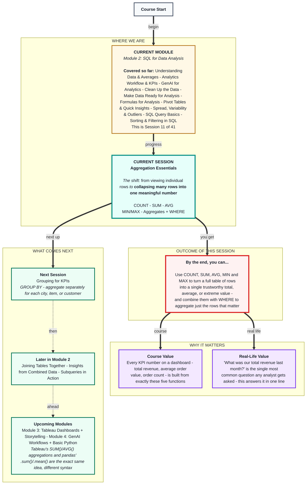
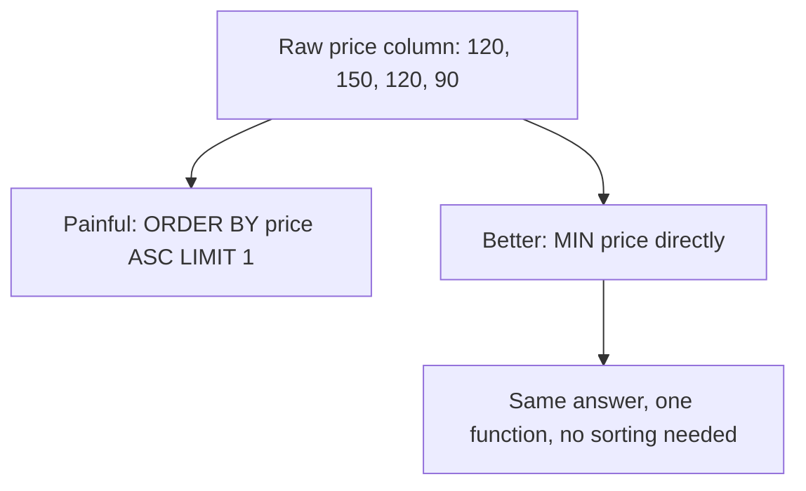

# SQL for Data Analysis: Aggregation Essentials
> **Pre-Read - Academic Session 11** | Module 2: SQL for Data Analysis

---

## Mental Map
> 📄 Also provided as a printable PDF in this folder: **mental-map: Aggregation Essentials.pdf**



---

## What You'll Learn

In this pre-read, you'll discover:
- How to count rows with `COUNT`, and why counting rows isn't always the same as counting "things"
- How to total a column with `SUM` and average it with `AVG`
- How to find extremes with `MIN` and `MAX`
- How to combine any aggregate function with `WHERE` to summarize just the rows that matter

---

## A. COUNT - how many rows do I actually have?

**💡 Analogy:** A chai stall owner doesn't want a list of every single cup sold today - they want one number: "how many cups did we sell- `COUNT` is how you get that one number instead of a long list.

**`COUNT` returns the number of rows that match a query - it collapses many rows into a single count.**

```sql
SELECT COUNT(*) AS total_orders
FROM orders;
```

`AS total_orders` renames the result column so it reads clearly - this is called an **alias**, and it's good practice on every aggregate.

**Worked example:** On this session's running `orders` table (4 rows shown in earlier sessions, more in the full practice table):

| total_orders |
|---|
| 4 |

**⚠️ Common trap:** Assuming `COUNT(*)` always means "count of unique things" - like unique customers. It doesn't. `COUNT(*)` counts **rows**. If Ramesh placed 2 separate orders, that's 2 rows, and `COUNT(*)` reports 2 - not "1 customer." Always ask: *"What does one row represent here-* (You answered this exact question back in Session 9.) Counting rows and counting entities are only the same thing when one row truly equals one entity.

---

## B. SUM and AVG - totaling and averaging a column

**💡 Analogy:** At the end of the day, a vendor doesn't want to see every individual sale amount - they want the day's **total** takings, and maybe the **average** sale size to judge if today was a big-ticket day or a small-ticket day.

**`SUM` adds up all the values in a numeric column. `AVG` divides that sum by the number of rows - the exact same "mean" calculation from Session 1.1, just computed by the database instead of by hand.**

```sql
SELECT SUM(price) AS total_revenue, AVG(price) AS average_order_value
FROM orders;
```

**Worked example:** Orders priced `120, 150, 120, 90`:
- **SUM = 120+150+120+90 = ₹480**
- **AVG = 480 ÷ 4 = ₹120**

| total_revenue | average_order_value |
|---|---|
| 480 | 120 |

**⚠️ Common trap:** Running `SUM` or `AVG` on a text column, or on a column with missing values, without checking it first. `SUM(city)` makes no sense and will error - and a column with blank or missing prices will silently be excluded from `AVG`'s calculation, quietly changing what "average" even means. This is exactly why Module 1's data-cleaning habits matter here: check your column before you aggregate it.

---

## C. MIN and MAX - finding the extremes

**💡 Analogy:** A cricket statistician doesn't scroll through every innings to find the highest score of the season - they ask for the maximum, directly. `MIN` and `MAX` are that same direct question, applied to any column.

**`MIN` returns the smallest value in a column; `MAX` returns the largest - a faster, more direct version of the `ORDER BY ... LIMIT 1` trick from last session.**

```sql
SELECT MIN(price) AS cheapest_order, MAX(price) AS priciest_order
FROM orders;
```

**Worked example:** Orders priced `120, 150, 120, 90`:

| cheapest_order | priciest_order |
|---|---|
| 90 | 150 |

**⚠️ Common trap:** Forgetting that `MIN`/`MAX` work on more than just numbers - they also work on text (alphabetical) and dates (chronological). `MIN(order_date)` returns the *earliest* date, not the smallest-looking number, which surprises students expecting only numeric behaviour.



---

## D. Combining Aggregates with WHERE - summarizing just the rows that matter

**💡 Analogy:** A manager rarely wants "total revenue, ever." They want "total revenue **from Bengaluru**" or "average order value **last week**." That's `WHERE` narrowing the rows *before* the aggregate function ever runs.

**When `WHERE` and an aggregate function appear together, the filtering happens first - the aggregate then runs only on the rows that survived the filter.**

```sql
SELECT COUNT(*) AS bengaluru_orders, SUM(price) AS bengaluru_revenue
FROM orders
WHERE city = 'Bengaluru';
```

**Worked example:** Using the running `orders` table, filtered to Bengaluru only (Ramesh: ₹120, Arjun: ₹120):

| bengaluru_orders | bengaluru_revenue |
|---|---|
| 2 | 240 |

**⚠️ Common trap:** Writing an aggregate function *inside* a `WHERE` clause, like `WHERE SUM(price) > 1000`. This will error - `WHERE` filters individual rows *before* any aggregation happens, so it cannot reference a total that doesn't exist yet at that point in the query. Filtering on an *aggregated* result requires a different clause, `HAVING`, which you'll meet next session alongside `GROUP BY`.

---

## Quick Reference - Choosing the Right Aggregate Function

| Your Situation | Use This | Because |
|---|---|---|
| You need to know how many rows match | `COUNT(*)` | Counts rows - confirm what one row represents first |
| You need a running total of a numeric column | `SUM(column)` | Adds every value in that column |
| You need the typical/average value | `AVG(column)` | Sum ÷ count, the same mean from Session 1.1 |
| You need the smallest or largest value | `MIN(column)` / `MAX(column)` | Works on numbers, text, and dates |
| You need any of the above, but only for certain rows | Add `WHERE` before the aggregate runs | Filtering happens first, aggregation happens on what's left |

---

## Practice Exercises

Using the `orders` table from Sessions 9–10:

**1. Pattern Recognition:** Write a query returning the total number of orders and the total revenue in one result. What do these two numbers together tell you that either alone wouldn't?

**2. Concept Detective:** Write a query for the average order price for Hyderabad only. Explain in one sentence why `WHERE` must come before the aggregate runs, not after.

**3. Real-Life Application:** List 3 real business questions ("what was our...", "how many...") that each map directly onto COUNT, SUM, or AVG.

**4. Spot the Error:** A classmate writes `SELECT COUNT(*) FROM orders WHERE SUM(price) > 500;` to find days with high revenue. What's wrong with this query, and why does it error?

**5. Planning Ahead:** Write a single query returning the cheapest order, the priciest order, and the average order price for Chennai orders only. Say the plain-English translation aloud before writing the SQL.

---

> ✅ **You're done!** You can now collapse an entire table - or any filtered slice of it - into the handful of numbers that actually answer a business question: how many, how much, on average, and at the extremes.
>
> Next up: **Grouping for KPIs** - where you learn `GROUP BY` to run these same aggregates separately for every city, item, or customer, all in one query.
