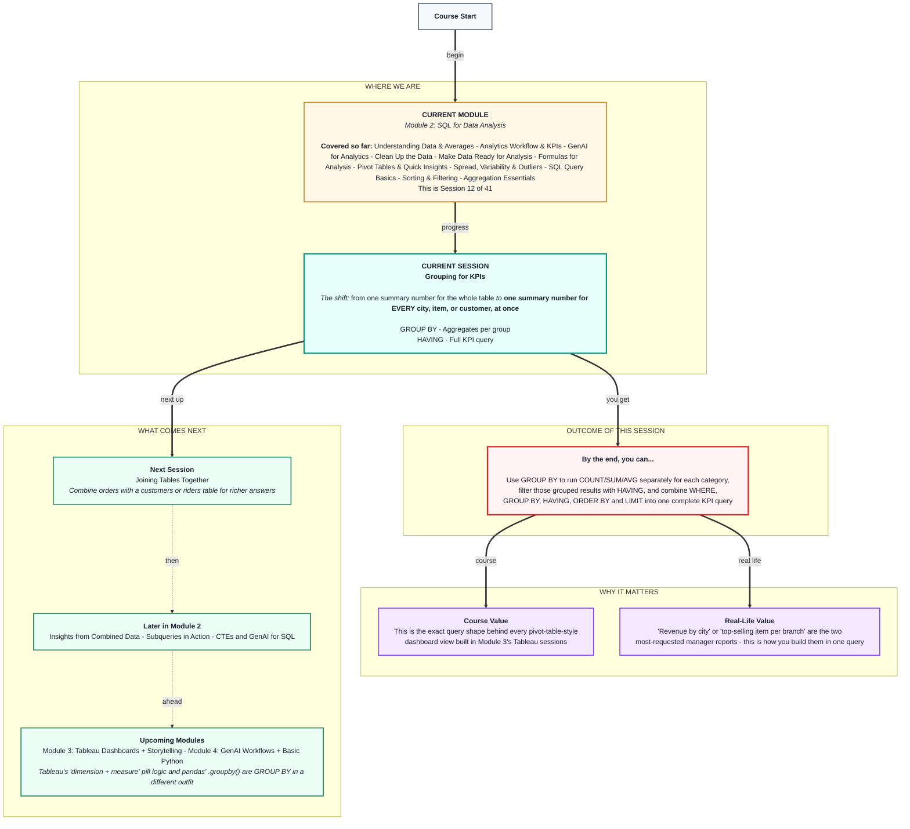

# Mental Map - Grouping for KPIs
> Academic Session 12 - Module 2: SQL for Data Analysis

```mermaid
%%{init: {'flowchart': {'htmlLabels': true, 'nodeSpacing': 60, 'rankSpacing': 95, 'wrappingWidth': 620, 'padding': 18}}}%%
flowchart TB

START["<b>Course Start</b>"]

subgraph foundation[" WHERE WE ARE "]
direction TB
    CURMOD["<b>CURRENT MODULE</b><br/><i>Module 2: SQL for Data Analysis</i><br/>&nbsp;<br/><b>Covered so far:</b> Understanding Data &amp; Averages - Analytics Workflow &amp; KPIs - GenAI for Analytics - Clean Up the Data - Make Data Ready for Analysis - Formulas for Analysis - Pivot Tables &amp; Quick Insights - Spread, Variability &amp; Outliers - SQL Query Basics - Sorting &amp; Filtering - Aggregation Essentials<br/>This is Session 12 of 41"]
    CURSES["<b>CURRENT SESSION</b><br/><b>Grouping for KPIs</b><br/>&nbsp;<br/><i>The shift:</i> from one summary number for the whole table <i>to</i> <b>one summary number for EVERY city, item, or customer, at once</b><br/>&nbsp;<br/>GROUP BY - Aggregates per group<br/>HAVING - Full KPI query"]
end

subgraph outcome[" OUTCOME OF THIS SESSION "]
direction TB
    OUT["<b>By the end, you can...</b><br/>&nbsp;<br/>Use GROUP BY to run COUNT/SUM/AVG separately for each category,<br/>filter those grouped results with HAVING, and combine WHERE,<br/>GROUP BY, HAVING, ORDER BY and LIMIT into one complete KPI query"]
end

subgraph value[" WHY IT MATTERS "]
direction TB
    CVAL["<b>Course Value</b><br/>This is the exact query shape behind every pivot-table-style<br/>dashboard view built in Module 3's Tableau sessions"]
    RVAL["<b>Real-Life Value</b><br/>'Revenue by city' or 'top-selling item per branch' are the two<br/>most-requested manager reports - this is how you build them in one query"]
end

subgraph future[" WHAT COMES NEXT "]
direction TB
    U0["<b>Next Session</b><br/>Joining Tables Together<br/><i>Combine orders with a customers or riders table for richer answers</i>"]
    U1["<b>Later in Module 2</b><br/>Insights from Combined Data - Subqueries in Action - CTEs and GenAI for SQL"]
    U2["<b>Upcoming Modules</b><br/>Module 3: Tableau Dashboards + Storytelling - Module 4: GenAI Workflows + Basic Python<br/><i>Tableau's 'dimension + measure' pill logic and pandas' .groupby() are GROUP BY in a different outfit</i>"]
end

START ==>|" begin "| CURMOD
CURMOD ==>|" progress "| CURSES
CURSES ==>|" you get "| OUT
OUT ==>|" course "| CVAL
OUT ==>|" real life "| RVAL
CURSES ==>|" next up "| U0
U0 -.->|" then "| U1
U1 -.->|" ahead "| U2

classDef startBox fill:#F7FAFC,stroke:#4A5568,stroke-width:2px,color:#1A202C
classDef curModBox fill:#FFF8E6,stroke:#B7791F,stroke-width:2px,color:#1A202C
classDef curSessBox fill:#E6FFFA,stroke:#0D9488,stroke-width:3px,color:#1A202C
classDef outBox fill:#FEF2F2,stroke:#DC2626,stroke-width:3px,color:#1A202C
classDef valueBox fill:#F3E8FF,stroke:#7C3AED,stroke-width:2px,color:#1A202C
classDef futureBox fill:#ECFDF5,stroke:#047857,stroke-width:2px,color:#1A202C

class START startBox
class CURMOD curModBox
class CURSES curSessBox
class OUT outBox
class CVAL,RVAL valueBox
class U0,U1,U2 futureBox
```
