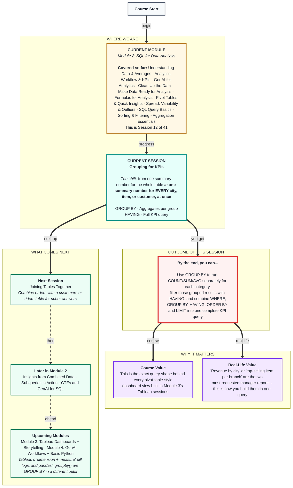
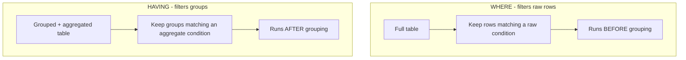

# SQL for Data Analysis: Grouping for KPIs
> **Pre-Read - Academic Session 12** | Module 2: SQL for Data Analysis

---

## Mental Map
> 📄 Also provided as a printable PDF in this folder: **mental-map: Grouping for KPIs.pdf**



---

## What You'll Learn

In this pre-read, you'll discover:
- How `GROUP BY` runs an aggregate function separately for every distinct value in a column
- How to combine `GROUP BY` with `COUNT`, `SUM`, and `AVG` to build a real KPI table
- How `HAVING` filters *grouped* results - the fix for last session's "WHERE can't filter an aggregate" trap
- How `WHERE`, `GROUP BY`, `HAVING`, `ORDER BY`, and `LIMIT` combine in one complete query, in the correct order

---

## A. GROUP BY - one summary number per category

**💡 Analogy:** Last session you asked a chai stall owner "how many cups did we sell today- and got one number. Now imagine she runs 3 branches and asks: "how many did each branch sell- You don't want one number anymore - you want one number *per branch*. That's exactly what `GROUP BY` does.

**`GROUP BY` splits the table into groups based on a column's distinct values, then runs any aggregate function separately for each group.**

```sql
SELECT city, COUNT(*) AS order_count
FROM orders
GROUP BY city;
```

**Worked example:** Using the running `orders` table (Bengaluru×2, Hyderabad×1, Chennai×1):

| city | order_count |
|---|---|
| Bengaluru | 2 |
| Hyderabad | 1 |
| Chennai | 1 |

One row per city, instead of one row per order - the table has been *collapsed by group*.

**⚠️ Common trap:** Including a column in `SELECT` that isn't in `GROUP BY` and isn't wrapped in an aggregate function. `SELECT city, customer_name, COUNT(*) FROM orders GROUP BY city;` will error (or behave inconsistently depending on the database) - because within a single "Bengaluru" group there might be 2 different customer names, and SQL doesn't know which one to show you. **Every column in SELECT must either be in GROUP BY, or wrapped in an aggregate function.**

---

## B. Combining GROUP BY with Multiple Aggregate Functions

**💡 Analogy:** A manager reviewing branch performance doesn't just want order counts per city - they want order count, total revenue, AND average order value, all side by side, per city, in one table.

**Any number of aggregate functions from last session - `COUNT`, `SUM`, `AVG`, `MIN`, `MAX` - can run together in the same `GROUP BY` query, each producing its own column.**

```sql
SELECT city,
       COUNT(*) AS order_count,
       SUM(price) AS total_revenue,
       AVG(price) AS average_order_value
FROM orders
GROUP BY city;
```

**Worked example:**

| city | order_count | total_revenue | average_order_value |
|---|---|---|---|
| Bengaluru | 2 | 240 | 120 |
| Hyderabad | 1 | 150 | 150 |
| Chennai | 1 | 90 | 90 |

This single query answers three separate manager questions at once - how many, how much, and how big on average - broken out by city.

**⚠️ Common trap:** Reading `AVG(price)` in a grouped query as the average across the *whole* table. It isn't - each row in this result is its own group's average, calculated only from that group's rows. Hyderabad's ₹150 average is based on exactly 1 order, not all 4.

---

## C. HAVING - filtering the grouped results

**💡 Analogy:** Last session, you tried to filter on a total (`WHERE SUM(price) > 1000`) and it errored, because WHERE only ever sees individual rows, before any grouping or totaling happens. `HAVING` is the clause built specifically to filter *after* grouping - "show me only the branches whose total revenue passed a certain number."

**`HAVING` filters groups based on the result of an aggregate function - it runs *after* `GROUP BY` has already collapsed the rows.**

```sql
SELECT city, SUM(price) AS total_revenue
FROM orders
GROUP BY city
HAVING SUM(price) > 100;
```

**Worked example:** Using the totals from Section B (Bengaluru: 240, Hyderabad: 150, Chennai: 90):

| city | total_revenue |
|---|---|
| Bengaluru | 240 |
| Hyderabad | 150 |

Chennai (₹90) is dropped - it didn't clear the ₹100 threshold. This is the exact query that errored last session when attempted with `WHERE` - `HAVING` is the tool built for this specific job.

**⚠️ Common trap:** Using `WHERE` and `HAVING` interchangeably, or in the wrong order. `WHERE` filters raw rows *before* grouping happens; `HAVING` filters groups *after* grouping happens, based on an aggregate result. If your condition mentions a raw column (like `city = 'Bengaluru'`), it belongs in `WHERE`. If it mentions an aggregate function (like `SUM(price) > 100`), it belongs in `HAVING`. Mixing them up is one of the most common SQL errors even experienced analysts make.



---

## D. Putting It All Together - the Full KPI Query

**💡 Analogy:** A real manager request is rarely just one clause - it's usually a full sentence: *"Show me total revenue by city, but only for cities that made more than ₹100, sorted highest revenue first, and just give me the top 2."* Each clause you've learned across this module answers one piece of that sentence.

**The full clause order is fixed: `SELECT ... FROM ... WHERE ... GROUP BY ... HAVING ... ORDER BY ... LIMIT ...`.** Each clause does exactly one job, in exactly this sequence.

```sql
SELECT city, SUM(price) AS total_revenue
FROM orders
WHERE quantity > 0
GROUP BY city
HAVING SUM(price) > 100
ORDER BY total_revenue DESC
LIMIT 2;
```

Read left to right: *"Start with orders. Keep only rows with a positive quantity. Group what's left by city. Keep only city groups with total revenue over ₹100. Sort those from highest to lowest revenue. Show me the top 2."*

**⚠️ Common trap:** Trying to sort or limit by a column that doesn't exist in the grouped result - for example, `ORDER BY price DESC` after grouping by city, when `price` no longer exists as an individual row-level column in the output. After `GROUP BY`, sort and filter using the *aggregated* column names (like `total_revenue`), not the original raw column they were built from.

---

## Quick Reference - Choosing the Right Clause, in Order

| Your Situation | Use This | Because |
|---|---|---|
| You want to keep only certain raw rows | `WHERE` | Filters rows before any grouping happens |
| You want one summary number per category | `GROUP BY` | Splits the table into groups, one aggregate result per group |
| You want to keep only certain groups, based on a total | `HAVING` | Filters groups after aggregation - WHERE cannot do this |
| You want the groups ranked | `ORDER BY` | Sorts the grouped/aggregated results |
| You want only the top or bottom groups | `LIMIT` | Trims the sorted, grouped results to a headline number |

---

## Practice Exercises

Using the fuller `orders` table from Sessions 9–11:

**1. Pattern Recognition:** Write a query showing order count per city. Which city has the most orders?

**2. Concept Detective:** Write a query showing total revenue and average order value per item (`item` column). Explain in one sentence why the AVG in each row only reflects that item's orders, not the whole table.

**3. Real-Life Application:** List 3 real "by category" business questions (by city, by item, by customer) that map directly onto a GROUP BY query.

**4. Spot the Error:** A classmate writes `SELECT city, SUM(price) FROM orders GROUP BY city WHERE SUM(price) > 200;`. What's wrong, and how would you fix it?

**5. Planning Ahead:** Write a single query showing total revenue per city, keeping only cities with total revenue above ₹100, sorted highest revenue first. Say the plain-English translation aloud before writing the SQL.

---

> ✅ **You're done!** You can now build a real KPI table in one query - total revenue, order count, or average value, broken out by any category, filtered before AND after grouping, and ranked to the headline number a manager actually asked for.
>
> Next up: **Joining Tables Together** - where you learn to combine `orders` with a second table, like `customers`, to answer even richer questions.
