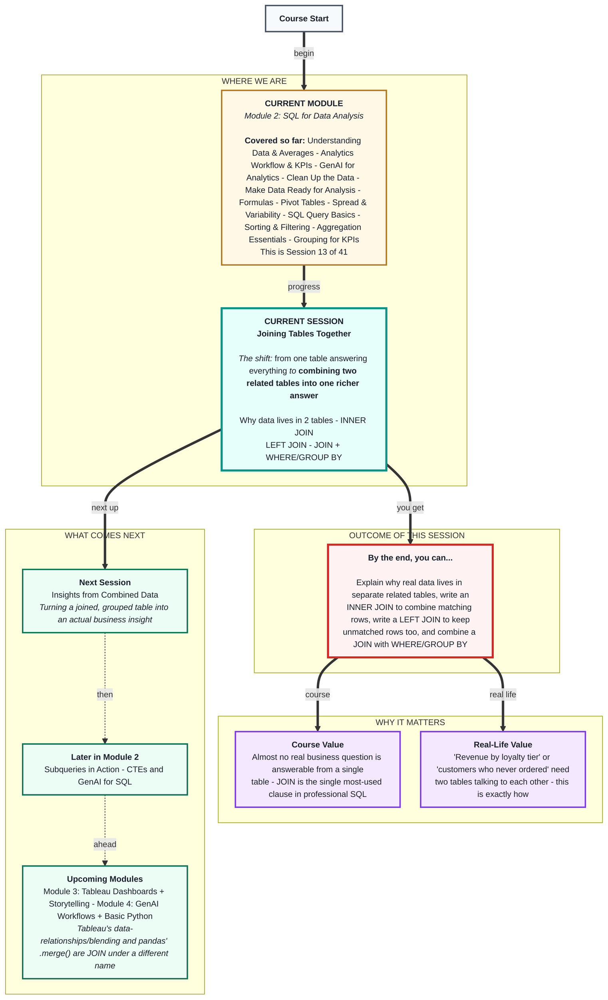
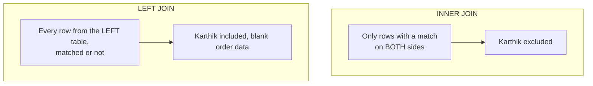

# SQL for Data Analysis: Joining Tables Together
> **Pre-Read - Academic Session 13** | Module 2: SQL for Data Analysis

---

## Mental Map
> 📄 Also provided as a printable PDF in this folder: **mental-map: Joining Tables Together.pdf**



---

## What You'll Learn

In this pre-read, you'll discover:
- Why real business data lives in multiple related tables instead of one giant table
- How `INNER JOIN` combines two tables using a shared key column
- How `LEFT JOIN` keeps every row from the first table, even when there's no match in the second
- How to combine a `JOIN` with `WHERE` and `GROUP BY` to answer richer business questions

---

## A. Why Data Lives in Two Tables - Meet `customers`

**💡 Analogy:** A school doesn't cram every student's name, address, AND every single exam score into one giant sheet - it keeps a **student register** (one row per student) and a separate **marks register** (one row per exam), linked by roll number. Repeating a student's full address on every single exam row would be wasteful and risky - if the address changes, you'd have to update it in dozens of places instead of just one.

**A well-structured database splits information into separate tables, each about one kind of thing, linked together by a shared key column - this avoids repeating (and risking inconsistent copies of) the same information over and over.**

From this session onward, the tiffin delivery service's data lives in **two** tables:

**`customers`** - one row per customer:

| customer_id | customer_name | city | loyalty_tier |
|---|---|---|---|
| 1 | Ramesh | Bengaluru | Gold |
| 2 | Fatima | Hyderabad | Silver |
| 3 | Arjun | Bengaluru | Silver |
| 4 | Priya | Chennai | Gold |
| 5 | Karthik | Bengaluru | Bronze |

**`orders`** - one row per order, now linked by `customer_id` instead of repeating the customer's name and city on every row:

| order_id | customer_id | item | quantity | price | order_date |
|---|---|---|---|---|---|
| 1 | 1 | Veg Thali | 2 | 120 | 2026-08-01 |
| 2 | 2 | Non-Veg Thali | 1 | 150 | 2026-08-01 |
| 3 | 3 | Veg Thali | 1 | 120 | 2026-08-02 |
| 4 | 4 | Mini Thali | 3 | 90 | 2026-08-02 |

Notice: Karthik (customer_id 5) exists in `customers` but has **no matching row** in `orders` - he's signed up but never ordered. Keep this in mind; it matters a lot in Section C.

**⚠️ Common trap:** Assuming the `orders` table from earlier sessions and this session's version are "the same table with extra columns." They're not - `customer_name` and `city` have been deliberately *removed* from `orders` and now live only in `customers`. This is a real, common step called **normalization**: keeping one piece of information in exactly one place, instead of scattered and duplicated across every table that needs it.

---

## B. INNER JOIN - combining rows that match on both sides

**💡 Analogy:** A teacher lining up the student register and the marks register side by side, matching each exam row to the correct student by roll number - and only keeping rows where a match was actually found on both sides.

**`INNER JOIN` combines rows from two tables where a shared column (the "key") matches in both - rows with no match on either side are excluded.**

```sql
SELECT orders.order_id, customers.customer_name, orders.item, orders.price
FROM orders
INNER JOIN customers
  ON orders.customer_id = customers.customer_id;
```

**Worked example:**

| order_id | customer_name | item | price |
|---|---|---|---|
| 1 | Ramesh | Veg Thali | 120 |
| 2 | Fatima | Non-Veg Thali | 150 |
| 3 | Arjun | Veg Thali | 120 |
| 4 | Priya | Mini Thali | 90 |

Notice: Karthik does **not** appear here at all - he has no matching row in `orders`, so `INNER JOIN` silently leaves him out. Every result row required a match on both sides.

**⚠️ Common trap:** Forgetting the `ON` clause, or joining on the wrong pair of columns (e.g., `ON orders.order_id = customers.customer_id`, matching two completely unrelated ID columns). Without a correct `ON` condition, SQL either errors or - worse - produces a **cartesian product**: every row in `orders` paired with every row in `customers`, regardless of whether they're actually related. Always double-check that your `ON` condition compares the columns that are genuinely meant to match.

---

## C. LEFT JOIN - keeping every row from the first table, matched or not

**💡 Analogy:** Now imagine the school principal specifically wants a list of **every student**, including ones who haven't taken any exams yet - with blank marks next to their name instead of leaving them off the list entirely.

**`LEFT JOIN` keeps every row from the first ("left") table, whether or not it has a match in the second ("right") table - unmatched rows get filled with `NULL` (empty) values for the second table's columns.**

```sql
SELECT customers.customer_name, orders.item, orders.price
FROM customers
LEFT JOIN orders
  ON customers.customer_id = orders.customer_id;
```

**Worked example:**

| customer_name | item | price |
|---|---|---|
| Ramesh | Veg Thali | 120 |
| Fatima | Non-Veg Thali | 150 |
| Arjun | Veg Thali | 120 |
| Priya | Mini Thali | 90 |
| Karthik | *(NULL)* | *(NULL)* |

Now Karthik appears - with empty `item` and `price` - because `customers` is the "left" table this time, and `LEFT JOIN` guarantees every one of its rows survives, matched or not.

**⚠️ Common trap:** Using `INNER JOIN` when the real business question needs `LEFT JOIN`, or vice versa. "Which customers have never ordered- is *only* answerable with `LEFT JOIN` - an `INNER JOIN` would silently exclude exactly the customers you're trying to find, because they have no match at all. Always ask: *"Do I need only the rows that matched - or every row from one side, matched or not-*



---

## D. Combining JOIN with WHERE and GROUP BY

**💡 Analogy:** A manager's real question is rarely just "combine the two tables" - it's "combine them, then narrow down, then summarize by category," all at once. "Total revenue by loyalty tier" needs the `customers` and `orders` tables joined, THEN grouped.

**A `JOIN` can be followed by any clause you already know - `WHERE`, `GROUP BY`, `HAVING`, `ORDER BY`, `LIMIT` - applied to the newly combined table exactly as if it were one table all along.**

```sql
SELECT customers.loyalty_tier, SUM(orders.price) AS total_revenue
FROM customers
INNER JOIN orders
  ON customers.customer_id = orders.customer_id
GROUP BY customers.loyalty_tier
ORDER BY total_revenue DESC;
```

**Worked example:**

| loyalty_tier | total_revenue |
|---|---|
| Gold | 210 |
| Silver | 270 |

This single query answers a question neither table could answer alone: `orders` doesn't know loyalty tiers, and `customers` doesn't know prices - joined together, both questions become answerable at once.

**⚠️ Common trap:** Forgetting to prefix column names with their table name (like `customers.city` vs `orders.city`) when both tables happen to share a column name, or when it's ambiguous which table a column came from. Once two tables are joined, always qualify column names with `table_name.column_name` if there's any chance of confusion - SQL will error on a genuinely ambiguous reference rather than guess.

---

## Quick Reference - Choosing the Right Join

| Your Situation | Use This | Because |
|---|---|---|
| You only want rows that exist in both tables | `INNER JOIN` | Excludes anything unmatched on either side |
| You want every row from the first table, matched or not | `LEFT JOIN` | Unmatched rows get NULLs instead of being dropped |
| You need to find rows with NO match at all | `LEFT JOIN` + check for NULL | INNER JOIN would exclude exactly what you're looking for |
| You need a joined table filtered, grouped, or ranked | Add `WHERE`/`GROUP BY`/`ORDER BY`/`LIMIT` after the JOIN | These work exactly as before, on the combined result |

---

## Practice Exercises

Using the `customers` and `orders` tables from Section A:

**1. Pattern Recognition:** Write an `INNER JOIN` query showing each order's `item` and the customer's `city`. How many rows does it return, and why not 5 (the number of customers)?

**2. Concept Detective:** Write a `LEFT JOIN` query, starting from `customers`, showing `customer_name` and `item`. Which customer shows up with a blank `item`, and why?

**3. Real-Life Application:** List 3 real business questions that specifically require `LEFT JOIN` (not `INNER JOIN`) because they're asking about *missing* matches.

**4. Spot the Error:** A classmate writes `SELECT * FROM orders JOIN customers ON orders.order_id = customers.customer_id;`. What's wrong with the `ON` condition, and what would you expect to see in the result?

**5. Planning Ahead:** Write a query showing total revenue per city, using an `INNER JOIN` between `customers` and `orders`, grouped by `customers.city`. Say the plain-English translation aloud before writing the SQL.

---

> ✅ **You're done!** You can now combine two related tables into one richer answer - pulling in customer details alongside their orders, and correctly choosing whether unmatched rows should be dropped or kept.
>
> Next up: **Insights from Combined Data** - where you turn a joined, grouped table like today's into an actual written business insight.
