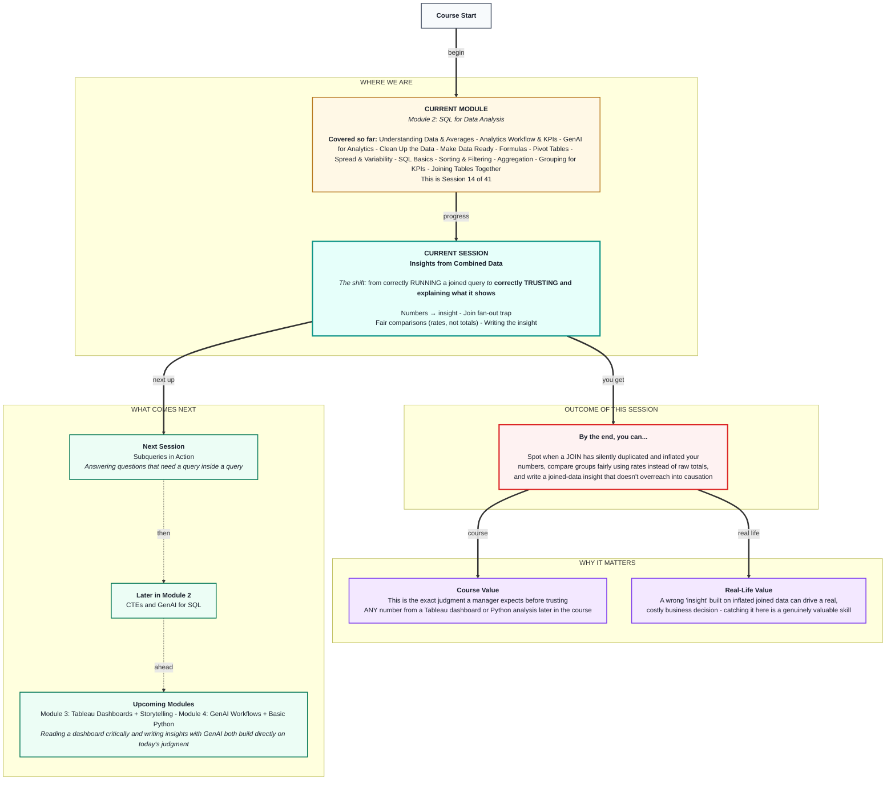

# Mental Map - Insights from Combined Data
> Academic Session 14 - Module 2: SQL for Data Analysis

```mermaid
%%{init: {'flowchart': {'htmlLabels': true, 'nodeSpacing': 60, 'rankSpacing': 95, 'wrappingWidth': 620, 'padding': 18}}}%%
flowchart TB

START["<b>Course Start</b>"]

subgraph foundation[" WHERE WE ARE "]
direction TB
    CURMOD["<b>CURRENT MODULE</b><br/><i>Module 2: SQL for Data Analysis</i><br/>&nbsp;<br/><b>Covered so far:</b> Understanding Data &amp; Averages - Analytics Workflow &amp; KPIs - GenAI for Analytics - Clean Up the Data - Make Data Ready - Formulas - Pivot Tables - Spread &amp; Variability - SQL Basics - Sorting &amp; Filtering - Aggregation - Grouping for KPIs - Joining Tables Together<br/>This is Session 14 of 41"]
    CURSES["<b>CURRENT SESSION</b><br/><b>Insights from Combined Data</b><br/>&nbsp;<br/><i>The shift:</i> from correctly RUNNING a joined query <i>to</i> <b>correctly TRUSTING and explaining what it shows</b><br/>&nbsp;<br/>Numbers → insight - Join fan-out trap<br/>Fair comparisons (rates, not totals) - Writing the insight"]
end

subgraph outcome[" OUTCOME OF THIS SESSION "]
direction TB
    OUT["<b>By the end, you can...</b><br/>&nbsp;<br/>Spot when a JOIN has silently duplicated and inflated your<br/>numbers, compare groups fairly using rates instead of raw totals,<br/>and write a joined-data insight that doesn't overreach into causation"]
end

subgraph value[" WHY IT MATTERS "]
direction TB
    CVAL["<b>Course Value</b><br/>This is the exact judgment a manager expects before trusting<br/>ANY number from a Tableau dashboard or Python analysis later in the course"]
    RVAL["<b>Real-Life Value</b><br/>A wrong 'insight' built on inflated joined data can drive a real,<br/>costly business decision - catching it here is a genuinely valuable skill"]
end

subgraph future[" WHAT COMES NEXT "]
direction TB
    U0["<b>Next Session</b><br/>Subqueries in Action<br/><i>Answering questions that need a query inside a query</i>"]
    U1["<b>Later in Module 2</b><br/>CTEs and GenAI for SQL"]
    U2["<b>Upcoming Modules</b><br/>Module 3: Tableau Dashboards + Storytelling - Module 4: GenAI Workflows + Basic Python<br/><i>Reading a dashboard critically and writing insights with GenAI both build directly on today's judgment</i>"]
end

START ==>|" begin "| CURMOD
CURMOD ==>|" progress "| CURSES
CURSES ==>|" you get "| OUT
OUT ==>|" course "| CVAL
OUT ==>|" real life "| RVAL
CURSES ==>|" next up "| U0
U0 -.->|" then "| U1
U1 -.->|" ahead "| U2

classDef startBox fill:#F7FAFC,stroke:#4A5568,stroke-width:2px,color:#1A202C
classDef curModBox fill:#FFF8E6,stroke:#B7791F,stroke-width:2px,color:#1A202C
classDef curSessBox fill:#E6FFFA,stroke:#0D9488,stroke-width:3px,color:#1A202C
classDef outBox fill:#FEF2F2,stroke:#DC2626,stroke-width:3px,color:#1A202C
classDef valueBox fill:#F3E8FF,stroke:#7C3AED,stroke-width:2px,color:#1A202C
classDef futureBox fill:#ECFDF5,stroke:#047857,stroke-width:2px,color:#1A202C

class START startBox
class CURMOD curModBox
class CURSES curSessBox
class OUT outBox
class CVAL,RVAL valueBox
class U0,U1,U2 futureBox
```
