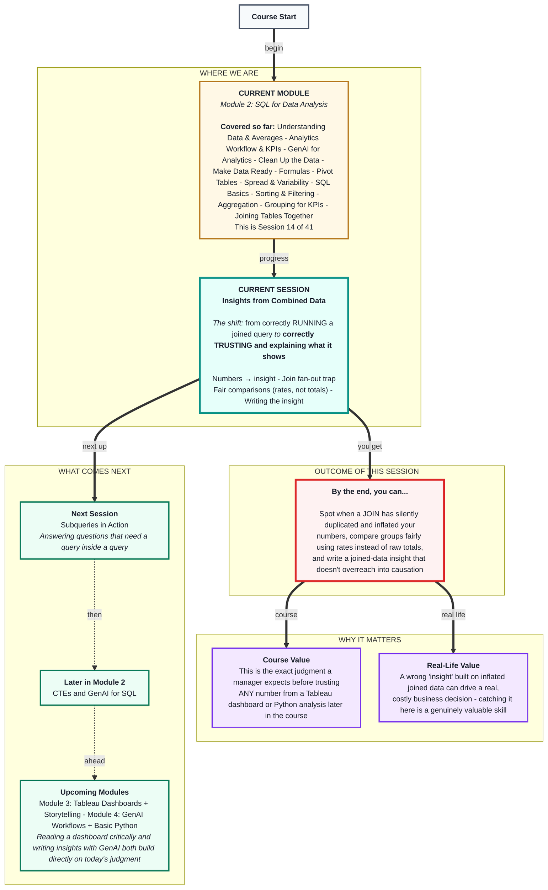
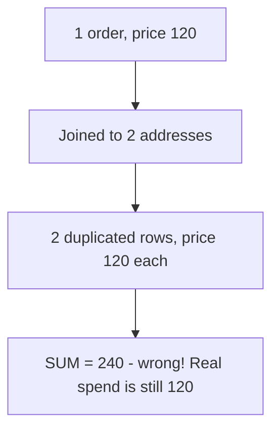

# SQL for Data Analysis: Insights from Combined Data
> **Pre-Read - Academic Session 14** | Module 2: SQL for Data Analysis

---

## Mental Map
> 📄 Also provided as a printable PDF in this folder: **mental-map: Insights from Combined Data.pdf**



---

## What You'll Learn

In this pre-read, you'll discover:
- How to move from a joined, grouped SQL result to an actual written business insight
- How joining tables can silently **duplicate and inflate** your numbers - the "fan-out" trap
- Why comparing raw totals across groups can mislead, and how a rate fixes it
- How to structure an insight so it states a finding, backs it with evidence, and doesn't overreach into causation

---

## A. From Numbers to Insight - the "So What" Step

**💡 Analogy:** A doctor doesn't hand you a printout of vitals and walk away - they read the numbers and tell you what it means for you: "your blood pressure is a little high; let's watch your salt intake." A number becomes useful the moment someone connects it to a real implication.

**An insight is a sentence that connects a number to a business meaning and, ideally, a next step - a number alone, no matter how correctly calculated, is not yet an insight.**

**Worked example:** From last session's joined query:

| loyalty_tier | total_revenue |
|---|---|
| Gold | 210 |
| Silver | 270 |

- ❌ **Not an insight (just a fact):** *"Gold tier revenue is ₹210 and Silver tier revenue is ₹270."*
- ✅ **An actual insight:** *"Silver-tier customers are currently generating more total revenue than Gold-tier customers, despite Gold being our 'premium' tier - this is worth investigating before we invest further in Gold-specific perks."*

The second version does three things the first doesn't: it makes a comparison, flags something surprising, and suggests why it matters.

**⚠️ Common trap:** Presenting a correctly calculated number as though it were self-evidently meaningful. Recall Session 1.2's analytics workflow: a query result is the "vitals," not the diagnosis. Every joined, grouped table you build from here on still needs this one extra step - asking "so what- - before it's ready to share.

---

## B. The Join Fan-Out Trap - When Joining Silently Duplicates Your Data

**💡 Analogy:** Imagine photocopying a customer's order once for *every* delivery address on file for them, instead of once total. A customer with 2 saved addresses now has 2 copies of the same order sitting in your pile - and if you count or total the pile, that customer's numbers look twice as large as they really are.

**Joining a table with a "one-to-many" relationship - where one row on one side matches MULTIPLE rows on the other side - duplicates the "one" side's rows, which can silently inflate any `SUM` or `COUNT` calculated afterward. This is called a fan-out.**

**Worked example:** A new table, `customer_addresses`, tracks saved delivery addresses - and Ramesh has 2:

| customer_id | address_label |
|---|---|
| 1 | Home |
| 1 | Office |
| 2 | Home |
| 3 | Home |
| 4 | Home |

Ramesh (customer_id 1) placed exactly **1** order, priced ₹120. Now join `orders` to `customer_addresses`:

```sql
SELECT orders.order_id, orders.price, customer_addresses.address_label
FROM orders
INNER JOIN customer_addresses
  ON orders.customer_id = customer_addresses.customer_id;
```

| order_id | price | address_label |
|---|---|---|
| 1 | 120 | Home |
| 1 | 120 | Office |

Ramesh's single order now appears **twice** - once per saved address. If you ran `SUM(price)` on this joined result without noticing, Ramesh's contribution would silently double from ₹120 to **₹240**, even though nothing about his actual spending changed.

**⚠️ Common trap:** Aggregating immediately after a join without first checking whether the join could have duplicated rows on the "one" side. Before trusting any `SUM` or `COUNT` on joined data, check: *"Could any row on either side have multiple matches on the other side-* If yes, either aggregate **before** joining (recommended), or explicitly deduplicate afterward - never assume a joined row count still means what it meant before the join.



---

## C. Comparing Groups Fairly - Rates, Not Just Raw Totals

**💡 Analogy:** A bigger city will almost always have more total literate people than a small town, simply because it has more people - that says nothing about which place has the *better* literacy rate. Comparing raw totals across groups of different sizes can flatter the bigger group by default.

**When comparing groups of different sizes, a raw total (SUM or COUNT) can be misleading - dividing by the group's size to get a rate or average often reveals the real story.**

**Worked example:** Using an extended version of the loyalty-tier data, now with more customers per tier:

| loyalty_tier | number_of_customers | total_revenue | revenue_per_customer |
|---|---|---|---|
| Gold | 5 | 5000 | 1000 |
| Silver | 2 | 3000 | 1500 |

- Looking only at `total_revenue`, Gold (₹5,000) looks like the stronger tier.
- Looking at `revenue_per_customer`, Silver customers actually spend **50% more individually** (₹1,500 vs ₹1,000) - Gold's higher total is simply because it has more than double the customers, not because each Gold customer is more valuable.

**⚠️ Common trap:** Ranking or comparing groups using only a `SUM` or `COUNT`, without also checking group size. In SQL, this means pairing your `SUM` with a `COUNT` (or a separate customer count) in the same `GROUP BY` query, and calculating the rate yourself - `SUM(price) / COUNT(DISTINCT customer_id)` - rather than eyeballing totals side by side.

---

## D. Writing the Insight - Structure and Guardrails

**💡 Analogy:** A journalist's "inverted pyramid" leads with the headline, then the supporting facts, then the wider context - never buries the actual finding under a pile of numbers first. A good business insight follows the same shape.

**A well-structured insight has three parts: the Finding (what's true), the Evidence (the number(s) behind it), and the Implication (why it matters or what to do next) - and it stops short of claiming causation the data can't actually prove.**

**Worked example, put together from Sections A–C:**

> **Finding:** Silver-tier customers generate more revenue per customer than Gold-tier customers.
> **Evidence:** Silver averages ₹1,500 revenue per customer vs. Gold's ₹1,000, even though Gold has more than double the customer count.
> **Implication:** Before expanding Gold-tier perks, it's worth understanding *why* Silver customers spend more individually - the loyalty tier itself may not be the deciding factor.

Notice the Implication does **not** claim "Silver customers spend more *because* they're Silver tier" - that would be a causal claim the data doesn't support. The data shows an association (Silver customers *happen to* spend more), not a proven cause.

**⚠️ Common trap:** Jumping from "these two things are associated in the data" to "one of them causes the other." A joined, grouped SQL result can show you *that* two things move together - it almost never proves *why*, on its own. Phrase insights as findings worth investigating, not settled explanations, unless you have specific evidence of a causal mechanism.

---

## Quick Reference - Before You Trust or Share a Joined Insight

| Check | Ask Yourself | Why |
|---|---|---|
| Fan-out | Could either side of my JOIN have multiple matches on the other side? | Prevents silently inflated SUM/COUNT |
| Fair comparison | Am I comparing raw totals across groups of different sizes? | A rate/average is often the fairer comparison |
| Structure | Does my insight have a Finding, Evidence, and Implication? | A bare number isn't yet an insight |
| Causation | Am I claiming X *causes* Y, or just that they're associated? | Joined SQL data shows association, not proof of cause |

---

## Practice Exercises

Using the `customers`, `orders`, and `customer_addresses` tables from this module:

**1. Pattern Recognition:** Run the `orders` + `customer_addresses` join from Section B for ALL customers, not just Ramesh. Which other customers, if any, get duplicated, and why?

**2. Concept Detective:** Using the Section C table, explain in 2–3 sentences why `total_revenue` alone would lead a manager to the wrong conclusion about which tier is more valuable per customer.

**3. Real-Life Application:** Take last session's "revenue by city" result and rewrite it as a full Finding/Evidence/Implication insight, being careful not to claim causation.

**4. Spot the Error:** A classmate writes: *"Gold members spend more because the loyalty program makes them loyal."* What's wrong with this statement, given what this session covered?

**5. Planning Ahead:** Write the SQL query that would calculate `revenue_per_customer` per loyalty tier correctly (SUM divided by a distinct customer count), and explain in one sentence why `COUNT(DISTINCT customer_id)` matters more than plain `COUNT(*)` here.

---

> ✅ **You're done!** You can now tell the difference between a number and an insight, catch a join that's silently duplicated your data, compare groups fairly using rates, and write a finding that doesn't overreach into causation.
>
> Next up: **Subqueries in Action** - where you learn to answer questions that need a query built entirely from the result of another query.
