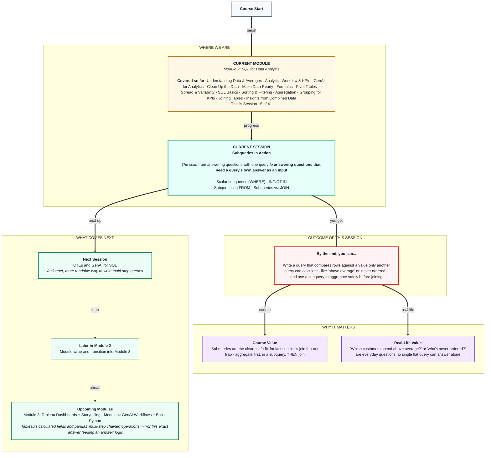

# Mental Map - Subqueries in Action
> Academic Session 15 - Module 2: SQL for Data Analysis

```mermaid
%%{init: {'flowchart': {'htmlLabels': true, 'nodeSpacing': 60, 'rankSpacing': 95, 'wrappingWidth': 620, 'padding': 18}}}%%
flowchart TB

START["<b>Course Start</b>"]

subgraph foundation[" WHERE WE ARE "]
direction TB
    CURMOD["<b>CURRENT MODULE</b><br/><i>Module 2: SQL for Data Analysis</i><br/>&nbsp;<br/><b>Covered so far:</b> Understanding Data &amp; Averages - Analytics Workflow &amp; KPIs - GenAI for Analytics - Clean Up the Data - Make Data Ready - Formulas - Pivot Tables - Spread &amp; Variability - SQL Basics - Sorting &amp; Filtering - Aggregation - Grouping for KPIs - Joining Tables - Insights from Combined Data<br/>This is Session 15 of 41"]
    CURSES["<b>CURRENT SESSION</b><br/><b>Subqueries in Action</b><br/>&nbsp;<br/><i>The shift:</i> from answering questions with one query <i>to</i> <b>answering questions that need a query's own answer as an input</b><br/>&nbsp;<br/>Scalar subqueries (WHERE) - IN/NOT IN<br/>Subqueries in FROM - Subqueries vs. JOIN"]
end

subgraph outcome[" OUTCOME OF THIS SESSION "]
direction TB
    OUT["<b>By the end, you can...</b><br/>&nbsp;<br/>Write a query that compares rows against a value only another<br/>query can calculate - like 'above average' or 'never ordered' -<br/>and use a subquery to aggregate safely before joining"]
end

subgraph value[" WHY IT MATTERS "]
direction TB
    CVAL["<b>Course Value</b><br/>Subqueries are the clean, safe fix for last session's join fan-out<br/>trap - aggregate first, in a subquery, THEN join"]
    RVAL["<b>Real-Life Value</b><br/>'Which customers spend above average?' or 'who's never ordered?'<br/>are everyday questions no single flat query can answer alone"]
end

subgraph future[" WHAT COMES NEXT "]
direction TB
    U0["<b>Next Session</b><br/>CTEs and GenAI for SQL<br/><i>A cleaner, more readable way to write multi-step queries</i>"]
    U1["<b>Later in Module 2</b><br/>Module wrap and transition into Module 3"]
    U2["<b>Upcoming Modules</b><br/>Module 3: Tableau Dashboards + Storytelling - Module 4: GenAI Workflows + Basic Python<br/><i>Tableau's calculated fields and pandas' multi-step chained operations mirror this exact 'answer feeding an answer' logic</i>"]
end

START ==>|" begin "| CURMOD
CURMOD ==>|" progress "| CURSES
CURSES ==>|" you get "| OUT
OUT ==>|" course "| CVAL
OUT ==>|" real life "| RVAL
CURSES ==>|" next up "| U0
U0 -.->|" then "| U1
U1 -.->|" ahead "| U2

classDef startBox fill:#F7FAFC,stroke:#4A5568,stroke-width:2px,color:#1A202C
classDef curModBox fill:#FFF8E6,stroke:#B7791F,stroke-width:2px,color:#1A202C
classDef curSessBox fill:#E6FFFA,stroke:#0D9488,stroke-width:3px,color:#1A202C
classDef outBox fill:#FEF2F2,stroke:#DC2626,stroke-width:3px,color:#1A202C
classDef valueBox fill:#F3E8FF,stroke:#7C3AED,stroke-width:2px,color:#1A202C
classDef futureBox fill:#ECFDF5,stroke:#047857,stroke-width:2px,color:#1A202C

class START startBox
class CURMOD curModBox
class CURSES curSessBox
class OUT outBox
class CVAL,RVAL valueBox
class U0,U1,U2 futureBox
```
