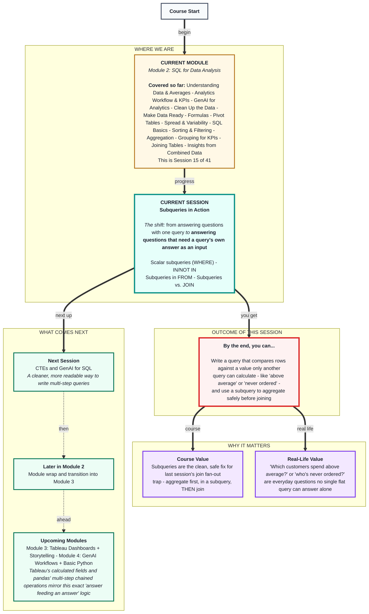
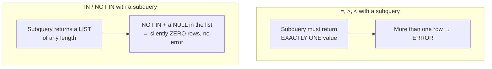

# SQL for Data Analysis: Subqueries in Action
> **Pre-Read - Academic Session 15** | Module 2: SQL for Data Analysis

---

## Mental Map
> 📄 Also provided as a printable PDF in this folder: **mental-map: Subqueries in Action.pdf**



---

## What You'll Learn

In this pre-read, you'll discover:
- What a subquery is, and why some business questions genuinely need one
- How to filter with `WHERE` against a value only another query can calculate - like "above average"
- How `IN` and `NOT IN` check membership against a list a subquery produces - including the exact trap that catches almost everyone once
- How a subquery in `FROM` lets you aggregate safely, *before* joining, avoiding last session's fan-out trap entirely

---

## A. What Is a Subquery?

**💡 Analogy:** "Who on the team earns more than average?" is really two questions stacked together. You can't answer the outer question ("who earns more than...") until you've answered the inner one first ("...than what, exactly?"). A subquery is exactly that: a smaller, complete query nested inside a bigger one, answering the "than what?" part first.

**A subquery is a complete `SELECT` query nested inside another query - wrapped in parentheses - used to supply a value or list the outer query needs.**

```sql
SELECT order_id, price
FROM orders
WHERE price > (SELECT AVG(price) FROM orders);
```

The part in parentheses runs first, calculates one number (the average), and the outer query then uses that number as its comparison value.

**Worked example:** On this module's `orders` table (₹120, ₹150, ₹120, ₹90 → average ₹120):

| order_id | price |
|---|---|
| 2 | 150 |

Only order 2 (₹150) is priced above the ₹120 average - every other order is exactly at or below it.

**⚠️ Common trap:** Forgetting the parentheses around the subquery, or forgetting that the subquery must run and resolve to something the outer query's comparison actually understands. `WHERE price > SELECT AVG(price) FROM orders` (no parentheses) will error - SQL needs the subquery clearly wrapped off from the rest of the query.

---

## B. Subqueries in WHERE - Comparing Against a Calculated Value

**💡 Analogy:** "Which customers placed an order priced above our average?" needs the exact same two-step logic as Section A, just joined to customer names.

**A subquery that returns exactly one value (a "scalar" subquery) can be used anywhere a single comparison value is expected in `WHERE`.**

```sql
SELECT DISTINCT customers.customer_name
FROM customers
INNER JOIN orders ON customers.customer_id = orders.customer_id
WHERE orders.price > (SELECT AVG(price) FROM orders);
```

**Worked example:**

| customer_name |
|---|
| Fatima |

Fatima's ₹150 order is the only one above the ₹120 average - so she's the only customer returned.

**⚠️ Common trap:** Using a subquery that could return **more than one row** with a single-value operator like `=`, `>`, or `<`. In most databases (MySQL, PostgreSQL, SQL Server), this errors outright with something like "subquery returned more than 1 row." **SQLite is unusually permissive here** - instead of erroring, it silently picks just one of the matching rows and uses that, giving you a technically-running query with a potentially wrong answer and no warning at all. That's arguably more dangerous than an error, since nothing tells you to double-check. Before using `=`/`>`/`<` with a subquery, always ask: *"Is there any chance this inner query could return more than one row?"* If yes, you need `IN`, not `=`/`>`/`<` - covered next.

---

## C. Subqueries with IN and NOT IN - Checking Membership in a List

**💡 Analogy:** "Which customers have never ordered?" isn't a single-value comparison - it needs checking each customer against an entire *list* of customer IDs that DO appear in `orders`. `IN` and `NOT IN` are built for exactly this: checking membership in a list, not comparing to one value.

**`IN` checks whether a value appears anywhere in a list a subquery produces; `NOT IN` checks that it doesn't.**

```sql
SELECT customer_name
FROM customers
WHERE customer_id NOT IN (SELECT customer_id FROM orders);
```

**Worked example:**

| customer_name |
|---|
| Karthik |

The inner query returns every `customer_id` that appears in `orders` (1, 2, 3, 4). `NOT IN` then keeps only customers whose ID is **not** in that list - Karthik (id 5), exactly matching Session 13's `LEFT JOIN` result for "customers who never ordered," just written a different way.

**⚠️ Common trap - the single most dangerous trap in this session:** If the subquery inside `NOT IN` could ever return a `NULL` value (a missing/blank `customer_id`, say, from a data-entry gap), `NOT IN` can silently return **zero rows for the entire query** - not an error, just a quietly wrong, empty result. This is a well-known SQL trap even among experienced analysts. The safe habit: before trusting a `NOT IN` subquery, check that the inner column can't contain `NULL`s - or use a `LEFT JOIN ... WHERE ... IS NULL` instead, which doesn't have this danger.



---

## D. Subqueries in FROM - Aggregating Safely, Before Joining

**💡 Analogy:** Remember Session 14's fan-out trap - Ramesh's one order became two rows after joining to his saved addresses, silently doubling his revenue. The safest fix isn't avoiding joins altogether - it's aggregating **first**, in a subquery, and only joining or filtering *after* the numbers are already correct.

**A subquery placed in the `FROM` clause is treated as a temporary, unnamed table that the outer query can filter, sort, or further aggregate - exactly like any real table.**

```sql
SELECT city_totals.city, city_totals.total_revenue
FROM (
    SELECT customers.city, SUM(orders.price) AS total_revenue
    FROM customers
    INNER JOIN orders ON customers.customer_id = orders.customer_id
    GROUP BY customers.city
) AS city_totals
WHERE city_totals.total_revenue > 100;
```

**Worked example:**

| city | total_revenue |
|---|---|
| Bengaluru | 240 |
| Hyderabad | 150 |

The inner subquery does the join-and-group-by work **once**, cleanly, producing one row per city with no duplication risk. The outer query then simply filters that already-correct result - Chennai's ₹90 total doesn't clear ₹100, so it's dropped.

**⚠️ Common trap:** Forgetting that a subquery in `FROM` **must** be given an alias (like `AS city_totals` above) - SQL requires a name for any table-like thing referenced in the query, even a temporary one built on the fly. Leaving it unaliased causes an error in most databases.

---

## Quick Reference - Choosing the Right Subquery Shape

| Your Situation | Use This | Because |
|---|---|---|
| Comparing rows to ONE calculated value (like an average) | Subquery in `WHERE` with `=`/`>`/`<` | Only valid if the subquery returns exactly one row |
| Checking membership in a LIST of values | Subquery in `WHERE` with `IN` / `NOT IN` | Handles any number of rows from the inner query |
| Finding rows with NO match at all | `LEFT JOIN ... WHERE ... IS NULL` over `NOT IN` | `NOT IN` silently breaks if the list contains a NULL |
| Aggregating safely before joining or filtering further | Subquery in `FROM`, aliased | Prevents last session's join fan-out from ever happening |

---

## Practice Exercises

Using the `customers` and `orders` tables from Sessions 13–14:

**1. Pattern Recognition:** Write a subquery-based query returning orders priced below the overall average. How many rows come back, and does that match what you'd expect given the average is ₹120?

**2. Concept Detective:** Rewrite Section C's `NOT IN` query using `LEFT JOIN ... WHERE ... IS NULL` instead. Confirm both approaches return the same customer, and explain in one sentence why the JOIN version is safer.

**3. Real-Life Application:** List 3 real business questions that specifically need a subquery (not just a plain WHERE) because they compare against a value that has to be calculated first.

**4. Spot the Error:** A classmate writes `WHERE price = (SELECT price FROM orders WHERE item = 'Veg Thali')` to find orders matching any Veg Thali order's price. What's wrong with using `=` here, given that 2 different orders are Veg Thali, and how would you fix it?

**5. Planning Ahead:** Write a subquery-in-FROM query that calculates total revenue per loyalty tier, then filters (in the outer query) to only tiers above ₹200. Say the plain-English translation aloud before writing the SQL.

---

> ✅ **You're done!** You can now answer a question that needs another question answered first - comparing rows to a calculated average, checking membership in a list, and aggregating safely before joining or filtering further.
>
> Next up: **CTEs and GenAI for SQL** - where you learn a cleaner way to write today's subqueries, and how to use GenAI to draft SQL safely without blindly trusting its output.
