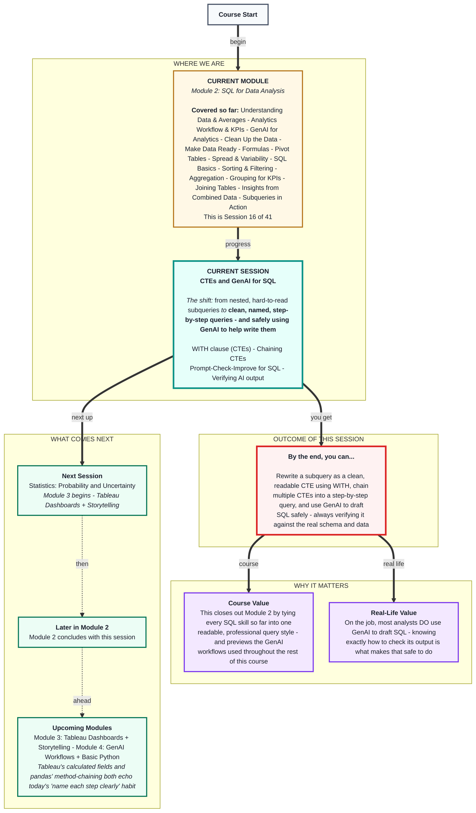
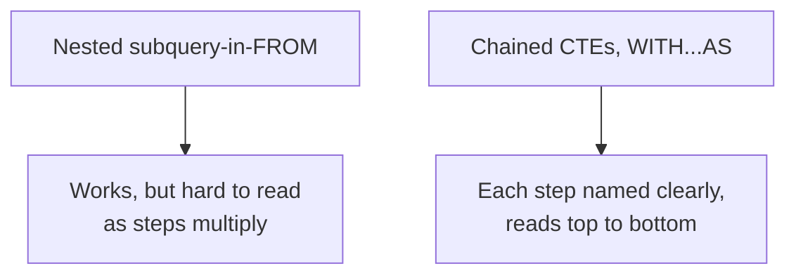

# SQL for Data Analysis: CTEs and GenAI for SQL
> **Pre-Read - Academic Session 16** | Module 2: SQL for Data Analysis

---

## Mental Map
> 📄 Also provided as a printable PDF in this folder: **mental-map: CTEs and GenAI for SQL.pdf**



---

## What You'll Learn

In this pre-read, you'll discover:
- How the `WITH` clause turns a nested subquery into a clean, named, readable step
- How to chain multiple CTEs together to build a query one clear step at a time
- How to use GenAI to draft SQL safely, using the Prompt–Check–Improve workflow from Session 3
- How to catch a GenAI-generated query that "hallucinates" a column or table that doesn't actually exist in your schema

---

## A. The WITH Clause - Giving a Subquery a Name

**💡 Analogy:** Compare a recipe written as one dense paragraph versus one written as clearly labeled steps: "Step 1: make the dough. Step 2: make the filling. Step 3: combine." Both produce the same dish - but one is dramatically easier for someone else (or future-you) to follow. A CTE is that second, labeled-steps version of a subquery.

**A CTE (Common Table Expression), introduced with `WITH`, is a temporary, named result set defined *before* the main query - the main query can then reference it by name, just like a real table.**

Recall Session 15's subquery-in-`FROM`:

```sql
SELECT city_totals.city, city_totals.total_revenue
FROM (
    SELECT customers.city, SUM(orders.price) AS total_revenue
    FROM customers
    INNER JOIN orders ON customers.customer_id = orders.customer_id
    GROUP BY customers.city
) AS city_totals
WHERE city_totals.total_revenue > 100;
```

The exact same logic, written as a CTE:

```sql
WITH city_totals AS (
    SELECT customers.city, SUM(orders.price) AS total_revenue
    FROM customers
    INNER JOIN orders ON customers.customer_id = orders.customer_id
    GROUP BY customers.city
)
SELECT city, total_revenue
FROM city_totals
WHERE total_revenue > 100;
```

**Worked example - identical result, either way:**

| city | total_revenue |
|---|---|
| Bengaluru | 240 |
| Hyderabad | 150 |

Nothing about the *logic* changed - only the readability. The `city_totals` name now appears clearly at the top, and the main query below reads almost like plain English: "from city_totals, where total_revenue is over 100."

**⚠️ Common trap:** Assuming a CTE persists beyond the single query it's defined in - like a saved view or a permanent table. It doesn't. A CTE exists only for the duration of the one `WITH ... SELECT ...` statement it's attached to; the moment that query finishes, the CTE is gone, and a completely separate later query can't reference it by name.

---

## B. Chaining Multiple CTEs

**💡 Analogy:** A multi-step recipe doesn't stop at one labeled step - "Step 1: make the dough" feeds into "Step 2: roll it out," which feeds into "Step 3: bake it." Chained CTEs work the same way: each one can build on the result of the one before it.

**Multiple CTEs can be defined in a single `WITH` clause, separated by commas - and each later CTE can reference any CTE defined before it.**

```sql
WITH city_totals AS (
    SELECT customers.city, SUM(orders.price) AS total_revenue
    FROM customers
    INNER JOIN orders ON customers.customer_id = orders.customer_id
    GROUP BY customers.city
),
top_cities AS (
    SELECT city, total_revenue
    FROM city_totals
    WHERE total_revenue > 100
)
SELECT *
FROM top_cities
ORDER BY total_revenue DESC
LIMIT 1;
```

**Worked example:**

| city | total_revenue |
|---|---|
| Bengaluru | 240 |

Read top to bottom like a recipe: *"First calculate city_totals. Then, from that, keep only top_cities above ₹100. Finally, from top_cities, give me the single highest one."* Three clear steps, each with a name - instead of one dense, nested block.

**⚠️ Common trap:** Forgetting the comma between chained CTE definitions, or trying to reference a *later* CTE from an *earlier* one (e.g., having `city_totals` reference `top_cities`, which is defined after it). CTEs can only look backward, at CTEs already defined above them - never forward.



---

## C. Using GenAI to Draft SQL - Prompt, Check, Improve

**💡 Analogy:** Recall Session 3's GenAI workflow - treat GenAI like a fast, capable junior analyst handing you a first draft. A junior analyst who's never seen your actual database might guess at table and column names that sound reasonable but don't exist. Your job, as the senior reviewer, is to check before you ship.

**The same Prompt–Check–Improve cycle from Session 3 applies directly to SQL: prompt with your real schema, check the output by actually running it against real data, and improve anything that's wrong before trusting the result.**

**A weak prompt**, missing schema context:
> *"Write a SQL query showing total revenue by city."*

**A strong prompt**, giving the AI what it actually needs:
> *"I have two tables. `customers` has columns: customer_id, customer_name, city, loyalty_tier. `orders` has columns: order_id, customer_id, item, quantity, price, order_date. Write a SQL query joining them to show total revenue (SUM of price) by city."*

The weak prompt leaves the AI guessing at your actual table structure - and it will guess, confidently, whether or not it's right.

**⚠️ Common trap:** Copy-pasting AI-generated SQL directly into a real analysis without running it against real data first. A fluent, well-formatted, confident-looking query can still be completely wrong for your actual schema - confidence in the AI's phrasing is not evidence of correctness.

---

## D. Verifying GenAI SQL - Catching Hallucinated Schema and Repeated Traps

**💡 Analogy:** Recall this module's own story: `city` used to live directly on `orders` (Sessions 9–12) - then Session 13 deliberately moved it into `customers`. An AI trained on generic examples, or without your exact current schema, might still confidently write a query assuming the *old* structure.

**Worked example - a genuinely realistic hallucination:** Asked for "total revenue by city" without being given the current schema, a GenAI tool might write:

```sql
SELECT city, SUM(price) AS total_revenue
FROM orders
GROUP BY city;
```

Run against this module's actual (post-Session 13) database, this **errors immediately** - `orders` has no `city` column anymore; it lives in `customers`. The query is fluent, plausible-looking SQL... for a schema that no longer exists.

**The fix - give the AI your real schema (as in Section C), then run and check the corrected version:**

```sql
SELECT customers.city, SUM(orders.price) AS total_revenue
FROM customers
INNER JOIN orders ON customers.customer_id = orders.customer_id
GROUP BY customers.city;
```

This runs correctly and returns the real numbers - Bengaluru ₹240, Hyderabad ₹150, Chennai ₹90.

**A second, subtler risk:** even a schema-correct, error-free AI-generated `JOIN` can still walk straight into last session's fan-out trap. If you ask an AI for "total revenue by customer, including their saved addresses," it may confidently produce a join across `orders` and `customer_addresses` - and, exactly like in Session 14, silently double Ramesh's revenue to ₹240 because he has two saved addresses. **The query runs. The number is still wrong.** GenAI does not automatically know your data's one-to-many relationships unless you tell it, or unless it happens to check - and it often won't.

**⚠️ Common trap:** Trusting a GenAI-generated query more than a human-written one simply because it "sounds professional" or ran without error. Every check from Sessions 14 and 15 still applies, in full, to AI-generated SQL - check for fan-out, check group sizes before comparing totals, and verify column/table names actually exist in your real schema, every single time.

---

## Quick Reference - CTEs and GenAI Checklist

| Your Situation | Use This | Because |
|---|---|---|
| A subquery-in-FROM is getting hard to read | Rewrite it as a CTE with `WITH` | Same logic, clearer names, reads top to bottom |
| You need several calculation steps in sequence | Chain multiple CTEs with commas | Each step can build on the one before it |
| Asking GenAI to draft SQL | Give it your real table and column names first | Prevents confident guesses at a schema that doesn't exist |
| Reviewing GenAI-generated SQL | Run it, check the numbers, check for fan-out | A fluent, error-free query can still be quietly wrong |

---

## Practice Exercises

Using the `customers`, `orders`, and `customer_addresses` tables from this module:

**1. Pattern Recognition:** Rewrite Session 15's `NOT IN` "customers who never ordered" subquery as a CTE. Does the result change? Should it?

**2. Concept Detective:** Write a chained two-CTE query: first calculate average order price per loyalty tier, then keep only tiers whose average is above ₹100. Explain in one sentence why this needs two CTEs rather than one.

**3. Real-Life Application:** Write a strong GenAI prompt (with full schema context) asking for "which customers have placed more than one order." What would a weak version of this same prompt be missing?

**4. Spot the Error:** A GenAI tool produces `SELECT customer_name, price FROM customers;` when asked for "each customer's order price." What's hallucinated here, and how would you fix the prompt or the query?

**5. Planning Ahead:** Write a query - using either a CTE or a subquery, your choice - that checks a GenAI-drafted join (orders + customer_addresses) for fan-out before trusting any SUM from it. Say out loud what you'd check first.

---

> ✅ **You're done!** You can now write clean, readable, multi-step SQL using CTEs, and use GenAI to draft queries safely - always checking its output against your real schema and real data before trusting a single number.
>
> This wraps up **Module 2: SQL for Data Analysis.** Next up: **Statistics - Probability and Uncertainty**, opening **Module 3: Tableau Dashboards + Storytelling**.
