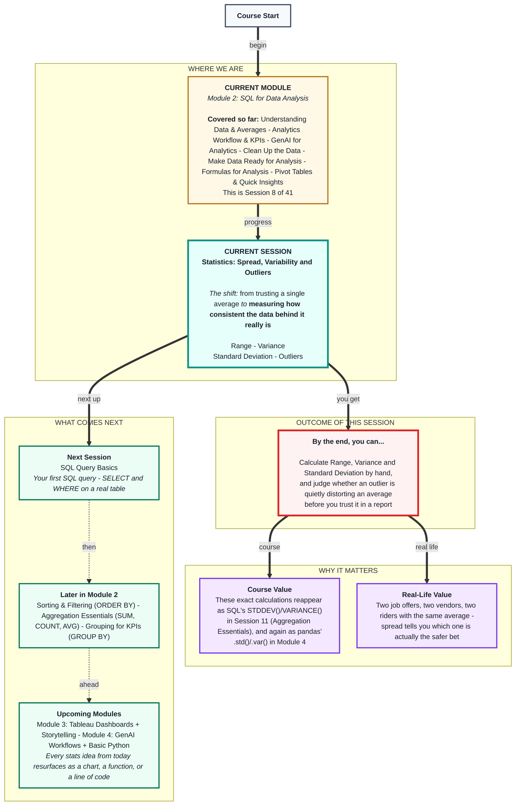
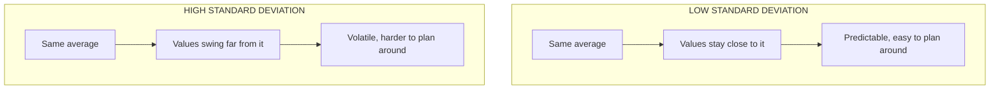

# Statistics: Spread, Variability and Outliers
> **Pre-Read - Academic Session 9** | Module 2: SQL for Data Analysis

---

## Mental Map
> 📄 Also provided as a printable PDF in this folder: **mental-map: Statistics Spread, Variability and Outliers.pdf**



---

## What You'll Learn

In this pre-read, you'll discover:
- Why two datasets can share the exact same average and still represent completely different levels of business risk
- How to calculate **Range**, a quick first measure of spread
- How to build a deviation table and calculate **Variance** and **Standard Deviation** by hand
- How to spot an **outlier** and decide whether it's worth investigating, correcting, or keeping

---

## A. Range - the quick first measure of spread

**💡 Analogy:** Two chai stalls both average ₹2,000 in daily sales. Stall A earns between ₹1,900–₹2,100 every single day - steady as clockwork. Stall B swings between ₹500 on a quiet Tuesday and ₹4,000 on match day. Same average, very different stalls to run.

**Range is the gap between the highest and lowest value in a dataset.**

```
Range = Maximum value − Minimum value
```

**Worked example:** An auto-rickshaw driver logs a week of daily earnings (₹): `650, 700, 680, 720, 690, 710, 670`
- Maximum = 720, Minimum = 650
- **Range = 720 − 650 = ₹70**

A second driver earns the same average (₹690) but logs: `300, 900, 400, 1100, 250, 950, 430`
- Maximum = 1100, Minimum = 250
- **Range = 1100 − 250 = ₹850**

Both drivers average ₹690 a day. Driver 1 is predictable. Driver 2 is a gamble. Range shows this instantly - the average alone hides it completely.

**⚠️ Common trap:** Range only looks at the highest and lowest value - the other five days of the week don't count at all. Change Driver 1's best day from ₹720 to a one-off ₹2,000 festival bonus, and Range jumps from ₹70 to ₹1,350, even though six of his seven days are exactly as steady as before. Range is fast, but one unusual day can throw it off completely.

---

## B. Variance - using every value, not just the extremes

**💡 Analogy:** Range only checks a batsman's highest and lowest score of the season. Variance is the coach who reviews every single innings and asks, "how far did each score typically sit from the batting average?"

**Variance is the average of the squared distance between each value and the mean.**

```
Variance = Σ(value − mean)² ÷ number of values
```

**Worked example:** A samosa vendor's daily sales over 5 days: `18, 22, 20, 24, 16` → Mean = 20

| Day | Value | Deviation (value − mean) | Squared Deviation |
|---|---|---|---|
| 1 | 18 | −2 | 4 |
| 2 | 22 | +2 | 4 |
| 3 | 20 | 0 | 0 |
| 4 | 24 | +4 | 16 |
| 5 | 16 | −4 | 16 |

Sum of squared deviations = 4+4+0+16+16 = 40
**Variance = 40 ÷ 5 = 8**

We square the deviations for two reasons: plain deviations always add up to zero (positives and negatives cancel out), and squaring gives bigger deviations more weight - exactly what you want when flagging inconsistency.

**⚠️ Common trap:** Reading "Variance = 8" as 8 samosas. It's actually 8 *squared* samosas, because the deviations were squared to calculate it. Variance is a working step, not a number you'd put in a report - that's what Standard Deviation is for, next.

---

## C. Standard Deviation - variance, translated back into real units

**💡 Analogy:** If Variance is a recipe measured in a mixed-up unit (squared rupees, squared runs), Standard Deviation converts it back into rupees or runs - a number you can actually say out loud in a meeting.

**Standard Deviation is the square root of the Variance - the typical distance of a value from the mean, in the original units.**

```
Standard Deviation = √Variance
```

**Worked example:** Continuing the samosa vendor: Variance = 8 → **Standard Deviation = √8 ≈ 2.83 samosas**

So the vendor's daily sales typically sit about ±2.83 samosas away from the average of 20 - a sentence you can actually use, unlike "8 squared samosas."

**Comparing two vendors with the same average (20 samosas/day):**

| Vendor | Standard Deviation | What it tells you |
|---|---|---|
| Vendor X | 2.83 | Consistent - easy to plan stock for |
| Vendor Y | 9.50 | Volatile - risk of running out or over-stocking |

**⚠️ Common trap:** Assuming a "low" Standard Deviation is always good and a "high" one is always bad. It depends on the goal - a factory wants low SD on product weight (every unit should be identical), but an investor comparing two funds with the same average return might actually prefer the higher-SD one for its upside potential. SD measures consistency, not goodness - the business context decides which one is preferable.



---

## D. Outliers - when one value distorts the whole story

**💡 Analogy:** A traffic app reports "average commute: 25 minutes." One day, a VIP convoy shuts the main road and a single trip takes 3 hours. Include that one trip in a small sample, and it drags the "typical" commute time far above what almost everyone actually experiences.

**An outlier is a data point that sits unusually far from the rest of the dataset** - often flagged as more than about 1.5× the interquartile range beyond the typical spread, or simply any value that clearly breaks the pattern the rest of the data shows.

**Worked example:** A cab aggregator logs 9 trip fares (₹): `120, 135, 128, 140, 132, 125, 138, 130, 850`
- Mean **with** the ₹850 fare ≈ ₹166
- Mean **without** it ≈ ₹129

The ₹850 fare (a genuine airport trip) pulls the "typical fare" figure well above what nearly every customer actually paid. This is why a high Standard Deviation or wide Range is often your first clue to go looking for an outlier - before trusting any average.

**⚠️ Common trap:** Assuming "outlier" automatically means "bad data, delete it." Sometimes the outlier is the *most* important row in the dataset - the one fraud transaction, the one stock-out day, the one viral sales spike. The job of variability analysis is to flag an outlier for a decision, not to silently erase it.

---

## Quick Reference - Choosing the Right Spread Measure

| Your Situation | Use This | Because |
|---|---|---|
| You need a fast, rough sense of spread | Range | Simple to compute, but only uses 2 of the data points |
| You need a precise measure using every value | Variance | Uses all data, but comes out in awkward squared units |
| You need a number you can actually report | Standard Deviation | Same units as the original data, easy to say out loud |
| A value looks unusually far from the rest | Check for an outlier | High SD/Range is your signal to investigate, not automatically remove it |

---

## Practice Exercises

**1. Pattern Recognition:** A tea stall's weekly sales (₹) are: `1200, 1250, 1180, 1220, 1230`. Calculate the Range. Does this feel like a "steady" or "volatile" business, and why?

**2. Concept Detective:** Using the same tea stall data, calculate the Mean and then the Variance (show your deviation table). What does the size of the Variance suggest, even before converting it to Standard Deviation?

**3. Real-Life Application:** Calculate the Standard Deviation from Exercise 2's Variance. List 3 real business decisions (hiring, stocking, staffing) where knowing this number would change what you'd do.

**4. Spot the Error:** Two delivery riders both average 30 orders/day. Rider A has SD = 2, Rider B has SD = 11. A manager says "they're equally good, same average." What's wrong with that conclusion, and which rider would you assign to a tight-deadline corporate client?

**5. Planning Ahead:** A dataset of exam scores is: `62, 65, 60, 63, 98, 61, 64`. Identify the likely outlier, compute the mean with and without it, and explain in 2–3 sentences how you'd decide whether to investigate, correct, or keep this value.

---

> ✅ **You're done!** You can now measure how consistent a dataset really is - not just what it averages to - and you know how to catch an outlier before it quietly distorts a business decision.
>
> Next up: **Sorting and Filtering in SQL** - picking SQL back up where Session 8 left off, adding `ORDER BY` and `LIMIT` to the `SELECT`/`WHERE` skills you already have.
