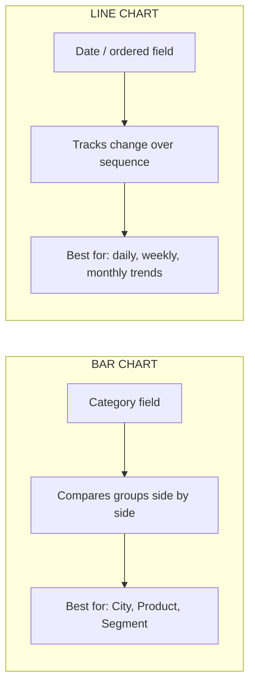

# Tableau: Tableau Basics and First Charts
> Pre-Read — Academic Session 17 | Module 3: Tableau Dashboards + Storytelling
---

## Mental Map
> 📄 Also provided as a printable PDF in this folder: **mental-map - Tableau Basics and First Charts.pdf**

```mermaid
%%{init: {'themeVariables': {'fontSize': '16px'}, 'flowchart': {'useMaxWidth': false, 'htmlLabels': true, 'nodeSpacing': 80, 'rankSpacing': 120, 'wrappingWidth': 620, 'padding': 20}}}%%
flowchart LR

START["<b>Course Start</b>"]

subgraph foundation[" WHERE WE ARE "]
direction LR
    CURMOD["<b>CURRENT MODULE</b><br/><i>Module 3: Tableau Dashboards + Storytelling</i><br/>&nbsp;<br/><b>Covered so far:</b> nothing yet — this is the module's first session<br/>This is Session 17 of 41"]
    CURSES["<b>CURRENT SESSION</b><br/><b>Tableau Basics and First Charts</b><br/>&nbsp;<br/><i>The shift:</i> from <i>scrolling through raw SQL output tables</i> to <b>seeing the same data as an instant, readable chart</b><br/>&nbsp;<br/>Tableau interface · Loading data<br/>Basic bar &amp; line charts · Mapping fields to axes"]
end

subgraph outcome[" OUTCOME OF THIS SESSION "]
direction LR
    OUT["<b>By the end, you can…</b><br/>&nbsp;<br/>Load a Kirana365 orders dataset into Tableau and build<br/>your first bar and line charts by dragging the right<br/>fields onto Rows, Columns, and Marks"]
end

subgraph value[" WHY IT MATTERS "]
direction LR
    CVAL["<b>Course Value</b><br/>Every dashboard you build for the rest of Module 3 is made of charts exactly like these"]
    RVAL["<b>Real-Life Value</b><br/>An ops manager can glance at one chart on their phone instead of scrolling 5,000 rows of Excel before a Monday review"]
end

subgraph future[" WHAT COMES NEXT "]
direction LR
    U0["<b>Next Session</b><br/>Statistics: Probability and Uncertainty<br/><i>How sure can you really be that a customer will buy?</i>"]
    U1["<b>Later in Module 3</b><br/>Choosing the Right Chart · Building a Dashboard<br/>KPIs and Trends on One View"]
    U2["<b>Upcoming Modules</b><br/>Module 4: GenAI for Analytics Workflows + Basic Python<br/><i>These same charts later get rebuilt in Python and stitched into full workflows</i>"]
end

START ==>|" begin "| CURMOD
CURMOD ==>|" progress "| CURSES
CURSES ==>|" you get "| OUT
OUT ==>|" course "| CVAL
OUT ==>|" real life "| RVAL
CURSES ==>|" next up "| U0
U0 -.->|" then "| U1
U1 -.->|" ahead "| U2

classDef startBox fill:#F7FAFC,stroke:#4A5568,stroke-width:2px,color:#1A202C
classDef curModBox fill:#FFF8E6,stroke:#B7791F,stroke-width:2px,color:#1A202C
classDef curSessBox fill:#E6FFFA,stroke:#0D9488,stroke-width:3px,color:#1A202C
classDef outBox fill:#FEF2F2,stroke:#DC2626,stroke-width:3px,color:#1A202C
classDef valueBox fill:#F3E8FF,stroke:#7C3AED,stroke-width:2px,color:#1A202C
classDef futureBox fill:#ECFDF5,stroke:#047857,stroke-width:2px,color:#1A202C

class START startBox
class CURMOD curModBox
class CURSES curSessBox
class OUT outBox
class CVAL,RVAL valueBox
class U0,U1,U2 futureBox

linkStyle default stroke-width:2px
```

## What You'll Learn
In this pre-read, you'll discover:
- What the Tableau screen is actually made of, so it stops feeling like a maze
- How to load a dataset (like our Kirana365 orders file) into Tableau
- How to build your first bar chart and line chart in under two minutes each
- What it really means to "map a field to an axis" — and why getting this wrong gives you nonsense charts

## A. The Tableau Interface — Your New Workbench

**💡 Analogy**: Think of Tableau like a **thali plate at an Udupi restaurant**. Every compartment has a job — one for rice, one for sambar, one for chutney. You don't dump everything into one bowl. Tableau's screen works the same way: separate compartments (panes) for data, fields, and the chart itself, and each has one job.

**Tableau's interface is a set of labelled zones, each meant for one specific job.**

| Zone | What it's for |
|---|---|
| **Data pane** (left side) | Every column in your dataset shows up here, split into **Dimensions** (categories like City, Category) and **Measures** (numbers like Revenue, Quantity) |
| **Rows / Columns shelves** (top) | Where you drag fields to decide what goes on the horizontal and vertical axes |
| **Marks card** | Controls how each data point looks — bar, line, colour, size, label |
| **View / Canvas** (centre) | Where your actual chart appears |

**Worked example**: Open the Kirana365 orders file in Tableau. In the Data pane you'll see `City`, `Category`, `Order Date` under **Dimensions** (blue pill), and `Revenue`, `Quantity` under **Measures** (green pill). That colour difference — blue vs green — is Tableau quietly telling you "this is a category" vs "this is a number you can add up."

**⚠️ Common trap**: New users try to drag a Measure (like Revenue) into a spot meant for categories, or vice versa, and then panic when the chart looks broken. Tableau isn't broken — it's just telling you the field is in the wrong shelf. Blue pill → group by it. Green pill → calculate with it.

## B. Loading Data — Getting Kirana365's Orders In

**💡 Analogy**: Loading data into Tableau is like handing a chef your grocery bag before asking them to cook. Tableau needs the raw ingredients (rows and columns) before it can plate anything.

**Connecting to a data source is the first thing you do in any Tableau session — before any chart exists.**

For Kirana365, our dataset is a simple orders file:

| Order ID | Order Date | City | Category | Quantity | Revenue (₹) |
|---|---|---|---|---|---|
| 10231 | 2026-08-02 | Bengaluru | Groceries | 4 | 620 |
| 10232 | 2026-08-02 | Hyderabad | Snacks | 2 | 180 |
| 10233 | 2026-08-03 | Chennai | Beverages | 6 | 340 |

**Steps**: Open Tableau → **Connect to a File** → choose the Kirana365 orders CSV/Excel → Tableau shows you a preview grid → drag the table onto the canvas → click **Sheet 1** to start building.

**⚠️ Common trap**: If a column like `Revenue` loads as text instead of a number (this happens if even one row has a stray ₹ symbol typed into the cell), Tableau will treat it as a Dimension, not a Measure, and you won't be able to add it up. Always scan the Data pane after loading — numbers should be green pills.

## C. Your First Bar Chart

**💡 Analogy**: A bar chart is like comparing the height of tiffin boxes lined up on a shelf — one glance tells you which one is tallest, no measuring tape needed.

**A bar chart compares a number across categories, using bar length to show the difference.**

**Worked example**: You want to compare total Revenue by City for Kirana365.
1. Drag `City` (Dimension) onto **Columns**
2. Drag `Revenue` (Measure) onto **Rows**
3. Tableau automatically shows `SUM(Revenue)` as bars, one per city

Result (approximate, for August 2026):

| City | Total Revenue (₹) |
|---|---|
| Bengaluru | 3,42,000 |
| Hyderabad | 2,78,000 |
| Chennai | 2,15,000 |
| Pune | 1,64,000 |

Bengaluru's bar is clearly the tallest — you know that in one second, without reading a single number.

**⚠️ Common trap**: Forgetting that Tableau defaults to **SUM** for any measure you drop onto Rows/Columns. If you actually wanted the *average* order value per city, you must right-click the field and change the aggregation to `AVG` — otherwise you're comparing totals, not averages, and may draw the wrong conclusion (a city with more orders will always look "bigger" even if each order is small).

## D. Your First Line Chart — Showing Change Over Time

**💡 Analogy**: A line chart is like a heartbeat monitor — it's built to show you *movement over time*, not to compare separate categories side by side.

**A line chart tracks how a measure changes across a continuous field, almost always time.**

**Worked example**: You want to see how Kirana365's daily Revenue moved across August 2026.
1. Drag `Order Date` onto **Columns** (Tableau auto-detects it as a date and offers a continuous timeline)
2. Drag `Revenue` onto **Rows**
3. Tableau draws a line connecting each day's total revenue

You'd see a line that dips on weekdays and spikes on weekends — a pattern invisible in a raw spreadsheet, obvious in three seconds on a line chart.

**⚠️ Common trap**: Using a line chart for something that isn't naturally ordered — like City. Cities have no "before and after," so a line connecting Bengaluru → Chennai → Pune implies a trend that doesn't exist. Lines are for time (or any ordered sequence). Bars are for categories.

## Quick Reference — Which Chart, Which Shelf

| Your situation | Use this | Because |
|---|---|---|
| Comparing Revenue across cities or categories | Bar chart (category → Columns, measure → Rows) | Bars are built for side-by-side comparison |
| Tracking Revenue day by day or month by month | Line chart (date → Columns, measure → Rows) | Lines are built to show a sequence changing |
| A field shows up as text, not a number, in the Data pane | Check for stray symbols/typos in that column, then reload | Tableau treats "dirty" numeric columns as Dimensions by mistake |
| You want an average, not a total | Right-click the measure pill → change aggregation to AVG | Tableau's default aggregation is always SUM |

## Practice Exercises

1. **Pattern Recognition**: You load a new Kirana365 file and notice the `Quantity` column shows up as a blue pill (Dimension) instead of green (Measure). What likely went wrong in the source file, and what would you check first?

2. **Concept Detective**: A colleague builds a bar chart with `Order Date` on Columns and `Revenue` on Rows, and gets one bar per exact date — hundreds of tiny bars. What should they have used instead, and why?

3. **Real-Life Application**: List three other real Kirana365 questions (besides revenue by city) that a simple bar chart could answer in one glance.

4. **Spot the Error**: A teammate says, "I made a line chart of Revenue by Delivery Partner to see which partner performs best." What's wrong with this choice of chart type?

5. **Planning Ahead**: Kirana365's ops head wants to compare this month's daily revenue against last month's daily revenue, on the same chart. Based on what you've learned about Rows, Columns, and Marks, what do you think you'll need to add to your line chart to make that comparison possible?

> ✅ **You're done!** You can now open Tableau, load a real dataset, and turn plain rows into a bar or line chart that tells a story in one glance — the exact skill every dashboard in this module is built on.
Next session, we step back into statistics for a moment — **Statistics: Probability and Uncertainty** — to understand just how confident we can be when we say "this customer is likely to buy."
