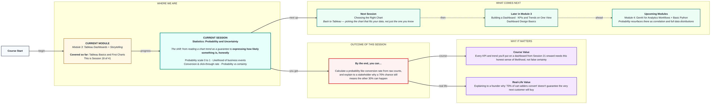

# Mental Map — Statistics: Probability and Uncertainty
> Academic Session 18 · Module 3: Tableau Dashboards + Storytelling

```mermaid
%%{init: {'themeVariables': {'fontSize': '16px'}, 'flowchart': {'useMaxWidth': false, 'htmlLabels': true, 'nodeSpacing': 80, 'rankSpacing': 120, 'wrappingWidth': 620, 'padding': 20}}}%%
flowchart LR

START["<b>Course Start</b>"]

subgraph foundation[" WHERE WE ARE "]
direction LR
    CURMOD["<b>CURRENT MODULE</b><br/><i>Module 3: Tableau Dashboards + Storytelling</i><br/>&nbsp;<br/><b>Covered so far:</b> Tableau Basics and First Charts<br/>This is Session 18 of 41"]
    CURSES["<b>CURRENT SESSION</b><br/><b>Statistics: Probability and Uncertainty</b><br/>&nbsp;<br/><i>The shift:</i> from <i>reading a chart trend as a guarantee</i> to <b>expressing how likely something is, honestly</b><br/>&nbsp;<br/>Probability scale 0 to 1 · Likelihood of business events<br/>Conversion &amp; click-through rate · Probability vs certainty"]
end

subgraph outcome[" OUTCOME OF THIS SESSION "]
direction LR
    OUT["<b>By the end, you can…</b><br/>&nbsp;<br/>Calculate a probability like conversion rate from raw counts,<br/>and explain to a stakeholder why a 70% chance still<br/>means the other 30% can happen"]
end

subgraph value[" WHY IT MATTERS "]
direction LR
    CVAL["<b>Course Value</b><br/>Every KPI and trend you'll put on a dashboard from Session 21 onward needs this honest sense of likelihood, not false certainty"]
    RVAL["<b>Real-Life Value</b><br/>Explaining to a founder why '70% of cart adders convert' doesn't guarantee the very next customer will buy"]
end

subgraph future[" WHAT COMES NEXT "]
direction LR
    U0["<b>Next Session</b><br/>Choosing the Right Chart<br/><i>Back to Tableau — picking the chart that fits your data, not just the one you know</i>"]
    U1["<b>Later in Module 3</b><br/>Building a Dashboard · KPIs and Trends on One View<br/>Dashboard Design Basics"]
    U2["<b>Upcoming Modules</b><br/>Module 4: GenAI for Analytics Workflows + Basic Python<br/><i>Probability resurfaces there as correlation and full data distributions</i>"]
end

START ==>|" begin "| CURMOD
CURMOD ==>|" progress "| CURSES
CURSES ==>|" you get "| OUT
OUT ==>|" course "| CVAL
OUT ==>|" real life "| RVAL
CURSES ==>|" next up "| U0
U0 -.->|" then "| U1
U1 -.->|" ahead "| U2

classDef startBox fill:#F7FAFC,stroke:#4A5568,stroke-width:2px,color:#1A202C
classDef curModBox fill:#FFF8E6,stroke:#B7791F,stroke-width:2px,color:#1A202C
classDef curSessBox fill:#E6FFFA,stroke:#0D9488,stroke-width:3px,color:#1A202C
classDef outBox fill:#FEF2F2,stroke:#DC2626,stroke-width:3px,color:#1A202C
classDef valueBox fill:#F3E8FF,stroke:#7C3AED,stroke-width:2px,color:#1A202C
classDef futureBox fill:#ECFDF5,stroke:#047857,stroke-width:2px,color:#1A202C

class START startBox
class CURMOD curModBox
class CURSES curSessBox
class OUT outBox
class CVAL,RVAL valueBox
class U0,U1,U2 futureBox

linkStyle default stroke-width:2px
```
