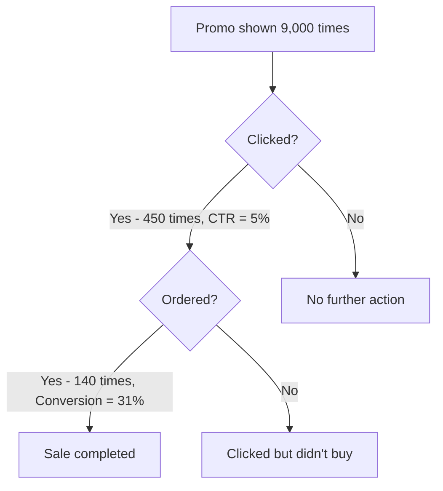

# Statistics: Statistics: Probability and Uncertainty
> Pre-Read — Academic Session 18 | Module 3: Tableau Dashboards + Storytelling
---

## Mental Map
> 📄 Also provided as a printable PDF in this folder: **mental-map - Statistics Probability and Uncertainty.pdf**

```mermaid
%%{init: {'themeVariables': {'fontSize': '16px'}, 'flowchart': {'useMaxWidth': false, 'htmlLabels': true, 'nodeSpacing': 80, 'rankSpacing': 120, 'wrappingWidth': 620, 'padding': 20}}}%%
flowchart LR

START["<b>Course Start</b>"]

subgraph foundation[" WHERE WE ARE "]
direction LR
    CURMOD["<b>CURRENT MODULE</b><br/><i>Module 3: Tableau Dashboards + Storytelling</i><br/>&nbsp;<br/><b>Covered so far:</b> Tableau Basics and First Charts<br/>This is Session 18 of 41"]
    CURSES["<b>CURRENT SESSION</b><br/><b>Statistics: Probability and Uncertainty</b><br/>&nbsp;<br/><i>The shift:</i> from <i>reading a chart trend as a guarantee</i> to <b>expressing how likely something is, honestly</b><br/>&nbsp;<br/>Probability scale 0 to 1 · Likelihood of business events<br/>Conversion &amp; click-through rate · Probability vs certainty"]
end

subgraph outcome[" OUTCOME OF THIS SESSION "]
direction LR
    OUT["<b>By the end, you can…</b><br/>&nbsp;<br/>Calculate a probability like conversion rate from raw counts,<br/>and explain to a stakeholder why a 70% chance still<br/>means the other 30% can happen"]
end

subgraph value[" WHY IT MATTERS "]
direction LR
    CVAL["<b>Course Value</b><br/>Every KPI and trend you'll put on a dashboard from Session 21 onward needs this honest sense of likelihood, not false certainty"]
    RVAL["<b>Real-Life Value</b><br/>Explaining to a founder why '70% of cart adders convert' doesn't guarantee the very next customer will buy"]
end

subgraph future[" WHAT COMES NEXT "]
direction LR
    U0["<b>Next Session</b><br/>Choosing the Right Chart<br/><i>Back to Tableau — picking the chart that fits your data, not just the one you know</i>"]
    U1["<b>Later in Module 3</b><br/>Building a Dashboard · KPIs and Trends on One View<br/>Dashboard Design Basics"]
    U2["<b>Upcoming Modules</b><br/>Module 4: GenAI for Analytics Workflows + Basic Python<br/><i>Probability resurfaces there as correlation and full data distributions</i>"]
end

START ==>|" begin "| CURMOD
CURMOD ==>|" progress "| CURSES
CURSES ==>|" you get "| OUT
OUT ==>|" course "| CVAL
OUT ==>|" real life "| RVAL
CURSES ==>|" next up "| U0
U0 -.->|" then "| U1
U1 -.->|" ahead "| U2

classDef startBox fill:#F7FAFC,stroke:#4A5568,stroke-width:2px,color:#1A202C
classDef curModBox fill:#FFF8E6,stroke:#B7791F,stroke-width:2px,color:#1A202C
classDef curSessBox fill:#E6FFFA,stroke:#0D9488,stroke-width:3px,color:#1A202C
classDef outBox fill:#FEF2F2,stroke:#DC2626,stroke-width:3px,color:#1A202C
classDef valueBox fill:#F3E8FF,stroke:#7C3AED,stroke-width:2px,color:#1A202C
classDef futureBox fill:#ECFDF5,stroke:#047857,stroke-width:2px,color:#1A202C

class START startBox
class CURMOD curModBox
class CURSES curSessBox
class OUT outBox
class CVAL,RVAL valueBox
class U0,U1,U2 futureBox

linkStyle default stroke-width:2px
```

## What You'll Learn
In this pre-read, you'll discover:
- What probability actually means on a scale from 0 to 1 (or 0% to 100%)
- How to describe the likelihood of business events — a customer buying, or leaving
- How to calculate two of the most common business probabilities: conversion rate and click-through rate
- Why saying something is "70% likely" is completely different from saying it "will happen" — and how to say that clearly to a stakeholder

## A. The Probability Scale — From Impossible to Certain

**💡 Analogy**: Think of probability like the volume knob on a phone — it doesn't jump straight from silent to full blast. It slides smoothly from 0 (completely off, impossible) to 1 (completely on, certain), with every real-world business event sitting somewhere in between.

**Probability is a number between 0 and 1 (or 0% and 100%) that tells you how likely an event is.**

| Probability | Meaning |
|---|---|
| 0 (0%) | Impossible — will never happen |
| 0.5 (50%) | A coin-flip — equally likely to happen or not |
| 0.9 (90%) | Very likely, but not guaranteed |
| 1 (100%) | Certain — will always happen |

**Worked example**: Kirana365 notices that out of every 100 customers who open the app during a festival sale, 82 place at least one order. That's a probability of `82/100 = 0.82`, or 82%.

**⚠️ Common trap**: Treating "likely" as the same as "certain." A 0.9 (90%) probability still means 1 in 10 times, the event does *not* happen. High probability is not a promise.

## B. Likelihood of Business Events — Buying and Leaving

**💡 Analogy**: Think of every customer as a coin that's slightly weighted, not a fair 50-50 coin. A loyal customer's coin is weighted heavily toward "buys again." A frustrated customer's coin is weighted toward "leaves." Probability is how we describe that weighting with a number instead of a gut feeling.

**Two of the most common business probabilities are the chance a customer purchases (conversion) and the chance a customer stops using the service (churn).**

**Worked example**: Last month, out of Kirana365's 4,000 active customers in Bengaluru, 240 did not place a single order. The churn probability is:

`240 / 4,000 = 0.06`, or **6% churn probability**.

That means for every 100 customers, roughly 6 are likely to go quiet next month if nothing changes.

**⚠️ Common trap**: Calculating churn or conversion probability from a tiny sample (say, 8 customers) and reporting it with confidence. A probability calculated from a small group can swing wildly and mislead — always check how many customers the number is actually based on.

## C. Calculating Real Business Probabilities — Conversion & Click-Through Rate

**Conversion rate and click-through rate are both probabilities — the chance that a person who saw or started something actually completes it.**

| Metric | Formula | Kirana365 example |
|---|---|---|
| **Conversion rate** | Orders placed ÷ App sessions | 620 orders ÷ 2,000 sessions = **31%** |
| **Click-through rate (CTR)** | Clicks on a promo ÷ Times the promo was shown | 450 clicks ÷ 9,000 views = **5%** |

**Worked example**: Kirana365 runs a Diwali banner ad shown 9,000 times inside the app. It gets clicked 450 times. CTR = `450 / 9,000 = 0.05` = **5%**. Of those 450 clicks, 140 result in an actual order. Conversion-from-click = `140 / 450 = 0.31` = **31%**.

**⚠️ Common trap**: Confusing "conversion rate" and "click-through rate" — they measure different steps of the same journey. CTR asks "did they engage at all?" Conversion asks "did engagement turn into a sale?" A campaign can have a great CTR and a terrible conversion rate, or vice versa — you need both numbers to see the full picture.

## D. Probability Is Not Certainty — Talking to Stakeholders

**💡 Analogy**: A weather forecast saying "80% chance of rain" doesn't mean it will definitely rain — and it doesn't mean the forecaster was wrong if it stays dry. It means that out of many similar days, it rained on about 8 out of 10.

**A high probability describes a pattern across many cases — it never guarantees the outcome of any single case.**

**Worked example**: You tell Kirana365's founder, "customers who add 3+ items to cart have a 75% chance of completing checkout." The founder assumes every such customer will buy, and gets confused when a specific big customer abandons their cart. The honest way to say it: "3 out of 4 such customers typically complete checkout — this particular customer was in the 1-in-4 who doesn't, and that's expected, not a system failure."

**⚠️ Common trap**: Stakeholders often hear a probability and mentally round it up to certainty ("75%? So they'll buy"). Part of your job as an analyst is to gently correct this every time it comes up, without sounding like you're hedging or unsure of your own numbers.

## Quick Reference — Talking About Likelihood

| Your situation | Use this | Because |
|---|---|---|
| Describing how often an event happens across many customers | A probability (0 to 1, or a %) | It captures a pattern, not a single guaranteed outcome |
| Explaining to a stakeholder why a "likely" outcome didn't happen this one time | "X out of Y typically happens — this was one of the others" | Reframes disappointment as expected variation, not a broken model |
| Comparing how well two campaigns engage vs convert customers | Report both CTR and conversion rate separately | They measure different steps of the customer journey |
| A probability is based on a very small number of customers | Flag the sample size before trusting the number | Small samples can produce misleading probabilities |

## Practice Exercises

1. **Pattern Recognition**: Kirana365's Chennai store shows a 92% probability that customers who order groceries also order snacks in the same order. What would make you trust — or distrust — this number before acting on it?

2. **Concept Detective**: A marketing report says "our banner has a 40% success rate." Which business probability is this most likely describing — CTR or conversion rate — and what extra information would you ask for to be sure?

3. **Real-Life Application**: List three other Kirana365 events (besides purchase and churn) that could be described using a probability.

4. **Spot the Error**: A teammate says, "Our churn probability is 6%, so exactly 6 out of every 100 customers will leave next month, no more, no less." What's wrong with this statement?

5. **Planning Ahead**: Next session, we return to Tableau to choose chart types. If you wanted to visually show a probability like "31% conversion rate" on a dashboard, what kind of chart or visual do you think might communicate "part of a whole" better than a plain bar chart?

> ✅ **You're done!** You can now calculate a real business probability from raw counts, and — just as importantly — explain to someone else why a high probability is still not a promise.
Next session, we're back in Tableau for **Choosing the Right Chart**, learning how to pick the visual that actually fits the story your data is telling — including probabilities like the ones you just calculated.
