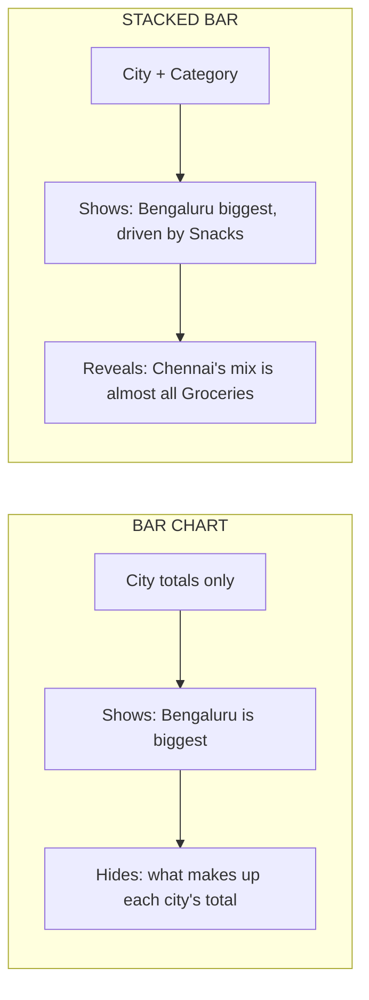

# Tableau: Choosing the Right Chart
> Pre-Read — Academic Session 19 | Module 3: Tableau Dashboards + Storytelling
---

## Mental Map
> 📄 Also provided as a printable PDF in this folder: **mental-map - Choosing the Right Chart.pdf**

```mermaid
%%{init: {'themeVariables': {'fontSize': '16px'}, 'flowchart': {'useMaxWidth': false, 'htmlLabels': true, 'nodeSpacing': 80, 'rankSpacing': 120, 'wrappingWidth': 620, 'padding': 20}}}%%
flowchart LR

START["<b>Course Start</b>"]

subgraph foundation[" WHERE WE ARE "]
direction LR
    CURMOD["<b>CURRENT MODULE</b><br/><i>Module 3: Tableau Dashboards + Storytelling</i><br/>&nbsp;<br/><b>Covered so far:</b> Tableau Basics and First Charts · Statistics: Probability and Uncertainty<br/>This is Session 19 of 41"]
    CURSES["<b>CURRENT SESSION</b><br/><b>Choosing the Right Chart</b><br/>&nbsp;<br/><i>The shift:</i> from <i>only knowing how to build a bar or a line chart</i> to <b>matching the chart type to the actual question being asked</b><br/>&nbsp;<br/>Chart type variety · Matching chart to data<br/>Comparing chart types · Labels &amp; formatting"]
end

subgraph outcome[" OUTCOME OF THIS SESSION "]
direction LR
    OUT["<b>By the end, you can…</b><br/>&nbsp;<br/>Look at a Kirana365 business question and pick the chart<br/>type that answers it clearly, then format it with labels<br/>and sorting so anyone can read it in seconds"]
end

subgraph value[" WHY IT MATTERS "]
direction LR
    CVAL["<b>Course Value</b><br/>A dashboard is only as good as the charts inside it — this is the judgement call every later Tableau session assumes you can make"]
    RVAL["<b>Real-Life Value</b><br/>Picking a chart a store manager actually understands in ten seconds, instead of a cluttered pie chart nobody can read"]
end

subgraph future[" WHAT COMES NEXT "]
direction LR
    U0["<b>Next Session</b><br/>Building a Dashboard<br/><i>Now we combine several well-chosen charts into one connected view</i>"]
    U1["<b>Later in Module 3</b><br/>KPIs and Trends on One View · Dashboard Design Basics<br/>Dashboards That Support Decisions"]
    U2["<b>Upcoming Modules</b><br/>Module 4: GenAI for Analytics Workflows + Basic Python<br/><i>You'll rebuild some of these same chart choices in matplotlib later</i>"]
end

START ==>|" begin "| CURMOD
CURMOD ==>|" progress "| CURSES
CURSES ==>|" you get "| OUT
OUT ==>|" course "| CVAL
OUT ==>|" real life "| RVAL
CURSES ==>|" next up "| U0
U0 -.->|" then "| U1
U1 -.->|" ahead "| U2

classDef startBox fill:#F7FAFC,stroke:#4A5568,stroke-width:2px,color:#1A202C
classDef curModBox fill:#FFF8E6,stroke:#B7791F,stroke-width:2px,color:#1A202C
classDef curSessBox fill:#E6FFFA,stroke:#0D9488,stroke-width:3px,color:#1A202C
classDef outBox fill:#FEF2F2,stroke:#DC2626,stroke-width:3px,color:#1A202C
classDef valueBox fill:#F3E8FF,stroke:#7C3AED,stroke-width:2px,color:#1A202C
classDef futureBox fill:#ECFDF5,stroke:#047857,stroke-width:2px,color:#1A202C

class START startBox
class CURMOD curModBox
class CURSES curSessBox
class OUT outBox
class CVAL,RVAL valueBox
class U0,U1,U2 futureBox

linkStyle default stroke-width:2px
```

## What You'll Learn
In this pre-read, you'll discover:
- Five chart types beyond bar and line, and the specific job each one does
- A simple way to decide which chart fits your question, every time
- Why the same Kirana365 dataset can look completely different — and tell a different story — depending on the chart you pick
- How small formatting choices (labels, sorting, colour) turn a correct chart into a readable one

## A. Beyond Bar and Line — Five More Chart Types

**💡 Analogy**: Think of chart types like kitchen tools. A bar chart is your knife — used constantly. But sometimes you need a ladle (for parts of a whole), a sieve (for spotting outliers), or a rolling pin (for spreading things out). Using the wrong tool doesn't just look odd — it makes the job harder.

**Different chart types are built to answer different kinds of questions, not to look different for variety's sake.**

| Chart type | Best for |
|---|---|
| Bar chart | Comparing a number across categories |
| Line chart | Showing change over time |
| Stacked bar | Comparing categories while also showing what they're made of |
| Scatter plot | Showing the relationship between two numbers |
| Treemap | Showing part-to-whole with many categories at once |
| Highlight table | Scanning many rows/columns for patterns using colour instead of shapes |

**Worked example**: Kirana365 wants to see Revenue by City, broken down further by Category (Groceries, Snacks, Beverages). A plain bar chart can only show total Revenue by City. A **stacked bar chart** shows both — total city revenue, and which categories make it up — in one chart.

**⚠️ Common trap**: Reaching for a pie chart out of habit because "it's the classic chart for parts of a whole." Pie charts become unreadable past 4–5 slices — most real business categories (like Kirana365's 8+ product categories) are better shown as a stacked bar or treemap.

## B. Matching Chart to Question — A Simple Decision Habit

**Before opening Tableau, first write down, in one sentence, the exact question your chart needs to answer — the chart type follows from the question, not the other way around.**

| Your question sounds like... | Chart type |
|---|---|
| "Which is bigger/smaller?" | Bar chart |
| "How did this change over time?" | Line chart |
| "What's this made up of, across categories?" | Stacked bar or treemap |
| "Is there a relationship between two numbers?" | Scatter plot |
| "Where are the patterns across many rows and columns?" | Highlight table |

**Worked example**: The question "Is there a relationship between how many items a Kirana365 customer orders and how much they spend?" is a relationship question between two numbers (Quantity and Revenue) — the answer is a **scatter plot**, with each dot representing one order.

**⚠️ Common trap**: Picking a chart type first, out of familiarity (bar charts feel "safe"), and then trying to force the question to fit it. This produces technically correct but weak charts — a bar chart of "average revenue per item" when a scatter plot would have revealed that heavy orders and light orders behave completely differently.

## C. Comparing Chart Types on the Same Data

**The same dataset, shown through different chart types, can highlight completely different insights — this is why experienced analysts sketch two or three options before settling on one.**

**Worked example**: Take Kirana365's August order data by City and Category.
- As a **bar chart** (City only): Bengaluru is clearly the top city
- As a **stacked bar** (City + Category): Bengaluru is top, but its growth is mostly Snacks, while Chennai's smaller total is almost entirely Groceries — a pattern invisible in the plain bar chart
- As a **scatter plot** (Quantity vs Revenue, one dot per order): reveals that a few very large bulk orders are pulling up the average, a detail no bar chart shows at all

**⚠️ Common trap**: Assuming there's always exactly one "correct" chart. Often two chart types are both valid — the real skill is picking the one that best matches what you're about to say next in your presentation.

## D. Making Charts Readable — Labels, Sorting, and Formatting

**💡 Analogy**: An unlabelled, unsorted chart is like a shop shelf with no price tags and items placed in random order — technically all the information is there, but the customer has to work far too hard to use it.

**A correct chart type can still fail if it isn't formatted for a reader in a hurry.**

Three quick formatting habits that fix most readability problems:

1. **Sort bars by value**, not alphabetically — Bengaluru first (biggest), not because it starts with B
2. **Add data labels** directly on bars/lines for the 3-5 most important values, so readers don't have to estimate against a faint axis
3. **Use colour with a purpose**, not decoration — e.g., colour the lowest-performing city red only if the chart's whole point is to flag underperformance

**Worked example**: An unsorted, unlabelled bar chart of Revenue by City takes a reader 10-15 seconds to interpret. The same chart, sorted highest-to-lowest with revenue labels on each bar, takes under 3 seconds — same data, same chart type, dramatically different usability.

**⚠️ Common trap**: Over-formatting — adding labels to every single bar, multiple colours with no clear meaning, and 3D effects. This creates visual noise that slows readers down just as much as no formatting at all. Format only what helps the specific point you're making.

## Quick Reference — Chart Type Decision Table

| Your situation | Use this | Because |
|---|---|---|
| Comparing a number across a handful of categories | Bar chart | Direct, familiar, easy to compare bar lengths |
| Showing how a number changed over days/weeks/months | Line chart | Built for sequences, shows direction of change |
| Showing categories AND their sub-composition together | Stacked bar or treemap | Reveals what's "inside" each category's total |
| Checking if two numeric fields move together | Scatter plot | Only chart type built to show a numeric relationship |
| Your chart is correct but still takes readers too long to interpret | Sort by value, label key points, use colour purposefully | Fixes usability without changing the underlying chart type |

## Practice Exercises

1. **Pattern Recognition**: A dashboard has a line chart showing "Revenue by Delivery Partner" with partners plotted alphabetically along the x-axis. What's wrong here, and which chart type and formatting fix would you suggest?

2. **Concept Detective**: Someone shows you a scatter plot of Quantity vs Revenue per order and says "see, bigger orders make more money." What relationship is the scatter plot actually built to reveal, and is that conclusion fully supported by it?

3. **Real-Life Application**: List three Kirana365 questions where a stacked bar chart would reveal more than a plain bar chart.

4. **Spot the Error**: A teammate builds a pie chart with 9 product category slices, several so thin they're barely visible. What chart type would you recommend instead, and why?

5. **Planning Ahead**: Next session, you'll combine multiple charts into one dashboard. Based on today's lesson, what do you think could go wrong if you throw together 6 charts of 6 different, unrelated types onto one dashboard without a plan?

> ✅ **You're done!** You can now match a chart type to the actual question behind it, compare chart options on the same data, and format any chart so a reader understands it in seconds instead of minutes.
Next session, we take these well-chosen, well-formatted charts and combine them for the first time into **Building a Dashboard** — a single connected view instead of scattered individual charts.
