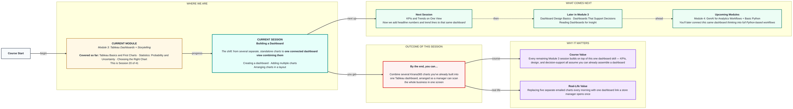

# Mental Map — Building a Dashboard
> Academic Session 20 · Module 3: Tableau Dashboards + Storytelling

```mermaid
%%{init: {'themeVariables': {'fontSize': '16px'}, 'flowchart': {'useMaxWidth': false, 'htmlLabels': true, 'nodeSpacing': 80, 'rankSpacing': 120, 'wrappingWidth': 620, 'padding': 20}}}%%
flowchart LR

START["<b>Course Start</b>"]

subgraph foundation[" WHERE WE ARE "]
direction LR
    CURMOD["<b>CURRENT MODULE</b><br/><i>Module 3: Tableau Dashboards + Storytelling</i><br/>&nbsp;<br/><b>Covered so far:</b> Tableau Basics and First Charts · Statistics: Probability and Uncertainty · Choosing the Right Chart<br/>This is Session 20 of 41"]
    CURSES["<b>CURRENT SESSION</b><br/><b>Building a Dashboard</b><br/>&nbsp;<br/><i>The shift:</i> from <i>several separate, standalone charts</i> to <b>one connected dashboard view combining them</b><br/>&nbsp;<br/>Creating a dashboard · Adding multiple charts<br/>Arranging charts in a layout"]
end

subgraph outcome[" OUTCOME OF THIS SESSION "]
direction LR
    OUT["<b>By the end, you can…</b><br/>&nbsp;<br/>Combine several Kirana365 charts you've already built into<br/>one Tableau dashboard, arranged so a manager can scan<br/>the whole business in one screen"]
end

subgraph value[" WHY IT MATTERS "]
direction LR
    CVAL["<b>Course Value</b><br/>Every remaining Module 3 session builds on top of this one dashboard skill — KPIs, design, and decision-support all assume you can already assemble a dashboard"]
    RVAL["<b>Real-Life Value</b><br/>Replacing five separate emailed charts every morning with one dashboard link a store manager opens once"]
end

subgraph future[" WHAT COMES NEXT "]
direction LR
    U0["<b>Next Session</b><br/>KPIs and Trends on One View<br/><i>Now we add headline numbers and trend lines to that same dashboard</i>"]
    U1["<b>Later in Module 3</b><br/>Dashboard Design Basics · Dashboards That Support Decisions<br/>Reading Dashboards for Insight"]
    U2["<b>Upcoming Modules</b><br/>Module 4: GenAI for Analytics Workflows + Basic Python<br/><i>You'll later connect this same dashboard thinking into full Python-based workflows</i>"]
end

START ==>|" begin "| CURMOD
CURMOD ==>|" progress "| CURSES
CURSES ==>|" you get "| OUT
OUT ==>|" course "| CVAL
OUT ==>|" real life "| RVAL
CURSES ==>|" next up "| U0
U0 -.->|" then "| U1
U1 -.->|" ahead "| U2

classDef startBox fill:#F7FAFC,stroke:#4A5568,stroke-width:2px,color:#1A202C
classDef curModBox fill:#FFF8E6,stroke:#B7791F,stroke-width:2px,color:#1A202C
classDef curSessBox fill:#E6FFFA,stroke:#0D9488,stroke-width:3px,color:#1A202C
classDef outBox fill:#FEF2F2,stroke:#DC2626,stroke-width:3px,color:#1A202C
classDef valueBox fill:#F3E8FF,stroke:#7C3AED,stroke-width:2px,color:#1A202C
classDef futureBox fill:#ECFDF5,stroke:#047857,stroke-width:2px,color:#1A202C

class START startBox
class CURMOD curModBox
class CURSES curSessBox
class OUT outBox
class CVAL,RVAL valueBox
class U0,U1,U2 futureBox

linkStyle default stroke-width:2px
```
