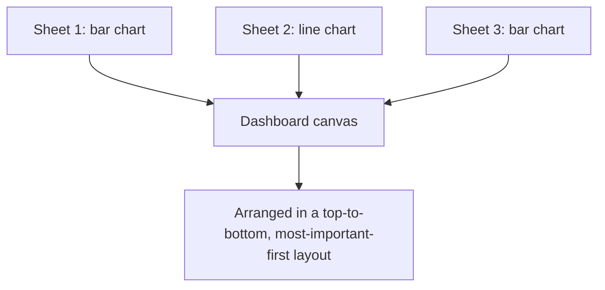

# Tableau: Building a Dashboard
> Pre-Read — Academic Session 20 | Module 3: Tableau Dashboards + Storytelling
---

## Mental Map
> 📄 Also provided as a printable PDF in this folder: **mental-map - Building a Dashboard.pdf**

```mermaid
%%{init: {'themeVariables': {'fontSize': '16px'}, 'flowchart': {'useMaxWidth': false, 'htmlLabels': true, 'nodeSpacing': 80, 'rankSpacing': 120, 'wrappingWidth': 620, 'padding': 20}}}%%
flowchart LR

START["<b>Course Start</b>"]

subgraph foundation[" WHERE WE ARE "]
direction LR
    CURMOD["<b>CURRENT MODULE</b><br/><i>Module 3: Tableau Dashboards + Storytelling</i><br/>&nbsp;<br/><b>Covered so far:</b> Tableau Basics and First Charts · Statistics: Probability and Uncertainty · Choosing the Right Chart<br/>This is Session 20 of 41"]
    CURSES["<b>CURRENT SESSION</b><br/><b>Building a Dashboard</b><br/>&nbsp;<br/><i>The shift:</i> from <i>several separate, standalone charts</i> to <b>one connected dashboard view combining them</b><br/>&nbsp;<br/>Creating a dashboard · Adding multiple charts<br/>Arranging charts in a layout"]
end

subgraph outcome[" OUTCOME OF THIS SESSION "]
direction LR
    OUT["<b>By the end, you can…</b><br/>&nbsp;<br/>Combine several Kirana365 charts you've already built into<br/>one Tableau dashboard, arranged so a manager can scan<br/>the whole business in one screen"]
end

subgraph value[" WHY IT MATTERS "]
direction LR
    CVAL["<b>Course Value</b><br/>Every remaining Module 3 session builds on top of this one dashboard skill — KPIs, design, and decision-support all assume you can already assemble a dashboard"]
    RVAL["<b>Real-Life Value</b><br/>Replacing five separate emailed charts every morning with one dashboard link a store manager opens once"]
end

subgraph future[" WHAT COMES NEXT "]
direction LR
    U0["<b>Next Session</b><br/>KPIs and Trends on One View<br/><i>Now we add headline numbers and trend lines to that same dashboard</i>"]
    U1["<b>Later in Module 3</b><br/>Dashboard Design Basics · Dashboards That Support Decisions<br/>Reading Dashboards for Insight"]
    U2["<b>Upcoming Modules</b><br/>Module 4: GenAI for Analytics Workflows + Basic Python<br/><i>You'll later connect this same dashboard thinking into full Python-based workflows</i>"]
end

START ==>|" begin "| CURMOD
CURMOD ==>|" progress "| CURSES
CURSES ==>|" you get "| OUT
OUT ==>|" course "| CVAL
OUT ==>|" real life "| RVAL
CURSES ==>|" next up "| U0
U0 -.->|" then "| U1
U1 -.->|" ahead "| U2

classDef startBox fill:#F7FAFC,stroke:#4A5568,stroke-width:2px,color:#1A202C
classDef curModBox fill:#FFF8E6,stroke:#B7791F,stroke-width:2px,color:#1A202C
classDef curSessBox fill:#E6FFFA,stroke:#0D9488,stroke-width:3px,color:#1A202C
classDef outBox fill:#FEF2F2,stroke:#DC2626,stroke-width:3px,color:#1A202C
classDef valueBox fill:#F3E8FF,stroke:#7C3AED,stroke-width:2px,color:#1A202C
classDef futureBox fill:#ECFDF5,stroke:#047857,stroke-width:2px,color:#1A202C

class START startBox
class CURMOD curModBox
class CURSES curSessBox
class OUT outBox
class CVAL,RVAL valueBox
class U0,U1,U2 futureBox

linkStyle default stroke-width:2px
```

## What You'll Learn
In this pre-read, you'll discover:
- What a Tableau dashboard actually is, and how it's different from a single chart
- How to bring multiple existing charts (sheets) into one dashboard
- How to arrange charts in a layout that reads naturally, top-to-bottom and left-to-right
- Why connecting charts together (so clicking one filters the others) is what makes a dashboard more than a collage

## A. What a Dashboard Actually Is

**💡 Analogy**: A single chart is like one photo from a trip. A dashboard is the photo album — several related photos arranged together so the whole story makes sense at a glance, not one image at a time.

**A dashboard is a single screen that combines multiple charts (sheets) so someone can understand several angles of the business at once.**

**Worked example**: Instead of Kirana365's ops manager opening three separate Tableau sheets each morning — Revenue by City, Daily Revenue Trend, and Revenue by Category — a dashboard puts all three on one screen, viewed together in one glance.

**⚠️ Common trap**: Assuming a dashboard is just "a bigger chart." A dashboard is a *container* for multiple charts (called sheets in Tableau) — you don't draw new bars or lines directly on a dashboard; you build each chart on its own sheet first, then bring them together.

## B. Adding Multiple Charts to a Dashboard

**Every chart added to a dashboard must already exist as its own sheet — the dashboard is assembled from finished pieces, not built from scratch.**

**Worked example**: For Kirana365, you would first build (as separate sheets, using skills from the last two sessions):
1. `Revenue by City` (bar chart)
2. `Daily Revenue Trend` (line chart)
3. `Revenue by Category` (bar chart)

Then, in a new Dashboard tab, drag each of these three sheets onto the dashboard canvas one at a time from the sheet list on the left.

| Step | What happens |
|---|---|
| Create new Dashboard | Blank canvas appears, sheet list shown on the left |
| Drag `Revenue by City` onto canvas | Chart 1 appears |
| Drag `Daily Revenue Trend` onto canvas | Chart 2 appears alongside Chart 1 |
| Drag `Revenue by Category` onto canvas | Chart 3 completes the dashboard |

**⚠️ Common trap**: Editing a chart's fields directly inside the dashboard view and being confused when the original sheet also changes. Charts inside a dashboard are still the *same* underlying sheet — editing one edits both. If you want a different version, duplicate the sheet first.

## C. Arranging Charts in a Layout

**💡 Analogy**: Arranging dashboard charts is like laying out vegetables at a sabzi mandi stall — the biggest, most important items go at eye level and front-and-centre; smaller supporting items go to the side.

**A dashboard's layout should follow how people naturally read: top-to-bottom, most important first.**

**Worked example**: For the Kirana365 ops dashboard, a sensible layout is:
- **Top**: `Daily Revenue Trend` (the single most important "how are we doing right now" chart)
- **Bottom-left**: `Revenue by City` (which markets are strong)
- **Bottom-right**: `Revenue by Category` (what's driving those numbers)

This mirrors how a manager actually scans a page — trend first, then breakdowns.

**⚠️ Common trap**: Cramming too many charts into one dashboard "because Tableau allows it." Past 4-6 charts, a dashboard usually needs a second page or tab instead — cramming makes every individual chart smaller and harder to read, defeating the purpose of a dashboard.

## D. Making Charts Talk to Each Other — Dashboard Actions (Introductory Look)

**A dashboard becomes more than a collage of charts when clicking on one chart filters or highlights the others — this is called a dashboard action, and we'll go deeper on it soon, but it's worth knowing it exists from day one.**

**Worked example**: On the Kirana365 dashboard, clicking "Bengaluru" on the `Revenue by City` chart could automatically filter the `Revenue by Category` chart to show only Bengaluru's category breakdown — letting a manager drill from a city-level view straight into that city's details, without switching screens.

**⚠️ Common trap**: Building a dashboard with several related charts but never connecting them with an action, leaving users to mentally cross-reference three separate charts by eye. Even a single well-placed filter action can make a dashboard feel dramatically more useful.

## Quick Reference — Assembling a Dashboard

| Your situation | Use this | Because |
|---|---|---|
| You have several finished charts and want them on one screen | Create a new Dashboard tab and drag each sheet in | Dashboards are containers assembled from existing sheets |
| A chart looks different after you edited it inside the dashboard | Remember you edited the underlying sheet itself | Dashboard charts are live references, not copies |
| You have more than 4-6 charts to show | Split across multiple dashboard pages/tabs | Cramming shrinks every chart and hurts readability |
| Related charts don't visually "talk" to each other | Add a dashboard action (filter/highlight) | Turns a collage of charts into one connected experience |

## Practice Exercises

1. **Pattern Recognition**: You open a Kirana365 dashboard and see 9 tiny charts crammed onto one screen, each too small to read clearly. What's the likely root cause, and what would you suggest?

2. **Concept Detective**: A teammate says, "I edited the bar chart directly on the dashboard, but now the original sheet also changed — is that a bug?" How would you explain what actually happened?

3. **Real-Life Application**: List three Kirana365 charts (besides the three used in this pre-read) that could reasonably sit together on one operational dashboard.

4. **Spot the Error**: Someone arranges a dashboard with the least important chart (say, a rarely-used delivery-partner breakdown) at the very top, and the daily revenue trend buried at the bottom. What layout principle does this violate?

5. **Planning Ahead**: Next session adds KPIs and trend indicators to a dashboard. Based on today's layout lesson, where do you think a single headline KPI number (like "Total Revenue This Month") should typically sit on the page, and why?

> ✅ **You're done!** You can now assemble multiple finished charts into one Tableau dashboard, arrange them in a layout that reads the way people naturally scan a page, and you know dashboard actions exist to connect charts together.
Next session, we build on this same dashboard by adding **KPIs and Trends on One View** — the headline numbers that make a dashboard feel like a cockpit instead of just a gallery of charts.
