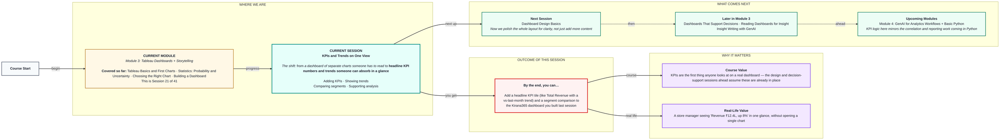

# Mental Map — KPIs and Trends on One View
> Academic Session 21 · Module 3: Tableau Dashboards + Storytelling

```mermaid
%%{init: {'themeVariables': {'fontSize': '16px'}, 'flowchart': {'useMaxWidth': false, 'htmlLabels': true, 'nodeSpacing': 80, 'rankSpacing': 120, 'wrappingWidth': 620, 'padding': 20}}}%%
flowchart LR

START["<b>Course Start</b>"]

subgraph foundation[" WHERE WE ARE "]
direction LR
    CURMOD["<b>CURRENT MODULE</b><br/><i>Module 3: Tableau Dashboards + Storytelling</i><br/>&nbsp;<br/><b>Covered so far:</b> Tableau Basics and First Charts · Statistics: Probability and Uncertainty · Choosing the Right Chart · Building a Dashboard<br/>This is Session 21 of 41"]
    CURSES["<b>CURRENT SESSION</b><br/><b>KPIs and Trends on One View</b><br/>&nbsp;<br/><i>The shift:</i> from <i>a dashboard of separate charts someone has to read</i> to <b>headline KPI numbers and trends someone can absorb in a glance</b><br/>&nbsp;<br/>Adding KPIs · Showing trends<br/>Comparing segments · Supporting analysis"]
end

subgraph outcome[" OUTCOME OF THIS SESSION "]
direction LR
    OUT["<b>By the end, you can…</b><br/>&nbsp;<br/>Add a headline KPI tile (like Total Revenue with a<br/>vs-last-month trend) and a segment comparison to<br/>the Kirana365 dashboard you built last session"]
end

subgraph value[" WHY IT MATTERS "]
direction LR
    CVAL["<b>Course Value</b><br/>KPIs are the first thing anyone looks at on a real dashboard — the design and decision-support sessions ahead assume these are already in place"]
    RVAL["<b>Real-Life Value</b><br/>A store manager seeing 'Revenue ₹12.4L, up 8%' in one glance, without opening a single chart"]
end

subgraph future[" WHAT COMES NEXT "]
direction LR
    U0["<b>Next Session</b><br/>Dashboard Design Basics<br/><i>Now we polish the whole layout for clarity, not just add more content</i>"]
    U1["<b>Later in Module 3</b><br/>Dashboards That Support Decisions · Reading Dashboards for Insight<br/>Insight Writing with GenAI"]
    U2["<b>Upcoming Modules</b><br/>Module 4: GenAI for Analytics Workflows + Basic Python<br/><i>KPI logic here mirrors the correlation and reporting work coming in Python</i>"]
end

START ==>|" begin "| CURMOD
CURMOD ==>|" progress "| CURSES
CURSES ==>|" you get "| OUT
OUT ==>|" course "| CVAL
OUT ==>|" real life "| RVAL
CURSES ==>|" next up "| U0
U0 -.->|" then "| U1
U1 -.->|" ahead "| U2

classDef startBox fill:#F7FAFC,stroke:#4A5568,stroke-width:2px,color:#1A202C
classDef curModBox fill:#FFF8E6,stroke:#B7791F,stroke-width:2px,color:#1A202C
classDef curSessBox fill:#E6FFFA,stroke:#0D9488,stroke-width:3px,color:#1A202C
classDef outBox fill:#FEF2F2,stroke:#DC2626,stroke-width:3px,color:#1A202C
classDef valueBox fill:#F3E8FF,stroke:#7C3AED,stroke-width:2px,color:#1A202C
classDef futureBox fill:#ECFDF5,stroke:#047857,stroke-width:2px,color:#1A202C

class START startBox
class CURMOD curModBox
class CURSES curSessBox
class OUT outBox
class CVAL,RVAL valueBox
class U0,U1,U2 futureBox

linkStyle default stroke-width:2px
```
