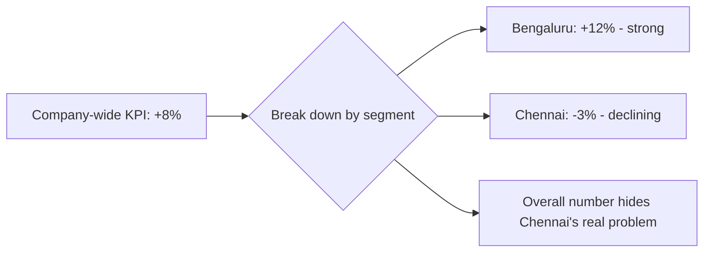

# Tableau: KPIs and Trends on One View
> Pre-Read — Academic Session 21 | Module 3: Tableau Dashboards + Storytelling
---

## Mental Map
> 📄 Also provided as a printable PDF in this folder: **mental-map - KPIs and Trends on One View.pdf**

```mermaid
%%{init: {'themeVariables': {'fontSize': '16px'}, 'flowchart': {'useMaxWidth': false, 'htmlLabels': true, 'nodeSpacing': 80, 'rankSpacing': 120, 'wrappingWidth': 620, 'padding': 20}}}%%
flowchart LR

START["<b>Course Start</b>"]

subgraph foundation[" WHERE WE ARE "]
direction LR
    CURMOD["<b>CURRENT MODULE</b><br/><i>Module 3: Tableau Dashboards + Storytelling</i><br/>&nbsp;<br/><b>Covered so far:</b> Tableau Basics and First Charts · Statistics: Probability and Uncertainty · Choosing the Right Chart · Building a Dashboard<br/>This is Session 21 of 41"]
    CURSES["<b>CURRENT SESSION</b><br/><b>KPIs and Trends on One View</b><br/>&nbsp;<br/><i>The shift:</i> from <i>a dashboard of separate charts someone has to read</i> to <b>headline KPI numbers and trends someone can absorb in a glance</b><br/>&nbsp;<br/>Adding KPIs · Showing trends<br/>Comparing segments · Supporting analysis"]
end

subgraph outcome[" OUTCOME OF THIS SESSION "]
direction LR
    OUT["<b>By the end, you can…</b><br/>&nbsp;<br/>Add a headline KPI tile (like Total Revenue with a<br/>vs-last-month trend) and a segment comparison to<br/>the Kirana365 dashboard you built last session"]
end

subgraph value[" WHY IT MATTERS "]
direction LR
    CVAL["<b>Course Value</b><br/>KPIs are the first thing anyone looks at on a real dashboard — the design and decision-support sessions ahead assume these are already in place"]
    RVAL["<b>Real-Life Value</b><br/>A store manager seeing 'Revenue ₹12.4L, up 8%' in one glance, without opening a single chart"]
end

subgraph future[" WHAT COMES NEXT "]
direction LR
    U0["<b>Next Session</b><br/>Dashboard Design Basics<br/><i>Now we polish the whole layout for clarity, not just add more content</i>"]
    U1["<b>Later in Module 3</b><br/>Dashboards That Support Decisions · Reading Dashboards for Insight<br/>Insight Writing with GenAI"]
    U2["<b>Upcoming Modules</b><br/>Module 4: GenAI for Analytics Workflows + Basic Python<br/><i>KPI logic here mirrors the correlation and reporting work coming in Python</i>"]
end

START ==>|" begin "| CURMOD
CURMOD ==>|" progress "| CURSES
CURSES ==>|" you get "| OUT
OUT ==>|" course "| CVAL
OUT ==>|" real life "| RVAL
CURSES ==>|" next up "| U0
U0 -.->|" then "| U1
U1 -.->|" ahead "| U2

classDef startBox fill:#F7FAFC,stroke:#4A5568,stroke-width:2px,color:#1A202C
classDef curModBox fill:#FFF8E6,stroke:#B7791F,stroke-width:2px,color:#1A202C
classDef curSessBox fill:#E6FFFA,stroke:#0D9488,stroke-width:3px,color:#1A202C
classDef outBox fill:#FEF2F2,stroke:#DC2626,stroke-width:3px,color:#1A202C
classDef valueBox fill:#F3E8FF,stroke:#7C3AED,stroke-width:2px,color:#1A202C
classDef futureBox fill:#ECFDF5,stroke:#047857,stroke-width:2px,color:#1A202C

class START startBox
class CURMOD curModBox
class CURSES curSessBox
class OUT outBox
class CVAL,RVAL valueBox
class U0,U1,U2 futureBox

linkStyle default stroke-width:2px
```

## What You'll Learn
In this pre-read, you'll discover:
- What makes a number a "KPI tile" instead of just a number on a page
- How to show a trend (like "up 8% vs last month") next to a KPI, not just the current value
- How to let a dashboard compare segments (like cities or categories) side by side, not just show one total
- How KPIs and trends together turn a dashboard from "a place to look things up" into "a place that supports real decisions"

## A. What Makes a Number a KPI Tile

**💡 Analogy**: Think of a KPI tile like the speedometer in a car — one big number, always in the same spot, telling the driver the single most important fact right now, without them having to open the engine and check anything themselves.

**A KPI tile is a large, prominent number on a dashboard representing the single most important metric for that audience, shown with minimal clutter.**

**Worked example**: For Kirana365's ops dashboard, the KPI tile might simply show:

**₹12,40,000**
Total Revenue — This Month

No chart, no axis — just the number, big and clear, because the whole point is instant absorption, not detailed analysis.

**⚠️ Common trap**: Turning a KPI tile into a mini chart by adding gridlines, extra labels, or multiple numbers crammed together. A KPI tile should be readable from across the room — if it needs close reading, it has stopped doing its job.

## B. Showing Trends Next to a KPI

**A number alone (₹12.4L) tells you the current state, but not whether that's good or bad — a trend indicator answers "compared to what?"**

**Worked example**: The Kirana365 KPI tile becomes far more useful with a trend line added:

**₹12,40,000** ▲ 8% vs last month
Total Revenue — This Month

Now the reader instantly knows not just the number, but the direction and size of change.

| KPI alone | KPI + trend |
|---|---|
| ₹12,40,000 | ₹12,40,000, up 8% vs last month |
| Tells you: current state | Tells you: current state AND whether it's improving |

**⚠️ Common trap**: Showing a trend arrow without stating what it's being compared against. "Up 8%" means nothing on its own — up 8% versus last month? Versus the same month last year? Versus a target? Always label the comparison explicitly.

## C. Comparing Segments Within a Dashboard

**💡 Analogy**: A single KPI is like checking your own exam score. Comparing segments is like seeing your score next to your classmates' — the number alone tells you something, but the comparison tells you a lot more.

**A dashboard becomes more useful when it lets someone compare a KPI across segments — cities, categories, customer types — rather than showing only one company-wide total.**

**Worked example**: Alongside the company-wide Total Revenue KPI, Kirana365's dashboard adds a small segment comparison table:

| City | Revenue (₹) | vs Last Month |
|---|---|---|
| Bengaluru | 3,42,000 | ▲ 12% |
| Hyderabad | 2,78,000 | ▲ 5% |
| Chennai | 2,15,000 | ▼ 3% |
| Pune | 1,64,000 | ▲ 9% |

This reveals something the single company-wide KPI hides completely: Chennai is actually declining even though the overall company number looks healthy.

**⚠️ Common trap**: Reporting only the company-wide total and assuming it represents every segment equally. A rising overall number can hide a struggling city or category — segment comparisons are how you catch that.

## D. Using Dashboards to Support Analysis, Not Just Report Numbers

**A dashboard with KPIs and trends stops being a static report the moment someone can use it to ask and answer a follow-up question, right there on the screen.**

**Worked example**: A manager sees Chennai declining 3% on the segment table, clicks Chennai (using the dashboard action skill from last session), and the connected `Revenue by Category` chart instantly filters to show Chennai's category breakdown alone — revealing that Chennai's Groceries category specifically dropped, while Snacks held steady. That's analysis happening live, inside the dashboard, not in a separate spreadsheet later.

**⚠️ Common trap**: Building a dashboard full of static KPIs and trends but no way to drill from a KPI into the detail behind it. A dashboard that only reports numbers, without letting the user ask "why," has stopped short of its real value.

## Quick Reference — Building Effective KPI Views

| Your situation | Use this | Because |
|---|---|---|
| You want one instantly-readable headline number | A single large KPI tile, minimal clutter | Should be readable from across the room |
| You want to show whether a KPI is improving or worsening | A trend indicator with an explicit comparison point | "Up 8%" is meaningless without saying versus what |
| The company-wide KPI might be hiding a struggling segment | A segment comparison table or chart alongside the KPI | Averages and totals can mask real problems underneath |
| Users need to go from "what happened" to "why" | Connect the KPI/segment view to detail charts via dashboard actions | Turns a static report into a tool for live analysis |

## Practice Exercises

1. **Pattern Recognition**: A KPI tile shows "Orders: 1,240 ▲ 15%" with no other text. What critical piece of context is missing, and why does it matter?

2. **Concept Detective**: Kirana365's company-wide revenue KPI shows +8% this month, but the founder still feels uneasy about Chennai. What kind of dashboard element would help settle whether that unease is justified?

3. **Real-Life Application**: List three other KPIs (besides Total Revenue) that would make sense as headline tiles on a Kirana365 dashboard.

4. **Spot the Error**: A dashboard shows five different KPI tiles, each in a different font size and colour, scattered around the page with no clear hierarchy. What principle from this session does this violate?

5. **Planning Ahead**: Next session focuses on overall dashboard design. Based on today's KPI-tile lesson (readable from across the room, minimal clutter), what do you think "good design" might mean for the rest of the dashboard's charts, not just the KPI tiles?

> ✅ **You're done!** You can now add a headline KPI with a clearly labelled trend, build a segment comparison that can reveal what a single total hides, and connect both into a dashboard that supports real, live analysis.
Next session, we zoom out from individual KPIs to the whole page with **Dashboard Design Basics** — applying real design principles so every part of your dashboard, not just the KPI tiles, is instantly readable.
