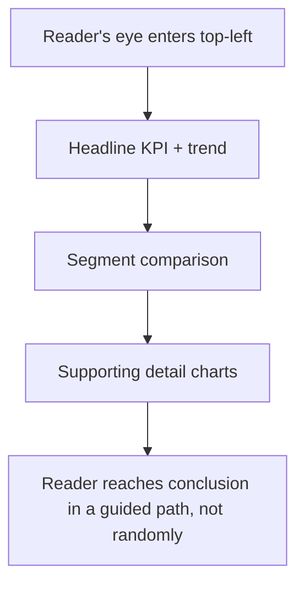

# Tableau: Dashboard Design Basics
> Pre-Read — Academic Session 22 | Module 3: Tableau Dashboards + Storytelling
---

## Mental Map
> 📄 Also provided as a printable PDF in this folder: **mental-map - Dashboard Design Basics.pdf**

```mermaid
%%{init: {'themeVariables': {'fontSize': '16px'}, 'flowchart': {'useMaxWidth': false, 'htmlLabels': true, 'nodeSpacing': 80, 'rankSpacing': 120, 'wrappingWidth': 620, 'padding': 20}}}%%
flowchart LR

START["<b>Course Start</b>"]

subgraph foundation[" WHERE WE ARE "]
direction LR
    CURMOD["<b>CURRENT MODULE</b><br/><i>Module 3: Tableau Dashboards + Storytelling</i><br/>&nbsp;<br/><b>Covered so far:</b> Tableau Basics and First Charts · Statistics: Probability and Uncertainty · Choosing the Right Chart · Building a Dashboard · KPIs and Trends on One View<br/>This is Session 22 of 41"]
    CURSES["<b>CURRENT SESSION</b><br/><b>Dashboard Design Basics</b><br/>&nbsp;<br/><i>The shift:</i> from <i>a dashboard that technically contains the right content</i> to <b>a dashboard designed so that content is genuinely easy to read</b><br/>&nbsp;<br/>Clarity &amp; layout principles · Reducing clutter<br/>Organizing visuals for readability"]
end

subgraph outcome[" OUTCOME OF THIS SESSION "]
direction LR
    OUT["<b>By the end, you can…</b><br/>&nbsp;<br/>Take an already-functional Kirana365 dashboard and apply<br/>design principles — whitespace, alignment, decluttering —<br/>so it reads clearly in seconds, not minutes"]
end

subgraph value[" WHY IT MATTERS "]
direction LR
    CVAL["<b>Course Value</b><br/>A dashboard that supports real decisions, coming next session, only works if it's designed clearly enough to be trusted at a glance"]
    RVAL["<b>Real-Life Value</b><br/>A cluttered dashboard gets closed in ten seconds; a clean one gets opened again tomorrow"]
end

subgraph future[" WHAT COMES NEXT "]
direction LR
    U0["<b>Next Session</b><br/>Dashboards That Support Decisions<br/><i>Now we design specifically to help someone decide something, not just look at something</i>"]
    U1["<b>Later in Module 3</b><br/>Reading Dashboards for Insight · Insight Writing with GenAI"]
    U2["<b>Upcoming Modules</b><br/>Module 4: GenAI for Analytics Workflows + Basic Python<br/><i>Clean, decluttered visuals matter just as much when you build charts in Python next module</i>"]
end

START ==>|" begin "| CURMOD
CURMOD ==>|" progress "| CURSES
CURSES ==>|" you get "| OUT
OUT ==>|" course "| CVAL
OUT ==>|" real life "| RVAL
CURSES ==>|" next up "| U0
U0 -.->|" then "| U1
U1 -.->|" ahead "| U2

classDef startBox fill:#F7FAFC,stroke:#4A5568,stroke-width:2px,color:#1A202C
classDef curModBox fill:#FFF8E6,stroke:#B7791F,stroke-width:2px,color:#1A202C
classDef curSessBox fill:#E6FFFA,stroke:#0D9488,stroke-width:3px,color:#1A202C
classDef outBox fill:#FEF2F2,stroke:#DC2626,stroke-width:3px,color:#1A202C
classDef valueBox fill:#F3E8FF,stroke:#7C3AED,stroke-width:2px,color:#1A202C
classDef futureBox fill:#ECFDF5,stroke:#047857,stroke-width:2px,color:#1A202C

class START startBox
class CURMOD curModBox
class CURSES curSessBox
class OUT outBox
class CVAL,RVAL valueBox
class U0,U1,U2 futureBox

linkStyle default stroke-width:2px
```

## What You'll Learn
In this pre-read, you'll discover:
- Three core design principles — clarity, alignment, and whitespace — and what each one actually fixes
- How to spot and remove clutter from a dashboard without losing important information
- How to organize a dashboard's visuals so a reader's eyes move in a natural, guided order
- Why "more polished" and "more decorated" are not the same thing

## A. Clarity — Every Element Earns Its Place

**💡 Analogy**: Think of a well-designed dashboard like a well-organized kitchen counter before cooking — every utensil out has a reason to be there. A cluttered counter, even with good ingredients, slows the cook down.

**Clarity means every chart, label, and colour on a dashboard exists because it directly helps answer the dashboard's core question — nothing is there "just because."**

**Worked example**: A Kirana365 dashboard meant to answer "how is this month's revenue trending?" doesn't need a chart of delivery-partner ratings on the same screen — that belongs on a different, operations-focused dashboard entirely.

**⚠️ Common trap**: Adding "just one more chart" because the data was available, not because the question needed it. Every extra element on a dashboard has a cost — it takes attention away from the elements that actually matter.

## B. Reducing Clutter — What to Remove, Not Just What to Add

**Good design is often about subtraction, not addition — removing gridlines, redundant labels, and decorative colour that don't help the reader.**

| Common clutter | Why it hurts | Fix |
|---|---|---|
| Default gridlines on every chart | Adds visual noise without adding information | Turn off gridlines unless precise value-reading is the goal |
| A legend repeating information already obvious from labels | Takes up space to restate the obvious | Remove or shrink the legend |
| Every bar labelled with its exact value | Forces the eye to read numbers instead of comparing shapes | Label only the 2-3 values that matter most |
| Multiple decorative colours with no meaning | Makes readers hunt for a pattern that isn't there | Use colour only when it encodes real information |

**Worked example**: A Kirana365 revenue-by-city bar chart with gridlines, a legend (unnecessary — city names are already on the bars), and every single bar labelled looks busy and slow to read. Removing the gridlines and legend, and labelling only the top and bottom bar, cuts the visual noise by more than half without losing a single fact.

**⚠️ Common trap**: Confusing "empty space" with "wasted space." Whitespace around a chart isn't unused — it's what lets the eye rest and focus on the content that remains.

## C. Organizing Visuals for a Natural Reading Order

**💡 Analogy**: A well-organized dashboard guides the eye the way a well-planned Diwali rangoli guides a glance — starting at a clear focal point and moving outward in a deliberate order, not scattered randomly.

**People read dashboards the same way they read a page: top-to-bottom, left-to-right, most important first.**

**Worked example**: On the Kirana365 dashboard, the most important element (the Total Revenue KPI with its trend) sits top-left. The segment comparison sits just below or beside it. Supporting detail charts (category, delivery partner) sit further down or to the right — each item positioned in the order a reader would naturally want to ask about it.

**⚠️ Common trap**: Placing charts in the order they were built, rather than the order a reader needs them. Just because you built the category chart first doesn't mean it belongs at the top of the finished dashboard.

## D. "Polished" Is Not the Same as "Decorated"

**Design polish means making something easier and faster to understand — not making it look more elaborate or colourful.**

**Worked example**: Two versions of the same Kirana365 dashboard: Version A has a gradient background, five accent colours, drop shadows on every chart, and rounded corners everywhere. Version B has a plain white background, one accent colour used only to flag the underperforming city, and clean spacing. Version B is the more "polished" dashboard, even though it looks visually simpler — because it's faster and easier to trust.

**⚠️ Common trap**: Spending design effort on visual flourish (colours, shadows, fonts) instead of on the things that genuinely improve readability (alignment, whitespace, decluttering, reading order). A dashboard can look impressive in a screenshot and still be slow and frustrating to actually use.

## Quick Reference — Design Fixes for Common Problems

| Your situation | Use this | Because |
|---|---|---|
| A dashboard feels "busy" even though the data is correct | Remove gridlines, unnecessary legends, and excess labels | Clutter competes with content for the reader's attention |
| Charts are arranged in the order you happened to build them | Rearrange top-to-bottom, most important first | Matches how people naturally read a page |
| A dashboard has 5+ accent colours with no clear meaning | Reduce to one purposeful accent colour (e.g., to flag a problem) | Colour should encode information, not decorate |
| You're unsure if a chart belongs on this dashboard at all | Ask "does this help answer the dashboard's core question?" | If not, it likely belongs on a different, purpose-built dashboard |

## Practice Exercises

1. **Pattern Recognition**: A Kirana365 dashboard has gridlines on every chart, a legend repeating city names already shown on the bars, and every bar individually labelled. List the three specific fixes you'd apply.

2. **Concept Detective**: A colleague adds a delivery-partner performance chart to a dashboard built to answer "how is revenue trending this month?" What design principle from this session does this addition violate?

3. **Real-Life Application**: Describe, in your own words, what a "well-designed" version of a Kirana365 ops dashboard would look like on first glance, before reading a single number.

4. **Spot the Error**: A teammate proudly shows off a dashboard with a colourful gradient background, five accent colours, and rounded shadow effects on every chart, saying "it looks so much more professional now." What might they be missing?

5. **Planning Ahead**: Next session focuses on dashboards that support real decisions. Based on today's reading-order lesson, what do you think should sit at the very top of a dashboard specifically meant to help someone decide whether to approve a marketing budget increase?

> ✅ **You're done!** You can now spot and remove clutter, organize a dashboard so a reader's eyes move in a natural, guided order, and tell the difference between a dashboard that's genuinely polished and one that's just decorated.
Next session, we take this same clean, well-organized dashboard and push it one step further with **Dashboards That Support Decisions** — designing specifically so someone can act on what they see, not just look at it.
