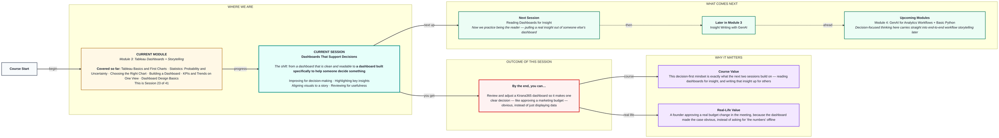

# Mental Map — Dashboards That Support Decisions
> Academic Session 23 · Module 3: Tableau Dashboards + Storytelling

```mermaid
%%{init: {'themeVariables': {'fontSize': '16px'}, 'flowchart': {'useMaxWidth': false, 'htmlLabels': true, 'nodeSpacing': 80, 'rankSpacing': 120, 'wrappingWidth': 620, 'padding': 20}}}%%
flowchart LR

START["<b>Course Start</b>"]

subgraph foundation[" WHERE WE ARE "]
direction LR
    CURMOD["<b>CURRENT MODULE</b><br/><i>Module 3: Tableau Dashboards + Storytelling</i><br/>&nbsp;<br/><b>Covered so far:</b> Tableau Basics and First Charts · Statistics: Probability and Uncertainty · Choosing the Right Chart · Building a Dashboard · KPIs and Trends on One View · Dashboard Design Basics<br/>This is Session 23 of 41"]
    CURSES["<b>CURRENT SESSION</b><br/><b>Dashboards That Support Decisions</b><br/>&nbsp;<br/><i>The shift:</i> from <i>a dashboard that is clean and readable</i> to <b>a dashboard built specifically to help someone decide something</b><br/>&nbsp;<br/>Improving for decision-making · Highlighting key insights<br/>Aligning visuals to a story · Reviewing for usefulness"]
end

subgraph outcome[" OUTCOME OF THIS SESSION "]
direction LR
    OUT["<b>By the end, you can…</b><br/>&nbsp;<br/>Review and adjust a Kirana365 dashboard so it makes one<br/>clear decision — like approving a marketing budget —<br/>obvious, instead of just displaying data"]
end

subgraph value[" WHY IT MATTERS "]
direction LR
    CVAL["<b>Course Value</b><br/>This decision-first mindset is exactly what the next two sessions build on — reading dashboards for insight, and writing that insight up for others"]
    RVAL["<b>Real-Life Value</b><br/>A founder approving a real budget change in the meeting, because the dashboard made the case obvious, instead of asking for 'the numbers' offline"]
end

subgraph future[" WHAT COMES NEXT "]
direction LR
    U0["<b>Next Session</b><br/>Reading Dashboards for Insight<br/><i>Now we practice being the reader — pulling a real insight out of someone else's dashboard</i>"]
    U1["<b>Later in Module 3</b><br/>Insight Writing with GenAI"]
    U2["<b>Upcoming Modules</b><br/>Module 4: GenAI for Analytics Workflows + Basic Python<br/><i>Decision-focused thinking here carries straight into end-to-end workflow storytelling later</i>"]
end

START ==>|" begin "| CURMOD
CURMOD ==>|" progress "| CURSES
CURSES ==>|" you get "| OUT
OUT ==>|" course "| CVAL
OUT ==>|" real life "| RVAL
CURSES ==>|" next up "| U0
U0 -.->|" then "| U1
U1 -.->|" ahead "| U2

classDef startBox fill:#F7FAFC,stroke:#4A5568,stroke-width:2px,color:#1A202C
classDef curModBox fill:#FFF8E6,stroke:#B7791F,stroke-width:2px,color:#1A202C
classDef curSessBox fill:#E6FFFA,stroke:#0D9488,stroke-width:3px,color:#1A202C
classDef outBox fill:#FEF2F2,stroke:#DC2626,stroke-width:3px,color:#1A202C
classDef valueBox fill:#F3E8FF,stroke:#7C3AED,stroke-width:2px,color:#1A202C
classDef futureBox fill:#ECFDF5,stroke:#047857,stroke-width:2px,color:#1A202C

class START startBox
class CURMOD curModBox
class CURSES curSessBox
class OUT outBox
class CVAL,RVAL valueBox
class U0,U1,U2 futureBox

linkStyle default stroke-width:2px
```
