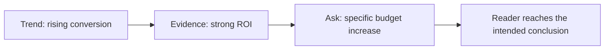

# Tableau: Dashboards That Support Decisions
> Pre-Read — Academic Session 23 | Module 3: Tableau Dashboards + Storytelling
---

## Mental Map
> 📄 Also provided as a printable PDF in this folder: **mental-map - Dashboards That Support Decisions.pdf**

```mermaid
%%{init: {'themeVariables': {'fontSize': '16px'}, 'flowchart': {'useMaxWidth': false, 'htmlLabels': true, 'nodeSpacing': 80, 'rankSpacing': 120, 'wrappingWidth': 620, 'padding': 20}}}%%
flowchart LR

START["<b>Course Start</b>"]

subgraph foundation[" WHERE WE ARE "]
direction LR
    CURMOD["<b>CURRENT MODULE</b><br/><i>Module 3: Tableau Dashboards + Storytelling</i><br/>&nbsp;<br/><b>Covered so far:</b> Tableau Basics and First Charts · Statistics: Probability and Uncertainty · Choosing the Right Chart · Building a Dashboard · KPIs and Trends on One View · Dashboard Design Basics<br/>This is Session 23 of 41"]
    CURSES["<b>CURRENT SESSION</b><br/><b>Dashboards That Support Decisions</b><br/>&nbsp;<br/><i>The shift:</i> from <i>a dashboard that is clean and readable</i> to <b>a dashboard built specifically to help someone decide something</b><br/>&nbsp;<br/>Improving for decision-making · Highlighting key insights<br/>Aligning visuals to a story · Reviewing for usefulness"]
end

subgraph outcome[" OUTCOME OF THIS SESSION "]
direction LR
    OUT["<b>By the end, you can…</b><br/>&nbsp;<br/>Review and adjust a Kirana365 dashboard so it makes one<br/>clear decision — like approving a marketing budget —<br/>obvious, instead of just displaying data"]
end

subgraph value[" WHY IT MATTERS "]
direction LR
    CVAL["<b>Course Value</b><br/>This decision-first mindset is exactly what the next two sessions build on — reading dashboards for insight, and writing that insight up for others"]
    RVAL["<b>Real-Life Value</b><br/>A founder approving a real budget change in the meeting, because the dashboard made the case obvious, instead of asking for 'the numbers' offline"]
end

subgraph future[" WHAT COMES NEXT "]
direction LR
    U0["<b>Next Session</b><br/>Reading Dashboards for Insight<br/><i>Now we practice being the reader — pulling a real insight out of someone else's dashboard</i>"]
    U1["<b>Later in Module 3</b><br/>Insight Writing with GenAI"]
    U2["<b>Upcoming Modules</b><br/>Module 4: GenAI for Analytics Workflows + Basic Python<br/><i>Decision-focused thinking here carries straight into end-to-end workflow storytelling later</i>"]
end

START ==>|" begin "| CURMOD
CURMOD ==>|" progress "| CURSES
CURSES ==>|" you get "| OUT
OUT ==>|" course "| CVAL
OUT ==>|" real life "| RVAL
CURSES ==>|" next up "| U0
U0 -.->|" then "| U1
U1 -.->|" ahead "| U2

classDef startBox fill:#F7FAFC,stroke:#4A5568,stroke-width:2px,color:#1A202C
classDef curModBox fill:#FFF8E6,stroke:#B7791F,stroke-width:2px,color:#1A202C
classDef curSessBox fill:#E6FFFA,stroke:#0D9488,stroke-width:3px,color:#1A202C
classDef outBox fill:#FEF2F2,stroke:#DC2626,stroke-width:3px,color:#1A202C
classDef valueBox fill:#F3E8FF,stroke:#7C3AED,stroke-width:2px,color:#1A202C
classDef futureBox fill:#ECFDF5,stroke:#047857,stroke-width:2px,color:#1A202C

class START startBox
class CURMOD curModBox
class CURSES curSessBox
class OUT outBox
class CVAL,RVAL valueBox
class U0,U1,U2 futureBox

linkStyle default stroke-width:2px
```

## What You'll Learn
In this pre-read, you'll discover:
- The difference between a dashboard that "displays data" and one that supports an actual decision
- How to highlight the one insight that matters most, instead of showing everything equally
- How to align a dashboard's visuals into a clear story that leads a reader toward a conclusion
- A simple review checklist to test whether a dashboard is genuinely decision-ready

## A. Displaying Data vs Supporting a Decision

**💡 Analogy**: Think of the difference between a shop's full inventory list and a shopkeeper pointing at exactly the three items running low before Diwali. Both are "true" and "complete," but only one actually helps you decide what to restock right now.

**A dashboard that supports a decision is built around one specific choice someone needs to make — not around showing every available metric equally.**

**Worked example**: Kirana365's marketing team wants approval to increase the Bengaluru ad budget by ₹50,000. A dashboard that "displays data" would show revenue, orders, churn, delivery times, and ratings all equally. A dashboard that "supports the decision" would show exactly the evidence relevant to that one choice: Bengaluru's conversion rate trend, its ad spend-to-revenue ratio, and a projection of expected return — everything else removed or moved elsewhere.

**⚠️ Common trap**: Believing a "complete" dashboard (one showing every metric available) is automatically more useful. For decision support, completeness often works against you — it forces the decision-maker to do the filtering themselves, which is exactly the job the dashboard should have done for them.

## B. Highlighting the Key Insight Visually

**💡 Analogy**: A newspaper headline doesn't bury the main story in paragraph six — it's the biggest, boldest text on the page, on purpose.

**The single most important insight on a decision-focused dashboard should be the most visually prominent element, not one number among many equal ones.**

**Worked example**: On the Bengaluru budget-approval dashboard, the key insight — "Every ₹1 spent on Bengaluru ads has historically returned ₹4.20 in revenue" — is shown as the largest element on the page, in bold, with supporting charts arranged smaller around it. A reader who only has ten seconds still walks away with the one fact that matters most.

**⚠️ Common trap**: Giving every chart equal visual size and weight "to be fair" or "so nothing looks favoured." A decision-support dashboard isn't a neutral museum exhibit — it exists to make one specific point clearly, and visual hierarchy is how you do that honestly, not manipulatively, as long as the underlying numbers are accurate.

## C. Aligning Visuals to Tell a Clear Story

**A decision-focused dashboard should read like a short argument, not a random collection of charts — each visual should build toward the same conclusion.**

**Worked example**: The Bengaluru budget dashboard is arranged as a three-step story:
1. **The trend** (line chart): conversion rate has been climbing for 3 months
2. **The evidence** (KPI + comparison): ₹4.20 return per ₹1 spent, well above the company average of ₹2.80
3. **The ask** (a simple projection): "at current trend, a ₹50,000 increase is projected to return ₹2,10,000 in additional revenue over the next quarter"

Each chart hands off to the next, building toward the same recommendation — approve the increase.

**⚠️ Common trap**: Including a genuinely interesting but tangential chart (like customer satisfaction scores) that doesn't build toward the specific decision at hand. Interesting is not the same as relevant to this exact story.

## D. Reviewing a Dashboard for Decision-Readiness

**Before presenting a dashboard meant to support a decision, run it through a short review checklist rather than assuming it's ready because it looks clean.**

| Review question | What it catches |
|---|---|
| Does this dashboard exist to support one specific, nameable decision? | Vague or overly broad dashboards that don't actually push toward any conclusion |
| Is the single most important insight the most visually prominent element? | Key facts buried among equally-weighted charts |
| Does every chart build toward the same conclusion? | Interesting-but-irrelevant charts that dilute the argument |
| Could someone unfamiliar with the topic state the recommended decision after 15 seconds? | Dashboards that are readable but don't actually lead anywhere |

**Worked example**: Running the Bengaluru dashboard through this checklist confirms: yes, it supports one decision (budget increase); yes, the ROI figure is the most prominent element; yes, all three charts build toward the same conclusion; and yes, a colleague unfamiliar with the campaign correctly guessed "increase the budget" after a 15-second glance.

**⚠️ Common trap**: Skipping this review because the dashboard is already clean and well-designed (from last session's principles). Clean design and decision-readiness are related but different — a dashboard can be visually excellent and still fail to lead anyone toward a clear decision.

## Quick Reference — Building for a Decision

| Your situation | Use this | Because |
|---|---|---|
| You're building a dashboard to support one specific choice | Include only evidence relevant to that choice | Extra "complete" data forces the reader to do your filtering job |
| You have one insight that matters most | Make it the largest, most visually prominent element | A decision dashboard needs a clear headline, not equal-weight facts |
| You have several charts that don't obviously connect | Reorder or trim them into a trend → evidence → ask structure | Charts should build toward one conclusion, not sit side by side randomly |
| You're not sure if a dashboard is decision-ready | Run the four-question review checklist | Clean design doesn't automatically mean decision-ready |

## Practice Exercises

1. **Pattern Recognition**: A dashboard meant to support a "should we discontinue this product category" decision instead shows 12 equally-sized charts covering every metric about the category. What's the likely consequence for the decision-maker?

2. **Concept Detective**: A colleague's dashboard includes a chart on customer satisfaction scores, which is genuinely interesting but isn't about the specific decision (a delivery-partner contract renewal) the dashboard is meant to support. What should happen to that chart?

3. **Real-Life Application**: Pick a real Kirana365 decision (e.g., "should we open a fifth city?") and describe, in one sentence each, what the trend, evidence, and ask charts might show.

4. **Spot the Error**: A dashboard gives five charts identical size and visual weight, even though one of them contains the single most important fact for the decision at hand. What review-checklist question would catch this?

5. **Planning Ahead**: Next session focuses on reading someone else's dashboard for insight. Based on today's "trend → evidence → ask" structure, what do you think you should look for first when trying to figure out what decision a dashboard you didn't build is trying to support?

> ✅ **You're done!** You can now tell the difference between a dashboard that merely displays data and one that supports a real decision, highlight the one insight that matters most, and run a quick review to check if a dashboard is genuinely decision-ready.
Next session, we switch roles — **Reading Dashboards for Insight** — practicing how to walk into someone else's dashboard and pull out the real story it's trying to tell.
