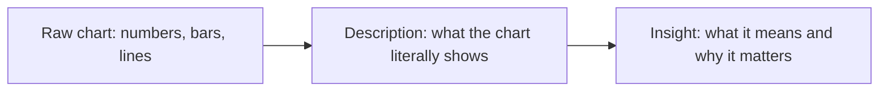

# Tableau: Reading Dashboards for Insight
> Pre-Read — Academic Session 24 | Module 3: Tableau Dashboards + Storytelling
---

## Mental Map
> 📄 Also provided as a printable PDF in this folder: **mental-map - Reading Dashboards for Insight.pdf**

```mermaid
%%{init: {'themeVariables': {'fontSize': '16px'}, 'flowchart': {'useMaxWidth': false, 'htmlLabels': true, 'nodeSpacing': 80, 'rankSpacing': 120, 'wrappingWidth': 620, 'padding': 20}}}%%
flowchart LR

START["<b>Course Start</b>"]

subgraph foundation[" WHERE WE ARE "]
direction LR
    CURMOD["<b>CURRENT MODULE</b><br/><i>Module 3: Tableau Dashboards + Storytelling</i><br/>&nbsp;<br/><b>Covered so far:</b> Tableau Basics and First Charts · Statistics: Probability and Uncertainty · Choosing the Right Chart · Building a Dashboard · KPIs and Trends on One View · Dashboard Design Basics · Dashboards That Support Decisions<br/>This is Session 24 of 41"]
    CURSES["<b>CURRENT SESSION</b><br/><b>Reading Dashboards for Insight</b><br/>&nbsp;<br/><i>The shift:</i> from <i>building dashboards for others to read</i> to <b>reading someone else's dashboard and pulling out the real insight it's arguing for</b><br/>&nbsp;<br/>Reading dashboard outputs · Spotting trends &amp; patterns<br/>Converting charts into insight statements"]
end

subgraph outcome[" OUTCOME OF THIS SESSION "]
direction LR
    OUT["<b>By the end, you can…</b><br/>&nbsp;<br/>Open an unfamiliar Kirana365-style dashboard you didn't<br/>build, correctly spot the trends and patterns in it, and<br/>write the one-sentence insight it's actually arguing for"]
end

subgraph value[" WHY IT MATTERS "]
direction LR
    CVAL["<b>Course Value</b><br/>This exact reading skill is what you'll hand to GenAI to draft into a full written insight next session"]
    RVAL["<b>Real-Life Value</b><br/>Correctly summarizing a colleague's dashboard from another city without needing a call to explain it to you"]
end

subgraph future[" WHAT COMES NEXT "]
direction LR
    U0["<b>Next Session</b><br/>Insight Writing with GenAI<br/><i>Now we turn the insight you just learned to spot into a clearly written narrative</i>"]
    U1["<b>Later in Module 3</b><br/>Module 3 Evaluation"]
    U2["<b>Upcoming Modules</b><br/>Module 4: GenAI for Analytics Workflows + Basic Python<br/><i>Reading patterns in a chart is the same instinct you'll apply to distributions and correlations there</i>"]
end

START ==>|" begin "| CURMOD
CURMOD ==>|" progress "| CURSES
CURSES ==>|" you get "| OUT
OUT ==>|" course "| CVAL
OUT ==>|" real life "| RVAL
CURSES ==>|" next up "| U0
U0 -.->|" then "| U1
U1 -.->|" ahead "| U2

classDef startBox fill:#F7FAFC,stroke:#4A5568,stroke-width:2px,color:#1A202C
classDef curModBox fill:#FFF8E6,stroke:#B7791F,stroke-width:2px,color:#1A202C
classDef curSessBox fill:#E6FFFA,stroke:#0D9488,stroke-width:3px,color:#1A202C
classDef outBox fill:#FEF2F2,stroke:#DC2626,stroke-width:3px,color:#1A202C
classDef valueBox fill:#F3E8FF,stroke:#7C3AED,stroke-width:2px,color:#1A202C
classDef futureBox fill:#ECFDF5,stroke:#047857,stroke-width:2px,color:#1A202C

class START startBox
class CURMOD curModBox
class CURSES curSessBox
class OUT outBox
class CVAL,RVAL valueBox
class U0,U1,U2 futureBox

linkStyle default stroke-width:2px
```

## What You'll Learn
In this pre-read, you'll discover:
- A simple three-step routine for reading any unfamiliar dashboard: orient, scan, question
- How to tell the difference between a real trend/pattern and random noise on a chart
- How to convert what you see visually into a clear, one-sentence written insight
- Common misreadings that trip up even experienced analysts, and how to avoid them

## A. Orient, Scan, Question — A Routine for Any Dashboard

**💡 Analogy**: Walking into an unfamiliar dashboard without a routine is like walking into someone else's kitchen and trying to cook — you'll find things eventually, but a quick look around first (where's the stove, what ingredients are out) saves real time and mistakes.

**Before drawing any conclusion, run a fixed three-step routine on any dashboard you didn't build yourself.**

| Step | What you're doing |
|---|---|
| **1. Orient** | What is this dashboard about? What's the title, what business area, what time period? |
| **2. Scan** | What's the biggest, most prominent element? That's usually the headline the builder wants you to notice first |
| **3. Question** | What decision or insight is this dashboard trying to lead me toward? |

**Worked example**: You're handed a Kirana365 dashboard titled "Chennai Store Performance — August 2026" with a large KPI showing "-3% Revenue vs Last Month" at the top. Orient: this is about Chennai, last month. Scan: the -3% KPI is clearly the headline. Question: this dashboard is almost certainly arguing that something needs attention in Chennai.

**⚠️ Common trap**: Jumping straight into reading individual numbers before orienting to what the dashboard is even about. Analysts who skip step 1 often misinterpret a chart's context — reading "orders: 620" without knowing if that's a daily, weekly, or monthly figure leads to wrong conclusions.

## B. Real Trend or Random Noise?

**💡 Analogy**: One hot day in October doesn't mean summer is starting over — a single data point wobbling up or down is weather, not climate. A trend needs to repeat across enough points to be trusted.

**A genuine trend shows a consistent direction across several data points; a single unusual point is more likely noise than a signal.**

**Worked example**: Chennai's daily revenue chart shows a sharp one-day dip on a Tuesday, but the surrounding six days all sit at a normal, stable level. That single dip is likely noise — maybe a delivery disruption that day — not a declining trend. But if the last 10 days all trend consistently downward, that's a real pattern worth flagging.

**⚠️ Common trap**: Reacting to the most recent single data point as if it defines the whole trend. The most recent point is real, but on its own it's not evidence of direction — always look at the shape across several points before calling something a trend.

## C. Converting Charts into Insight Statements

**An insight is not a description of what a chart shows — it's a specific, useful statement about what that means for the business.**

| Chart description (not yet an insight) | Insight (business meaning) |
|---|---|
| "Chennai's revenue is down 3% this month" | "Chennai is the only city declining while all others grow — its Groceries category specifically dropped, suggesting a local, fixable issue rather than a company-wide trend" |
| "The scatter plot shows a cluster of high-quantity orders" | "A small group of bulk-ordering customers is driving a disproportionate share of revenue — worth a dedicated retention offer" |
| "Conversion rate rose from 28% to 31% over 3 months" | "Bengaluru's conversion improvement lines up with the new banner campaign launch, suggesting the campaign is working and worth extending" |

**Worked example**: Looking at Kirana365's Bengaluru dashboard, the description "conversion rate went from 28% to 31%" is just a fact restated. The insight is: "Bengaluru's conversion rate climbed 3 points right after the banner campaign launched, which is strong early evidence the campaign is working."

**⚠️ Common trap**: Stopping at description ("the number went up") and calling that an insight. A useful insight always answers "so what?" — what should someone do or believe differently because of this fact?

## D. Common Misreadings to Watch For

**Even careful analysts fall into a few repeatable traps when reading dashboards quickly — knowing them in advance helps you catch yourself.**

- **Confusing correlation with cause**: Seeing conversion rise alongside a campaign launch doesn't automatically prove the campaign caused it — other factors (a festival, a competitor's price hike) could explain the same pattern.
- **Anchoring on the biggest number, not the most important one**: A huge total revenue figure can distract from a smaller but more urgent problem, like one declining segment.
- **Misreading axis scale**: A dramatic-looking spike can be an illusion if the y-axis doesn't start at zero — always check the axis before trusting the visual impression.

**Worked example**: A Kirana365 chart with a y-axis starting at ₹2,00,000 instead of ₹0 makes a modest 5% revenue increase look like a dramatic spike. Checking the axis reveals the "dramatic" change is actually fairly small in real terms.

**⚠️ Common trap**: Trusting your first visual impression of a chart's shape without checking the underlying axis scale and values — charts can accidentally (or deliberately) exaggerate or minimize real differences.

## Quick Reference — Reading a Dashboard Well

| Your situation | Use this | Because |
|---|---|---|
| You've just opened an unfamiliar dashboard | Orient → Scan → Question, in that order | Context first prevents misreading individual numbers |
| A chart shows one unusual data point | Check whether it's part of a consistent pattern across several points | A single point is more often noise than a real trend |
| You've described what a chart shows but aren't sure it's an insight yet | Ask "so what should someone do or believe differently?" | A description restates data; an insight explains its meaning |
| A chart's change looks dramatic at first glance | Check the axis scale before trusting the visual impression | Truncated axes can make small changes look large |

## Practice Exercises

1. **Pattern Recognition**: You open a Kirana365 dashboard and see one delivery partner's on-time rate dropped sharply for a single day, then returned to normal. Is this most likely a trend or noise, and how would you confirm which?

2. **Concept Detective**: A dashboard states "orders: 4,200" with no further context. What's missing before you can turn that number into any kind of insight?

3. **Real-Life Application**: Take any chart shape you've seen in a real app or news site recently and describe, in one sentence, the difference between what it literally shows and what insight you'd draw from it.

4. **Spot the Error**: A colleague says, "revenue jumped right after we changed our app icon, so the new icon caused the jump." What reasoning trap does this statement fall into?

5. **Planning Ahead**: Next session, you'll use GenAI to help write up insights like the ones you're learning to spot today. Based on today's "description vs insight" distinction, what do you think you'd need to give GenAI so it doesn't just restate the chart back to you as a description?

> ✅ **You're done!** You can now walk into an unfamiliar dashboard, orient yourself before reading numbers, tell a real trend from noise, and convert a chart into a genuine, useful insight instead of a restated description.
Next session, we take that same insight-spotting skill into **Insight Writing with GenAI**, using AI to help turn what you've noticed into a clear, well-written narrative someone else can act on.
