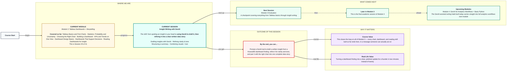

# Mental Map — Insight Writing with GenAI
> Academic Session 25 · Module 3: Tableau Dashboards + Storytelling

```mermaid
%%{init: {'themeVariables': {'fontSize': '16px'}, 'flowchart': {'useMaxWidth': false, 'htmlLabels': true, 'nodeSpacing': 80, 'rankSpacing': 120, 'wrappingWidth': 620, 'padding': 20}}}%%
flowchart LR

START["<b>Course Start</b>"]

subgraph foundation[" WHERE WE ARE "]
direction TB
    CURMOD["<b>CURRENT MODULE</b><br/><i>Module 3: Tableau Dashboards + Storytelling</i><br/>&nbsp;<br/><b>Covered so far:</b> Tableau Basics and First Charts · Statistics: Probability and Uncertainty · Choosing the Right Chart · Building a Dashboard · KPIs and Trends on One View · Dashboard Design Basics · Dashboards That Support Decisions · Reading Dashboards for Insight<br/>This is Session 25 of 41"]
    CURSES["<b>CURRENT SESSION</b><br/><b>Insight Writing with GenAI</b><br/>&nbsp;<br/><i>The shift:</i> from <i>spotting an insight in your head</i> to <b>using GenAI to draft it, then refining it into a clear written data story</b><br/>&nbsp;<br/>Drafting insights with GenAI · Refining clarity &amp; tone<br/>Structuring a summary · Combining visuals + text"]
end

subgraph outcome[" OUTCOME OF THIS SESSION "]
direction TB
    OUT["<b>By the end, you can…</b><br/>&nbsp;<br/>Prompt a GenAI tool to draft a written insight from a<br/>Kirana365 dashboard finding, refine it for clarity and tone,<br/>and pair it with the right chart into one complete data story"]
end

subgraph value[" WHY IT MATTERS "]
direction TB
    CVAL["<b>Course Value</b><br/>This closes the loop on all of Module 3 — every chart, dashboard, and reading skill built so far ends here, in a message someone can actually act on"]
    RVAL["<b>Real-Life Value</b><br/>Turning a dashboard finding into a clear, polished update for a founder in two minutes instead of twenty"]
end

subgraph future[" WHAT COMES NEXT "]
direction TB
    U0["<b>Next Session</b><br/>Module 3 Evaluation<br/><i>A checkpoint covering everything from Tableau basics through insight writing</i>"]
    U1["<b>Later in Module 3</b><br/>This is the final academic session of Module 3"]
    U2["<b>Upcoming Modules</b><br/>Module 4: GenAI for Analytics Workflows + Basic Python<br/><i>The GenAI-assisted writing habit built today carries straight into full analytics workflows next module</i>"]
end

START ==>|" begin "| CURMOD
CURMOD ==>|" progress "| CURSES
CURSES ==>|" you get "| OUT
OUT ==>|" course "| CVAL
OUT ==>|" real life "| RVAL
CURSES ==>|" next up "| U0
U0 -.->|" then "| U1
U1 -.->|" ahead "| U2

classDef startBox fill:#F7FAFC,stroke:#4A5568,stroke-width:2px,color:#1A202C
classDef curModBox fill:#FFF8E6,stroke:#B7791F,stroke-width:2px,color:#1A202C
classDef curSessBox fill:#E6FFFA,stroke:#0D9488,stroke-width:3px,color:#1A202C
classDef outBox fill:#FEF2F2,stroke:#DC2626,stroke-width:3px,color:#1A202C
classDef valueBox fill:#F3E8FF,stroke:#7C3AED,stroke-width:2px,color:#1A202C
classDef futureBox fill:#ECFDF5,stroke:#047857,stroke-width:2px,color:#1A202C

class START startBox
class CURMOD curModBox
class CURSES curSessBox
class OUT outBox
class CVAL,RVAL valueBox
class U0,U1,U2 futureBox

linkStyle default stroke-width:2px
```
