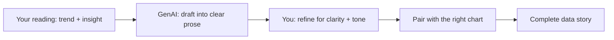

# Tableau + GenAI: Insight Writing with GenAI
> Pre-Read — Academic Session 25 | Module 3: Tableau Dashboards + Storytelling
---

## Mental Map
> 📄 Also provided as a printable PDF in this folder: **mental-map - Insight Writing with GenAI.pdf**

```mermaid
%%{init: {'themeVariables': {'fontSize': '16px'}, 'flowchart': {'useMaxWidth': false, 'htmlLabels': true, 'nodeSpacing': 80, 'rankSpacing': 120, 'wrappingWidth': 620, 'padding': 20}}}%%
flowchart LR

START["<b>Course Start</b>"]

subgraph foundation[" WHERE WE ARE "]
direction LR
    CURMOD["<b>CURRENT MODULE</b><br/><i>Module 3: Tableau Dashboards + Storytelling</i><br/>&nbsp;<br/><b>Covered so far:</b> Tableau Basics and First Charts · Statistics: Probability and Uncertainty · Choosing the Right Chart · Building a Dashboard · KPIs and Trends on One View · Dashboard Design Basics · Dashboards That Support Decisions · Reading Dashboards for Insight<br/>This is Session 25 of 41"]
    CURSES["<b>CURRENT SESSION</b><br/><b>Insight Writing with GenAI</b><br/>&nbsp;<br/><i>The shift:</i> from <i>spotting an insight in your head</i> to <b>using GenAI to draft it, then refining it into a clear written data story</b><br/>&nbsp;<br/>Drafting insights with GenAI · Refining clarity &amp; tone<br/>Structuring a summary · Combining visuals + text"]
end

subgraph outcome[" OUTCOME OF THIS SESSION "]
direction LR
    OUT["<b>By the end, you can…</b><br/>&nbsp;<br/>Prompt a GenAI tool to draft a written insight from a<br/>Kirana365 dashboard finding, refine it for clarity and tone,<br/>and pair it with the right chart into one complete data story"]
end

subgraph value[" WHY IT MATTERS "]
direction LR
    CVAL["<b>Course Value</b><br/>This closes the loop on all of Module 3 — every chart, dashboard, and reading skill built so far ends here, in a message someone can actually act on"]
    RVAL["<b>Real-Life Value</b><br/>Turning a dashboard finding into a clear, polished update for a founder in two minutes instead of twenty"]
end

subgraph future[" WHAT COMES NEXT "]
direction LR
    U0["<b>Next Session</b><br/>Module 3 Evaluation<br/><i>A checkpoint covering everything from Tableau basics through insight writing</i>"]
    U1["<b>Later in Module 3</b><br/>This is the final academic session of Module 3"]
    U2["<b>Upcoming Modules</b><br/>Module 4: GenAI for Analytics Workflows + Basic Python<br/><i>The GenAI-assisted writing habit built today carries straight into full analytics workflows next module</i>"]
end

START ==>|" begin "| CURMOD
CURMOD ==>|" progress "| CURSES
CURSES ==>|" you get "| OUT
OUT ==>|" course "| CVAL
OUT ==>|" real life "| RVAL
CURSES ==>|" next up "| U0
U0 -.->|" then "| U1
U1 -.->|" ahead "| U2

classDef startBox fill:#F7FAFC,stroke:#4A5568,stroke-width:2px,color:#1A202C
classDef curModBox fill:#FFF8E6,stroke:#B7791F,stroke-width:2px,color:#1A202C
classDef curSessBox fill:#E6FFFA,stroke:#0D9488,stroke-width:3px,color:#1A202C
classDef outBox fill:#FEF2F2,stroke:#DC2626,stroke-width:3px,color:#1A202C
classDef valueBox fill:#F3E8FF,stroke:#7C3AED,stroke-width:2px,color:#1A202C
classDef futureBox fill:#ECFDF5,stroke:#047857,stroke-width:2px,color:#1A202C

class START startBox
class CURMOD curModBox
class CURSES curSessBox
class OUT outBox
class CVAL,RVAL valueBox
class U0,U1,U2 futureBox

linkStyle default stroke-width:2px
```

## What You'll Learn
In this pre-read, you'll discover:
- Why GenAI is a strong drafting partner for insight writing, but not a substitute for the reading skills from last session
- How to prompt GenAI so it produces an insight, not just a restated description
- How to refine a GenAI draft for clarity and the right tone for your audience
- How to structure a short written insight summary and pair it with the right chart into a complete data story

## A. GenAI as a Drafting Partner, Not a Replacement for Judgment

**💡 Analogy**: Using GenAI to write an insight is like asking a skilled assistant to type up your handwritten notes into a clean paragraph — genuinely useful, and much faster than doing it yourself from scratch. But if your handwritten notes said the wrong thing, the assistant will type up a clean, confident-sounding version of the wrong thing.

**GenAI is excellent at turning your already-correct observations into clear, well-structured prose — it is not a substitute for correctly reading the dashboard yourself first.**

**Worked example**: If you feed GenAI the raw observation "Chennai revenue -3%, all other cities positive, Groceries category specifically down," it can draft a clear paragraph fast. But if you skipped last session's reading discipline and fed it a wrong or incomplete observation, it will still produce confident, polished-sounding prose — about the wrong conclusion.

**⚠️ Common trap**: Treating GenAI output as automatically correct because it reads smoothly. Fluent writing and accurate analysis are two different things — GenAI is strong at the first, and only as good as your input at the second.

## B. Prompting GenAI for an Insight, Not a Description

**A vague prompt produces a vague, description-level draft; a specific prompt that includes your actual reading produces a genuine insight.**

| Weak prompt | Stronger prompt |
|---|---|
| "Write something about this Chennai chart." | "Chennai's revenue is down 3% this month while Bengaluru, Hyderabad, and Pune are all up. The decline is specifically in the Groceries category. Write a 3-sentence insight for our founder explaining what this likely means and what we should check next." |
| "Summarize this dashboard." | "This dashboard shows Bengaluru's conversion rate rising from 28% to 31% over the 3 months since we launched a new banner campaign. Write a short insight connecting the timing to the campaign, and note this is a correlation, not proven causation." |

**Worked example**: The weak prompt "write something about this Chennai chart" might return a generic paragraph restating the -3% figure. The stronger prompt — which includes your own already-correct reading from last session — returns something close to: "Chennai is the only city showing a revenue decline this month, driven specifically by its Groceries category, while every other city grew. This localized pattern suggests a Chennai-specific issue rather than a broader trend, and warrants investigating recent changes to Groceries pricing, stock availability, or delivery partners in that city."

**⚠️ Common trap**: Handing GenAI just the chart or just the raw numbers and expecting it to independently notice the same pattern you spotted through careful reading. Always include your own reading — the trend you confirmed, the comparison you made — directly in the prompt.

## C. Refining for Clarity and Tone

**A GenAI draft is a starting point, not a finished product — refining it for your specific audience is still your job.**

**Worked example**: The same Chennai insight needs different tone for different audiences:
- **For the founder** (needs the headline fast): "Chennai is declining 3% this month, driven by Groceries specifically — the only city with this issue. Recommend investigating pricing and stock in Chennai's Groceries category this week."
- **For the Chennai store team** (needs to feel collaborative, not accusatory): "We've noticed Chennai's Groceries revenue has softened this month while other categories held steady — would love to loop in on what you're seeing locally so we can dig into it together."

Same underlying insight, two very different tones — GenAI can draft both, but choosing which tone fits which reader is your judgment call.

**⚠️ Common trap**: Sending the founder-facing, blunt version to the Chennai store team, or vice versa. A technically accurate insight can still land badly if the tone doesn't match who's reading it.

## D. Structuring a Complete Data Story — Chart + Text Together

**A complete data story pairs the right chart (from Session 19's chart-choice skill) with a written insight (today's skill) so a reader gets both the visual proof and the plain-language meaning in one place.**

**Worked example**: A complete Kirana365 insight package for the founder combines:
1. **The chart**: a small bar chart showing all four cities' revenue change, Chennai clearly the outlier in red
2. **The insight text**: the 2-3 sentence written insight explaining what the chart shows and what to do next
3. **A clear next step**: "Recommend: pull Chennai's Groceries pricing and stock data for the last 30 days before Friday's ops review."

This mirrors the trend → evidence → ask structure from Session 23, now finished with actual written words instead of relying on the chart alone to make the case.

**⚠️ Common trap**: Sending a chart with no text ("here's the dashboard, let me know what you think") or text with no chart ("Chennai is down 3%" with nothing to visually back it up). The strongest data stories always pair both — visual proof and plain-language meaning.

## Quick Reference — Writing Insights with GenAI

| Your situation | Use this | Because |
|---|---|---|
| You want GenAI to draft an insight, not a description | Include your own confirmed reading (trend, comparison, numbers) directly in the prompt | Vague prompts produce vague, description-level drafts |
| A GenAI draft reads smoothly but you haven't verified the underlying reading | Double-check the observation yourself before trusting the draft | Fluent writing doesn't guarantee accurate analysis |
| The same insight needs to go to two different audiences | Ask GenAI for two tone variants, then pick or blend | Founders and frontline teams often need different tone for the same fact |
| You're about to send an insight without a supporting chart, or a chart without text | Pair both together before sending | The strongest data stories combine visual proof and written meaning |

## Practice Exercises

1. **Pattern Recognition**: A classmate feeds GenAI only the words "write about Kirana365 revenue" with no specific numbers or reading included. What kind of output would you expect, and why?

2. **Concept Detective**: A GenAI draft reads confidently: "Chennai's decline was caused by the recent price increase." What should you check before trusting this sentence, based on today's and last session's lessons?

3. **Real-Life Application**: Write one short prompt (in your own words) that includes a specific reading you might make from a Kirana365 dashboard, aimed at getting GenAI to draft a genuine insight rather than a description.

4. **Spot the Error**: A teammate sends the founder-facing blunt version of an insight directly to the Chennai store team with no tone adjustment. What might go wrong, and why?

5. **Planning Ahead**: This is the final session of Module 3. Looking back across bar charts, dashboards, KPIs, design, decision-support, reading, and now insight writing — which single skill from this module do you think you'll use the most often once you're working with real data day to day?

> ✅ **You're done!** You can now prompt GenAI with your own confirmed reading to draft a genuine insight, refine that draft for clarity and the right audience's tone, and pair it with the right chart into a complete data story someone can act on.
That completes Module 3. Next up is the **Module 3 Evaluation**, checking everything from your first Tableau chart through today's GenAI-assisted insight writing — after that, Module 4 begins with GenAI for Analytics Workflows and your first steps into Python.
