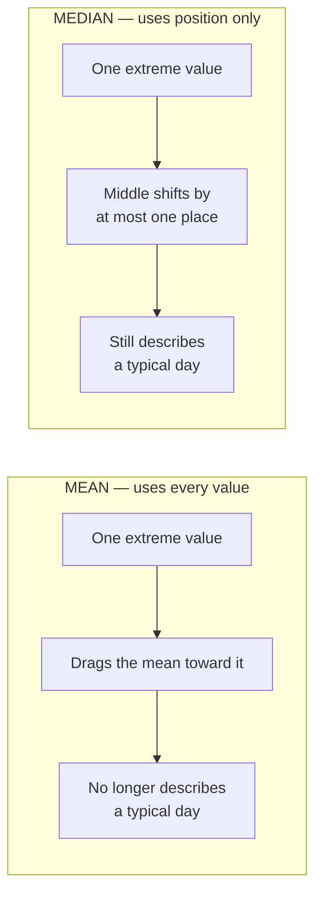

# Lecture Script: Statistics — Understanding Data and Averages
> **Instructor Reference** — Module 1: Analytics Foundations + GenAI + Spreadsheets | Academic Session 1 | Duration: 1.5 Hours | Instructor: Professor

---

## Session Overview

**Goal:** Students can classify any column as numerical or categorical, compute mean/median/mode/range by hand, and — most importantly — **defend which summary number is honest** for a given business situation.

**Student profile at this point:** Day one of the course. Assume **zero** prior statistics, zero coding, zero tools. Many will have last seen "mean, median, mode" in school and will be tempted to switch off. **Your job is to make them realise they know the arithmetic but not the judgement.**

**Key outcome:** Students leave able to look at a report that says *"average spend is ₹4,200"* and ask the right follow-up question: *"…and what's the median?"*

> 🎯 **The one sentence this session must land:** *The average is a choice, not a fact — and choosing wrong is how honest data tells a dishonest story.*

---

## Timing Breakdown

| Segment | Duration | Cumulative |
|---|---|---|
| Opening & Hook — "The Café Problem" | 6 min | 0:06 |
| **Concept 1:** Numerical vs Categorical Data | 12 min | 0:18 |
| **Practical 1:** Classify the columns (whole-class) | 10 min | 0:28 |
| **Concept 2:** Mean, Median, Mode | 15 min | 0:43 |
| **Practical 2:** Compute all three, by hand | 10 min | 0:53 |
| **BREAK** | 5 min | 0:58 |
| **Concept 3:** Outliers — Why the Mean Lies | 12 min | 1:10 |
| **Practical 3:** The Salary Debate (discussion) | 8 min | 1:18 |
| **Concept 4:** Range — Level vs Risk | 6 min | 1:24 |
| Summary & Bridge to Session 2 | 3 min | 1:27 |
| Q&A & Doubt Solving | 3 min | 1:30 |

---

## Opening — "The Café Problem" (6 min)

**Do not open with a definition. Open with this.**

Write on the board:

```
Nine people are sitting in a café.
Their average net worth is ₹8 lakh.

A billionaire walks in and sits down.

The average net worth in the café is now ₹100 crore.
```

Pause. Then ask the class:

> *"Put your hand up if anyone in that café became richer."*

Nobody did. Let the silence sit for a beat.

> *"So we have a number — ₹100 crore — that is arithmetically 100% correct, and yet describes a café that does not exist. Nobody in that room is a crorepati. That number is a lie told with correct maths."*

**Now the pivot:**

> *"Every single one of you learned mean, median and mode in school. You can compute them in your sleep. So this session is NOT about the arithmetic. It is about the thing school never taught you — **which one to use, and how to defend that choice when a manager pushes back.** That judgement is the difference between an analyst and a calculator."*

**Context for the 39 sessions ahead:**

> *"For the next 39 sessions you will learn SQL, Tableau, Python and GenAI. Every one of those tools has an `average` button. Every one of them will happily compute a lie for you at scale, in a beautiful dashboard, in half a second. This session is the one that stops that from happening."*

---

## Concept Block 1: Numerical vs Categorical Data (12 min)

### Start with the shirt

> *"Look at a shirt in a shop. It has a price — ₹899. It has a colour — blue. You can average the prices of every shirt in the shop. Has anyone, in the history of retail, computed the **average colour**?"*

**The core distinction — write this on the board and leave it up all session:**

| | **Numerical** | **Categorical** |
|---|---|---|
| It is a… | quantity | label |
| It answers | *How much? How many?* | *Which kind? Which group?* |
| You can | add, average, rank | count, group |
| Examples | `sales`, `age`, `delivery_days` | `city`, `payment_method`, `status` |
| Summarise with | mean / median | mode / count |
| Chart with | line, histogram | bar, pie |

### The four sub-types (2 min — mention, don't labour)

```
NUMERICAL
  ├─ Discrete    → whole counts. "3 orders." You cannot place 3.5 orders.
  └─ Continuous  → any value on a scale. Revenue, weight, time taken.

CATEGORICAL
  ├─ Nominal     → no order. Mumbai is not "more" than Delhi.
  └─ Ordinal     → has an order, unequal gaps. Poor < Average < Good < Excellent.
```

> **Teaching point on ordinal:** *"A 4-star and a 5-star rating are one apart. A 1-star and a 2-star are also one apart. But is the gap in customer happiness the same? Absolutely not. That's why ratings are ordinal — ordered, but the gaps are not real distances. Averaging star ratings is technically dodgy and universally done anyway. Know that you're doing it."*

### 🔴 The trap — numbers that are not numerical

**This is the highest-value 3 minutes in the block. Slow down here.**

Write these on the board:

```
pin_code:      560001
customer_id:   10023
phone_number:  9876543210
year:          2024
```

> *"Every one of these is stored as a number. Excel will happily average them. Pandas will happily average them. SQL's `AVG()` will happily average them. And every single answer will be garbage."*

**Give them the test — one line, make them write it down:**

> ### **If adding two values together is nonsense, the column is categorical.**
>
> *Pin code 560001 + pin code 400001 = 960002. Is that a place? No. It's categorical.*

---

## Practical Block 1: Classify the Columns (10 min)

**Format:** Put this table on screen. Give them 4 minutes in pairs, then take answers from the room — do **not** just reveal them.

```
An e-commerce orders table:

order_id | customer_city | order_value | star_rating | payment_method | delivery_days | pin_code
---------|---------------|-------------|-------------|----------------|---------------|----------
   1001  | Chennai       |    2,499    |      4      |      UPI       |       3       |  600001
   1002  | Coimbatore    |      899    |      5      |     Card       |       5       |  641001
   1003  | Chennai       |   12,000    |      3      |      COD       |       2       |  600042
   1004  | Madurai       |      450    |      5      |      UPI       |       7       |  625001
```

**Answer key — with the reasoning you must voice out loud:**

| Column | Type | The reasoning to say aloud |
|---|---|---|
| `order_id` | **Categorical** 🔴 | *"It's a name that happens to look like a number. Order 1001 + order 1002 ≠ order 2003."* |
| `customer_city` | Categorical (nominal) | Obvious — good, they need one easy win |
| `order_value` | **Numerical** (continuous) | Adding is meaningful → revenue |
| `star_rating` | Categorical (**ordinal**) | *"Ordered — but is 5 stars 'five times' 1 star? No."* Note we still average it in practice |
| `payment_method` | Categorical (nominal) | Obvious |
| `delivery_days` | **Numerical** (discrete) | Whole days; averaging is meaningful and useful |
| `pin_code` | **Categorical** 🔴 | *"The average of two pin codes is not a place."* |

> 💬 **Expect an argument about `star_rating`.** Welcome it. Say: *"You're both right. Strictly it's ordinal. Practically, every company on earth reports 'average rating: 4.2'. The professional move is to know that you are bending a rule, and to also report the **mode** — 'most customers gave us 5 stars' — because that is the statistically clean statement."*

> 💬 **Expect at least one student to call `order_id` numerical.** Do not correct them fast. Ask: *"What would `AVG(order_id)` mean?"* Let them arrive at it themselves. That moment is the lesson.

---

## Concept Block 2: Mean, Median, Mode (15 min)

### The running dataset — put it on the board and keep it there

```
Daily sales at a store, Monday to Friday (₹ thousands):

     Mon   Tue   Wed   Thu   Fri
      12    15    11    14    13
```

### 1️⃣ Mean — the "fair share" (4 min)

> *"Four friends, ₹1,200 pizza bill, split equally = ₹300 each. That ₹300 is the mean. It is the amount everyone would have if we **redistributed everything perfectly evenly**."*

```
Mean = Sum of all values / Number of values
     = (12 + 15 + 11 + 14 + 13) / 5
     = 65 / 5
     = 13
```

> *"₹13k on a typical day. That's genuinely useful — multiply by 30 and you have a monthly forecast."*

**Say this, because it sets up Concept 3:**

> *"The mean uses **every single value**. Change any one number and the mean moves. Hold onto that — it is both its superpower and its fatal flaw."*

### 2️⃣ Median — the "middle person" (5 min)

> *"Line the whole class up by height. Walk to the middle person. Their height is the median. Now — if the tallest person in the room suddenly grew two feet taller, does the middle person move? No. They don't budge."*

**The rule — and the one mistake everyone makes:**

```
STEP 1: SORT the values. (Everyone forgets this. Everyone.)
STEP 2: Odd count  → take the middle value
        Even count → average the two middle values

Our data sorted:  11, 12, 13, 14, 15
                          ▲
                    3rd of 5 = 13

Median = 13
```

> ⚠️ **Instructor:** Deliberately compute a median *without* sorting first, get the wrong answer, and let someone catch you. If nobody catches it, point it out. This one mistake will cost them marks and credibility forever.

**Even-count example — do it on the board:**
```
11, 12, 14, 15  →  (12 + 14) / 2 = 13
```

### 3️⃣ Mode — the "most common" (4 min)

> *"A shoe shop owner does not care about the average shoe size. You cannot stock a size 8.4 shoe. They care about the size that walks through the door most often. That's the mode."*

```
Mode = the value that appears most often

4, 5, 5, 5, 6     →  mode = 5      (unimodal)
2, 2, 7, 7, 9     →  modes 2 and 7 (bimodal)
1, 2, 3, 4        →  no mode
```

**The point that makes mode matter — emphasise this:**

> *"Mode is the **only** summary that works on categorical data. You cannot compute the mean city. You cannot compute the median payment method. But you absolutely can say **'most of our customers are in Chennai'** — and that is a mode. Every time you say 'the most common X', you are quoting a mode."*

> 💡 **On bimodal data — throw this in if the room is sharp:** *"Two modes usually means two different populations hiding in one dataset. If exam scores are bimodal, you don't have one class — you have students who studied and students who didn't. The mode found something the mean would have buried."*

### 4️⃣ Which one do I actually use? (2 min)

| Question the business asks | Correct summary |
|---|---|
| "What's our average order value?" | **Mean** |
| "What does a typical customer spend?" (skewed) | **Median** |
| "Which city do most customers come from?" | **Mode** |
| "What's our most common star rating?" | **Mode** |

---

## Practical Block 2: Compute All Three, By Hand (10 min)

**No laptops. Pen and paper.** They will use tools for the rest of their lives — today they earn the intuition.

**Give them this:**

```
Star ratings from 9 customers:

   5, 4, 5, 3, 5, 2, 4, 5, 4

Compute:  (a) mean   (b) median   (c) mode
```

**Walk it live after 4 minutes:**

```
(a) MEAN
    Sum   = 5+4+5+3+5+2+4+5+4 = 37
    Count = 9
    Mean  = 37 / 9 = 4.11

(b) MEDIAN  — SORT FIRST!
    Sorted: 2, 3, 4, 4, 4, 5, 5, 5, 5
                        ▲
                  5th of 9
    Median = 4

(c) MODE
    Count them:  2→×1   3→×1   4→×3   5→×4
    Mode = 5
```

**Now the discussion that matters (3 min). Ask the room:**

> *"Your marketing head wants ONE number for the ad campaign. You have three: 4.11, 4, and 5. Which do you give her — and what happens if she picks the wrong one?"*

Let them fight about it. Then land it:

- **"Rated 4.11 out of 5"** — honest, uses all the data, standard practice. ✅
- **"Median rating: 4"** — also honest, and more robust if there were a pile of 1-star reviews.
- **"Most customers rate us 5 stars"** — 🔴 **True.** 4 out of 9 is the largest group. **And also the most misleading**, because 5 of the 9 customers did *not* give 5 stars.

> 🎯 **The line to close on:** *"Every one of those three sentences is factually true. Only some of them are honest. Choosing between them is your job — and no tool will ever do it for you."*

---

## BREAK (5 min)

> *"Before you go — one question to chew on. Your company's average salary is ₹18 lakh. You're offered a job there. Should you be happy? Think about it. We'll answer it in eight minutes."*

---

## Concept Block 3: Outliers — Why the Mean Lies (12 min)

**This is the heart of the session. If you're running short, cut Concept 4, never this.**

### Callback to the hook (2 min)

> *"Café. Nine people. Billionaire walks in. Average net worth: ₹100 crore. Nobody got richer."*

**Definition — one line:**

> An **outlier** is a value sitting far away from the rest of the data. It **drags the mean toward itself** and **leaves the median almost untouched.**

### The festival day — the demo that does all the work (5 min)

Go back to the store data on the board. Change one number, live:

```
BEFORE — normal week:
    12, 15, 11, 14, 13
    Mean   = 65/5  = 13.0
    Median = 13

AFTER — Friday was a Diwali sale, ₹95k:
    12, 15, 11, 14, 95
    Mean   = 147/5 = 29.4   ⬅ MORE THAN DOUBLED
    Median = 14             ⬅ barely moved
```

**Do this out loud, deliberately:**

> *"So I walk into my manager's office and say: 'Sir, we do ₹29,400 on an average day.' Am I lying?"*

Wait for "no."

> *"I am not lying. That is exactly what the mean is. Now look at the actual week — 12, 15, 11, 14. **Four days out of five were nowhere near ₹29k.** I have given him a number that is arithmetically perfect and operationally useless. If he staffs the shop for a ₹29k day, he wastes money four days a week."*



### Where outliers come from — and what to actually do (3 min)

> *"'Outlier' does not mean 'delete it'. That is the most dangerous shortcut in analytics. First ask **where it came from**."*

| Source | Example | Right action |
|---|---|---|
| **Data error** | `age = 999` | Fix or remove — it isn't real |
| **A genuine rare event** | Diwali sale day | **Keep it.** Report the *median* as "typical", and report the festival day *separately* — it's the most interesting day you have! |
| **A different population mixed in** | One wholesale order inside retail data | Split the data. Analyse separately. |

> 🔴 **Say this explicitly:** *"Deleting outliers because they're inconvenient is not analysis — it's fraud. The Diwali spike is not noise. It might be the single most valuable fact in your dataset."*

### The decision rule (2 min) — make them write this down

> ## ⚖️ **Use the MEAN** when data is fairly even and symmetric.
> *Delivery times, exam scores, daily footfall.*
>
> ## ⚖️ **Use the MEDIAN** when data is skewed or has extremes.
> *Salary, house prices, revenue per customer, net worth.*

> *"This is why every credible report on earth says **'median household income'** and never 'mean household income'. A handful of billionaires would make the mean describe a country that doesn't exist. The people who write those reports are not being cautious — they are being honest."*

---

## Practical Block 3: The Salary Debate (8 min)

**Format:** Discussion. Put this on screen and let the room argue for 4 minutes before you say anything.

```
A startup has 42 employees.

    40 engineers  earn ₹8–15 lakh    (median ≈ ₹11 lakh)
     2 founders   earn ₹2 crore each

    MEAN salary   ≈ ₹21.4 lakh
    MEDIAN salary ≈ ₹11 lakh
```

**The three questions — put them up one at a time:**

**Q1.** *"The company's recruitment page says 'Average salary: ₹21 lakh.' Is this a lie?"*
→ **No — and that's the whole problem.** It is arithmetically true and deeply misleading. **Not a single engineer** — not one of the 40 — earns anywhere near ₹21 lakh. The number describes nobody.

**Q2.** *"You're the analyst. Which number do you publish?"*
→ **The median, ₹11 lakh.** It is what a typical person actually takes home. If you must publish the mean, publish it *next to* the median — the gap between them is itself the story.

**Q3.** *"Your CEO insists on the mean because it looks better. What do you say?"*
→ This is the real skill. Model the answer for them, out loud:
> *"Sir, we can publish ₹21 lakh — it's technically correct. But every candidate who joins will discover within a week that nobody at their level earns it, and we'll have bought a hiring number at the cost of our credibility. If I publish ₹11 lakh median, it's defensible, and it's what our competitors publish too."*

> 🎯 **Land the session's thesis here:** *"Notice what just happened. The maths took thirty seconds. The **judgement** took the whole conversation. That gap — that is your entire career as an analyst. Anyone can compute a mean. You are being paid to know when not to use it."*

**Callback to the break question:** *"'Average salary ₹18 lakh — should you be happy?' Now you know the answer: **you have no idea until you ask for the median.**"*

---

## Concept Block 4: Range — Level vs Risk (6 min)

### The cricket hook

> *"Two batsmen. Both average 40. One scores 38, 41, 39, 42. The other scores 0, 95, 5, 60. Same average. Would you pick the same one for a final?"*

**Definition:**

```
Range = Maximum − Minimum
```

**The demo — two reps, identical mean:**

| Rep | Monthly sales (₹k) | Mean | Range |
|---|---|---|---|
| **Anita** | 48, 52, 50, 49, 51 | **50** | 52 − 48 = **4** |
| **Balaji** | 10, 90, 20, 80, 50 | **50** | 90 − 10 = **80** |

> *"Both average ₹50k. On a dashboard, they are the same person. But Anita is **reliable** and Balaji is a **coin flip**. If you had to forecast next month, whose number would you bet on?"*

> ### 🎯 **The mean told you the LEVEL. The range told you the RISK.**
> *"You need both. A KPI without a spread measure is half a fact."*

**Honesty about range's weakness (1 min) — this sets up Session 8:**

> *"Range has one job and one flaw: it is built **entirely from the two most extreme values** and ignores everything in between. It's a five-second smell test, not a finish line. In **Session 8** you'll learn variance and standard deviation, which measure spread using *every* value. Range is the trailer. Session 8 is the film."*

---

## Summary & Bridge (3 min)

**What we covered today:**

| Concept | The one thing to remember |
|---|---|
| **Numerical vs Categorical** | If adding two values is nonsense, it's categorical. *(Pin codes are not numbers.)* |
| **Mean** | The fair share. Uses every value — which is why one outlier can hijack it. |
| **Median** | The middle person. Ignores extremes. **The honest number for skewed data.** |
| **Mode** | The most common. **The only summary that works on categories.** |
| **Outliers** | Don't delete them — *understand* them. Then report the median. |
| **Range** | Max − min. Mean gives you the level; range gives you the risk. |

**Close on the thesis:**

> *"You walked in able to compute an average. You walk out able to **choose** one — and to defend that choice to a CEO who wants a different answer. That is not a statistics skill. That is the job."*

**Bridge to Session 2:**

> *"Today we learned how to summarise a number honestly. Next session — **Analytics Workflow, Metrics & KPIs** — we go one level up: **which** numbers are even worth summarising? You'll learn the workflow every analyst runs (problem → data → analysis → insight) and how to turn a vague business question like 'why are sales down?' into a measurable KPI. Because computing the perfect median of the wrong metric helps nobody."*

---

## Q&A & Doubt Solving (3 min)

**Q: If the median is more honest, why does anyone use the mean at all?**
→ Because the mean uses *every* value, so when data is symmetric it carries more information and is mathematically better behaved — nearly all of statistics and machine learning is built on it. The median throws away information to buy robustness. Use the mean by default; switch to the median when you see skew or outliers.

**Q: How do I know if I even have outliers?**
→ Cheapest test on earth: **compute both the mean and the median.** If they are close, your data is well-behaved. If they are far apart, you have skew or outliers — go look. (In Session 8 you'll learn the formal 1.5 × IQR rule.)

**Q: Can a dataset have no mode?**
→ Yes — if every value appears exactly once (`1, 2, 3, 4`), there is no mode. That's common in continuous data like revenue, which is exactly why mode is mostly used on categorical data.

**Q: Is it wrong to average star ratings, since they're ordinal?**
→ Strictly, yes — the gap between 1★ and 2★ isn't the same "amount of happiness" as 4★ to 5★. Practically, every company does it. The professional move: report the average **and** the distribution (*"4.2 average, and 60% of customers gave 5 stars"*). Never let a single number stand alone.

**Q: What if there are two outliers on opposite sides — don't they cancel out?**
→ In the mean, they partially do — which is precisely the danger. The mean looks perfectly healthy while your data is wildly spread. That is exactly why you *also* report the range. **One number is never enough.**

---

## Instructor Notes

- **Assume zero background.** Do not use the words *skew*, *distribution*, *variance* or *standard deviation* as if they're known. Skew appears only as "stretched out to one side." Variance is explicitly a **Session 8** promise.
- **The single biggest risk in this session is boredom.** Half the room will think "I did this in Class 8." Defeat this in the first 6 minutes with the café hook — they have *never* been taught that a correct average can be a lie. Once they see that, you have them.
- **Do not rush the outlier block.** If time runs short, cut Concept 4 (Range) to 3 minutes and mention it verbally. **Never cut the salary debate** — it is where the judgement actually lands.
- **Board management:** Keep the `12, 15, 11, 14, 13` store data and the numerical/categorical table visible for the entire session. You will call back to both repeatedly.
- **Common confusion #1:** Forgetting to **sort** before taking the median. Make the mistake yourself on purpose and let them catch it.
- **Common confusion #2:** *"Outlier = bad data = delete it."* Kill this hard. Say explicitly that the Diwali spike is the most valuable row in the table.
- **Common confusion #3:** `pin_code` / `order_id` / `year` treated as numerical. Reinforce the one-line test: **if adding two values is nonsense, it's categorical.**
- **No coding question for this session** — it is a conceptual statistics session, per course design. The pre-read's five practice exercises are the homework. Students will compute all of these with `AVG()` in **Session 11 (Aggregation Essentials)** and with pandas in **Session 34** — tell them that, so they see the thread.
- **Local context:** Diwali/Pongal sale spikes, ₹ salary figures, and cricket averages land far better with this cohort than US-centric examples. Keep them.
