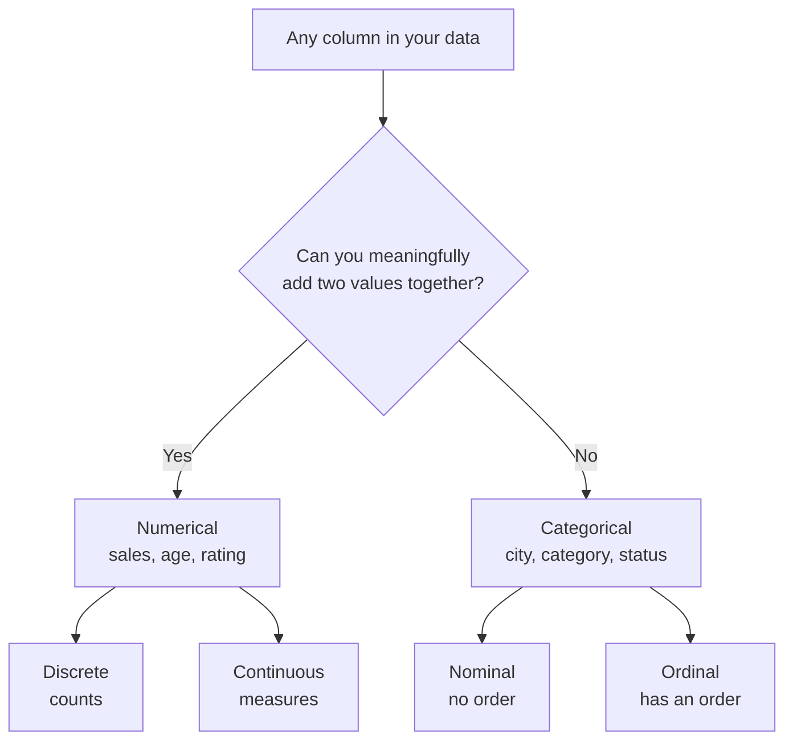
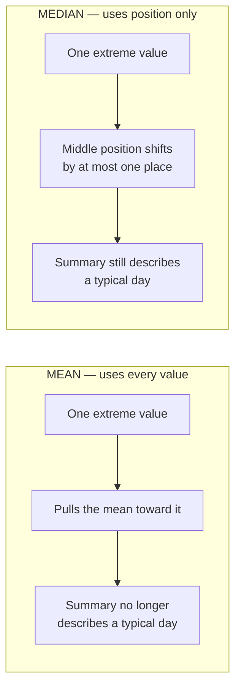

# Statistics: Understanding Data and Averages
> **Pre-Read — Academic Session 1** | Module 1: Analytics Foundations + GenAI + Spreadsheets
---

## Mental Map

> 📄 Also provided as a printable PDF in this folder: **mental-map: Statistics - Understanding Data and Averages.pdf**

```mermaid
%%{init: {'flowchart': {'htmlLabels': true, 'nodeSpacing': 60, 'rankSpacing': 95, 'wrappingWidth': 620, 'padding': 18}}}%%
flowchart LR

START["<b>Course Start</b>"]

subgraph foundation[" WHERE WE ARE "]
direction TB
    CURMOD["<b>CURRENT MODULE</b><br/><i>Module 1 — Analytics Foundations,<br/>GenAI &amp; Spreadsheets</i><br/>&nbsp;<br/><b>Covered so far:</b> nothing yet<br/>This is Session 1 of 39"]
    CURSES["<b>CURRENT SESSION</b><br/><b>Understanding Data and Averages</b><br/>&nbsp;<br/><i>The shift:</i> from raw rows of data<br/><i>to</i> <b>one honest number</b><br/>&nbsp;<br/>numerical vs categorical · mean · median<br/>mode · outliers · range"]
end

subgraph outcome[" OUTCOME OF THIS SESSION "]
direction TB
    OUT["<b>By the end, you can…</b><br/>&nbsp;<br/>Look at any business column and say<br/>what <b>type</b> it is, which <b>average</b> is fair,<br/>and whether an <b>outlier</b> is lying to you"]
end

subgraph value[" WHY IT MATTERS "]
direction TB
    CVAL["<b>Course Value</b><br/>Every KPI, dashboard and SQL AVG()<br/>you build later rests on this session"]
    RVAL["<b>Real-Life Value</b><br/>Spot a misleading average salary<br/>or average rating in a report<br/>before you repeat it"]
end

subgraph future[" WHAT COMES NEXT "]
direction TB
    U0["<b>Next Session</b><br/>Analytics Workflow, Metrics &amp; KPIs<br/><i>problem → data → analysis → insight</i>"]
    U1["<b>Later in Module 1</b><br/>GenAI prompting · Spreadsheets<br/>Cleaning · Formulas · Pivot tables"]
    U2["<b>Upcoming Modules</b><br/>SQL · Tableau · Python + GenAI<br/><i>the same averages, at scale</i>"]
end

START ==>|" begin "| CURMOD
CURMOD ==>|" progress "| CURSES
CURSES ==>|" you get "| OUT
OUT ==>|" course "| CVAL
OUT ==>|" real life "| RVAL
CURSES ==>|" next up "| U0
U0 -.->|" then "| U1
U1 -.->|" ahead "| U2

classDef startBox fill:#F7FAFC,stroke:#4A5568,stroke-width:2px,color:#1A202C
classDef curModBox fill:#FFF8E6,stroke:#B7791F,stroke-width:2px,color:#1A202C
classDef curSessBox fill:#E6FFFA,stroke:#0D9488,stroke-width:3px,color:#1A202C
classDef outBox fill:#FEF2F2,stroke:#DC2626,stroke-width:3px,color:#1A202C
classDef valueBox fill:#F3E8FF,stroke:#7C3AED,stroke-width:2px,color:#1A202C
classDef futureBox fill:#ECFDF5,stroke:#047857,stroke-width:2px,color:#1A202C

class START startBox
class CURMOD curModBox
class CURSES curSessBox
class OUT outBox
class CVAL,RVAL valueBox
class U0,U1,U2 futureBox

linkStyle default stroke-width:2px
```



## What You'll Learn

In this pre-read, you'll discover:

- The difference between **numerical** and **categorical** data — and why an analyst treats them completely differently
- How **mean**, **median**, and **mode** each summarise a business metric, and why they disagree
- Why a single **outlier** can quietly destroy the mean, and when the **median** is the more honest business number
- How **range** gives you a five-second read on how spread out performance is

---

## A. Numerical vs Categorical Data — Knowing What You're Holding

> 💡 **Analogy:** Walk into a shop and look at a shirt. Its **price** (₹899) is a number you can add up and average. Its **colour** (blue) is a label you can only count. Nobody has ever computed the "average colour" of a shirt — and that instinct is exactly what separates the two data types.

**One-line definition:** **Numerical** data is measured in quantities you can do arithmetic on; **categorical** data is a label that puts each row into a bucket.

Every column in every dataset you will ever touch is one of these two. Getting this wrong is the single most common beginner mistake, because a spreadsheet will happily compute the "average" of a column of pin codes and give you a meaningless number.

| Property | Numerical | Categorical |
|---|---|---|
| Example columns | `sales`, `age`, `rating`, `delivery_days` | `city`, `product_category`, `payment_method`, `is_returned` |
| What it answers | *How much? How many?* | *Which kind? Which group?* |
| Valid operations | Add, subtract, average, rank | Count, group, compare proportions |
| Typical summary | Mean / median | Mode / count per category |
| Typical chart | Line, histogram, scatter | Bar, pie |

**Two sub-types worth knowing:**

- **Numerical → Discrete:** whole counts you can't split. *Number of orders* (you can't place 3.5 orders).
- **Numerical → Continuous:** any value on a scale. *Revenue, weight, time taken.*
- **Categorical → Nominal:** no natural order. *City, payment method.*
- **Categorical → Ordinal:** has an order, but the gaps aren't equal. *Rating: Poor < Average < Good < Excellent.*



> ⚠️ **The trap:** Some numbers are *not* numerical. `pin_code`, `customer_id`, `phone_number` and `year` look like numbers but behave like labels. The test is simple — **if adding two values together is nonsense, it's categorical.** The average of two pin codes is not a place.

---

## B. The Mean — The "Fair Share" Number

> 💡 **Analogy:** Four friends order pizza and the bill is ₹1,200. Splitting it equally means each pays ₹300. That ₹300 is the **mean** — the amount everyone would pay *if everything were shared perfectly evenly*.

**One-line definition:** The **mean** is the total of all values divided by how many values there are.

$$\text{Mean} = \frac{\text{Sum of all values}}{\text{Number of values}}$$

**Worked example — daily sales for a store (₹ thousands):**

```
Mon  Tue  Wed  Thu  Fri
 12   15   11   14   13

Sum   = 12 + 15 + 11 + 14 + 13 = 65
Count = 5
Mean  = 65 / 5 = 13
```

So the store does **₹13k on an average day**. This is a genuinely useful business number: multiply by 30 and you have a monthly forecast.

**Why the mean is the default:** it uses *every single value*. Change any one number and the mean moves. That sensitivity is its greatest strength — and, as you'll see in Section E, its greatest weakness.

---

## C. The Median — The "Middle Person" Number

> 💡 **Analogy:** Line up everyone in your class by height and walk to the person standing exactly in the middle. That person's height is the **median**. It does not matter how tall the tallest person is — the middle person doesn't move.

**One-line definition:** The **median** is the middle value once all the values are sorted in order.

**How to compute it — always sort first:**

| Case | Rule | Example |
|---|---|---|
| **Odd** count | Take the single middle value | `11, 12, 13, 14, 15` → median = **13** |
| **Even** count | Average the two middle values | `11, 12, 14, 15` → (12+14)/2 = **13** |

**Worked example — the same store, but Friday had a festival sale:**

```
Sorted: 11, 12, 13, 14, 95
Middle value (3rd of 5) = 13
Median = 13
```

Notice something remarkable: that ₹95k festival day did **not** move the median at all. It is still 13. The median only cares about *position*, not *size*.

---

## D. The Mode — The "Most Common" Number

> 💡 **Analogy:** A shoe shop owner doesn't care about the *average* shoe size — you cannot stock a size 8.4 shoe. They care about the size that walks through the door most often. That's the **mode**.

**One-line definition:** The **mode** is the value that appears most frequently.

The mode is the only summary that works on **categorical** data — and that makes it quietly indispensable:

| Question | Correct summary |
|---|---|
| What is our average order value? | **Mean** (numerical) |
| What is a typical salary here? | **Median** (numerical, skewed) |
| Which city do most of our customers come from? | **Mode** (categorical) |
| What is our most common star rating? | **Mode** (ordinal) |

**A dataset can have:**
- **One mode** (unimodal) — `4, 5, 5, 5, 6` → mode = 5
- **Two modes** (bimodal) — `2, 2, 7, 7, 9` → modes = 2 and 7. *This is a signal, not a nuisance: two modes often means two different customer groups hiding in one dataset.*
- **No mode** — `1, 2, 3, 4` → every value appears once

---

## E. Outliers — Why the Mean Lies

> 💡 **Analogy:** Nine people sit in a café; the average net worth in the room is ₹8 lakh. A billionaire walks in. The average net worth is now ₹100 crore — and yet **not one person in that room got any richer**. The "average" is now describing a room that does not exist.

**One-line definition:** An **outlier** is a value that sits far away from the rest of the data, and it drags the mean toward itself while leaving the median almost untouched.

**Worked example — one festival day changes everything:**

| | Normal week | Week with a ₹95k festival day |
|---|---|---|
| Values (₹k) | 12, 15, 11, 14, 13 | 12, 15, 11, 14, **95** |
| **Mean** | 13.0 | **29.4** ⬅ more than doubled |
| **Median** | 13 | **14** ⬅ barely moved |

If you told your manager *"we do ₹29k on an average day"*, you would be technically correct and practically wrong — **four days out of five were nowhere near ₹29k**. The mean has been captured by a single value.



**Where outliers come from — and what to do:**

| Source of the outlier | Example | Right action |
|---|---|---|
| **Data error** | Age recorded as `999` | Fix or remove it |
| **A genuine rare event** | Diwali sale day | Keep it — but report the **median** as "typical" |
| **A different population mixed in** | One wholesale order inside retail data | Split the data and analyse separately |

> ⚖️ **The decision rule to memorise:**
> **Use the MEAN when data is fairly even and symmetric** (delivery times, exam scores, daily footfall).
> **Use the MEDIAN when data is skewed or has extremes** (salary, house prices, revenue per customer).
>
> This is exactly why every credible report says *"median household income"* and never *"mean household income"* — a handful of billionaires would make the mean meaningless.

---

## F. Range — A Five-Second Read on Spread

> 💡 **Analogy:** Two batsmen both average 40 runs. One scores 38, 41, 39, 42. The other scores 0, 95, 5, 60. Same average — completely different players. The **range** is the first number that tells you they are not the same.

**One-line definition:** The **range** is the largest value minus the smallest value — the total width of your data.

$$\text{Range} = \text{Maximum} - \text{Minimum}$$

**Worked example — two sales reps, same mean:**

| Rep | Monthly sales (₹k) | Mean | Range |
|---|---|---|---|
| Anita | 48, 52, 50, 49, 51 | 50 | 52 − 48 = **4** |
| Balaji | 10, 90, 20, 80, 50 | 50 | 90 − 10 = **80** |

Both average ₹50k. But Anita is **reliable** and Balaji is **volatile**. If you had to forecast next month's sales, you would trust Anita's number far more. *The mean told you the level. The range told you the risk.*

| What range gives you | What range does **not** give you |
|---|---|
| Instant sense of spread | Any idea of what happens *between* the extremes |
| Quick outlier smell-test | Resistance to outliers — it is built *entirely* from the two most extreme values |

> 📌 **Range is a starting point, not a finish line.** In **Session 8** you will learn *variance* and *standard deviation*, which measure spread using every value instead of only two.

---

## Quick Reference — Which Summary Do I Use?

| Your situation | Use this | Because |
|---|---|---|
| Numerical data, no extremes | **Mean** | Uses all information |
| Numerical data, skewed or has outliers | **Median** | Not dragged by extremes |
| Categorical data | **Mode** | The only one that works on labels |
| "How consistent is this?" | **Range** | Fast read on spread |
| Mean and median are far apart | ⚠️ **Investigate** | You almost certainly have outliers or skew |

---

## Practice Exercises

**1. Pattern Recognition**
A retail table has these columns: `order_id`, `customer_city`, `order_value`, `star_rating`, `payment_method`, `delivery_days`, `pin_code`. Label each one **numerical** or **categorical**. Two of them are deliberately tricky — find them and justify your call.

**2. Concept Detective**
A team reports: *"Average customer spend is ₹4,200."* You then find that the median spend is ₹900. In plain words, describe what must be true about this dataset, and which number you would put in front of the CEO — and why.

**3. Real-Life Application**
Cricket scores for a batsman across 6 matches: `0, 4, 8, 12, 6, 150`. Compute the mean, the median, and the range. Then answer as a selector: *"Is this a consistent player?"* — and name which of the three numbers actually answered that question.

**4. Spot the Error**
An intern computes the "average pin code" of all customers and reports `560,041`. Explain, in one sentence, what conceptual mistake was made, and what they should have computed instead to answer *"where do most of our customers live?"*

**5. Planning Ahead**
You are handed a table of employee salaries at a startup: 40 engineers earning ₹8–15 lakh, and 2 founders earning ₹2 crore each. Plan — in plain words, no code — how you would report "what a typical person earns here" honestly. Name which summary statistic you'd use, which one you'd deliberately avoid, and what you would say if a journalist insisted on the mean.

---

> ✅ **You're done!** You now know that "the average" is not one number but a *choice* between three — and that the choice is where honesty in analytics begins. Every KPI you build in the next 38 sessions, every `AVG()` you write in SQL, and every number you drop into a Tableau dashboard is a decision you now know how to defend. Coming up next: **Analytics Workflow, Metrics & KPIs**, where you'll learn how these numbers become the *questions a business actually pays you to answer*.
