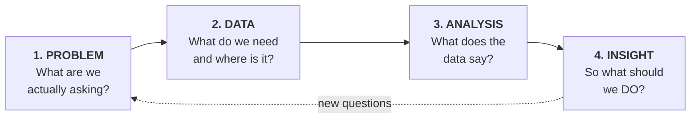
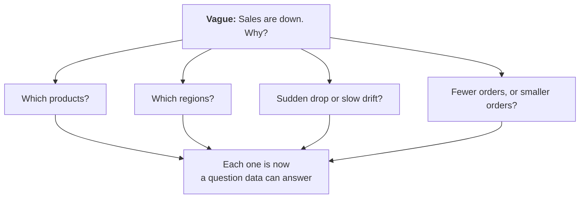

# Analytics Workflow, Metrics & KPIs
> **Pre-Read — Academic Session 2** | Module 1: Analytics Foundations + GenAI + Spreadsheets
---

## Mental Map

> 📄 Also provided as a printable PDF in this folder: **mental-map: Analytics Workflow, Metrics & KPIs.pdf**

```mermaid
%%{init: {'flowchart': {'htmlLabels': true, 'nodeSpacing': 60, 'rankSpacing': 95, 'wrappingWidth': 620, 'padding': 18}}}%%
flowchart LR

START["<b>Module 1</b><br/><i>Analytics Foundations</i>"]

subgraph foundation[" WHERE WE ARE "]
direction TB
    CURMOD["<b>CURRENT MODULE</b><br/><i>Module 1 — Analytics Foundations,<br/>GenAI &amp; Spreadsheets</i><br/>&nbsp;<br/><b>Covered so far:</b><br/>S1 · Data types · mean · median · mode<br/>outliers · range"]
    CURSES["<b>CURRENT SESSION 2</b><br/><b>Analytics Workflow, Metrics &amp; KPIs</b><br/>&nbsp;<br/><i>The shift:</i> from summarising a column<br/><i>to</i> <b>knowing which column is worth summarising</b><br/>&nbsp;<br/>problem → data → analysis → insight<br/>metric vs KPI · making a question measurable"]
end

subgraph outcome[" OUTCOME OF THIS SESSION "]
direction TB
    OUT["<b>By the end, you can…</b><br/>&nbsp;<br/>Take a vague ask like <i>“sales are down, fix it”</i><br/>and turn it into <b>a workflow</b>, <b>sharp sub-questions</b>,<br/>and <b>one KPI with a target</b> you can actually measure"]
end

subgraph value[" WHY IT MATTERS "]
direction TB
    CVAL["<b>Course Value</b><br/>Every SQL query, dashboard and report<br/>you build later starts from a KPI defined here"]
    RVAL["<b>Real-Life Value</b><br/>Stop being handed vague requests<br/>Walk into any review with a number<br/>that has a definition and a target"]
end

subgraph future[" WHAT COMES NEXT "]
direction TB
    U0["<b>Next Session (S3)</b><br/>GenAI for Analytics: Prompt, Check, Improve<br/><i>use AI on the workflow you just learned</i>"]
    U1["<b>Later in Module 1</b><br/>Spreadsheets · Cleaning · Formulas<br/>Pivot tables"]
    U2["<b>Upcoming Modules</b><br/>SQL · Tableau · Python + GenAI<br/><i>where these KPIs get built for real</i>"]
end

START ==>|" you are here "| CURMOD
CURMOD ==>|" progress "| CURSES
CURSES ==>|" you get "| OUT
OUT ==>|" course "| CVAL
OUT ==>|" real life "| RVAL
CURSES ==>|" next up "| U0
U0 -.->|" then "| U1
U1 -.->|" ahead "| U2

classDef startBox fill:#F7FAFC,stroke:#4A5568,stroke-width:2px,color:#1A202C
classDef curModBox fill:#FFF8E6,stroke:#B7791F,stroke-width:2px,color:#1A202C
classDef curSessBox fill:#E6FFFA,stroke:#0D9488,stroke-width:3px,color:#1A202C
classDef outBox fill:#FEF2F2,stroke:#DC2626,stroke-width:3px,color:#1A202C
classDef valueBox fill:#F3E8FF,stroke:#7C3AED,stroke-width:2px,color:#1A202C
classDef futureBox fill:#ECFDF5,stroke:#047857,stroke-width:2px,color:#1A202C

class START startBox
class CURMOD curModBox
class CURSES curSessBox
class OUT outBox
class CVAL,RVAL valueBox
class U0,U1,U2 futureBox

linkStyle default stroke-width:2px
```



## What You'll Learn

In this pre-read, you'll discover:

- What an **analytics workflow** is, and the four steps every analyst walks through
- How to break a vague business problem into **smaller, answerable questions**
- What a **metric** is, what a **KPI** is, and why confusing the two wastes everyone's time
- How to convert a fuzzy business question into a **measurable KPI** with a target

---

## A. The Analytics Workflow — The Four Steps

> 💡 **Analogy:** A doctor never starts with medicine. They start with *"where does it hurt?"* (problem), then run tests (data), read the results (analysis), and only then say *"you have a vitamin deficiency, take this"* (insight). Handing you a prescription before the tests would be malpractice. **Starting your analysis by opening a spreadsheet is the same mistake.**

**One-line definition:** The **analytics workflow** is the fixed path from a business problem to a decision: **problem → data → analysis → insight.**



| Step | The question it answers | What you produce | The classic failure |
|---|---|---|---|
| **1. Problem** | *What are we actually trying to decide?* | A sharp, answerable question | Starting work on a vague request |
| **2. Data** | *What do we need, and do we have it?* | The right dataset, cleaned | Using whatever data is handy |
| **3. Analysis** | *What does the data say?* | Numbers, comparisons, trends | Computing things nobody asked for |
| **4. Insight** | *So what should we do about it?* | A recommendation | Dumping a chart and going home |

**The two ideas most beginners miss:**

1. **The loop.** Step 4 usually creates new questions and sends you back to Step 1. Good analysis is a spiral, not a straight line.
2. **Step 1 is the whole game.** Most failed analyses aren't wrong maths — they're *perfectly correct answers to the wrong question.*

> ⚠️ **The most expensive mistake in analytics is skipping Step 1.** An analyst who spends 3 days building a beautiful dashboard nobody asked for has produced nothing. An analyst who spends 30 minutes sharpening the question has already done the hardest part.

---

## B. Breaking Down a Business Problem

> 💡 **Analogy:** *"Why is the car making a noise?"* is not a repairable question. *"Is the noise coming from the engine, the brakes, or the wheels? Does it happen when turning, braking, or accelerating?"* — now a mechanic can actually work. **You are the mechanic. Vague questions must be broken into testable ones.**

**One-line definition:** **Problem decomposition** is splitting one big, unanswerable business question into a small set of specific questions that data *can* answer.

**The technique — ask "which, when, who, what":**

Take the classic vague request:

> 🗣️ *"Sales are down. Find out why."*

You cannot query that. Break it apart:

| Dimension | Sharper sub-question |
|---|---|
| **Which** (product) | Are *all* products down, or only some categories? |
| **Where** (region) | Is it every city, or one region dragging the total? |
| **When** (time) | Did it drop suddenly, or drift down over months? |
| **Who** (customer) | Are we losing new customers, or losing repeat customers? |
| **What** (mechanism) | Fewer orders, or the same orders at a lower value? |

That last one is worth pausing on. **Revenue = number of orders × average order value.** If revenue falls, exactly one of those two must have fallen. That single decomposition tells you which half of the business to go look at — and it took ten seconds.



> ✅ **A good sub-question has one property: you can imagine the answer.** If you cannot picture what the answer would look like — a number, a comparison, a chart — the question is still too vague. Keep cutting.

---

## C. Metrics — The Numbers That Describe the Business

> 💡 **Analogy:** A car dashboard shows speed, fuel, engine temperature, RPM, odometer, outside temperature. All are **metrics** — real numbers about the car. But you are not staring at the outside temperature while overtaking on a highway. Most metrics just sit there, available, unwatched.

**One-line definition:** A **metric** is any number you can measure about the business.

| Metric | What it measures | Where it comes from |
|---|---|---|
| Total revenue | Money in, over a period | Sum of order values |
| Number of orders | Volume of transactions | Count of rows |
| Average order value (AOV) | Typical basket size | Revenue ÷ orders |
| Delivery time | Days from order to doorstep | Delivered date − order date |
| Return rate | Share of orders sent back | Returns ÷ orders |
| Page views | Traffic | Website logs |

Notice something: **all six are true, measurable, and useful.** A company might track hundreds. That abundance is exactly the problem — and it's why KPIs exist.

---

## D. KPIs — The Handful That Actually Matter

> 💡 **Analogy:** Back to the dashboard. When the **fuel light** comes on, you *act* — you find a petrol pump. That is a **KPI**: a metric tied to a goal, with a threshold, that changes what you do. The outside temperature reading never makes you do anything. It is a metric, and only a metric.

**One-line definition:** A **KPI** (Key Performance Indicator) is a metric that is **tied to a business goal**, has a **target**, and **drives a decision** when it moves.

### The three tests — a metric is only a KPI if it passes all three

| Test | Question | If it fails… |
|---|---|---|
| **1. Goal** | Is it linked to something the business is *trying to achieve*? | It's just trivia |
| **2. Target** | Is there a number we're aiming for? | You can't tell good from bad |
| **3. Action** | If it moves the wrong way, does someone *do* something? | Nobody will ever look at it |

### Same number, two different lives

> **Metric:** *"Average delivery time is 4.2 days."*
> **KPI:** *"Average delivery time must stay **under 3 days**, because customers who wait longer than 3 days churn at twice the rate. We are at 4.2 — **we are failing, and the logistics team owns the fix.**"*

The number is identical. The KPI version has a **target** (under 3 days), a **reason** (churn), and an **owner** (logistics). *That* is what turns a number into a decision.

| | **Metric** | **KPI** |
|---|---|---|
| How many? | Hundreds | A handful (5–7 max) |
| Tied to a goal? | Not necessarily | **Always** |
| Has a target? | No | **Yes** |
| Someone acts on it? | Usually not | **Yes — that's the point** |
| Analogy | Outside temperature | Fuel warning light |

> 🔑 **The relationship:** **Every KPI is a metric. Most metrics are not KPIs.** A KPI is a promotion a metric earns by mattering.

> ⚠️ **If everything is a KPI, nothing is.** A "KPI dashboard" with 40 numbers on it is just a metrics dump — nobody knows which one to act on. Ruthless selection *is* the skill.

---

## E. Turning a Business Question Into a Measurable KPI

**One-line definition:** A KPI is measurable when someone else could compute the exact same number from the same data **without asking you a single question.**

### The four-part recipe

```
1. METRIC      What exactly is being counted or measured?
2. FORMULA     How is it computed, precisely?
3. TIMEFRAME   Over what period?
4. TARGET      What number counts as success?
```

**Worked example — from vague to measurable:**

| Stage | The statement |
|---|---|
| 🗣️ **Business question** | *"Are our customers happy?"* |
| ❌ **Still vague** | *"Track customer happiness."* — Happiness isn't in any database. |
| ⚠️ **A metric** | *"Average star rating."* — Better. But over what period? What's good? |
| ✅ **A KPI** | *"**Average star rating** (sum of ratings ÷ number of ratings), measured **monthly**, must stay **at or above 4.2**. Below that, the support lead reviews all 1★ and 2★ reviews that month."* |

Only the last line can be built, tracked, and acted upon.

### The ambiguity trap — define your terms

Two analysts asked for "monthly active users" will produce two different numbers, because:

- Does "active" mean *logged in*, or *placed an order*?
- Is "monthly" a calendar month, or a rolling 30 days?
- Does one person with two accounts count once or twice?

> 📌 **This is not pedantry — it is the job.** A KPI whose definition lives only in your head is not a KPI; it's a number you'll have to defend in every meeting for the rest of your life. **Write the definition down.**

---

## Quick Reference

| You are asked… | Do this |
|---|---|
| *"Look into our sales."* | Stop. Decompose it. Which products, which region, which period? |
| *"Track everything."* | Pick 5–7 KPIs. Everything else is a metric, available on request. |
| *"Is this a KPI?"* | Apply the three tests: goal, target, action. All three, or it's a metric. |
| *"Make it measurable."* | Metric + formula + timeframe + target. All four, in writing. |

---

## Practice Exercises

**1. Pattern Recognition**
Label each as **Metric** or **KPI**, and justify in one line: (a) Number of website visitors last month. (b) Cart abandonment rate must drop below 60% this quarter, or the checkout page gets redesigned. (c) Total number of products in the catalogue. (d) Customer churn kept under 5% monthly, owned by the retention team.

**2. Concept Detective**
A manager says: *"Our KPI is engagement."* Using the three tests (goal, target, action), explain exactly what is missing, and rewrite it as a real KPI. You may invent a reasonable definition and target — but state them explicitly.

**3. Real-Life Application**
You run a small food delivery startup. Write down **five metrics** you could track, then promote exactly **two** of them to KPIs. For each KPI, state the formula, the timeframe, the target, and who acts when it slips.

**4. Spot the Error**
An analyst is asked *"why did revenue fall in March?"* and immediately produces a chart of total revenue by month. Their manager is unhappy. Using the analytics workflow, identify which step they skipped, and list three sub-questions they should have asked first.

**5. Planning Ahead**
A retail chain says: *"Our online store is underperforming."* Map this to all four workflow steps. For Step 1, write three sharp sub-questions. For Step 2, name the data you'd need. For Step 3, name the comparison you'd run. For Step 4, describe what a *useful* insight would sound like — as a sentence a manager could act on today.

---

> ✅ **You're done!** Session 1 taught you how to summarise a number honestly. This session teaches you something harder: **which number to summarise at all.** The workflow gives you the path, decomposition gives you the sharp question, and the metric-vs-KPI distinction stops you from drowning a business in numbers nobody acts on. Coming up next: **GenAI for Analytics — Prompt, Check, Improve**, where you'll put AI to work on this exact workflow — and learn to catch it when it confidently makes things up.
