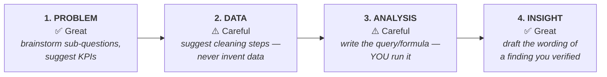

# GenAI for Analytics: Prompt, Check, Improve
> **Pre-Read — Academic Session 3** | Module 1: Analytics Foundations + GenAI + Spreadsheets
---

## Mental Map

> 📄 Also provided as a printable PDF in this folder: **mental-map: GenAI for Analytics - Prompt, Check, Improve.pdf**

```mermaid
%%{init: {'flowchart': {'htmlLabels': true, 'nodeSpacing': 60, 'rankSpacing': 95, 'wrappingWidth': 620, 'padding': 18}}}%%
flowchart LR

START["<b>Module 1</b><br/><i>Analytics Foundations</i>"]

subgraph foundation[" WHERE WE ARE "]
direction TB
    CURMOD["<b>CURRENT MODULE</b><br/><i>Module 1 — Analytics Foundations,<br/>GenAI &amp; Spreadsheets</i><br/>&nbsp;<br/><b>Covered so far:</b><br/>S1 · Data types · mean · median · mode · outliers<br/>S2 · Workflow · decomposition · metrics vs KPIs"]
    CURSES["<b>CURRENT SESSION 3</b><br/><b>GenAI for Analytics: Prompt, Check, Improve</b><br/>&nbsp;<br/><i>The shift:</i> from doing every step yourself<br/><i>to</i> <b>directing an assistant — and checking its work</b><br/>&nbsp;<br/>where GenAI fits in the workflow · prompt patterns<br/>structured outputs · spotting a confident lie"]
end

subgraph outcome[" OUTCOME OF THIS SESSION "]
direction TB
    OUT["<b>By the end, you can…</b><br/>&nbsp;<br/>Write a prompt that returns a <b>usable table, not an essay</b>,<br/>and run a <b>validation check</b> that catches GenAI<br/>inventing a number that was never in your data"]
end

subgraph value[" WHY IT MATTERS "]
direction TB
    CVAL["<b>Course Value</b><br/>You will use GenAI in every module after this —<br/>for SQL, for dashboards, for Python<br/>This session is the safety training"]
    RVAL["<b>Real-Life Value</b><br/>Ship AI-assisted work you can defend<br/>Never be the analyst who pasted<br/>a hallucinated number into a board deck"]
end

subgraph future[" WHAT COMES NEXT "]
direction TB
    U0["<b>Next Session (S4)</b><br/>Clean Up the Data<br/><i>hands on a spreadsheet at last</i>"]
    U1["<b>Later in Module 1</b><br/>Make data ready · Formulas<br/>Pivot tables"]
    U2["<b>Upcoming Modules</b><br/>SQL · Tableau · Python + GenAI<br/><i>GenAI writes the SQL — you check it</i>"]
end

START ==>|" you are here "| CURMOD
CURMOD ==>|" progress "| CURSES
CURSES ==>|" you get "| OUT
OUT ==>|" course "| CVAL
OUT ==>|" real life "| RVAL
CURSES ==>|" next up "| U0
U0 -.->|" then "| U1
U1 -.->|" ahead "| U2

classDef startBox fill:#F7FAFC,stroke:#4A5568,stroke-width:2px,color:#1A202C
classDef curModBox fill:#FFF8E6,stroke:#B7791F,stroke-width:2px,color:#1A202C
classDef curSessBox fill:#E6FFFA,stroke:#0D9488,stroke-width:3px,color:#1A202C
classDef outBox fill:#FEF2F2,stroke:#DC2626,stroke-width:3px,color:#1A202C
classDef valueBox fill:#F3E8FF,stroke:#7C3AED,stroke-width:2px,color:#1A202C
classDef futureBox fill:#ECFDF5,stroke:#047857,stroke-width:2px,color:#1A202C

class START startBox
class CURMOD curModBox
class CURSES curSessBox
class OUT outBox
class CVAL,RVAL valueBox
class U0,U1,U2 futureBox

linkStyle default stroke-width:2px
```



## What You'll Learn

In this pre-read, you'll discover:

- What **GenAI** actually is — and the one fact about how it works that explains every mistake it makes
- **Where** in the analytics workflow GenAI helps, and where it is genuinely dangerous
- The **four ingredients** of a prompt that returns something usable
- How to force **structured outputs** (tables and lists) instead of paragraphs of prose
- How to spot a **hallucination**, and the three validation checks you run before trusting anything

---

## A. What GenAI Is — And the One Fact That Explains Everything

> 💡 **Analogy:** Think of the autocomplete on your phone. You type *"I'm running a bit…"* and it suggests *"late."* It doesn't know you're late. It has simply seen that word follow those words a million times. **GenAI is that same idea, scaled up enormously** — and it will confidently complete a sentence about your sales data with exactly the same machinery.

**One-line definition:** **GenAI** (Generative AI) is a system that produces new text by predicting what is *most likely to come next*, based on patterns learned from an enormous amount of text.

### The one fact you must internalise

> ### 🔑 **GenAI is optimised to produce text that LOOKS right. It is not optimised to produce text that IS right.**

Those two things overlap most of the time — which is exactly what makes it dangerous. It is a brilliant assistant that has **no idea when it is wrong**, and no ability to tell you.

This single fact explains every failure mode you will meet:

| What it does | Why it does it |
|---|---|
| Invents a statistic that sounds plausible | A number "fits" there, so it produces one |
| Cites a source that doesn't exist | Citations *look like* that, so it generates one |
| Confidently gives a wrong average | It's pattern-matching text, **not doing arithmetic** |
| Never says "I don't know" | Uncertainty is rare in its training text |

> ⚠️ **The word for this is *hallucination*: output that is fluent, confident, well-formatted — and false.** It does not look like an error. **That is the entire problem.** A calculator that breaks gives you an error message. GenAI that breaks gives you a beautiful table of wrong numbers.

---

## B. Where GenAI Fits in the Analytics Workflow

Recall the four steps from Session 2: **problem → data → analysis → insight.** GenAI is not equally useful at each one.



| Step | GenAI is… | Use it for | **Never** use it for |
|---|---|---|---|
| **1. Problem** | ✅ **Excellent** | Brainstorming sub-questions, suggesting KPIs, challenging your framing | Deciding what the business should care about |
| **2. Data** | ⚠️ **Handle with care** | Suggesting what to check, explaining an error | **Generating data.** Ever. |
| **3. Analysis** | ⚠️ **Handle with care** | Writing a formula or query *for you to run* | **Computing the answer itself** |
| **4. Insight** | ✅ **Excellent** | Rewriting a verified finding clearly, drafting the summary | Deciding what the finding *is* |

### The rule that keeps you safe

> ### ✅ **Use GenAI for LANGUAGE. Use your tools for NUMBERS.**
>
> Ask it to *write the SQL* — then run that SQL yourself and trust the database's answer.
> Ask it to *compute the average of these 200 rows* — and you have just asked autocomplete to do arithmetic.

Every safe use of GenAI in analytics follows from that one line.

---

## C. Writing a Prompt That Works — The Four Ingredients

> 💡 **Analogy:** Imagine briefing a brand-new intern who is fast, eager, well-read — and has *never seen your company*. You would not say "look into sales." You'd say what you want, give context, show the format, and set the boundaries. **A prompt is an intern brief.**

**One-line definition:** A **prompt** is the instruction you give GenAI. Vague brief → vague output. This is not the AI being unhelpful; it is you being unclear.

### The four ingredients

```
1. ROLE     Who should it act as?          "You are a retail data analyst."
2. TASK     What exactly do you want?      "List 5 sub-questions to investigate a sales drop."
3. CONTEXT  What does it need to know?     "Data: orders with city, product, value, date. Q3 2025."
4. FORMAT   How should the answer look?    "Return a markdown table: Question | Data needed."
```

**Watch the difference:**

| ❌ Weak prompt | ✅ Strong prompt |
|---|---|
| *"Help me analyse sales."* | *"**You are a retail data analyst.** Our Q3 revenue fell 12% versus Q2. **Data available:** order_id, city, product_category, order_value, order_date. **Task:** list 5 sub-questions I should investigate first. **Format:** a markdown table with columns — Sub-question \| Why it matters \| Columns needed. **Constraint:** use only the columns listed above."* |
| Returns: a generic essay about sales analysis | Returns: a table you can start working from in 30 seconds |

> 📌 **`FORMAT` is the ingredient beginners always drop — and it's the one that saves the most time.** If you don't specify the shape of the answer, you get prose. Prose has to be re-read, re-typed, and reformatted. **Ask for a table and you get a table.**

> 🔒 **`CONSTRAINT` is the ingredient that saves you from hallucination.** The line *"use only the columns I listed"* is a fence. Without a fence, it will happily invent a `customer_age` column you don't have and build its whole analysis on it.

---

## D. Structured Outputs — Tables, Not Essays

**One-line definition:** A **structured output** is a response in a fixed shape — a table, a numbered list, a set of fields — that you can use directly without rewriting it.

**Say exactly what you want. It obeys shape instructions extremely well:**

| Ask for this | Get this |
|---|---|
| *"Return a markdown table with columns: Metric, Formula, Target"* | A clean 3-column table |
| *"Return exactly 5 bullet points, max 15 words each"* | 5 tight bullets |
| *"For each row, output: Issue \| Severity (High/Med/Low) \| Fix"* | A consistent, sortable list |
| *"Answer in one sentence. No preamble."* | One sentence, no *"Certainly! Here's…"* |

**The upgrade — give it a template to fill:**

```
Fill in this table. One row per issue. Do not add commentary.

| Column name | Issue found | Severity | Suggested fix |
|-------------|-------------|----------|---------------|
|             |             |          |               |
```

> ✅ **Why this matters beyond tidiness:** a structured output is **checkable**. An essay hides its assumptions inside flowing sentences. A table with a "Columns needed" field makes it instantly obvious when the AI has referenced a column that doesn't exist. **Structure is not just neat — it is a hallucination detector.**

---

## E. Checking the Output — Catching a Confident Lie

> 💡 **Analogy:** A new intern hands you a report with a number in it. You would not forward it to the CEO without a glance. You'd ask: *"Where did this come from?"* **GenAI is that intern — except it never gets tired, and it never admits doubt.**

### The three checks — run these every single time

| # | Check | The question you ask | What you're catching |
|---|---|---|---|
| **1** | **Source check** | *"Is every number here traceable to my actual data?"* | Invented figures |
| **2** | **Sanity check** | *"Does this make sense in the real world?"* | Nonsense that reads well (a 340% conversion rate) |
| **3** | **Recompute check** | *"If I calculate this myself, do I get the same answer?"* | Arithmetic errors |

### Red flags — learn to feel these

| 🚩 Red flag | Why it should stop you |
|---|---|
| A **suspiciously round** number ("exactly 25% of customers") | Real data is messy; round numbers are often invented |
| A **column you don't have** appears in the answer | It filled a gap by making one up |
| **No hedging at all** on a genuinely uncertain question | Real analysts say "roughly", "approximately", "it depends" |
| A **citation or source** you can't find | Hallucinated references are extremely common |
| Numbers that **don't add up to the total** | It generated each cell independently |

### The single most useful habit

> ### 🔍 **Ask it: "Which parts of this are you unsure about?"**
>
> It will often — not always — flag its own weakest claims. It's free, it takes five seconds, and it will save you at least one public embarrassment in your career.

### And the one rule you never break

> ### 🛑 **You are responsible for every number you ship.**
>
> *"The AI said so"* has never once been an acceptable answer in a meeting, and it never will be. GenAI is a tool, exactly like a calculator or a spreadsheet. **A calculator that gives a wrong answer is your problem, not the calculator's.**

---

## Quick Reference

| Situation | What to do |
|---|---|
| Output is a rambling essay | You forgot **FORMAT**. Ask for a table, and set a length limit. |
| It invented a column or a number | You forgot **CONSTRAINT**. Add: *"use only the columns I listed."* |
| The answer is generic and useless | You forgot **CONTEXT**. Give it your actual columns and situation. |
| It gave you a computed number | ❌ Don't use it. **Get the formula from GenAI, run it yourself.** |
| It sounds perfect | 🚩 Run all three checks anyway. **Fluency is not accuracy.** |

---

## Practice Exercises

**1. Pattern Recognition**
For each task, decide whether GenAI is ✅ safe, ⚠️ safe-with-checking, or 🛑 unsafe — and say why in one line: (a) Draft five sub-questions about a drop in app installs. (b) Compute the average order value of these 500 rows. (c) Write a SQL query to compute average order value. (d) Rewrite my verified finding as a two-sentence summary for the CEO. (e) Estimate what our churn rate probably is.

**2. Concept Detective**
This prompt produces a useless answer: *"Analyse my customer data and tell me what's wrong with it."* Identify **which of the four ingredients** (role, task, context, format) are missing, then rewrite it as a strong prompt. Invent reasonable details for your dataset.

**3. Real-Life Application**
You ask GenAI to summarise a sales report and it replies: *"Revenue grew 23% in Q3, driven primarily by the Bangalore region, which contributed exactly 40% of total sales. Customer satisfaction remained strong at 4.5/5."* Your dataset has only `order_id`, `city`, `order_value`, `order_date`. **List every red flag you can find** — there are at least three.

**4. Spot the Error**
A classmate says: *"I asked ChatGPT for the median of my 80 sales figures and it gave me ₹4,200, so I put it in my report."* Explain precisely what is wrong with this, using what you know about how GenAI works. What should they have done instead?

**5. Planning Ahead**
Write a complete prompt (all four ingredients + a constraint) that would help you with **Step 1** of the workflow for this problem: *"Our food delivery app's ratings have dropped from 4.5 to 3.9 over two months."* Then write down the **three checks** you would run on whatever it gives back.

---

> ✅ **You're done!** GenAI is the most useful assistant you will ever have and the most confident liar you will ever work with — and those are the same sentence. The workflow from Session 2 is what lets you tell the difference: you know what question you're asking, so you can tell when the answer doesn't fit it. Coming up next: **Clean Up the Data** — you finally get your hands on a spreadsheet, and you'll meet the messy, duplicated, badly-formatted reality that every analyst actually spends their days fixing.
