# Clean Up the Data
> **Pre-Read — Academic Session 4** | Module 1: Analytics Foundations + GenAI + Spreadsheets
---

## Mental Map

> 📄 Also provided as a printable PDF in this folder: **mental-map: Clean Up the Data.pdf**

```mermaid
%%{init: {'flowchart': {'htmlLabels': true, 'nodeSpacing': 60, 'rankSpacing': 95, 'wrappingWidth': 620, 'padding': 18}}}%%
flowchart LR

START["<b>Module 1</b><br/><i>Analytics Foundations</i>"]

subgraph foundation[" WHERE WE ARE "]
direction TB
    CURMOD["<b>CURRENT MODULE</b><br/><i>Module 1 — Analytics Foundations,<br/>GenAI &amp; Spreadsheets</i><br/>&nbsp;<br/><b>Covered so far:</b><br/>S1 · Data types · mean · median · outliers<br/>S2 · Workflow · decomposition · metrics vs KPIs<br/>S3 · GenAI · prompting · checking outputs"]
    CURSES["<b>CURRENT SESSION 4</b><br/><b>Clean Up the Data</b><br/>&nbsp;<br/><i>The shift:</i> from talking about data<br/><i>to</i> <b>touching it — and finding it filthy</b><br/>&nbsp;<br/>load a dataset · spot missing values, duplicates<br/>and broken formats · sort · filter · de-duplicate"]
end

subgraph outcome[" OUTCOME OF THIS SESSION "]
direction TB
    OUT["<b>By the end, you can…</b><br/>&nbsp;<br/>Open a messy real-world export, run a <b>5-point audit</b><br/>to find what is broken, remove duplicates without<br/>destroying real rows, and <b>say why every row you deleted</b><br/>deserved to go"]
end

subgraph value[" WHY IT MATTERS "]
direction TB
    CVAL["<b>Course Value</b><br/>Everything downstream — SQL, Tableau, pandas —<br/>assumes clean data. Garbage in, garbage out,<br/>no matter how good the tool"]
    RVAL["<b>Real-Life Value</b><br/>Analysts spend most of their working life here<br/>The dirty secret of the job: cleaning IS the job"]
end

subgraph future[" WHAT COMES NEXT "]
direction TB
    U0["<b>Next Session (S5)</b><br/>Make Data Ready for Analysis<br/><i>from 'not broken' to 'actually usable'</i>"]
    U1["<b>Later in Module 1</b><br/>Formulas for Analysis<br/>Pivot Tables and Quick Insights"]
    U2["<b>Upcoming Modules</b><br/>SQL · Tableau · Python + GenAI<br/><i>same cleaning problems, bigger data</i>"]
end

START ==>|" you are here "| CURMOD
CURMOD ==>|" progress "| CURSES
CURSES ==>|" you get "| OUT
OUT ==>|" course "| CVAL
OUT ==>|" real life "| RVAL
CURSES ==>|" next up "| U0
U0 -.->|" then "| U1
U1 -.->|" ahead "| U2

classDef startBox fill:#F7FAFC,stroke:#4A5568,stroke-width:2px,color:#1A202C
classDef curModBox fill:#FFF8E6,stroke:#B7791F,stroke-width:2px,color:#1A202C
classDef curSessBox fill:#E6FFFA,stroke:#0D9488,stroke-width:3px,color:#1A202C
classDef outBox fill:#FEF2F2,stroke:#DC2626,stroke-width:3px,color:#1A202C
classDef valueBox fill:#F3E8FF,stroke:#7C3AED,stroke-width:2px,color:#1A202C
classDef futureBox fill:#ECFDF5,stroke:#047857,stroke-width:2px,color:#1A202C

class START startBox
class CURMOD curModBox
class CURSES curSessBox
class OUT outBox
class CVAL,RVAL valueBox
class U0,U1,U2 futureBox

linkStyle default stroke-width:2px
```



## What You'll Learn

In this pre-read, you'll discover:

- How to **load** a dataset into a spreadsheet without silently corrupting it
- The **five data issues** that appear in almost every real export
- Why **missing values** are not all the same — and why you must never blindly delete them
- How to remove **duplicates** without destroying legitimate rows
- How **sort** and **filter** turn a wall of 5,000 rows into an inspection tool

---

## A. Loading Data — Where Corruption Begins

> 💡 **Analogy:** You buy vegetables, get home, and dump the bag on the counter without looking. Two are rotten. You won't find out until they're in the curry. **Loading a dataset without inspecting it is exactly that** — and the rot always surfaces at the worst possible moment.

**One-line definition:** **Loading** is importing a raw file (usually CSV) into a spreadsheet — and it is the first place your data can silently break.

### The CSV — what you're actually opening

A **CSV** (Comma-Separated Values) is a plain text file where commas separate columns:

```
order_id,customer,city,order_value,order_date
1001,Ravi Kumar,Chennai,2400,2025-03-01
1002,Priya S,Madurai,1800,2025-03-02
```

That's it. No formatting, no formulas, no colours — just text and commas. It's the universal language of data.

### 🔴 The three traps that corrupt data on import

| Trap | What happens | How to prevent it |
|---|---|---|
| **Leading zeros vanish** | Pin code `600001` → `600001` (fine), but `007` → `7` | Import the column **as text**, not as a number |
| **Dates get rewritten** | `03-04-2025` becomes April 3rd… or March 4th. **The spreadsheet guesses.** | Set the date format explicitly on import |
| **Long numbers → scientific notation** | Phone `9876543210` → `9.88E+09` | Import **as text** |

> ⚠️ **These are not display quirks. The underlying value is genuinely changed and cannot be recovered.** Once `007` becomes `7`, the leading zeros are gone from the file. This is the single most common way a beginner destroys data — and it happens in the first three seconds, before they've done anything at all.

**The habit to build:** after loading, **always look at the first 20 rows with your own eyes** before you do anything else. Ten seconds. It will save you hours.

---

## B. The Five Issues in Every Real Dataset

> 💡 **Analogy:** A doctor doesn't examine you randomly. They run a checklist — pulse, blood pressure, temperature. **You need a checklist too**, or you'll only find the problems you happened to trip over.

| # | Issue | What it looks like | Why it breaks your analysis |
|---|---|---|---|
| **1** | **Missing values** | Empty cells, `NA`, `NULL`, `-`, `0` | Averages are wrong; rows silently vanish from counts |
| **2** | **Duplicates** | The same order appearing twice | **Revenue is overstated.** You report money that doesn't exist. |
| **3** | **Formatting issues** | `₹2,400` vs `2400`; `01/03/25` vs `2025-03-01` | The number is text — **you cannot sum it** |
| **4** | **Inconsistent entries** | `Chennai`, `chennai`, `CHENNAI`, `Chennai ` | One city becomes four; every group-by is wrong |
| **5** | **Outliers / impossible values** | `age = 999`, `order_value = -500` | Mean is destroyed *(remember Session 1!)* |

> 📌 **Run this as a 5-point audit, in this order, every single time you open a new dataset.** Not because it's elegant — because you will otherwise miss things, and the things you miss are the things that end up in front of a CEO.

---

## C. Missing Values — Not All Absences Are Equal

> 💡 **Analogy:** A blank on a form can mean three very different things: *"I have no phone"*, *"I'd rather not say"*, or *"I didn't see the question."* Erasing all three as if they mean the same thing throws away real information.

**One-line definition:** A **missing value** is an empty or unrecorded cell — and *why* it's empty determines what you should do about it.

### The three causes — and three different responses

| Why it's missing | Example | What to do |
|---|---|---|
| **Genuinely doesn't exist** | `delivery_date` for a cancelled order | ✅ **Leave it blank.** It's correct. |
| **Not recorded** | `phone` never captured for walk-ins | ⚠️ Leave blank, or fill with a clear marker |
| **Lost / broken** | System crash wiped a day of `order_value` | 🔴 Investigate. Can you recover it? |

### 🚨 The trap that ruins beginners: `0` is not "missing"

```
Rating: [blank]   →  the customer did not rate.
Rating: 0         →  the customer gave a rating of zero.
```

These are **completely different facts.** But if someone "cleans" the data by filling blanks with `0`, they've silently converted *"no opinion"* into *"worst possible score."* Your average rating collapses, and it's entirely fictional.

> ⚠️ **The same trap in reverse:** if `order_value` is blank and you fill it with `0`, you have just recorded a real sale as ₹0 and quietly deleted revenue.

### What you can do about missing values

| Approach | When it's right | The danger |
|---|---|---|
| **Leave it blank** | The absence is meaningful | Some tools mishandle blanks |
| **Delete the row** | Very few rows, and the value is critical | **Deleting 30% of your data is not cleaning — it's data loss** |
| **Fill with a value** | Genuinely justified (rare in this course) | You are inventing data. Say so, out loud, in writing. |
| **Flag it** | Best default: add a column marking it | Nothing — this is the professional move |

> ### 🔑 **The rule:** *Understand WHY it's missing before you decide what to do with it. Never delete a row you haven't looked at.*

---

## D. Duplicates — The Silent Revenue Inflator

> 💡 **Analogy:** You scan a barcode twice at the self-checkout. The bill charges you twice. **A duplicate row is that mistake, at scale** — and unlike the checkout, nothing beeps.

**One-line definition:** A **duplicate** is a row that appears more than once when it should appear only once.

### 🔴 Why duplicates are the most dangerous issue on the list

Missing values usually make a number *look wrong* — you notice. Duplicates make a number look **great**. Revenue is up! Orders are up! Nobody questions good news. **Duplicates get caught late, in front of important people, or never.**

### The critical distinction — exact vs partial

```
EXACT DUPLICATE — every column identical:
  1001, Ravi Kumar, Chennai, 2400, 2025-03-01
  1001, Ravi Kumar, Chennai, 2400, 2025-03-01     ← same row twice. Delete one.

NOT A DUPLICATE — same customer, two real orders:
  1001, Ravi Kumar, Chennai, 2400, 2025-03-01
  1005, Ravi Kumar, Chennai, 1800, 2025-03-09     ← different order. KEEP BOTH.
```

> ### 🛑 **The mistake that will bite you:** de-duplicating on `customer_name` and deleting every repeat customer's orders.
>
> **You just deleted your best customers.** Loyal customers appear many times — *that's what loyalty looks like in a table.*

**The right way to think about it — ask one question:**

> ### *"Which column (or combination) should be unique in this table?"*

- In an **orders** table → `order_id` should be unique. Two rows with the same `order_id` = a real duplicate.
- In a **customers** table → `customer_id` should be unique. Same name is fine — there are many Ravi Kumars.

Find your **unique key first.** Then, and only then, de-duplicate on it.

> 💡 **Before you delete anything:** count the rows. Delete. Count again. **You must be able to say exactly how many rows you removed and why.** "I clicked Remove Duplicates and it said 47" is not an answer — *why were there 47?*

---

## E. Sort and Filter — Your Inspection Tools

> 💡 **Analogy:** You can't proofread a book by staring at all 300 pages at once. You read it in order, or you search for a word. **Sort and filter are exactly that** — they turn 5,000 unreadable rows into something a human eye can actually inspect.

**One-line definition:** **Sorting** reorders rows by a column's values; **filtering** hides rows that don't match a condition. Neither changes your data — they change what you can *see*.

### Sort — where the extremes hide

| Sort by… | And you instantly find… |
|---|---|
| `order_value` **ascending** | Negatives, zeros, blanks — **all the broken values cluster at the top** |
| `order_value` **descending** | The suspicious ₹99,99,999 order |
| `order_date` ascending | Dates from 1899 or 2087 (a classic import bug) |
| `city` A–Z | `chennai`, `Chennai`, `CHENNAI` — **sitting right next to each other** |

> 🔑 **This is the highest-value trick in the session.** Sorting a text column alphabetically makes every spelling inconsistency line up **adjacent to each other**. Problems that were invisible across 5,000 scattered rows become obvious in one glance.

### Filter — asking questions of your data

| Filter | Finds |
|---|---|
| `order_value` is empty | Every missing value, counted |
| `order_value` < 0 | Impossible negatives |
| `city` = "Chennai" | Only Chennai rows — *and if the count looks low, your spelling is inconsistent* |
| `order_date` > today | Future orders. These exist. They should not. |

> ⚠️ **Sort and filter are safe — they never modify data.** Explore fearlessly. It is *deleting* that requires courage and a reason.

---

## Quick Reference — The Cleaning Checklist

```
□  1.  Load, then LOOK at the first 20 rows with your own eyes
□  2.  Check row count. Write it down.
□  3.  Sort each key column ascending AND descending — extremes reveal themselves
□  4.  Filter for blanks in every important column — count them
□  5.  Identify the unique key. De-duplicate on THAT — never on a name
□  6.  Sort text columns A–Z — spelling inconsistencies line up together
□  7.  Check for impossible values (negatives, future dates, age 999)
□  8.  Count rows again. Be able to explain every single row you removed.
```

---

## Practice Exercises

**1. Pattern Recognition**
For each, name which of the five issues it is: (a) `Chennai` appears 340 times and `chennai` appears 12 times. (b) An `order_value` cell contains `₹2,400`. (c) Order `1001` appears in three rows, all identical. (d) 200 of 5,000 rows have no `delivery_date`. (e) One customer's age is recorded as `999`.

**2. Concept Detective**
A colleague cleans a ratings column by replacing all blanks with `0`, saying *"zero means no rating."* The average rating drops from 4.3 to 3.1. Explain exactly what they broke, and what they should have done instead.

**3. Real-Life Application**
You have an orders table where `Ravi Kumar` appears in 14 rows, each with a different `order_id` and `order_date`. Your teammate says: *"Look, 14 duplicates! Let me remove them."* Write down what you would say to stop them — and what the correct unique key is here.

**4. Spot the Error**
An analyst opens a CSV, and the `pin_code` column shows `600001`, `641001`, and `7`. The last customer definitely lives in Chennai. Explain what happened during import, and how it should have been loaded instead.

**5. Planning Ahead**
You're given a 5,000-row export from a food delivery app with these columns: `order_id`, `customer_name`, `restaurant`, `city`, `order_value`, `order_time`, `delivery_time`, `rating`. Write the exact sequence of checks you would run — in order — before you would be willing to compute a single average. For each check, say what you expect to find.

---

> ✅ **You're done!** Here's the unglamorous truth of this profession: **cleaning is not the boring part before the real work — it IS the work.** Every beautiful dashboard, every clever SQL query, every model rests on somebody having done this properly. And notice how Session 1 came back — outliers, data types, the mean being destroyed by one bad value. Coming up next: **Make Data Ready for Analysis**, where we go from *"nothing is broken"* to *"this is genuinely usable"* — consistent types, consistent formats, and a validation check that proves it.
