# Make Data Ready for Analysis
> **Pre-Read — Academic Session 5** | Module 1: Analytics Foundations + GenAI + Spreadsheets
---

## Mental Map

> 📄 Also provided as a printable PDF in this folder: **mental-map: Make Data Ready for Analysis.pdf**

```mermaid
%%{init: {'flowchart': {'htmlLabels': true, 'nodeSpacing': 60, 'rankSpacing': 95, 'wrappingWidth': 620, 'padding': 18}}}%%
flowchart LR

START["<b>Module 1</b><br/><i>Analytics Foundations</i>"]

subgraph foundation[" WHERE WE ARE "]
direction TB
    CURMOD["<b>CURRENT MODULE</b><br/><i>Module 1 — Analytics Foundations,<br/>GenAI &amp; Spreadsheets</i><br/>&nbsp;<br/><b>Covered so far:</b><br/>S1 · Data types · averages · outliers<br/>S2 · Workflow · metrics vs KPIs<br/>S3 · GenAI · prompting · checking<br/>S4 · Loading · the 5 issues · duplicates · sort &amp; filter"]
    CURSES["<b>CURRENT SESSION 5</b><br/><b>Make Data Ready for Analysis</b><br/>&nbsp;<br/><i>The shift:</i> from <b>finding</b> what is broken<br/><i>to</i> <b>fixing it — and proving it is fixed</b><br/>&nbsp;<br/>consistent types · standardise text, numbers, dates<br/>validation checks · the analysis-ready dataset"]
end

subgraph outcome[" OUTCOME OF THIS SESSION "]
direction TB
    OUT["<b>By the end, you can…</b><br/>&nbsp;<br/>Turn a merely 'not-broken' file into an <b>analysis-ready</b> one:<br/>every column one type, every entry standardised,<br/>and a <b>validation row that PROVES it</b> — not a hope that it is"]
end

subgraph value[" WHY IT MATTERS "]
direction TB
    CVAL["<b>Course Value</b><br/>Session 6 formulas and Session 7 pivots<br/>simply will not work on unstandardised data<br/>This is the gate to everything after it"]
    RVAL["<b>Real-Life Value</b><br/>Hand over a dataset a colleague can trust<br/>without re-checking every column themselves"]
end

subgraph future[" WHAT COMES NEXT "]
direction TB
    U0["<b>Next Session (S6)</b><br/>Formulas for Analysis<br/><i>finally: compute something</i>"]
    U1["<b>Then (S7)</b><br/>Pivot Tables and Quick Insights<br/><i>closes Module 1</i>"]
    U2["<b>Upcoming Modules</b><br/>SQL · Tableau · Python + GenAI<br/><i>clean data is the entry ticket</i>"]
end

START ==>|" you are here "| CURMOD
CURMOD ==>|" progress "| CURSES
CURSES ==>|" you get "| OUT
OUT ==>|" course "| CVAL
OUT ==>|" real life "| RVAL
CURSES ==>|" next up "| U0
U0 -.->|" then "| U1
U1 -.->|" ahead "| U2

classDef startBox fill:#F7FAFC,stroke:#4A5568,stroke-width:2px,color:#1A202C
classDef curModBox fill:#FFF8E6,stroke:#B7791F,stroke-width:2px,color:#1A202C
classDef curSessBox fill:#E6FFFA,stroke:#0D9488,stroke-width:3px,color:#1A202C
classDef outBox fill:#FEF2F2,stroke:#DC2626,stroke-width:3px,color:#1A202C
classDef valueBox fill:#F3E8FF,stroke:#7C3AED,stroke-width:2px,color:#1A202C
classDef futureBox fill:#ECFDF5,stroke:#047857,stroke-width:2px,color:#1A202C

class START startBox
class CURMOD curModBox
class CURSES curSessBox
class OUT outBox
class CVAL,RVAL valueBox
class U0,U1,U2 futureBox

linkStyle default stroke-width:2px
```



## What You'll Learn

In this pre-read, you'll discover:

- What **"analysis-ready"** actually means — and why *not broken* is not the same thing
- The **one-type-per-column rule**, and how a single text cell poisons an entire calculation
- How to standardise **text**, **numbers**, and **dates** so a computer sees what your eye sees
- How to write **validation checks** that *prove* the data is clean instead of hoping it is

---

## A. What "Analysis-Ready" Means

> 💡 **Analogy:** Session 4 was checking the vegetables for rot. **This session is washing, peeling and chopping them.** Nothing was wrong with the un-chopped onion — but you cannot cook with it. *Not rotten* and *ready to cook* are two very different states.

**One-line definition:** Data is **analysis-ready** when every column holds one consistent type, every entry is written the same way, and you have **proven** it — not assumed it.

### The three properties

| Property | Means | Test it by asking |
|---|---|---|
| **1. Consistent type** | Every value in a column is the same kind of thing | *"Is every cell in `order_value` a real number?"* |
| **2. Consistent format** | The same real-world thing is always written the same way | *"Is Chennai always spelled exactly 'Chennai'?"* |
| **3. Validated** | You have a check that **proves** the above | *"What would tell me if this broke tomorrow?"* |

> 🔑 **The bar to clear:** *"Analysis-ready" means **someone else could run a calculation on this file and get the right answer without asking you a single question.**
>
> That should sound familiar — it is exactly the bar we set for a KPI in Session 2. It's the same standard: **your work has to survive without you standing next to it.**

---

## B. The One-Type-Per-Column Rule

> 💡 **Analogy:** A cutlery drawer where the spoon slot holds spoons, forks, one battery and a paperclip. It *looks* fine at a glance. But now try to grab "a spoon" without looking — you'll get the paperclip. **A mixed-type column is that drawer**, and formulas grab without looking.

**One-line definition:** **Every value in a column must be the same data type** — all numbers, or all text, or all dates. Never a mixture.

### Why one bad cell poisons the whole column

```
order_value
-----------
   2400        ← number  ✅
   1800        ← number  ✅
  ₹2,400       ← TEXT    ❌   (the ₹ and the comma make it text)
   3200        ← number  ✅

=SUM(order_value)  →  7,400

The true total is 9,800. The ₹2,400 was silently skipped.
No error. No warning. Just a smaller, wrong number.
```

> ⚠️ **This is the most dangerous behaviour in any spreadsheet: it does not tell you it ignored something.** It doesn't show `#ERROR`. It quietly gives you a confident, wrong total — and you have no reason to doubt it.
>
> **Notice the pattern:** this is exactly what GenAI did to you in Session 3. **Both fail silently and fluently.** Silent failure is the thing you must build defences against, in every tool, for your whole career.

### 🔍 How to catch a text-number hiding in a number column

| Trick | What it does |
|---|---|
| **Look at the alignment** | In most spreadsheets, **numbers align RIGHT, text aligns LEFT** by default. A left-aligned value in a number column is a red flag you can see from across the room. |
| `=ISNUMBER(cell)` | Returns TRUE/FALSE. Drag it down the column — every FALSE is a broken cell. |
| `=COUNT(range)` vs `=COUNTA(range)` | `COUNT` counts only **numbers**; `COUNTA` counts **all non-empty cells**. **If they disagree, you have text hiding in your numbers.** |

> 💡 **That last one is the fastest data-quality check in existence.** Two formulas, five seconds, and it tells you instantly whether a column is safe to sum.

---

## C. Standardising Text

> 💡 **Analogy:** To you, `Chennai`, `chennai`, `CHENNAI` and `Chennai ` are obviously one city. **To a computer they are four unrelated strings** — as different as "cat", "dog", "tree" and "car". The computer is not being stupid; it is being literal, because it has no idea what a city is.

**One-line definition:** **Standardising text** means forcing every version of the same real-world thing into one identical spelling.

### The three fixes

| Problem | Fix | Formula |
|---|---|---|
| **Invisible spaces** — `"Chennai "` | Strip leading/trailing spaces | `=TRIM(A2)` |
| **Inconsistent case** — `chennai` / `CHENNAI` | Force one case | `=PROPER(A2)` → `Chennai` |
| **Both at once** | Combine them | `=PROPER(TRIM(A2))` |

> 🚨 **The trailing space is the most vicious bug in spreadsheets.** `"Chennai "` and `"Chennai"` look **absolutely identical on screen.** You can stare at them all day and never see it. But every filter, every group-by, every lookup treats them as different cities.
>
> **This is why `TRIM` should be reflexive.** Run it on every text column, every time, before you do anything else. It costs nothing and it prevents a bug you cannot see.

### ⚠️ Where `PROPER` is wrong — think, don't just apply

`PROPER()` capitalises the first letter of every word. Usually right. But:

| Input | `PROPER()` gives | Correct? |
|---|---|---|
| `chennai` | `Chennai` | ✅ |
| `UPI` | `Upi` | ❌ **It broke an acronym** |
| `ravi kumar` | `Ravi Kumar` | ✅ |
| `iPhone 14` | `Iphone 14` | ❌ |

> 📌 **The lesson: a cleaning function is a tool, not a decision.** Look at the column, decide what "correct" means *for that column*, and then pick the function. Applying `PROPER` blindly to every text column will damage your acronyms and brand names.

### The real fix — a lookup table

For messy categories, the professional approach is a **mapping table**:

```
   RAW VALUE          →   STANDARD VALUE
   ------------------------------------
   chennai            →   Chennai
   CHENNAI            →   Chennai
   Madras             →   Chennai      ← TRIM and PROPER can never catch this!
   Chennai            →   Chennai
```

> 🔑 **`Madras → Chennai` is the point.** No formula on earth knows those are the same city. **That requires a human who knows the domain.** This is where an analyst's knowledge of the business becomes irreplaceable — and it's the reason you cannot fully automate data cleaning.

---

## D. Standardising Numbers and Dates

### Numbers — strip everything that isn't the number

| Problem | Why it's text | Fix |
|---|---|---|
| `₹2,400` | Currency symbol + comma | Remove symbol and separators |
| `2,400` | Thousands separator | Remove the comma |
| `1200 ` | Trailing space | `TRIM` |
| `1.2K` | Human shorthand | Convert manually — **no formula understands "K"** |

**The fix:** `=VALUE(SUBSTITUTE(SUBSTITUTE(A2,"₹",""),",",""))` → strips the symbol, strips the comma, converts to a real number.

> 💡 **Store numbers naked.** No currency symbol, no comma, no unit. `2400`, not `₹2,400`. **Formatting is for display, not for storage.** If you want the ₹ to appear, apply a *currency format* to the cell — the underlying value stays a clean number and everything still sums correctly. **Never bake a symbol into the value itself.**

### Dates — the hardest column in any dataset

```
  01/03/2025    ← is this 1 March or 3 January?  Depends on the country.
  March 1, 2025 ← readable by humans, useless to a computer
  2025-03-01    ← unambiguous. Sorts correctly. Universal.
```

> ### 📅 **Use `YYYY-MM-DD`. Always. Everywhere.**
>
> It is the ISO standard, it is unambiguous in every country on earth, and — a lovely bonus — **sorting it alphabetically also sorts it chronologically.** No other format can claim that.

**The check that catches a broken date column:**

> A **real date** is stored as a number internally, so it right-aligns and can be sorted and subtracted.
> **A "date" that is actually text** left-aligns and sorts nonsensically (`01/03` before `02/01` before `12/12`).
>
> ✅ **The test:** try `=B2-A2` on two dates. If you get a number of days, they're real dates. **If you get an error, they're text pretending to be dates.**

---

## E. Validation — Proving It, Not Hoping It

> 💡 **Analogy:** A pilot does not *feel* that the plane is ready. They run a **checklist**, out loud, every single flight — even after 10,000 hours. Not because they're forgetful, but because *feeling ready* has killed people and *checking* has not.

**One-line definition:** A **validation check** is a formula that answers *"is this column still correct?"* — and re-answers it automatically, every time the data changes.

### The validation row — build it once, at the top of your sheet

| Check | Formula | Passes when |
|---|---|---|
| **No text hiding in numbers** | `=COUNT(D:D) = COUNTA(D:D)` | `TRUE` |
| **No missing values** | `=COUNTBLANK(D:D)` | `0` (or a number you can explain) |
| **No impossible values** | `=COUNTIF(D:D, "<0")` | `0` |
| **No duplicate IDs** | `=COUNTA(A:A) = SUMPRODUCT(1/COUNTIF(A2:A100,A2:A100))` | `TRUE` |
| **Only expected categories** | `=COUNTA(UNIQUE(C:C))` | The number of cities you actually expect |
| **Row count is stable** | `=COUNTA(A:A)-1` | Matches what you started with, minus what you removed |

> ✅ **The magic of this:** these are **live formulas**, not a one-time inspection. Someone pastes in next month's data, and your validation row **immediately tells you** if they've pasted something broken. **You have built a smoke alarm, not just swept the floor.**

### The sanity checks a formula cannot do for you

Numbers can be perfectly typed and still be nonsense. Always ask:

- Do the **totals** roughly match what the business believes? *(If finance says ₹44 lakh and you have ₹48 lakh — one of you is wrong, and it's worth finding out which.)*
- Are there **dates in the future**? Orders from 2087 are a bug.
- Does the **row count** make sense? *(A "daily" export with 3 rows is not a daily export.)*
- Do the **categories** match reality? *(You operate in 4 cities. Why does the data show 7?)*

> 🔑 **The final test — say it out loud before you hand the file over:**
> ### *"Could someone else compute the right answer from this file, without asking me a single question?"*
> If no → it is not analysis-ready yet.

---

## Quick Reference — The Standardisation Playbook

```
TEXT       □  =TRIM()  on every text column — reflexively, always
           □  Decide the correct case per column (PROPER can break acronyms!)
           □  Build a lookup table for aliases (Madras → Chennai)

NUMBERS    □  Strip ₹ , % and spaces → store the number NAKED
           □  Apply currency format for DISPLAY only
           □  Check:  COUNT() == COUNTA()   → if not, text is hiding

DATES      □  Convert everything to YYYY-MM-DD
           □  Test:  date2 - date1 gives a number → they're real dates

VALIDATE   □  Build a validation ROW of live formulas at the top
           □  Sanity-check totals against what the business believes
           □  Ask: "Could someone else use this without asking me anything?"
```

---

## Practice Exercises

**1. Pattern Recognition**
For each, name the standardisation problem and the fix: (a) `=SUM()` on an `order_value` column returns a number that's too small. (b) A filter for `city = "Chennai"` returns 12 rows when you expect 300. (c) `=DATEDIF()` on two date columns throws an error. (d) A `payment_method` column shows both `UPI` and `Upi` after cleaning.

**2. Concept Detective**
`COUNT(D:D)` returns 94 and `COUNTA(D:D)` returns 100 on the same column. Explain exactly what this means, what has happened to those 6 cells, and how you'd find them.

**3. Real-Life Application**
Your city column contains: `Chennai`, `chennai`, `CHENNAI`, `Chennai ` (trailing space), `Madras`, `MADRAS`. Write the exact sequence of steps to reduce these to one value. Identify which step **no formula can do for you**, and explain why.

**4. Spot the Error**
An analyst applies `=PROPER()` to every text column in the dataset. The `payment_method` column now reads `Upi`, `Cod` and `Netbanking`. Explain what they broke and what they should have done for that specific column.

**5. Planning Ahead**
You're handed a cleaned dataset by a colleague and told *"it's ready."* Write down the **five validation formulas** you'd build to verify that claim yourself, and say what result each one must return for you to accept the file.

---

> ✅ **You're done!** Session 4 found the problems; this session fixes them and — more importantly — **proves** they're fixed. The word to hold onto is **validation**: professionals don't *feel* that their data is clean, they build a check that *demonstrates* it, and that keeps demonstrating it every time new data arrives. Coming up next: **Formulas for Analysis.** After two sessions of preparation, you finally get to compute something — and because your data is genuinely analysis-ready, every number you compute will actually be **true.**
