# Formulas for Analysis
> **Pre-Read — Academic Session 6** | Module 1: Analytics Foundations + GenAI + Spreadsheets
---

## Mental Map

> 📄 Also provided as a printable PDF in this folder: **mental-map: Formulas for Analysis.pdf**

```mermaid
%%{init: {'flowchart': {'htmlLabels': true, 'nodeSpacing': 60, 'rankSpacing': 95, 'wrappingWidth': 620, 'padding': 18}}}%%
flowchart LR

START["<b>Module 1</b><br/><i>Analytics Foundations</i>"]

subgraph foundation[" WHERE WE ARE "]
direction TB
    CURMOD["<b>CURRENT MODULE</b><br/><i>Module 1 — Analytics Foundations,<br/>GenAI &amp; Spreadsheets</i><br/>&nbsp;<br/><b>Covered so far:</b><br/>S1 · Data types · averages · outliers<br/>S2 · Workflow · metrics vs KPIs<br/>S3 · GenAI · prompting · checking<br/>S4 · Finding what is broken<br/>S5 · Fixing it · standardising · validation"]
    CURSES["<b>CURRENT SESSION 6</b><br/><b>Formulas for Analysis</b><br/>&nbsp;<br/><i>The shift:</i> from <b>preparing</b> data<br/><i>to</i> <b>finally computing something true</b><br/>&nbsp;<br/>SUM · AVERAGE · COUNT · COUNTIF · SUMIF<br/>calculated columns · descriptive analysis"]
end

subgraph outcome[" OUTCOME OF THIS SESSION "]
direction TB
    OUT["<b>By the end, you can…</b><br/>&nbsp;<br/>Build a <b>calculated column</b>, compute a KPI with SUMIF/COUNTIF,<br/>and choose <b>mean or median</b> for the answer —<br/>defending the choice with Session 1"]
end

subgraph value[" WHY IT MATTERS "]
direction TB
    CVAL["<b>Course Value</b><br/>SUMIF is GROUP BY in disguise<br/>Everything you do here returns in Module 2 as SQL<br/>and in Module 4 as pandas"]
    RVAL["<b>Real-Life Value</b><br/>The everyday language of business<br/>Most reports in the world are still<br/>a spreadsheet with formulas in it"]
end

subgraph future[" WHAT COMES NEXT "]
direction TB
    U0["<b>Next Session (S7)</b><br/>Pivot Tables and Quick Insights<br/><i>closes Module 1</i>"]
    U1["<b>Then Module 2</b><br/>Statistics: Spread &amp; Variability<br/>then SQL for Data Analysis"]
    U2["<b>Upcoming Modules</b><br/>Tableau · Python + GenAI<br/><i>same logic, bigger tools</i>"]
end

START ==>|" you are here "| CURMOD
CURMOD ==>|" progress "| CURSES
CURSES ==>|" you get "| OUT
OUT ==>|" course "| CVAL
OUT ==>|" real life "| RVAL
CURSES ==>|" next up "| U0
U0 -.->|" then "| U1
U1 -.->|" ahead "| U2

classDef startBox fill:#F7FAFC,stroke:#4A5568,stroke-width:2px,color:#1A202C
classDef curModBox fill:#FFF8E6,stroke:#B7791F,stroke-width:2px,color:#1A202C
classDef curSessBox fill:#E6FFFA,stroke:#0D9488,stroke-width:3px,color:#1A202C
classDef outBox fill:#FEF2F2,stroke:#DC2626,stroke-width:3px,color:#1A202C
classDef valueBox fill:#F3E8FF,stroke:#7C3AED,stroke-width:2px,color:#1A202C
classDef futureBox fill:#ECFDF5,stroke:#047857,stroke-width:2px,color:#1A202C

class START startBox
class CURMOD curModBox
class CURSES curSessBox
class OUT outBox
class CVAL,RVAL valueBox
class U0,U1,U2 futureBox

linkStyle default stroke-width:2px
```



## What You'll Learn

In this pre-read, you'll discover:

- How a **formula** works, and why the `=` sign changes everything
- The five workhorses: **SUM, AVERAGE, COUNT, MIN, MAX**
- **COUNTIF** and **SUMIF** — the "with a condition" versions that turn formulas into real analysis
- How to build **calculated columns** that create new information from what you already have
- Why **relative vs absolute references** (`A2` vs `$A$2`) is the bug that catches everyone once

---

## A. What a Formula Actually Is

> 💡 **Analogy:** A calculator gives you an answer and forgets. A **formula** is a *standing instruction*: *"however this data changes, keep computing this."* It's the difference between doing a sum once and hiring someone to do it forever.

**One-line definition:** A **formula** is an instruction starting with `=` that computes a value and **recomputes automatically** whenever the data it depends on changes.

```
=SUM(E2:E40)
│  │    │
│  │    └── the RANGE: which cells to use
│  └─────── the FUNCTION: what to do with them
└────────── the EQUALS SIGN: "this is an instruction, not text"
```

> ⚠️ **Forget the `=` and the spreadsheet stores your formula as plain text.** You'll see `SUM(E2:E40)` sitting in the cell, doing nothing. Every beginner does this once.

### The live-link property — why this matters more than you think

```
E2 = 2400
=SUM(E2:E4)  →  9,400

Change E2 to 3400.
=SUM(E2:E4)  →  10,400      ← it updated ITSELF. You did nothing.
```

> 🔑 **This is why we spent two sessions on cleaning.** Your formulas are **live** — they sit on top of your data and re-fire forever. Clean data + live formulas = **a report that stays true**. Dirty data + live formulas = **a report that stays wrong**, automatically, at scale, in perpetuity.

---

## B. The Five Workhorses

| Function | What it does | Example |
|---|---|---|
| `=SUM(range)` | Adds everything up | `=SUM(E2:E40)` → total revenue |
| `=AVERAGE(range)` | The **mean** | `=AVERAGE(E2:E40)` → average order value |
| `=COUNT(range)` | Counts **numbers only** | `=COUNT(E2:E40)` → how many orders have a value |
| `=COUNTA(range)` | Counts **all non-empty** cells | `=COUNTA(B2:B40)` → how many rows have a customer |
| `=MIN` / `=MAX(range)` | Smallest / largest | `=MAX(E2:E40)` → biggest single order |

**And two you already know from Session 1:**

| Function | Gives you | Use when |
|---|---|---|
| `=MEDIAN(range)` | The middle value | Data is **skewed** — salaries, revenue, house prices |
| `=MODE(range)` | Most common value | You need the typical *category* or repeated value |

### 🎯 The Session 1 callback — this is the point of the whole session

```
=AVERAGE(E2:E40)   →   ₹4,850     ← the mean
=MEDIAN(E2:E40)    →   ₹2,100     ← the median

These are wildly different. What does that tell you?
```

> **It tells you the data is skewed** — a few enormous orders are dragging the mean up. **Report the median as "typical"**, and report the big orders separately, because they're the most interesting rows you have.

> 🔑 **The habit to build for life: compute the mean and median TOGETHER, side by side, every time.**
>
> **If they're close, your data is well-behaved and the mean is safe.**
> **If they're far apart, you have skew or outliers — go and look.**
>
> *Two formulas. Five seconds. It's the cheapest diagnostic in analytics, and almost nobody does it.*

### 📊 Range notation — read it once, know it forever

| Notation | Means |
|---|---|
| `E2` | One cell |
| `E2:E40` | A block of cells, E2 down to E40 |
| `E:E` | The **entire column E** — handy, but it also picks up your header row |
| `A2:E40` | A rectangle — five columns wide, 39 rows tall |

---

## C. COUNTIF and SUMIF — Formulas With a Condition

> 💡 **Analogy:** `SUM` is *"add up everything in the basket."* `SUMIF` is *"add up only the vegetables."* That one word — **only** — is what turns arithmetic into analysis.

**One-line definition:** `COUNTIF` and `SUMIF` apply a **condition** first, then count or add only the rows that match.

```
=COUNTIF(range_to_check, condition)
=SUMIF(range_to_check, condition, range_to_add)
```

### The examples that matter

| Business question | Formula |
|---|---|
| How many orders came from Chennai? | `=COUNTIF(C2:C40, "Chennai")` |
| **What is Chennai's total revenue?** | `=SUMIF(C2:C40, "Chennai", E2:E40)` |
| How many orders were over ₹5,000? | `=COUNTIF(E2:E40, ">5000")` |
| How many orders were cancelled? | `=COUNTIF(I2:I40, "cancelled")` |
| Revenue from **completed** orders only | `=SUMIF(I2:I40, "completed", E2:E40)` |

**Read `SUMIF` in plain English — the argument order confuses everyone at first:**

```
=SUMIF( C2:C40 , "Chennai" , E2:E40 )
         │         │           │
         │         │           └── ...then ADD UP the matching rows from THIS column
         │         └────────────── ...that equal "Chennai"...
         └──────────────────────── LOOK in this column for rows...
```

> 🔑 **Notice what you just did.** You grouped your data by city and computed a total per group. **That is a `GROUP BY` — the single most important operation in SQL — and you just did it in a spreadsheet.**
>
> In **Session 12** you'll write `SELECT city, SUM(order_value) FROM orders GROUP BY city` and it will feel completely new. **It isn't. It's this. The thinking is identical; only the syntax changes.**

### `AVERAGEIF` and the multi-condition versions

| Formula | Does |
|---|---|
| `=AVERAGEIF(C2:C40, "Chennai", E2:E40)` | Average order value in Chennai |
| `=COUNTIFS(...)` | Count with **multiple** conditions (note the **S**) |
| `=SUMIFS(...)` | Sum with **multiple** conditions |

**Example:** *Revenue from completed Chennai orders over ₹1,000* —

```
=SUMIFS(E2:E40, C2:C40, "Chennai", I2:I40, "completed", E2:E40, ">1000")
```

> ⚠️ **Careful — the argument order flips!** `SUMIF` puts the sum-range **last**. `SUMIFS` puts it **first**. This trips up everyone, forever. There's no logic to it; just know it.

---

## D. Calculated Columns — Creating New Information

> 💡 **Analogy:** You have a customer's height and weight. Neither one tells you much. **Divide one by the other and you get BMI** — a genuinely new fact that was hiding inside data you already had. **A calculated column is that move.**

**One-line definition:** A **calculated column** is a new column built from existing ones — it creates information that was implicit in your data but not visible.

### The workhorse examples

| New column | Formula | Why you want it |
|---|---|---|
| **Delivery days** | `=D2 - C2` (delivery date − order date) | Turns two dates into a **performance metric** |
| **Order value band** | `=IF(E2>5000, "High", "Low")` | Turns a number into a **category you can group by** |
| **% of total** | `=E2 / SUM($E$2:$E$40)` | Each order's **share of revenue** |
| **Is late?** | `=IF(F2>3, "LATE", "On time")` | Turns a number into a **KPI breach flag** |
| **Month** | `=TEXT(C2, "YYYY-MM")` | Lets you **group by month** |

### `IF` — the decision-maker

```
=IF( condition , value_if_true , value_if_false )

=IF(E2 > 5000, "High value", "Standard")
```

> 🔑 **Why `IF` matters more than it looks:** it converts a **numerical** column into a **categorical** one — and categories are what you group by, filter on, and put on a chart axis. *(Session 1's numerical-vs-categorical distinction is doing real work here.)*

**Nesting for multiple bands:**

```
=IF(E2>10000, "Premium", IF(E2>5000, "High", IF(E2>1000, "Medium", "Low")))
```

> ⚠️ **Three levels of nesting is the sane limit.** Beyond that it becomes unreadable and unmaintainable. If you need more bands, use a lookup table instead — the same reason the mapping table beat find-and-replace in Session 5.

---

## E. Relative vs Absolute References — The `$` That Catches Everyone

> 💡 **Analogy:** *"The house three doors down"* is a **relative** address — it changes meaning depending on where you're standing. *"14 Anna Salai"* is an **absolute** address — it means the same thing from anywhere. **Spreadsheets have both, and mixing them up is the classic bug.**

**One-line definition:** A **relative** reference (`E2`) shifts when you copy the formula. An **absolute** reference (`$E$2`) stays locked on that exact cell, no matter where you copy it.

### 💥 The bug — everyone hits this exactly once

You want each order's **% of total revenue**:

```
F2:  =E2 / SUM(E2:E40)      ← looks correct!

Drag it down and watch it rot:

F3:  =E3 / SUM(E3:E40)      ← the total shrank!
F4:  =E4 / SUM(E4:E40)      ← it shrank again!
F40: =E40 / SUM(E40:E40)    ← now it's dividing by itself → 100%
```

**Every single percentage is wrong, and they get *more* wrong further down.** The last row confidently reports 100%.

**The fix — lock the range with `$`:**

```
F2:  =E2 / SUM($E$2:$E$40)     ← the $ pins it

Drag down:
F3:  =E3 / SUM($E$2:$E$40)     ← total stays fixed ✅
F4:  =E4 / SUM($E$2:$E$40)     ← ✅
```

| Reference | Copying it does what? |
|---|---|
| `E2` | Both column and row shift |
| `$E$2` | **Nothing moves.** Fully locked. |
| `E$2` | Column shifts, row is locked |
| `$E2` | Column is locked, row shifts |

> 💡 **The shortcut:** select the reference in the formula bar and press **F4** (Windows) / **⌘+T** (Mac) to cycle through the lock modes.

> ### 🔑 **The rule of thumb:** *If the formula points at a **single fixed thing** (a total, a tax rate, a target), **lock it with `$`.** If it points at **"this row's value"**, leave it relative.*

---

## Quick Reference

```
BASICS      =SUM  =AVERAGE  =COUNT  =COUNTA  =MIN  =MAX  =MEDIAN

CONDITIONAL =COUNTIF(range, condition)
            =SUMIF(check_range, condition, sum_range)        ← sum range LAST
            =SUMIFS(sum_range, check_range, condition, ...)  ← sum range FIRST (!)

COLUMNS     =IF(condition, if_true, if_false)
            =D2-C2                      (dates → days)
            =E2/SUM($E$2:$E$40)         (% of total — LOCK the total!)

ALWAYS      Compute AVERAGE and MEDIAN side by side.
            If they disagree → you have skew. Go look.
```

---

## Practice Exercises

**1. Pattern Recognition**
Write the formula for each: (a) Total revenue from Madurai. (b) How many orders were cancelled. (c) The largest single order value. (d) Average order value for completed orders only. (e) How many orders were above ₹3,000.

**2. Concept Detective**
`=AVERAGE(E2:E40)` gives ₹4,850 and `=MEDIAN(E2:E40)` gives ₹2,100. Explain what this gap tells you about the data, which number you would report to a manager as "typical", and what you would do with the rows causing the gap. *(Session 1 is your friend here.)*

**3. Real-Life Application**
You have `order_date` and `delivery_date`. Build, in formula form: (a) a `delivery_days` column, (b) an `is_late` flag where more than 3 days is late, and (c) a formula that computes **what % of all orders were late.** State which of your formulas needs a `$` and why.

**4. Spot the Error**
An analyst writes `=E2/SUM(E2:E40)` in F2 and drags it down 40 rows. Their percentages don't add up to 100%, and the last row says 100%. Explain exactly what went wrong and write the corrected formula.

**5. Planning Ahead**
Using only formulas (no pivot tables — those are next session), plan how you would produce a summary showing **total revenue, order count, and average order value for each of your three cities.** Write out the formulas for one city, and state how many formulas you'd need in total. Then answer honestly: *does this feel like it scales to 50 cities?* Keep that answer in mind — it is exactly the problem Session 7 solves.

---

> ✅ **You're done!** Two sessions of cleaning bought you this: **every number you compute today is actually true.** The big idea to carry forward is `SUMIF` — because *"group the rows by something, then compute per group"* is the single most common operation in all of data work, and you'll meet it again as `GROUP BY` in SQL (Module 2) and `.groupby()` in pandas (Module 4). **Same thought, three costumes.** Coming up next: **Pivot Tables and Quick Insights** — which does everything you just did with SUMIF, for every category at once, without writing a single formula. Exercise 5 will have already convinced you that you need it.
