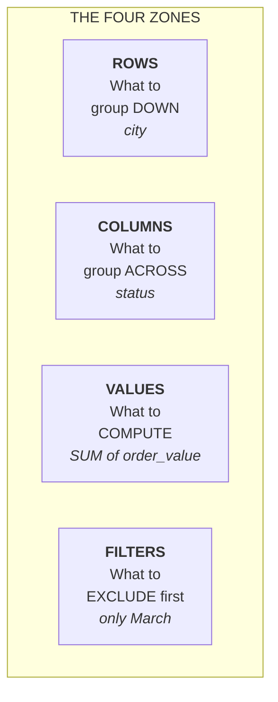

# Pivot Tables and Quick Insights
> **Pre-Read — Academic Session 7** | Module 1: Analytics Foundations + GenAI + Spreadsheets
---

## Mental Map

> 📄 Also provided as a printable PDF in this folder: **mental-map: Pivot Tables and Quick Insights.pdf**

```mermaid
%%{init: {'flowchart': {'htmlLabels': true, 'nodeSpacing': 60, 'rankSpacing': 95, 'wrappingWidth': 620, 'padding': 18}}}%%
flowchart LR

START["<b>Module 1</b><br/><i>Analytics Foundations</i>"]

subgraph foundation[" WHERE WE ARE "]
direction TB
    CURMOD["<b>CURRENT MODULE</b><br/><i>Module 1 — Analytics Foundations,<br/>GenAI &amp; Spreadsheets</i><br/>&nbsp;<br/><b>Covered so far:</b><br/>S1 · Averages · outliers &nbsp;·&nbsp; S2 · Workflow · KPIs<br/>S3 · GenAI · prompting · checking<br/>S4 · Finding what is broken &nbsp;·&nbsp; S5 · Fixing · validation<br/>S6 · Formulas · SUMIF · calculated columns"]
    CURSES["<b>CURRENT SESSION 7 — closes Module 1</b><br/><b>Pivot Tables and Quick Insights</b><br/>&nbsp;<br/><i>The shift:</i> from <b>one formula per question</b><br/><i>to</i> <b>every answer at once, in four clicks</b><br/>&nbsp;<br/>build a pivot · rows · columns · values<br/>compare categories · turn a table into an insight"]
end

subgraph outcome[" OUTCOME OF THIS SESSION "]
direction TB
    OUT["<b>By the end, you can…</b><br/>&nbsp;<br/>Build a pivot in four clicks, cross-tabulate two dimensions,<br/>and <b>write the one sentence a manager can act on</b> —<br/>closing the loop back to the workflow from Session 2"]
end

subgraph value[" WHY IT MATTERS "]
direction TB
    CVAL["<b>Course Value</b><br/>A pivot IS a GROUP BY with a mouse<br/>Module 2 SQL and Module 4 pandas<br/>are this exact idea, typed instead of clicked"]
    RVAL["<b>Real-Life Value</b><br/>The most-used analysis tool on earth<br/>Most business decisions still get made<br/>from a pivot table someone built in 5 minutes"]
end

subgraph future[" WHAT COMES NEXT "]
direction TB
    U0["<b>Next Session (S8)</b><br/>Statistics: Spread, Variability, Outliers<br/><i>opens Module 2</i>"]
    U1["<b>Then (S9–S16)</b><br/>SQL for Data Analysis<br/><i>SELECT · WHERE · GROUP BY · JOIN</i>"]
    U2["<b>Upcoming Modules</b><br/>Tableau · Python + GenAI<br/><i>same ideas, bigger canvas</i>"]
end

START ==>|" you are here "| CURMOD
CURMOD ==>|" progress "| CURSES
CURSES ==>|" you get "| OUT
OUT ==>|" course "| CVAL
OUT ==>|" real life "| RVAL
CURSES ==>|" next up "| U0
U0 -.->|" then "| U1
U1 -.->|" ahead "| U2

classDef startBox fill:#F7FAFC,stroke:#4A5568,stroke-width:2px,color:#1A202C
classDef curModBox fill:#FFF8E6,stroke:#B7791F,stroke-width:2px,color:#1A202C
classDef curSessBox fill:#E6FFFA,stroke:#0D9488,stroke-width:3px,color:#1A202C
classDef outBox fill:#FEF2F2,stroke:#DC2626,stroke-width:3px,color:#1A202C
classDef valueBox fill:#F3E8FF,stroke:#7C3AED,stroke-width:2px,color:#1A202C
classDef futureBox fill:#ECFDF5,stroke:#047857,stroke-width:2px,color:#1A202C

class START startBox
class CURMOD curModBox
class CURSES curSessBox
class OUT outBox
class CVAL,RVAL valueBox
class U0,U1,U2 futureBox

linkStyle default stroke-width:2px
```



## What You'll Learn

In this pre-read, you'll discover:

- What a **pivot table** is — and why it replaces 150 formulas with four clicks
- The **four zones** (Rows, Columns, Values, Filters) and what each one does
- How to **cross-tabulate** two dimensions to find things a single list can never show you
- How to turn a pivot output into an **insight** — the sentence a manager can actually act on

---

## A. What a Pivot Table Is

> 💡 **Analogy:** Imagine a huge pile of Lego bricks. **Sorting them into piles by colour** and counting each pile is a pivot table. You didn't change a single brick — you **reorganised** them so a pattern you couldn't see becomes obvious.

**One-line definition:** A **pivot table** takes a long list of rows and **summarises it by category** — automatically producing one row per group, with totals, counts or averages for each.

### Why you need it — the honest arithmetic from Session 6

Last session you computed revenue per city with `SUMIF`. Three cities, three formulas. Fine.

**Now scale it up:**

```
    50 cities  ×  3 metrics (revenue, order count, average order value)
    ────────────────────────────────────────────────────────────────
    =  150 formulas.

    A pivot table does all 150.  In four clicks.  With zero formulas.
```

> 🔑 **And here's the part that matters more than the time saved: a pivot has *no formulas to get wrong*.** No `$` bug. No dragged range that silently slid down by one. No forgotten quote mark. **The entire class of errors you met last session simply cannot happen.**

### The shape change — long to wide

```
BEFORE — your raw data (long):        AFTER — the pivot (wide):

order_id  city      value             city         total_revenue   orders
1001      Chennai   2400              Chennai            41,200        18
1002      Madurai   1800              Coimbatore         20,000         9
1003      Chennai   3200              Madurai            22,000        11
1004      Coimbatore 950
...  (40 rows)                        (3 rows — one per group)
```

> **Notice: the pivot has fewer rows than your data. That is the entire point.** Aggregation *collapses* rows. Forty scattered orders become three meaningful lines you can read at a glance.

---

## B. The Four Zones

Every pivot table is built by dragging fields into four boxes. **Learn what each one does and you can build any pivot in existence.**



| Zone | What goes in it | Ask yourself |
|---|---|---|
| **ROWS** | A **category** | *"What do I want one line per?"* → cities, products, months |
| **COLUMNS** | A second **category** | *"What do I want to compare side by side?"* → status, payment method |
| **VALUES** | A **number** + how to aggregate it | *"What do I want to compute?"* → SUM of revenue, COUNT of orders |
| **FILTERS** | Any field | *"What should I exclude entirely?"* → only completed orders |

### 🔑 The rule that makes it click

> ### **ROWS and COLUMNS take CATEGORICAL fields. VALUES takes a NUMERICAL field.**
>
> **That is Session 1, doing real work.** *(Remember: if adding two values is nonsense, it's categorical.)*
>
> Drop `city` into VALUES and the tool will try to *sum your cities* — which is meaningless. Drop `order_value` into ROWS and you'll get one row per distinct price, which is useless. **Knowing your data types tells you exactly which box each field belongs in.**

### The VALUES zone — pick your aggregation deliberately

| Aggregation | Answers |
|---|---|
| **SUM** | *"How much in total?"* → revenue |
| **COUNT** | *"How many?"* → number of orders |
| **AVERAGE** | *"What's typical?"* → ⚠️ **careful — mean or median?** |
| **MAX / MIN** | *"What's the best/worst?"* → biggest order |

> ⚠️ **The pivot's default `AVERAGE` is the MEAN — and pivot tables cannot do a median.** So if your data is skewed *(and Session 6 taught you to check!)*, the pivot will confidently show you a mean that describes nobody. **The tool will not warn you.** You have to remember.
>
> 📌 **The professional move:** put **SUM** and **COUNT** in the pivot, then compute the average yourself as `SUM ÷ COUNT`, so you always know exactly what you're looking at.

---

## C. Cross-Tabulation — Two Dimensions at Once

> 💡 **Analogy:** A single list tells you *"Chennai sells the most."* A cross-tab tells you *"Chennai sells the most — **but almost all of it is Cash on Delivery, and half of that gets returned.**"* **The insight was never in the total. It was in the intersection.**

**One-line definition:** A **cross-tab** puts one category in ROWS and another in COLUMNS, so every cell shows the value for that **combination**.

```
                    completed    cancelled     TOTAL
    Chennai            38,200        3,000    41,200
    Coimbatore         19,050          950    20,000
    Madurai            13,000        9,000    22,000     ← LOOK AT THIS
    ─────────────────────────────────────────────────
    TOTAL              70,250       12,950    83,200
```

> 🔍 **Read that table like an analyst.** Madurai's total (₹22,000) looks perfectly healthy — it's ahead of Coimbatore. **But ₹9,000 of it is cancelled.** Nearly half. That fact is **completely invisible** in a single-dimension list of totals by city.
>
> **The cross-tab is where the story was hiding.** One extra field, dragged into one extra box, and a problem nobody knew about becomes impossible to miss.

### The dimensions worth crossing

| Rows × Columns | Reveals |
|---|---|
| City × Status | **Which locations have a cancellation problem** |
| Product × Month | Seasonality — what sells when |
| City × Payment method | Regional payment behaviour |
| Value band × Status | *Do expensive orders get cancelled more?* |

> 💡 **Your calculated columns from Session 6 shine here.** That `value_band` column you built with `IF`? **Drop it straight into ROWS.** You *invented* a category, and now you can cross-tabulate on it — a question that did not exist in the raw data at all.

---

## D. From Table to Insight

**A pivot table gives you a *finding*. A manager needs an *insight*.** They are not the same, and the gap between them is where analysts get judged.

| | Says | Manager's reaction |
|---|---|---|
| 📊 **A number** | *"Madurai revenue is ₹22,000."* | *"…and?"* |
| 🔍 **A finding** | *"Madurai has ₹9,000 in cancellations."* | *"Hmm. Is that bad?"* |
| ✅ **An insight** | *"**41% of Madurai's revenue gets cancelled — 4× the rate of any other city. That's ₹9,000 a month we're booking and losing. Someone should check whether the Madurai delivery partner is failing.**"* | *"Get me the Madurai ops lead."* |

### The three-part recipe for an insight

```
1. WHAT      the number says          "Madurai cancels 41% of orders"
2. SO WHAT   why it matters           "That's 4× every other city — ₹9,000/month lost"
3. NOW WHAT  what someone should do   "Check the Madurai delivery partner"
```

> ### 🎯 **The test — say it out loud before you send anything:**
> ### ***"What should someone DO on Monday morning because of this?"***
>
> If you can't answer that, you have a finding, not an insight. **Go back to the pivot and cut it a different way.**

### Comparison is where insights come from

**A number alone is meaningless.** ₹22,000 — is that good? You cannot possibly know. It only becomes meaningful **against something**:

| Compare against | Gives you |
|---|---|
| **Other categories** | *"Madurai's cancellation rate is 4× Chennai's"* |
| **Time** | *"Cancellations doubled since March"* |
| **A target** | *"We're at 41% against a 10% target"* ← 👀 **Session 2's KPI!** |
| **The total** | *"Madurai is 26% of revenue but 70% of cancellations"* |

> 🔑 **This is why the pivot table is such a good insight machine: it puts categories side by side, so the comparison is *already made for you.* You just have to read it.**

---

## Quick Reference

```
BUILD       Rows      = the CATEGORY you want one line per
            Columns   = a SECOND category to compare across
            Values    = the NUMBER + how to aggregate it
            Filters   = what to exclude entirely

REMEMBER    Rows/Columns → CATEGORICAL     (Session 1!)
            Values       → NUMERICAL

WATCH OUT   Pivot AVERAGE = MEAN. It cannot do median.
            If your data is skewed → use SUM ÷ COUNT and know what you're seeing.

INSIGHT     What  →  So what  →  Now what
            Test: "What should someone DO on Monday?"
```

---

## Practice Exercises

**1. Pattern Recognition**
For each question, say which field goes in **Rows**, which in **Columns**, and what goes in **Values**: (a) Total revenue per city. (b) Order count per city, split by completed vs cancelled. (c) Average order value per product category, by month. (d) How many orders each payment method got.

**2. Concept Detective**
A pivot shows `AVERAGE of order_value` = ₹4,850 for Chennai. Your `MEDIAN` from Session 6 was ₹2,100. Explain why the pivot cannot show you the median, why that's dangerous here, and what you would put in the pivot instead so you aren't misled.

**3. Real-Life Application**
Take this cross-tab and write a proper **insight** (all three parts — what / so what / now what):

```
                    completed    cancelled
    Chennai            38,200        3,000
    Coimbatore         19,050          950
    Madurai            13,000        9,000
```

**4. Spot the Error**
A colleague drags `city` into the **Values** box and gets a column of numbers that make no sense. Explain what went wrong using the numerical-vs-categorical idea from Session 1.

**5. Planning Ahead**
Your manager asks: *"Which of our products should we stop selling?"* Design the pivot table you would build — name the Rows, Columns, Values and Filters, and say what pattern in the output would justify dropping a product. Then write the one sentence you'd say in the meeting.

---

> ✅ **You're done — and so is Module 1!** Look back at what you can now do: you can take a filthy export, clean it, validate it, compute honest numbers from it, cross-tabulate it, and say the one sentence a manager can act on. **That is the complete analytics workflow from Session 2, end to end.**
>
> And hold onto this: **a pivot table is a `GROUP BY` you build with a mouse.** In Module 2 you'll write `GROUP BY city` in SQL and it will produce *exactly* the table you just clicked together — but on ten million rows instead of forty, in a database no spreadsheet could ever open. **The idea doesn't change. Only the scale does.** Coming up next: **Statistics — Spread, Variability and Outliers**, where you'll learn why two cities with the *same* average revenue can be completely different businesses.
